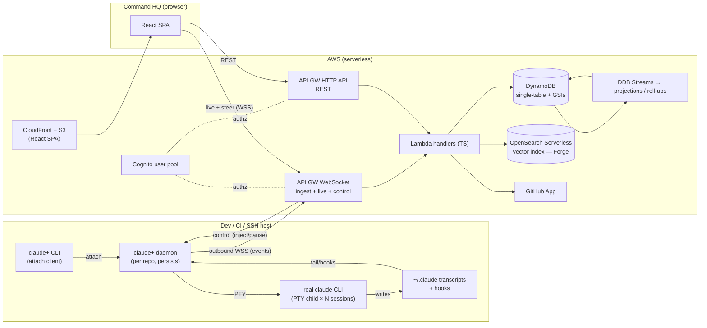
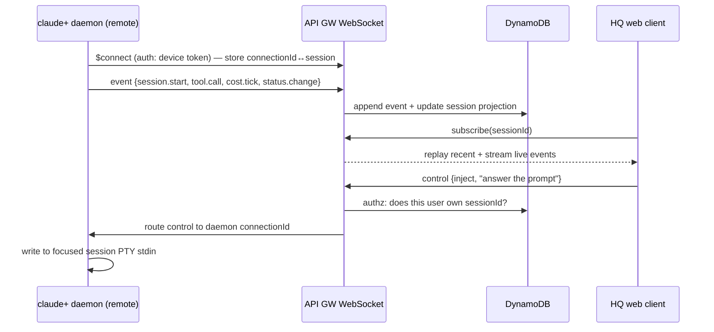

# feat: Build claude+ and Command HQ (the workflow harness)

## Summary

Build the full system shown in `wireframe.html` (19 screens): **`claude+`**, a Go terminal wrapper that hosts the real `claude` CLI as a persistent per-repo daemon and streams every session event to the cloud; and **Command HQ**, a React SPA backed by AWS serverless that lets you watch and steer those sessions from anywhere, organized around company Objectives (RCDO), Projects, Tickets, Agents, Skills, and agent-authored Weekly Updates.

Greenfield: `wireframe.html` is the authoritative spec. Decisions locked with the user up front:

- **Monorepo**, one TypeScript stack for web + backend + shared contracts; Go for the wrapper.
- **`claude+` is a daemon + thin attach client** (tmux model) so sessions survive SSH disconnects and are attachable from a second terminal.
- **AWS serverless** backend: API Gateway (REST + WebSocket), Lambda, DynamoDB. The WebSocket API carries both live event ingestion (outbound from remote daemons) and the control path back down.
- **React + Vite + Tailwind** SPA on S3 + CloudFront (infra already scaffolded under `infra/`).
- **Hard constraint:** the wrapper must work over SSH on arbitrary remote hosts — outbound-only networking, single-binary install via npm (`npm i -g`) or `curl | sh`.

This is a **full, unphased build**: all subsystems are planned, dependency-ordered, with no MVP gating.

---

## Problem Frame

A developer runs many Claude Code sessions across many repos and many machines (laptop, CI runners, remote boxes reached over SSH). Today those sessions are invisible the moment you look away from the terminal, there is no shared record of what agents did, and there is no connection between day-to-day agent work and company strategy.

`claude+` wraps the real `claude` so that **all traffic is captured** without changing the native experience, and **Command HQ** turns that capture into a live, steerable, strategy-aligned view of every project. The wireframe defines the surfaces; this plan defines how to build them.

The system has four planes:

1. **Capture/host plane** — `claude+` daemon hosting PTY sessions, capturing events.
2. **Transport plane** — outbound WebSocket from each daemon to the cloud; control messages back.
3. **State plane** — event store + projections (sessions, tickets, agents, skills, objectives, weekly updates).
4. **Presentation/control plane** — Command HQ web (watch + steer) and the wrapper's own tabs.

---

## Scope Boundaries

### In scope (everything in the wireframe)
- `claude+` CLI: `claude+`, `claude+ ls`, `claude+ --session=N`, attach-or-create per repo, daemon persistence across SSH disconnects.
- Multiplexed, **auto-named** sessions within a repo instance; status line; keybinds.
- Wrapper tabs: Session, Tickets, Agents, Forge, Stream.
- Event capture (messages, tool calls/results, status, cost) and outbound streaming with offline buffering.
- Control: inject message / pause / interrupt, from HQ web down into a live session.
- Command HQ web: Objectives (RCDO), Projects, Project detail (Overview/Tickets/Weekly/Sessions/Agents sub-tabs), Tickets board + detail, Sessions list, Live watch/steer, Agents (scoped) + editor, Skills (scoped) + bundle detail, Weekly Update.
- Scoped registries for Agents and Skills (org → user → project) with elevate/demote; skill bundles (incl. nesting).
- Forge: semantic search over past session histories → proposed agent with evidence-based skills.
- Weekly Update agent: git-history "done" + objective-validated forward plan, with strategic-alignment + completion breakdowns.
- Objectives roll-up computed bottom-up from linked work.
- GitHub integration: read `PRD.md`/`PROGRESS.md`, git history, branches/PRs for the ticket chain.
- AWS deployment via CDK (static site stack already started + a new API stack).
- Identity/multi-user (Cognito), per-user data scoping.

### Deferred to Follow-Up Work
- Telegram / mobile clients (control gateway is built client-agnostic so these are additive later).
- The Stream tab's final form (first-class vs. `⌃D` debug view) — ship as a tab, revisit.
- Cross-org / enterprise SSO, billing/usage metering, RBAC beyond per-user ownership + org/project scope.

### Outside this product's identity
- The sample `weekly-compass` application described in `st6_prd.md` — that is demo content, not the harness. The harness is not bound by that PRD's React/Spring stack.

---

## High-Level Technical Design

### Component architecture



### Live watch + steer sequence (the control gateway)



### Data model (DynamoDB single-table, key access patterns)

Directional — not a final schema. Single table `harness`, with overloaded `PK`/`SK` and GSIs for cross-cutting queries.

| Entity | PK | SK | Notes / GSI |
|---|---|---|---|
| User | `USER#<uid>` | `PROFILE` | — |
| Project (repo) | `PROJ#<pid>` | `META` | GSI1 `USER#<uid>` → projects |
| Instance (claude+) | `PROJ#<pid>` | `INST#<host>` | live state, uptime, session count |
| Session | `PROJ#<pid>` | `SESS#<sid>` | GSI1 `live` status → cross-project live list |
| Event (append-only) | `SESS#<sid>` | `EVT#<ts>#<seq>` | TTL on old raw events optional |
| Ticket | `PROJ#<pid>` | `TICK#<tid>` | GSI status; chain → session/branch/PR |
| Agent | `SCOPE#<scope>` | `AGENT#<name>` | scope ∈ org / user#uid / proj#pid |
| Skill / Bundle | `SCOPE#<scope>` | `SKILL#<name>` | bundle holds member refs; nestable |
| Objective node | `ORG#<org>` | `RCDO#<path>` | tree path; roll-up % cached |
| Weekly update | `PROJ#<pid>` | `WEEK#<isoweek>` | done[] + plan[] + alignment |

### Event schema (directional contract, shared package)

```
Event =
  | { kind: "session.start", sessionId, projectId, host, agent?, ticket?, name }
  | { kind: "session.rename", sessionId, name }            // auto-generated name
  | { kind: "user.msg" | "assistant.msg", sessionId, tokens }
  | { kind: "tool.call", sessionId, tool, args summary }
  | { kind: "tool.result", sessionId, ok, ms, summary }
  | { kind: "cost.tick", sessionId, deltaUsd, totalUsd, tokens }
  | { kind: "status.change", sessionId, from, to }          // active | needs_input | idle | done
Envelope = { v, instanceId, host, ts, seq, event: Event }
```

### Output Structure

```
workflow_harness/
  wireframe.html                 # the spec/prototype (kept)
  package.json                   # npm workspaces root
  packages/
    shared/                      # TS: event schema, API DTOs, zod validators, scope-resolution
    backend/                     # TS Lambda handlers (REST + WS routes), DDB access layer
    web/                         # React + Vite + Tailwind SPA (the 19 screens)
  infra/                         # CDK (TS) — existing static-site stack + new API stack
  wrapper/                       # Go module: claude+
    cmd/claude-plus/             # CLI entrypoint (ls, attach, run)
    internal/daemon/             # per-repo daemon, attach protocol
    internal/pty/                # PTY multiplexing, session lifecycle, auto-name
    internal/capture/            # JSONL tail + hooks + cost → events
    internal/transport/          # outbound WS client, offline buffer, control receiver
    internal/tui/                # Bubble Tea tabs + status line
    internal/config/             # ~/.claude sync
  npm/claude-plus/               # npm wrapper pkg (downloads prebuilt binary)
  scripts/install.sh             # curl | sh installer
  docs/plans/                    # this plan
```

---

## Key Technical Decisions

- **KTD1 — Monorepo, npm workspaces, two languages.** TS for `shared`/`backend`/`web`/`infra`; Go for `wrapper`. One shared contract package (`packages/shared`) is the single source of truth for the event schema and API DTOs; the Go wrapper re-declares the same envelope (kept in sync by a generated golden JSON fixture both sides test against). Rationale: one language across the cloud stack, Go only where SSH/single-binary distribution demands it.

- **KTD2 — Daemon + thin attach client (tmux model).** `claude+` starts (or attaches to) a background daemon bound to the repo. The TUI is a client that attaches over a local Unix socket. Required by the SSH constraint: sessions must survive disconnect and be re-attachable. `claude+ ls` enumerates daemons; `--session=N` attaches by index; bare `claude+` in a repo attaches-or-creates for `cwd`.

- **KTD3 — Capture without screen-scraping.** Three sources, not PTY text parsing: (1) **PTY pass-through** renders the native interactive Claude unchanged; (2) the daemon **tails Claude Code's session transcript JSONL** (`~/.claude/projects/<hash>/<sid>.jsonl`) for structured message/tool events; (3) **hooks** (`settings.json` PreToolUse/PostToolUse/Stop/Notification) post low-latency lifecycle + `status.change` signals to the daemon's local socket. Cost/token deltas come from the transcript. This is the same transcript source `ce-sessions` reads, so it's a proven surface.

- **KTD4 — Serverless backend.** API Gateway **HTTP API** (REST) + **WebSocket API** (ingest + live + control); Lambda (TS); DynamoDB single-table with GSIs; **DynamoDB Streams** drive projections (session current-state, objective roll-ups). Scales to zero, pay-per-use, matches the started CDK.

- **KTD5 — Auth.** Cognito user pool for HQ web (Amplify Auth / hosted UI). The wrapper authenticates with a **device token** minted in HQ (`claude+ login` device-code flow) stored at `~/.claude-plus/credentials`; the token authorizes the daemon's outbound WS `$connect` and scopes all its data to that user. No inbound ports on the remote host.

- **KTD6 — Control gateway over WebSocket.** Because the daemon holds a persistent **outbound** WS, HQ steers a session by routing a control frame to that daemon's stored `connectionId`. Authorization check on every control frame: the requesting user must own the target session. This is what makes remote/SSH steering work with zero inbound networking.

- **KTD7 — Forge semantic search.** Session summaries are embedded (Amazon Bedrock Titan/Cohere embeddings) on `session.done` and indexed in **OpenSearch Serverless (vector)**. Forge query: embed the description → k-NN over the user's sessions → aggregate the skills/tools those sessions used → propose an agent. Fallback for low volume: store embeddings in DynamoDB and brute-force cosine in a Lambda (flagged as a cost/scale toggle).

- **KTD8 — Scope model for Agents/Skills/Objectives.** Three tiers: `org`, `user#<uid>`, `proj#<pid>`. Resolution composes org + user + project; **narrowest wins on name collision** (a project agent/skill overrides an org one of the same name). Elevate/demote rewrites the scope key. Objectives are org-global (single company tree), not per-user.

- **KTD9 — GitHub integration via a GitHub App.** Reads `PRD.md`/`PROGRESS.md`, git history (for Weekly "done"), and branch/PR state (for the ticket chain). Installation token per project; webhooks update ticket status when PRs open/merge.

- **KTD10 — Distribution.** Go cross-compiled with **goreleaser**; an **npm wrapper package** (`npm/claude-plus`) with per-platform prebuilt binaries via `optionalDependencies` (the esbuild pattern) so `npm i -g claude-plus` needs no Go toolchain; plus `scripts/install.sh` for `curl | sh` on bare hosts. PTY via `github.com/creack/pty` (no native node addon).

- **KTD11 — LLM-backed features (Forge proposal, Weekly validation).** Use Amazon Bedrock (Claude) from Lambda for the agent-side reasoning (objective validation, agent-draft synthesis), keeping all secrets server-side. The wrapper never holds model keys.

- **KTD12 — Frontend data layer.** RTK Query against the REST API (cache invalidation per the wireframe's data needs) + a thin WebSocket middleware feeding live session events into the store. Tailwind; the wireframe's hand-written markup/CSS is promoted into components screen-by-screen.

---

## Implementation Units

Grouped by plane for readability; dependency-ordered. Group headings are organizational, not delivery milestones.

### Foundations & contracts

### U1. Monorepo + workspace tooling
- **Goal:** Establish npm-workspaces monorepo with `shared`, `backend`, `web`, `infra` (existing) and the `wrapper` Go module alongside.
- **Dependencies:** none.
- **Files:** `package.json` (root, workspaces), `tsconfig.base.json`, `.editorconfig`, `packages/shared/package.json`, `wrapper/go.mod`, move/keep `infra/` as a workspace.
- **Approach:** Root scripts orchestrate per-package build/test. Shared TS config; ESLint/Prettier. Go module independent, built via Make/goreleaser.
- **Test scenarios:** Test expectation: none — scaffolding. Verify `npm install` resolves workspaces and `npm run build` traverses packages.
- **Verification:** Clean `npm install && npm run build` at root; `go build ./...` in `wrapper/`.

### U2. Shared event schema & API contracts
- **Goal:** Single source of truth for the event envelope, entity DTOs, and scope-resolution helper.
- **Requirements:** Capture contract (System map ②/③ in wireframe).
- **Dependencies:** U1.
- **Files:** `packages/shared/src/events.ts`, `packages/shared/src/dto.ts`, `packages/shared/src/scope.ts`, `packages/shared/test/events.test.ts`, `packages/shared/test/golden/event-envelope.json`.
- **Approach:** zod schemas for every `Event.kind` + `Envelope`; exported TS types. Scope-resolution function (org/user/project, narrowest-wins). Emit a golden JSON fixture the Go wrapper's tests also load.
- **Test scenarios:**
  - Happy: a valid envelope of each `kind` parses; types inferred match.
  - Edge: unknown `kind` rejected; missing `seq`/`ts` rejected.
  - Scope: `[org agent "x", project agent "x"]` resolves to the project one; org-only resolves to org; precedence stable.
  - Integration: the golden fixture round-trips (parse → serialize → deep-equal).
- **Verification:** `vitest` green; golden fixture committed.

### U3. DynamoDB data model + access layer
- **Goal:** Encode the single-table design and a typed access layer used by all handlers.
- **Dependencies:** U2.
- **Files:** `packages/backend/src/db/keys.ts`, `packages/backend/src/db/repo.ts`, `packages/backend/test/repo.test.ts`.
- **Approach:** Key builders per entity (User/Project/Instance/Session/Event/Ticket/Agent/Skill/Objective/Weekly); GSIs for live-sessions and user→projects. Access layer exposes intent-named methods (`appendEvent`, `listLiveSessions`, `putTicket`, …). Test against DynamoDB Local.
- **Test scenarios:**
  - Happy: put/get each entity; `appendEvent` preserves ordering by `(ts,seq)`.
  - Query: `listLiveSessions` returns only `status=live` across projects (GSI); `listProjectsForUser` via GSI1.
  - Edge: append is idempotent on duplicate `(sessionId, seq)`; pagination cursor round-trips.
- **Verification:** Repo tests green against DynamoDB Local.

### U4. Auth foundation (Cognito + device token)
- **Goal:** User pool for web; device-token issuance + verification for the wrapper.
- **Requirements:** identity/scoping (wireframe `@matt`, per-user scopes).
- **Dependencies:** U3.
- **Files:** `infra/lib/auth-stack.ts`, `packages/backend/src/auth/verify.ts`, `packages/backend/src/auth/device.ts`, `packages/backend/test/auth.test.ts`.
- **Approach:** Cognito user pool + app client. Device-code flow: `POST /device/start` → code; `POST /device/poll` → long-lived wrapper token (signed, scoped to `user#uid`). JWT verification middleware shared by REST + WS authorizers.
- **Test scenarios:**
  - Happy: valid Cognito JWT authorizes; valid device token authorizes WS `$connect`.
  - Error: expired/forged token rejected; device poll before approval returns pending; approved poll returns token once.
  - Integration: a request's resolved `uid` scopes a subsequent repo query to that user's data only.
- **Verification:** Auth tests green; manual device-flow round-trip in a deploy smoke test.

### Serverless backend

### U5. API stack (CDK): HTTP API + WebSocket API + DynamoDB
- **Goal:** Provision the backend infra the handlers attach to.
- **Dependencies:** U3, U4.
- **Files:** `infra/lib/api-stack.ts`, `infra/bin/infra.ts` (add stack).
- **Approach:** DynamoDB table + GSIs + Streams; HTTP API with Cognito JWT authorizer; WebSocket API with `$connect`/`$disconnect`/`$default` + custom routes (`event`, `subscribe`, `control`) and a Lambda authorizer using the device/JWT verifier. Lambda functions wired with least-privilege IAM.
- **Test scenarios:** Test expectation: none — infra. Add a CDK assertions test that the table has the expected GSIs and the WS API exposes the three custom routes.
- **Verification:** `cdk synth` clean; assertions test green; `cdk deploy` to a dev account.

### U6. Event ingestion (WebSocket)
- **Goal:** Accept event envelopes from daemons; persist; update session projection.
- **Requirements:** "all traffic captured", Sessions list, Stream tab.
- **Dependencies:** U5.
- **Files:** `packages/backend/src/ws/connect.ts`, `packages/backend/src/ws/event.ts`, `packages/backend/src/ws/disconnect.ts`, `packages/backend/test/ingest.test.ts`.
- **Approach:** `$connect` authorizes (device token), stores `connectionId ↔ {uid, instanceId}`. `event` route validates envelope (U2), `appendEvent`, and upserts the session current-state projection (status, tokens, cost, name). `$disconnect` marks instance offline.
- **Test scenarios:**
  - Happy: a `tool.call` envelope is appended and the session projection reflects latest activity.
  - Edge: out-of-order `seq` still stored, projection uses max seq; duplicate `seq` ignored.
  - Status: a `status.change → needs_input` flips the projection so the Sessions list can surface it.
  - Error: invalid envelope rejected with a logged reason, connection not dropped.
  - Integration: `session.rename` updates the displayed name (auto-naming) end-to-end.
- **Verification:** Ingest tests green; a local script pushes a synthetic session and it appears via the read API.

### U7. Control gateway (subscribe + steer)
- **Goal:** Stream live events to web clients and route control frames back to the owning daemon.
- **Requirements:** Live watch/steer screen; parity with terminal.
- **Dependencies:** U6.
- **Files:** `packages/backend/src/ws/subscribe.ts`, `packages/backend/src/ws/control.ts`, `packages/backend/test/control.test.ts`.
- **Approach:** `subscribe(sessionId)` registers a web `connectionId` as a listener; ingestion fan-outs new events to listeners. `control{sessionId, action, payload}` authorizes ownership, looks up the daemon `connectionId`, and posts the frame via `@connections`. Actions: `inject`, `pause`, `interrupt`.
- **Test scenarios:**
  - Happy: subscribed web client receives a replayed recent window then live events.
  - Authz: a user cannot steer a session they don't own (403, no routing).
  - Routing: an `inject` is delivered to the correct daemon connection; offline daemon → queued/​error surfaced.
  - Edge: subscriber disconnect deregisters; no fan-out to stale connections.
- **Verification:** Control tests green; two-socket integration test (fake daemon + fake web) proves the round-trip.

### U8. REST: projects & sessions
- **Goal:** Read APIs for the Projects list, Project detail, and Sessions firehose.
- **Requirements:** Projects, Project detail, Sessions list screens.
- **Dependencies:** U3, U4.
- **Files:** `packages/backend/src/rest/projects.ts`, `packages/backend/src/rest/sessions.ts`, `packages/backend/test/projects.test.ts`, `packages/backend/test/sessions.test.ts`.
- **Approach:** `GET /projects`, `GET /projects/:id`, `POST /projects` (connect repo), `GET /sessions?live=`, `GET /sessions/:id` (+ event page for replay). Scope every query to the caller's `uid`.
- **Test scenarios:**
  - Happy: list returns the user's projects with live counts; session detail returns metadata + paged events.
  - Filter: `?live=true` returns only live sessions across projects.
  - Authz: another user's project/session is 404 (not 403, to avoid enumeration).
  - Edge: empty project list; pagination cursor stable.
- **Verification:** Endpoint tests green; wired to U21/U23 screens.

### U9. REST: agents & skills (scoped + bundles)
- **Goal:** CRUD + scope operations for the Agents and Skills registries, including bundles.
- **Requirements:** Agents (scoped) + editor, Skills (scoped) + bundle screens.
- **Dependencies:** U3.
- **Files:** `packages/backend/src/rest/agents.ts`, `packages/backend/src/rest/skills.ts`, `packages/backend/test/agents.test.ts`, `packages/backend/test/skills.test.ts`.
- **Approach:** CRUD scoped by `org|user|proj`; `POST /agents/:id/scope` (elevate/demote rewrites scope key); resolution endpoint returns the effective set for a (user, project) pair. Skills support `bundle` type with member refs; add/remove/eject; nesting; `dissolve`. Usage counts (agents-depending-on-skill).
- **Test scenarios:**
  - Happy: create at project scope; elevate to user then org; effective list composes inherited tiers.
  - Collision: project agent named `builder` shadows org `builder` in the resolved set (narrowest wins).
  - Bundles: add a standalone skill into a bundle; eject keeps it standalone; nested bundle resolves transitively; dissolve makes all members standalone.
  - Authz: only an admin may write at org scope; user cannot elevate to org without permission.
  - Edge: removing a skill in use by N agents returns the blast-radius count.
- **Verification:** Tests green; powers U24.

### U10. REST: objectives + roll-up
- **Goal:** Serve the RCDO tree and compute bottom-up completion.
- **Requirements:** Objectives screen; PRD-owned Supporting Outcomes; weekly roll-up.
- **Dependencies:** U3.
- **Files:** `packages/backend/src/rest/objectives.ts`, `packages/backend/src/projections/rollup.ts`, `packages/backend/test/objectives.test.ts`.
- **Approach:** CRUD for RCDO nodes (org-global). A Streams-triggered projection recomputes a node's cached `%` when linked tickets/weekly updates change. `GET /objectives` returns the tree with cached roll-ups; `GET /objectives/:id` returns linked work.
- **Test scenarios:**
  - Happy: tree returns Rally Cries → Defining Objectives → Outcomes → Supporting Outcomes with cached %.
  - Roll-up: completing a ticket linked to a Supporting Outcome raises that SO and propagates up to the Rally Cry.
  - Edge: a node with no linked work reports 0%; orphaned link is ignored, not fatal.
  - Integration: a published Weekly Update's deltas move the linked Outcome's %.
- **Verification:** Tests green; roll-up reflected on U20.

### U11. REST: tickets + weekly updates
- **Goal:** Ticket CRUD/lifecycle and Weekly Update persistence.
- **Requirements:** Tickets board/detail; Weekly Update screen.
- **Dependencies:** U3, U10.
- **Files:** `packages/backend/src/rest/tickets.ts`, `packages/backend/src/rest/weekly.ts`, `packages/backend/test/tickets.test.ts`, `packages/backend/test/weekly.test.ts`.
- **Approach:** Tickets: CRUD, status transitions (backlog→in progress→in review→done), links to session/branch/PR; "start session on ticket" emits a command the wrapper consumes. Weekly: store `{done[], plan[], alignment, completion}`, publish marks the week and feeds roll-up (U10).
- **Test scenarios:**
  - Happy: create ticket; transition to in-progress links a session; PR-open moves to in-review (via U26 webhook).
  - Edge: invalid transition rejected; closing/icebox grouping correct.
  - Weekly: publish writes both subsections and emits alignment deltas; re-publish overwrites the week.
  - Authz: ticket scoped to its project's owner.
- **Verification:** Tests green; powers U22/U25.

### claude+ wrapper (Go)

### U12. Daemon core + ls/attach/create lifecycle
- **Goal:** The per-repo background daemon and the attach client, with `claude+ ls` and `--session=N`.
- **Requirements:** `claude+ ls` screen; SSH-persistence; instance-per-repo model.
- **Dependencies:** U1.
- **Files:** `wrapper/cmd/claude-plus/main.go`, `wrapper/internal/daemon/daemon.go`, `wrapper/internal/daemon/registry.go`, `wrapper/internal/daemon/attach.go`, `wrapper/internal/daemon/*_test.go`.
- **Approach:** Bare `claude+` resolves the repo for `cwd`, finds-or-spawns its daemon (double-fork/detached), attaches over a Unix socket at `~/.claude-plus/<repo>.sock`. `claude+ ls` reads a registry of running daemons (index, repo, host, session count, state, uptime). `--session=N` attaches by index. Daemon survives client disconnect.
- **Execution note:** Start with a failing integration test for attach → detach → re-attach (the SSH-disconnect contract).
- **Test scenarios:**
  - Happy: `claude+` in a fresh repo spawns a named daemon; `ls` lists it; re-running attaches the existing one (no duplicate).
  - Persistence: client disconnect leaves the daemon (and its sessions) running; re-attach restores view.
  - Index: `--session=N` attaches the right daemon; out-of-range N errors clearly.
  - Edge: stale socket cleaned up; two repos → two daemons, isolated.
- **Verification:** Lifecycle tests green; manual SSH disconnect/reconnect keeps sessions alive.

### U13. PTY multiplexing + session auto-naming
- **Goal:** Multiple `claude` children within one instance, focus switching, and auto-generated names.
- **Requirements:** Session tab sub-tabs; auto-named sessions; keybinds.
- **Dependencies:** U12.
- **Files:** `wrapper/internal/pty/session.go`, `wrapper/internal/pty/mux.go`, `wrapper/internal/pty/autoname.go`, `wrapper/internal/pty/*_test.go`.
- **Approach:** Each session is a `claude` child under `creack/pty`; daemon multiplexes, renders only the focused one to the attached client. Auto-name derived from the session's first user turn / linked ticket (slugged), overridable (`⌃R`). Background sessions keep running.
- **Test scenarios:**
  - Happy: spawn 3 sessions; focus switch routes input to the focused PTY only; others keep producing output.
  - Auto-name: first turn "add reconciliation view" → a stable slug; collision suffixing; manual rename sticks.
  - Edge: closing the focused session re-focuses a neighbor; resizing propagates `SIGWINCH` to the focused PTY.
- **Verification:** Mux tests green; visual check of 3-session switching.

### U14. Event capture + outbound streaming
- **Goal:** Turn session activity into the event envelope and push it to HQ, buffering offline.
- **Requirements:** capture contract; Stream tab; cost meters.
- **Dependencies:** U13, U2, U6.
- **Files:** `wrapper/internal/capture/jsonl.go`, `wrapper/internal/capture/hooks.go`, `wrapper/internal/transport/wsclient.go`, `wrapper/internal/transport/buffer.go`, `wrapper/internal/**/**_test.go`.
- **Approach:** Tail the active session's transcript JSONL for message/tool/cost events; install a `settings.json` hooks block that POSTs lifecycle/status to the daemon socket. Map to `Envelope` (golden-fixture parity with U2). Outbound WS client with an on-disk ring buffer; replay on reconnect; monotonic `seq` per session.
- **Execution note:** Characterization test first against a captured real transcript JSONL fixture.
- **Test scenarios:**
  - Happy: a transcript with a tool call + result + cost emits the matching `tool.call`/`tool.result`/`cost.tick` envelopes in order.
  - Offline: with the WS down, events buffer to disk and replay in order on reconnect; no gaps/dupes (`seq` monotonic).
  - Status: a `Notification` hook produces `status.change → needs_input`.
  - Parity: emitted envelope deep-equals the U2 golden fixture for the same logical event.
  - Edge: transcript rotation / new session id handled; partial last line not double-emitted.
- **Verification:** Capture tests green against recorded fixtures; live session shows up on HQ.

### U15. Control receiver
- **Goal:** Apply HQ control frames (inject/pause/interrupt) to the right session.
- **Requirements:** steer parity (web ↔ terminal).
- **Dependencies:** U14, U7.
- **Files:** `wrapper/internal/transport/control.go`, `wrapper/internal/transport/control_test.go`.
- **Approach:** Control frames arrive on the same outbound WS. `inject` writes the payload to the target session's PTY stdin; `pause`/`interrupt` map to signals/queue control. Targeting by `sessionId`.
- **Test scenarios:**
  - Happy: an `inject` frame for session S writes that text to S's stdin (verified by the child echoing/acting).
  - Targeting: a frame for a background session reaches it, not the focused one.
  - Error: control for an unknown/closed session is dropped with a NACK, daemon stable.
  - Integration: end-to-end with U7 — a web "reply" reaches a live session.
- **Verification:** Control tests green; manual web-steer of a local session.

### U16. TUI tabs + status line
- **Goal:** The wrapper's own chrome: Session / Tickets / Agents / Forge / Stream + status line.
- **Requirements:** all five terminal tabs in the wireframe.
- **Dependencies:** U13 (session), U11 (tickets API), U17 (agents/config), U27 (forge), U14 (stream).
- **Files:** `wrapper/internal/tui/app.go`, `wrapper/internal/tui/tab_session.go`, `tab_tickets.go`, `tab_agents.go`, `tab_forge.go`, `tab_stream.go`, `statusline.go`, `wrapper/internal/tui/*_test.go`.
- **Approach:** Bubble Tea app with a top tab bar + the session sub-tab row. Tickets/Agents/Forge talk to HQ REST; Stream renders the local event feed; Session embeds the focused PTY. Status line shows instance, focused session name, tokens/cost, keybind hints.
- **Test scenarios:**
  - Happy: tab switch renders the right model; status line reflects the focused session.
  - Tickets: backlog renders from REST; "start session on ticket" spawns a session and links it.
  - Stream: scope toggle (all vs one session); pause halts scroll.
  - Edge: REST offline → tabs show a degraded state, Session still works locally.
- **Verification:** TUI model tests green (Bubble Tea test harness); manual walkthrough of all tabs.

### U17. Local config sync (~/.claude ↔ HQ)
- **Goal:** Keep the wrapper's Agents/Skills view in sync with both `~/.claude` and the HQ scoped registry.
- **Requirements:** "stays in sync with local Claude Code setup"; Agents tab drift warning.
- **Dependencies:** U9.
- **Files:** `wrapper/internal/config/claude.go`, `wrapper/internal/config/sync.go`, `wrapper/internal/config/*_test.go`.
- **Approach:** Read `~/.claude/agents` + `~/.claude/skills`; diff against HQ's effective set for this user+project; surface drift; one-key reconcile (push local→HQ user scope, pull HQ→local). Writes are additive and reversible.
- **Test scenarios:**
  - Happy: local-only agent shows as "needs push"; HQ-only as "needs pull"; sync converges.
  - Drift: a skill that differs between local and HQ flags the drift count (Agents tab `⚠ 2 skills differ`).
  - Edge: malformed local agent file reported, not crashing; sync is idempotent.
- **Verification:** Sync tests green; round-trip with a dev HQ.

### U18. Distribution (binary + npm + curl)
- **Goal:** `npm i -g claude-plus` and `curl | sh` install on arbitrary hosts.
- **Requirements:** SSH/remote install constraint.
- **Dependencies:** U12–U16.
- **Files:** `.goreleaser.yaml`, `npm/claude-plus/package.json`, `npm/claude-plus/install.js`, `npm/claude-plus/bin/claude-plus.js`, `scripts/install.sh`, `.github/workflows/release.yml`.
- **Approach:** goreleaser cross-compiles (darwin/linux × amd64/arm64). npm wrapper publishes per-platform binaries as `optionalDependencies`; a launcher shim execs the right one. `install.sh` detects platform and downloads from the release. CI publishes on tag.
- **Test scenarios:** Test expectation: none — packaging. Add a CI smoke job: install via npm in a clean container, run `claude+ --version` and `claude+ ls`.
- **Verification:** Smoke job green on linux+mac runners; manual install on a remote SSH box.

### Command HQ web

### U19. Web app shell, auth, data layer
- **Goal:** React+Vite+Tailwind shell with routing, Cognito auth, RTK Query, and a live-WS middleware.
- **Requirements:** HQ nav (Objectives/Projects/Sessions/Agents/Skills), clickable like the prototype.
- **Dependencies:** U8 (some reads), U4.
- **Files:** `packages/web/index.html`, `packages/web/src/main.tsx`, `packages/web/src/app/router.tsx`, `packages/web/src/app/store.ts`, `packages/web/src/api/*.ts`, `packages/web/src/ws/liveMiddleware.ts`, `packages/web/src/auth/*`, `packages/web/tailwind.config.ts`, `packages/web/src/test/*`.
- **Approach:** Port the wireframe's nav + design tokens to Tailwind components. RTK Query base API; WS middleware that subscribes and dispatches live events into the cache. Amplify Auth (Cognito) gate. Route table mirrors the wireframe's screens/sub-tabs.
- **Test scenarios:**
  - Happy: unauthenticated → login; authenticated → Objectives (first tab) renders.
  - Routing: nav + project sub-tabs navigate; deep links resolve (mirrors the clickable prototype).
  - Live: a mock WS event updates a subscribed component without refetch.
  - Edge: token expiry refreshes or re-prompts; API error shows a non-fatal state.
- **Verification:** Component/route tests (Vitest + Testing Library) green; `vite build` clean.

### U20. Objectives screen (RCDO)
- **Goal:** Company objectives tree with roll-ups.
- **Requirements:** Objectives screen.
- **Dependencies:** U19, U10.
- **Files:** `packages/web/src/screens/Objectives/*`, tests alongside.
- **Approach:** Expandable Rally Cry → DO → Outcome → Supporting Outcome tree; cached % bars; link from Supporting Outcome to owning project.
- **Test scenarios:**
  - Happy: tree renders nested with roll-up bars; expand/collapse works.
  - Data: a Supporting Outcome links to its owning project (navigates).
  - Edge: empty org tree shows an empty state; 0% nodes render correctly.
- **Verification:** Screen tests green; matches wireframe layout.

### U21. Projects list + Project detail
- **Goal:** Projects overview and the project hub with Overview/Tickets/Weekly/Sessions/Agents sub-tabs.
- **Requirements:** Projects, Project detail screens.
- **Dependencies:** U19, U8.
- **Files:** `packages/web/src/screens/Projects/*`, `packages/web/src/screens/ProjectDetail/*`, tests.
- **Approach:** Project cards (PRD goal, PROGRESS %, live activity). Detail Overview shows PRD (goal + owned Supporting Outcomes), PROGRESS, Weekly summary card, sessions table. Sub-tab routing.
- **Test scenarios:**
  - Happy: cards show live counts; detail composes PRD + progress + weekly summary + sessions.
  - Nav: sub-tabs route to Tickets/Weekly/Sessions; "owns Supporting Outcome ↑" links to Objectives.
  - Edge: idle project (no live); connect-repo entry point present.
- **Verification:** Screen tests green.

### U22. Tickets board + detail
- **Goal:** Project-scoped ticket board and ticket detail with the chain.
- **Requirements:** Tickets board/detail screens; HQ as source of truth.
- **Dependencies:** U19, U11.
- **Files:** `packages/web/src/screens/Tickets/*`, tests.
- **Approach:** Lifecycle columns; priority badges; live "in-progress" rows linked to sessions; detail shows description, activity log, and ticket→session→branch→PR chain with actions (start/attach, move status, reassign).
- **Test scenarios:**
  - Happy: board groups by status; in-progress card shows the live session/agent.
  - Action: "start session on ticket" calls the API and reflects the new in-progress state.
  - Detail: chain renders; "watch" links to the live session.
  - Edge: human-merge gate shown for in-review; empty backlog state.
- **Verification:** Screen tests green.

### U23. Sessions list + Live watch/steer
- **Goal:** Cross-project sessions firehose and the live watch/steer surface.
- **Requirements:** Sessions list, Live watch/steer screens; steer parity.
- **Dependencies:** U19, U7, U8.
- **Files:** `packages/web/src/screens/Sessions/*`, `packages/web/src/screens/LiveWatch/*`, tests.
- **Approach:** List with live-first + "needs input" status and reply action. Watch view subscribes via WS, renders the live transcript + tool events, and offers inject/pause/interrupt through the control gateway.
- **Test scenarios:**
  - Happy: list shows live sessions first; opening one streams live events.
  - Steer: typing a reply sends a `control{inject}`; UI confirms delivery.
  - Authz: a non-owned session isn't listed/openable.
  - Edge: session ends mid-watch → transitions to replay; reconnect resumes the stream.
- **Verification:** Screen tests green with a mock WS; manual end-to-end against a local daemon.

### U24. Agents + editor; Skills + bundles
- **Goal:** Scoped Agents and Skills registries with the editor and bundle drill-in.
- **Requirements:** Agents (scoped) + editor, Skills (scoped) + bundle screens.
- **Dependencies:** U19, U9.
- **Files:** `packages/web/src/screens/Agents/*`, `packages/web/src/screens/Skills/*`, tests.
- **Approach:** Scope sections (org/user/project) with elevate/demote; agent editor with scope selector + skill catalog filtered to the agent's scope; skills registry with bundle cards that open a sub-skill manager (add/remove/eject, nested bundles, dissolve).
- **Test scenarios:**
  - Happy: agent cards grouped by scope; editor assigns skills from the scope-filtered catalog; save persists.
  - Scope: elevate moves a card between sections; collision resolution visible.
  - Bundles: open bundle → add/eject sub-skill; nested bundle drills in; dissolve flattens.
  - Edge: blast-radius count shown before demote/remove.
- **Verification:** Screen tests green.

### U25. Weekly Update screen
- **Goal:** The agent-authored weekly update UI with Done/Plan subsections and alignment.
- **Requirements:** Weekly Update screen.
- **Dependencies:** U19, U11, U28.
- **Files:** `packages/web/src/screens/Weekly/*`, tests.
- **Approach:** Week picker; "Draft with agent" launches the validation dialogue (U28); render Done (from git) and Plan (validated) subsections, each with strategic-alignment breakdown + completion %; publish.
- **Test scenarios:**
  - Happy: a drafted week renders both subsections with alignment + % and a validated badge.
  - Flow: "Draft with agent" streams the validation dialogue; publish persists and reflects on Overview.
  - Edge: a plan item with no owned-outcome link is flagged before publish.
- **Verification:** Screen tests green with mocked agent responses.

### Intelligence & integrations

### U26. GitHub integration (App)
- **Goal:** Read PRD/PROGRESS, git history, and branch/PR state; drive ticket transitions.
- **Requirements:** PRD/PROGRESS framing; ticket chain; Weekly "done" source.
- **Dependencies:** U8, U11.
- **Files:** `packages/backend/src/github/app.ts`, `packages/backend/src/github/webhooks.ts`, `packages/backend/src/github/history.ts`, tests.
- **Approach:** GitHub App install per project; read `PRD.md`/`PROGRESS.md` on connect/sync; `listCommits(since)` for Weekly "done"; PR webhooks move tickets in-review/done; link branches/PRs to tickets by convention (`<ticket-id>` in branch/PR).
- **Test scenarios:**
  - Happy: connect reads PRD goal + owned Supporting Outcomes and PROGRESS %.
  - History: `listCommits` for a week returns the items the Weekly "done" section uses, attributed to tickets.
  - Webhook: PR-open for `WC-37` moves that ticket to in-review; merge → done.
  - Edge: missing PRD/PROGRESS handled with a clear "needs files" state; signature verification on webhooks.
- **Verification:** Tests green against recorded GitHub fixtures.

### U27. Forge — semantic session search → agent proposal
- **Goal:** History-mined agent creation (Forge tab + the proposal flow).
- **Requirements:** Forge tab.
- **Dependencies:** U6 (events), U9 (skills), U16 (tab).
- **Files:** `packages/backend/src/forge/embed.ts`, `packages/backend/src/forge/search.ts`, `packages/backend/src/forge/propose.ts`, `infra/lib/search-stack.ts`, tests.
- **Approach:** On `session.done`, summarize + embed (Bedrock) and index in OpenSearch Serverless (vector). `POST /forge/search` embeds the description, k-NN over the user's sessions, aggregates skills/tools by frequency, and asks Bedrock (Claude) to draft an agent (name/model/tools/skills/prompt) with low-confidence additions flagged.
- **Execution note:** Build the brute-force cosine fallback first (DynamoDB-stored vectors) so Forge works before OpenSearch is provisioned; gate on a config flag.
- **Test scenarios:**
  - Happy: a description returns ranked similar sessions; skill frequencies computed; a draft agent produced.
  - Relevance: sessions about migrations rank above unrelated ones for a migration query.
  - Edge: no similar history → graceful "not enough history" with a blank-but-editable draft.
  - Integration: accepting a draft opens it in the Agents editor at a chosen scope (U24).
- **Verification:** Search/propose tests green with seeded embeddings; manual Forge run.

### U28. Weekly Update agent (validation + generation)
- **Goal:** The agent that validates a plan against objectives and assembles the weekly update.
- **Requirements:** Weekly Update flow (push-back + Done/Plan + alignment).
- **Dependencies:** U10 (objectives), U26 (git history), U11 (weekly store).
- **Files:** `packages/backend/src/weekly/agent.ts`, `packages/backend/src/weekly/align.ts`, tests.
- **Approach:** A Bedrock-backed dialogue endpoint: given the user's stated plan, fetch the company objectives + the project's owned Supporting Outcomes, and push back on items that map to none. On acceptance, build "Done" from `listCommits(week)` (U26) tagged to objectives, and "Plan" from the validated commitments; compute alignment deltas + completion (U10 roll-up inputs).
- **Test scenarios:**
  - Happy: a compliant plan passes; output has both subsections with alignment + %.
  - Push-back: a plan item mapping to no owned outcome is challenged (the design-system example) and excluded unless re-justified.
  - Done: git commits for the week populate "Done", attributed to the right objectives.
  - Edge: a week with no commits → empty "Done" with a note; LLM failure surfaces a retry, not a crash.
- **Verification:** Agent tests green with mocked Bedrock + recorded git fixtures.

### Deployment

### U29. Deploy pipeline + web hosting wiring
- **Goal:** End-to-end deploy: static SPA (existing stack) + API stack + envs.
- **Dependencies:** U5, U19, and the screens.
- **Files:** `infra/lib/site-stack.ts` (finish the started static-site stack), `infra/bin/infra.ts`, `.github/workflows/deploy.yml`, `infra/README.md`.
- **Approach:** Finish the S3+CloudFront site stack (OAC, SPA error routing, `BucketDeployment` from the Vite build); deploy the API stack; dev/prod env config; CI builds `web`, deploys infra, invalidates CloudFront. Bootstrap once per account/region.
- **Test scenarios:** Test expectation: none — deployment. Add a CDK assertions test (bucket private, CloudFront OAC, SPA 403/404→index) and a post-deploy smoke (URL 200, a REST health route 200).
- **Verification:** `cdk deploy` both stacks to dev; SPA loads from CloudFront; smoke passes.

---

## System-Wide Impact

- **Security/authz is load-bearing.** Every read scopes to `uid`; every control frame re-checks session ownership. A bug here lets one user watch/steer another's sessions. Treat U4/U7 as high-risk.
- **Event schema is a cross-language contract.** `packages/shared` (TS) and the Go wrapper must agree; the golden fixture (U2/U14) is the guard. Schema changes ripple to ingestion, projections, web, and wrapper.
- **Cost.** OpenSearch Serverless (U27) and always-on nothing-else: the design scales to zero except the vector index. The brute-force fallback keeps Forge cheap until volume justifies OpenSearch.
- **Claude Code coupling.** Capture (U14) depends on transcript JSONL layout + hooks. A Claude Code change could shift these; isolate parsing behind `internal/capture` and pin to recorded fixtures.

---

## Risks & Mitigation

- **R1 — WebSocket control security.** Mitigation: ownership check on every `control` frame (U7); Lambda authorizer on `$connect`; deny-by-default routing.
- **R2 — Capture reliability across Claude Code versions.** Mitigation: fixture-based characterization tests (U14); parsing isolated; degrade to status-only if transcript format drifts.
- **R3 — Cross-language schema drift.** Mitigation: golden JSON fixture tested on both sides (U2/U14); CI fails on mismatch.
- **R4 — SSH-persistence edge cases** (detached process, orphaned sockets, multi-attach). Mitigation: integration tests for attach/detach/re-attach (U12); socket liveness + cleanup.
- **R5 — DynamoDB single-table modeling errors.** Mitigation: access-pattern-first key design (U3) with repo tests against DynamoDB Local before handlers depend on it.
- **R6 — Git-history attribution for Weekly "done".** Mitigation: link by ticket id in branch/PR/commit (U26); show unattributed commits separately rather than guessing.
- **R7 — Forge cost/latency.** Mitigation: embed only on `session.done`; brute-force fallback; cap k-NN; cache proposals.

---

## Open Questions (deferred to implementation)

- Exact Claude Code hook events available for `status.change` granularity (resolve against the installed version in U14).
- DynamoDB GSI count/shape for the live-sessions and objective-rollup queries (finalize while writing U3 against real access patterns).
- Whether OpenSearch Serverless or the brute-force vector fallback is the default at launch volume (decide in U27 from expected session counts).
- Device-token lifetime + rotation policy for the wrapper (finalize in U4 with the security pass).
- Name-collision rule confirmation: **narrowest scope wins** is assumed for Agents/Skills (and surfaced in the wireframe); confirm before U9 locks resolution.

---

## Sources & Research

- `wireframe.html` — the authoritative spec (19 screens), origin document for this plan.
- `st6_prd.md` — sample-project PRD; mined only for the RCDO vocabulary (Rally Cries / Defining Objectives / Outcomes / Supporting Outcomes) used by Objectives; not a stack constraint on the harness.
- `infra/` — the in-progress CDK TypeScript project (static-site stack) this plan completes in U29.
- TerMinal (github.com/trevormil/TerMinal) — prior art for the ticket→session→branch→PR chain and per-session cockpit; diverged from (hosted HQ + cloud capture vs. local-first desktop).
