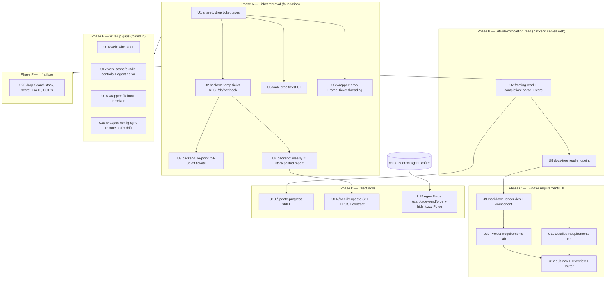

# feat: Command HQ + claude+ — new-model migration (de-ticket, GitHub-progress, two-tier requirements, client skills)

## Summary

Migrate the existing, fully-green Command HQ + claude+ codebase from its as-built "old model" (a ticketing system + `PRD.md`/`PROGRESS.md` framing) to the model decided in the `docs/plans/command-hq/` review: **no tickets**, **GitHub `.md` files as the source of truth for progress with a read-only Command HQ**, a **two-tier requirements UI**, and **client-side Claude skills** (`/update-progress`, `/weekly-update`, `/startforge`/`/endforge`) that run inside the claude+ PTY. Fold in the audit's wire-up gaps (steer, scope/bundle controls, hook receiver, config-sync) and small infra fixes.

Grounding: a 5-way read-only audit (2026-06-03) confirmed all suites green (shared 13, backend 127, web 7, infra 8, wrapper Go all ok) and mapped exactly what is ticket-coupled, what is unwired, and what is missing. This plan executes against that map. **The whole point of the migration is to keep every suite green** — coupled tests are *updated*, not dropped.

---

## Problem Frame

The product decisions are settled (see `docs/plans/command-hq/01-plan-mapping.md`..`06-platform-architecture.md`) but the **code still implements the old model**:

- **Roll-up and weekly "done" are ticket-engined to the core** — `rollup.ts` leaf% = done-fraction of linked tickets; `weekly/align.ts` = commit→ticket→objective. With tickets removed, both produce 0/empty.
- **GitHub read is unwired** — `github/app.ts readFraming()` has zero production callers; `Project.progressPct` is displayed by the web app but never populated server-side; and the parser reads `PROGRESS.md` `%`, not `completion:` frontmatter.
- **The web app is built to the old model** — Tickets board + sub-tab present; no markdown renderer, no GitHub fetch, no two-tier requirements, no conformity score; ~8 mutations defined-but-unused (steer, scope, bundle, weekly).
- **The skills don't exist** — `/update-progress`, `/weekly-update`, `/startforge`, `/endforge` appear only in docs.
- **Wiring gaps** — claude+ hook receiver is a stub (events flow only via the JSONL tailer); config-sync has only the local half (drift meter always 0).
- **Infra footguns** — `SearchStack` (OpenSearch, for the superseded fuzzy Forge) would deploy under `cdk deploy --all`; `DEVICE_TOKEN_SECRET` bakes a placeholder; Go CI pins 1.23 but `go.mod` needs 1.25; CORS is `*`.

This plan turns those into dependency-ordered, test-protected units.

---

## Requirements (trace)

| Req | Source | Advanced by |
|---|---|---|
| No ticket tracking anywhere | 01/02 + review | U1–U6 |
| Progress = `completion:` frontmatter; GitHub is source of truth | 01 | U7, U10–U12, U13 |
| Command HQ reads from GitHub, never writes (backend serves web) | 01, 06 | U7, U8, U10, U11 |
| Two-tier requirements (Project Requirements raw `.md` + Detailed `docs/plans/` tree) | 01 + wireframe | U9–U12 |
| `/update-progress` client-side: compute % from code-vs-docs, push to GitHub, compliance report | 01 | U13 |
| `/weekly-update` client-side: diff today→−7d → report (+ never-blocking conformity score) → POST to HQ | 02 + review | U4, U14 |
| AgentForge v1: single admin promoter, distiller-first, hide fuzzy Forge | 05 | U15 |
| Single laptop; no remote/SSH | 03/04/06 | U6, U21 (docs/comments), U20 |
| Wire-up gaps: steer, scope/bundle/editor, hook receiver, config-sync | audit | U16–U19 |
| Infra fixes | audit | U20 |
| All currently-green suites stay green | review | every unit's Verification |

---

## Key Technical Decisions

- **KTD1 — No tickets; progress is data, not a workflow.** Remove the ticket entity end-to-end. Progress is the `completion:` % in plan `.md` frontmatter on GitHub. There is no replacement work-item system.
- **KTD2 — GitHub is the progress source of truth; the backend reads it and serves the web; HQ never writes to GitHub.** The existing GitHub App stays read-only (`contents:read`). The browser never talks to GitHub directly — the backend `github/app.ts` fetches and exposes REST endpoints (resolves the read-path fork).
- **KTD3 — The skills are Claude Code `SKILL.md` files, run inside the claude+ PTY.** The wrapper does **not** gain a skill dispatcher (it observes via the transcript tailer). Skills shell out to `git`/`gh` and/or POST to the HQ REST API. Authored in-repo under `.claude/skills/<name>/SKILL.md`.
- **KTD4 — Weekly is a client-generated report posted to HQ.** `/weekly-update` (in claude+) reads the full git diff from today back 7 days, generates the report including a **never-blocking, manager-visible conformity score**, and POSTs it to HQ. The backend weekly module becomes store/serve for the posted report — the ticket-based `assembleWeekly`/`attributeDone` assembly is deleted, not re-pointed. (Resolves the weekly-attribution fork.)
- **KTD5 — Single laptop; no remote/SSH.** Strip remote/SSH framing from docs/comments; the daemon is already loopback-only.
- **KTD6 — AgentForge v1: single admin = promoter, distiller-first.** Reuse only `BedrockAgentDrafter` + the proposal shape from `forge/`; hide the read-side fuzzy Forge surface. Optimizer loop and transfer-validation remain deferred.
- **KTD7 — Migration keeps suites green.** Every unit updates the tests its change touches; no green test is deleted without a replacement assertion of the new behavior.

---

## High-Level Technical Design

Dependency / sequencing across the six phases (units land in this order; within a phase, units may parallelize unless a dependency is noted):



---

## Output Structure (new skill files)

```
.claude/skills/
  update-progress/SKILL.md     # U13 — client-side completion computation + GitHub push + compliance report
  weekly-update/SKILL.md       # U14 — week diff → report (+ conformity score) → POST to HQ
  startforge/SKILL.md          # U15 — mark a slice (land-to-main per 05; kept as designed)
  endforge/SKILL.md            # U15 — distill → register at author scope; single-admin promote
```

(Source-of-truth location is the repo `.claude/skills/`; distribution to `~/.claude/skills/` rides the config-sync layer from U19.)

---

## Implementation Units

### U1. Remove ticket types from shared contracts

- **Goal:** Delete the ticket vocabulary from `packages/shared` so every consumer fails to compile until de-ticketed (drives the migration).
- **Requirements:** No tickets. **Dependencies:** none.
- **Files:** modify `packages/shared/src/dto.ts` (remove `TICKET_STATUSES`, `ticketStatusSchema`, `ticketSchema`, `Ticket`, `TICKET_TRANSITIONS`, `isValidTicketTransition`; remove `ticket` from `sessionProjectionSchema`; remove `ticketIds` from `gitCommitSchema`), `packages/shared/src/events.ts` (remove `ticket` from `sessionStartEventSchema`), `packages/shared/src/index.ts` (drop dead re-exports); update `packages/shared/test/events.test.ts` and any golden fixture asserting `ticket`.
- **Approach:** Pure deletion + schema edits. Keep `objectiveId` where it lives on non-ticket entities. Update the golden event-envelope fixture so `session.start` no longer carries `ticket`.
- **Patterns to follow:** existing zod schema style in `dto.ts`.
- **Test scenarios:** `Covers` no-ticket req. Edge: a `session.start` envelope without `ticket` parses and round-trips (update golden fixture); an envelope *with* a stray `ticket` field is ignored/stripped per zod mode. Verify `shared` test count stays green (13 → adjusted).
- **Verification:** `packages/shared` builds and tests pass; no symbol named `ticket`/`Ticket` remains in `shared/src`.

### U2. Remove the ticket subsystem from the backend

- **Goal:** Delete ticket REST, DB access, and PR→ticket webhook logic.
- **Requirements:** No tickets. **Dependencies:** U1.
- **Files:** delete `packages/backend/src/rest/tickets.ts`, `packages/backend/test/tickets.test.ts`; modify `packages/backend/src/db/repo.ts` (remove `putTicket`/`getTicket`/`listTickets` ~240-262), `packages/backend/src/db/keys.ts` (remove `ticketKey`), `packages/backend/src/github/webhooks.ts` (remove `handlePullRequest`/`targetStatusFor` PR→ticket path; keep the signature-verify shell only if another webhook needs it, else delete the file and its route), `packages/backend/src/index.ts` / router (drop ticket routes); modify `packages/backend/src/rest/objectives.ts` (remove `linkedTickets` fan-out in `getObjective`); update `packages/backend/test/objectives.test.ts` (drop `linkedTickets` assertions), `packages/backend/test/github.test.ts` (drop PR→ticket cases).
- **Approach:** Delete-and-detach. Where `getObjective` returned `linkedTickets`, return the node without it (U3 re-defines completion).
- **Patterns to follow:** handler/registration pattern in `rest/projects.ts`.
- **Test scenarios:** objectives GET returns a node with no `linkedTickets` key and still 200s; removed ticket routes 404; webhook route (if kept) ignores PR events without error. Backend suite stays green minus the deleted ticket tests.
- **Verification:** backend builds; no `ticket` symbol in backend `src` except incidental words; suite green.

### U3. Re-point objective roll-up off tickets onto doc completion

- **Goal:** Make leaf objective % derive from project `completion:` / weekly data, not done-tickets.
- **Requirements:** progress from completion. **Dependencies:** U2, U7 (for the completion source). Land the roll-up refactor with a stubbed source first, wire to U7's stored value when U7 completes.
- **Files:** modify `packages/backend/src/projections/rollup.ts` (`leafPct` no longer reads tickets — derive from the project's stored `progressPct` for SO leaves, or 0 when absent), `packages/backend/src/projections/rollupRepo.ts` (stop gathering `listTickets`; read project framing instead), `packages/backend/test/objectives.test.ts` + `packages/backend/test/weekly.test.ts` (rewrite roll-up cases to drive completion from stored progress, not ticket status).
- **Approach:** Leaf completion for a Supporting Outcome = the owning project's stored `progressPct` (populated by U7 from GitHub `completion:`); internal nodes = mean of children (unchanged). Remove the ticket argument from `recomputeOrgRollup`.
- **Execution note:** characterization-first — capture current roll-up outputs in a test, then swap the source so the same tree math holds with the new input.
- **Patterns to follow:** existing mean-of-children logic in `rollup.ts`.
- **Test scenarios:** Happy: a project at `completion: 60` makes its owned SO leaf 60%, propagating to the parent mean. Edge: project with no stored progress → leaf 0%. Edge: internal node mean unchanged when a child changes. No ticket inputs anywhere.
- **Verification:** roll-up tests pass with completion-sourced inputs; `listTickets` no longer referenced.

### U4. Weekly backend becomes store/serve for a client-posted report

- **Goal:** Replace ticket-based weekly assembly with a store for the report `/weekly-update` posts.
- **Requirements:** weekly = client-posted report; no tickets. **Dependencies:** U2.
- **Files:** modify `packages/backend/src/weekly/agent.ts` (delete `assembleWeekly`'s commit→ticket→objective path), delete/gut `packages/backend/src/weekly/align.ts` (`attributeDone` is ticket-based — remove; keep only any pure summary helpers still used), modify `packages/backend/src/rest/weekly.ts` (accept a posted report body incl. `done` summary text, `plan`, `conformityScore`; store + serve; publish still recomputes org roll-up via U3), update `packages/backend/test/weekly.test.ts` + `packages/backend/test/weekly_agent.test.ts` (drop attribution cases; add post-report store/serve cases), modify `packages/shared/src/dto.ts` (weekly schema: add `conformityScore?`, make `done` a free-form summary, drop ticket-derived fields).
- **Approach:** The backend stops *generating* weekly content. It validates and stores what the client posts (PUT draft / POST publish already exist — extend the body), and serves it. Conformity is a stored number, never a gate.
- **Patterns to follow:** existing `rest/weekly.ts` PUT/POST handlers.
- **Test scenarios:** Happy: POST a report with `done` summary + `plan` + `conformityScore` → stored and returned by GET. Edge: publish triggers org roll-up recompute. Error: malformed body rejected. No commit/ticket attribution invoked.
- **Verification:** weekly suite green; `attributeDone` gone; `conformityScore` round-trips.

### U5. Remove ticket UI from the web app

- **Goal:** Delete the Tickets board, orphan ticket detail, ticket endpoints, and sub-tab.
- **Requirements:** No tickets. **Dependencies:** U1.
- **Files:** delete `packages/web/src/screens/ProjectDetail/ProjectTickets.tsx`, `packages/web/src/screens/Tickets/TicketDetail.tsx`; modify `packages/web/src/api/baseApi.ts` (remove `getTickets`/`transitionTicket`/`updateTicket` + hooks + `'Ticket'` tagType), `packages/web/src/screens/ProjectDetail/ProjectLayout.tsx` (remove Tickets sub-tab), `packages/web/src/app/router.tsx` (remove ticket routes), `packages/web/src/test/routing.test.tsx` (drop the Tickets sub-tab assertion; assert it's absent).
- **Approach:** Pure removal; the sub-tab slot is filled by U12.
- **Test scenarios:** routing test: Tickets sub-tab no longer renders and `/projects/:id/tickets` does not resolve; existing screens still route.
- **Verification:** web builds; web suite green; no `ticket` symbol in `web/src`.

### U6. Remove ticket threading from the Go wrapper

- **Goal:** Drop `Frame.Ticket`/`FrameNewSess` ticket plumbing and the live "Tickets" tab.
- **Requirements:** No tickets; single laptop. **Dependencies:** U1 (conceptual parity).
- **Files:** modify `wrapper/internal/daemon/attach.go` (remove `Frame.Ticket`; `FrameNewSess` no longer carries a ticket), `wrapper/internal/daemon/daemon.go` (`Spawn` without ticket), `wrapper/internal/daemon/client.go` (`NewSession()` without ticket), `wrapper/internal/pty/mux.go` + `session.go` + `autoname.go` (drop ticket params; `AutoName` no longer ticket-precedence), `wrapper/internal/event/event.go` (remove `Event.Ticket` + `SessionStart` ticket arg), `wrapper/internal/daemon/runtime.go` (emit `SessionStart` without ticket), `wrapper/internal/desktop/bridge.go` + `wrapper/cmd/claude-plus-desktop/app.go` (drop ticket arg already passed as ""), `wrapper/internal/shell/compositor.go` (remove the "Tickets" tab); update `wrapper/internal/pty/autoname_test.go` (remove `TestAutoNamePrefersTicket`; assert first-turn naming), `wrapper/internal/shell/click_test.go` (drop Tickets-tab case). Leave the orphaned `wrapper/internal/tui/` package alone (dead, unimported) or delete it in a follow-up.
- **Approach:** Remove the parameter through the call chain; auto-name now derives solely from the first turn/task.
- **Test scenarios:** autoname: first user turn produces a stable slug (no ticket precedence). shell: tab strip has no "Tickets" entry; click routing still works for remaining tabs. `go build ./...` clean.
- **Verification:** `go build ./...` and `go test ./...` pass; grep for `Ticket` in `wrapper/` returns only the dead `internal/tui` (if not deleted).

### U7. GitHub framing read + `completion:` frontmatter parse + store

- **Goal:** Wire `readFraming()` into a project connect/refresh path, parse `completion:` YAML frontmatter, and persist `progressPct`.
- **Requirements:** GitHub source of truth; HQ reads, never writes. **Dependencies:** U2 (clean repo).
- **Files:** modify `packages/backend/src/github/history.ts` (add a `completion:` frontmatter parser alongside the existing `PROGRESS.md %` parser; prefer frontmatter of the top `docs/plans/` doc), `packages/backend/src/github/app.ts` (no write methods — read only), `packages/backend/src/db/repo.ts` (add `setProjectProgress`/`putProjectFraming`), `packages/backend/src/rest/projects.ts` (add a `POST /projects/:id/refresh` or connect-time call that runs `readFraming()` and stores it; `GET /projects/:id` returns the stored `progressPct`/`prdGoal`/`supportingOutcomeIds`), tests `packages/backend/test/github.test.ts` (frontmatter parse cases) + `packages/backend/test/projects.test.ts` (refresh stores + serves).
- **Approach:** Backend is the only GitHub reader. Parse the top-of-`docs/plans` doc's frontmatter `completion:`; fall back to `PROGRESS.md %` for legacy. Store on the Project. Confirm the GitHub App has no write scope.
- **Test scenarios:** Happy: a doc with `completion: 58` frontmatter → `progressPct=58` stored and returned. Edge: missing frontmatter → falls back to `PROGRESS.md %`, then 0. Error: GitHub unreachable → handler returns last-known + a staleness flag, never 500s. Confirm no PUT/PATCH to GitHub anywhere.
- **Verification:** connect/refresh populates `progressPct`; `getProject` serves it; github tests green.

### U8. Backend endpoint to serve the `docs/plans/` tree + rendered content

- **Goal:** Let the web app render Detailed Requirements without talking to GitHub itself.
- **Requirements:** backend reads, serves web. **Dependencies:** U7.
- **Files:** modify `packages/backend/src/github/app.ts` (add recursive tree read via the Git Trees API + per-file content fetch, read-only; handle the Contents-API 1MB limit + rate-limit budget with conditional requests), `packages/backend/src/rest/projects.ts` (add `GET /projects/:id/docs` → tree of `docs/plans/` with per-doc `completion:`; `GET /projects/:id/docs/*path` → raw markdown for one doc), tests `packages/backend/test/projects.test.ts` (tree + file fetch, caching).
- **Approach:** Server-side fetch + a short cache keyed on the latest commit SHA to stay within the installation rate limit. Markdown is returned raw; the web app renders it (U9).
- **Test scenarios:** Happy: tree lists `docs/plans/` files with `completion:` per doc; file fetch returns raw markdown. Edge: empty/absent `docs/plans/` → empty tree, not error. Error: token expired → actionable error payload. Caching: second call within the window serves cached content (assert no duplicate upstream fetch via a stubbed client).
- **Verification:** endpoints return tree + content; rate-limit-safe; tests green.

### U9. Markdown rendering dependency + shared `MarkdownView` component

- **Goal:** Add the only missing rendering primitive the web app needs.
- **Requirements:** two-tier requirements UI. **Dependencies:** U8.
- **Files:** modify `packages/web/package.json` (add `react-markdown` + `remark-gfm` for task-list `- [x]` → ☑), create `packages/web/src/components/MarkdownView.tsx`, test `packages/web/src/components/MarkdownView.test.tsx`.
- **Approach:** Thin wrapper rendering GitHub-flavored markdown incl. task lists; sanitize; match the wireframe's reader styling.
- **Test scenarios:** Happy: headings + `- [x]`/`- [ ]` render as checked/unchecked; a fenced code block renders. Edge: empty string → empty render, no crash. Security: raw HTML in markdown is not executed.
- **Verification:** component test green; `react-markdown` resolves in build.

### U10. Project Requirements sub-tab (raw `.md` reader, HQ-owned high-level)

- **Goal:** Render the high-level requirements as a raw markdown doc with a full-screen reader.
- **Requirements:** Project Requirements tier. **Dependencies:** U9, U7.
- **Files:** create `packages/web/src/screens/ProjectDetail/ProjectRequirements.tsx` (+ full-screen reader), modify `packages/web/src/api/baseApi.ts` (endpoint to fetch the HQ-owned requirements markdown + the top-doc `completion:`), test `packages/web/src/screens/ProjectDetail/ProjectRequirements.test.tsx`.
- **Approach:** Renders via `MarkdownView`; progress bar reads the GitHub-sourced `completion:` (from U7). `✎ Edit` opens the HQ-owned editor (HQ store; not a GitHub write). Match `wireframe.html` "Project Requirements".
- **Test scenarios:** Happy: markdown renders with checks; the bar shows the stored `completion:`. Edge: no requirements yet → zero-state copy. Edge: full-screen toggle renders the same content full-width.
- **Verification:** screen renders from the API; matches wireframe; test green.

### U11. Detailed Requirements sub-tab (`docs/plans/` tree browser, read-only)

- **Goal:** Render the repo's `docs/plans/` tree from GitHub (via U8), read-only, with per-doc completion.
- **Requirements:** Detailed Requirements tier; GitHub source of truth. **Dependencies:** U8, U9.
- **Files:** create `packages/web/src/screens/ProjectDetail/DetailedRequirements.tsx` (doc-tree sidebar + `MarkdownView` pane), modify `packages/web/src/api/baseApi.ts` (consume `GET /projects/:id/docs` + `/docs/*path`), test `packages/web/src/screens/ProjectDetail/DetailedRequirements.test.tsx`.
- **Approach:** Left tree lists docs with `completion:` badges; right pane renders the selected doc; overall bar = top-doc completion. No editing. Match `wireframe.html` "Detailed Requirements".
- **Test scenarios:** Happy: tree lists docs with % badges; selecting one renders its markdown. Edge: GitHub-unreachable state shows last-known + staleness banner. Edge: empty `docs/plans/` → zero-state.
- **Verification:** screen renders the tree + content read-only; test green.

### U12. Project sub-nav + Overview + router rewire

- **Goal:** Slot the two requirement tabs in, update Overview to the new model, fix routing.
- **Requirements:** two-tier UI; GitHub progress. **Dependencies:** U10, U11.
- **Files:** modify `packages/web/src/screens/ProjectDetail/ProjectLayout.tsx` (sub-nav: Overview · Project Requirements · Detailed Requirements · Weekly · Sessions · Agents), `packages/web/src/app/router.tsx` (add the two requirement routes), `packages/web/src/screens/ProjectDetail/Overview.tsx` (requirements summary + GitHub-sourced progress + live-app/wireframe affordance per wireframe; drop `PRD.md`/`PROGRESS.md` framing language), `packages/web/src/test/routing.test.tsx` (assert the new sub-tabs route).
- **Test scenarios:** routing: both requirement sub-tabs resolve; Overview shows the GitHub-sourced progress number; old PRD/PROGRESS panels gone.
- **Verification:** nav + routes match wireframe; web suite green.

### U13. `/update-progress` skill

- **Goal:** Author the client-side skill that computes completion and pushes it to GitHub + emits a compliance report.
- **Requirements:** `/update-progress` contract. **Dependencies:** U7 (HQ reads what this pushes).
- **Files:** create `.claude/skills/update-progress/SKILL.md`.
- **Approach (skill spec, not code):** Runs in the claude+ PTY. Claude reads the repo's `docs/plans/` + the actual code, computes a `completion:` % per doc (code-vs-docs), writes the frontmatter, commits + pushes via `git`/`gh` (the dev's own creds), and emits a **compliance report** (requirements vs. built, drift between the HQ-owned Project Requirements and the GitHub docs). HQ then reads the pushed number (U7). Definition-of-Done gate (prod-E2E) stays deferred — for v1 the % is Claude's computed estimate.
- **Test scenarios:** `Test expectation: none` — this is a SKILL.md authoring unit (no executable code). Verification is review-based: the skill, when run, updates frontmatter and pushes; dry-run on this repo updates a doc's `completion:` and prints a compliance report.
- **Verification:** running `/update-progress` in this repo edits a `docs/plans/` doc's `completion:` and pushes; HQ's bar reflects it after a refresh (U7).

### U14. `/weekly-update` skill + HQ POST contract

- **Goal:** Author the client-side weekly command and the endpoint it posts to.
- **Requirements:** weekly = client report → HQ. **Dependencies:** U4.
- **Files:** create `.claude/skills/weekly-update/SKILL.md`; confirm/extend `packages/backend/src/rest/weekly.ts` (the POST body contract from U4: `done` summary, `plan`, `conformityScore`); test `packages/backend/test/weekly.test.ts` (contract).
- **Approach (skill spec):** In claude+, read the full git diff from today back 7 days, interview the user on next-week goals, compute a **never-blocking conformity score** (how well goals ladder up to the fixed high-level goals; surfaced for manager visibility), generate the report, and POST it to HQ's weekly endpoint. HQ stores/serves (U4) — never blocks.
- **Test scenarios:** backend contract: POST report → stored + served (covered in U4); skill unit is authoring (`Test expectation: none` for the SKILL.md itself).
- **Verification:** running `/weekly-update` posts a report that appears on the HQ Weekly screen with a conformity score.

### U15. AgentForge `/startforge` + `/endforge` + hide fuzzy Forge

- **Goal:** Author the distiller-first forge commands and retire the read-side fuzzy Forge surface.
- **Requirements:** AgentForge v1. **Dependencies:** none (reuses existing `forge/` drafter).
- **Files:** create `.claude/skills/startforge/SKILL.md`, `.claude/skills/endforge/SKILL.md`; modify backend to expose only `BedrockAgentDrafter` + the proposal shape (do not wire `embed`/`search`/`propose` k-NN to any route — confirm none exists); web: hide the read-side Forge surface and add a single-admin promote affordance on `packages/web/src/screens/Agents/Agents.tsx` (reuse the existing `changeAgentScope` mutation wired in U17).
- **Approach (skill spec):** `/startforge` marks the slice (land-to-main kept per 05); `/endforge` classifies coherence (warn, never block), distills a prompt, curates minimal skills, registers at the **author's scope**; a single admin promotes to org via the existing scope-elevate path. Optimizer loop + transfer-validation deferred.
- **Test scenarios:** `Test expectation: none` for the SKILL.md authoring; backend: assert the fuzzy forge pipeline remains unrouted (no `rest/forge.ts`); web: promote control calls `changeAgentScope`.
- **Verification:** forge commands documented + runnable; no fuzzy-Forge UI; promote works via scope elevate.

### U16. Wire LiveWatch steer to `sendControl`

- **Goal:** Make inject/pause/interrupt actually send control frames.
- **Requirements:** wire-up gap. **Dependencies:** none.
- **Files:** modify `packages/web/src/screens/LiveWatch/LiveWatch.tsx` (call `useSendControlMutation` on send/pause/interrupt), test `packages/web/src/test/liveWs.test.tsx` (assert the mutation fires with the right payload).
- **Test scenarios:** Happy: typing a reply + send dispatches `control{inject}` with the session id; pause/interrupt dispatch their actions. Error: a non-owned session's controls are disabled (server already enforces 403).
- **Verification:** steer mutation fires; liveWs test green.

### U17. Agents/Skills scope controls + bundle ops + Agent editor

- **Goal:** Wire the defined-but-unused scope/bundle mutations and add the Agent editor.
- **Requirements:** wire-up gap; AgentForge promote (U15). **Dependencies:** none.
- **Files:** modify `packages/web/src/screens/Agents/Agents.tsx` (elevate/demote via `changeAgentScope`, scope picker, "+ New agent"), create `packages/web/src/screens/Agents/AgentEditor.tsx`, modify `packages/web/src/screens/Skills/Skills.tsx` (elevate/demote via `changeSkillScope`), `packages/web/src/screens/Skills/SkillBundle.tsx` (wire `addBundleMember`/`removeBundleMember`/`dissolveBundle`), `packages/web/src/app/router.tsx` (editor route); tests alongside.
- **Test scenarios:** Happy: elevate moves an agent between scope groups (mutation fires, cache invalidates). Bundle: add/remove/dissolve fire their mutations. Editor: save persists via `saveAgent`. Edge: blast-radius count shown before demote/remove.
- **Verification:** all previously-unused mutations now have callers; tests green.

### U18. Fix the claude+ hook receiver

- **Goal:** Forward `settings.json` hook events to the daemon (today `runHook` is a stub that drops them).
- **Requirements:** wire-up gap (capture completeness). **Dependencies:** none.
- **Files:** modify `wrapper/cmd/claude-plus/main.go` (`runHook` reads the hook payload and forwards to the daemon socket), `wrapper/internal/capture/hooks.go` (receiver → event mapping path), `wrapper/internal/daemon/*` (accept hook-sourced lifecycle/status events), tests `wrapper/internal/capture/capture_test.go` (hook → `status.change` event).
- **Approach:** A `PreToolUse`/`PostToolUse`/`Stop`/`Notification` hook posts to the daemon; the daemon maps it to a `status.change`/lifecycle event alongside the JSONL tailer.
- **Test scenarios:** Happy: a `Notification` hook produces a `status.change → needs_input` event reaching the daemon. Edge: malformed hook payload is dropped with a log, daemon stable. Integration: hook event + tailer event coexist without dupes.
- **Verification:** hooks feed events end-to-end; capture tests green.

### U19. Config-sync remote half + drift meter

- **Goal:** Build the HQ-fetch + push/pull reconcile so the drift meter works (today drift is always 0).
- **Requirements:** wire-up gap. **Dependencies:** none.
- **Files:** modify `wrapper/internal/config/sync.go` (fetch remote items from HQ; reconcile push/pull), `wrapper/internal/config/claude.go` (apply pulled items locally), `wrapper/internal/daemon/status.go` (call `SetDrift` from the computed diff), tests `wrapper/internal/config/sync_test.go` (drift count from a populated remote; reconcile idempotence).
- **Approach:** Reuse the existing pure `Diff`; add the remote fetch + actuator + wire `SetDrift` so `StatusSnapshot.Drift` reflects real drift.
- **Test scenarios:** Happy: local-only item → "needs push"; HQ-only → "needs pull"; drift count > 0 surfaces in the status snapshot. Edge: converged state → drift 0. Edge: malformed remote item reported, not fatal; reconcile idempotent.
- **Verification:** drift meter non-zero on real drift; sync tests green.

### U20. Infra fixes

- **Goal:** Remove the OpenSearch deploy footgun, fix the device-token secret, Go CI version, and CORS.
- **Requirements:** infra fixes. **Dependencies:** U15 (fuzzy Forge retired) for SearchStack removal.
- **Files:** modify `infra/bin/infra.ts` (remove `SearchStack` from the synth app, or exclude from the deploy step), `.github/workflows/deploy.yml` (wire `DEVICE_TOKEN_SECRET` from secrets; don't `cdk deploy --all` SearchStack), `.github/workflows/release.yml` (Go `1.23` → `1.25`), `infra/lib/api-stack.ts` (CORS `allowOrigins` → the CloudFront origin, not `*`), tests `infra/test/*` (assert SearchStack absent; CORS pinned).
- **Test scenarios:** infra assertions: synth no longer includes the OpenSearch collection; HTTP API CORS origin is the CloudFront domain; `DEVICE_TOKEN_SECRET` is sourced from env/secret, not the placeholder.
- **Verification:** `cdk synth` clean without SearchStack; infra tests green; CI Go version matches `go.mod`.

---

## Scope Boundaries

**In scope:** everything in the Implementation Units above (the new-model migration + folded-in wire-up gaps + infra fixes).

### Deferred for later (parked in Open Questions / future increments)
- The **verified-completion gate** (prod-E2E suite discovery + binding the deployed env to the committed code) and `completion:` integrity (frontmatter is hand-editable) — for v1, `/update-progress`'s % is Claude's computed estimate.
- The **AgentForge optimizer/refine loop** and transfer-validation gate (distiller-first v1 only).
- Deleting the orphaned `wrapper/internal/tui/` package (dead, unimported) — cosmetic cleanup.

### Outside this product's identity
- Any **remote/SSH / multi-host** capability — single laptop only.
- A **ticketing / work-item** system in any form.
- Multi-user **permissions/roles** — single admin for v1.

---

## Open Questions (deferred to implementation)

- Exact `completion:` computation heuristic for `/update-progress` (what signals "done" per requirement) — design during U13.
- Conformity-score formula for `/weekly-update` — design during U14.
- GitHub docs-tree cache TTL / conditional-request strategy for the installation rate limit at refresh frequency — tune during U8.
- Markdown editor shape + versioning for the HQ-owned Project Requirements — design during U10.

---

## System-Wide Impact

- **Cross-language contract (`packages/shared`).** U1 changes the shared event/DTO schema; the Go wrapper re-declares the envelope (golden fixture) — U1 and U6 must land the same `session.start` shape (no `ticket`). The golden fixture is the guard.
- **Security/authz unchanged and preserved.** The control-gateway ownership check (`ws/control.ts`) and device-token verify stay; U16 only wires the client to the already-authorized path. GitHub App stays read-only (U7/U8).
- **Tests are the safety net.** Every unit updates its coupled tests; the migration is "green → green," never "green → red → green-later."

---

## Risks & Mitigation

- **R1 — Roll-up source swap (U3) silently zeros progress.** Mitigation: characterization-first (capture current outputs), drive completion from U7's stored value, assert the same tree math.
- **R2 — GitHub rate limit on docs-tree reads (U8) at refresh frequency.** Mitigation: SHA-keyed cache + conditional requests; serve last-known on miss.
- **R3 — Shared-schema change ripples (U1).** Mitigation: land U1 first and let the compiler + golden fixture surface every consumer.
- **R4 — SearchStack removal vs. deployed state (U20).** Mitigation: it was never meant to deploy; remove from synth so `cdk deploy --all` can't provision it.
- **R5 — Skills are docs, not code — easy to under-specify.** Mitigation: each SKILL.md includes a concrete dry-run against this repo as its verification.

---

## Sources & Research

- `docs/plans/command-hq-overview.md` + `docs/plans/command-hq/01`..`06` — the new-model spec (origin).
- 5-way codebase audit (2026-06-03, this session) — built-vs-claimed inventory, ticket-coupling map, unwired/stub findings, infra risks. Drives every unit's file list.
- `wireframe.html` — the UI prototype the web units target.
