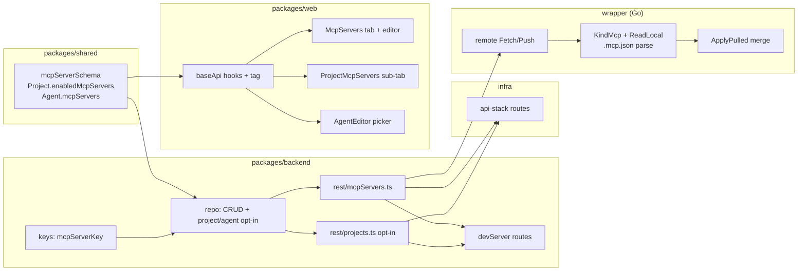
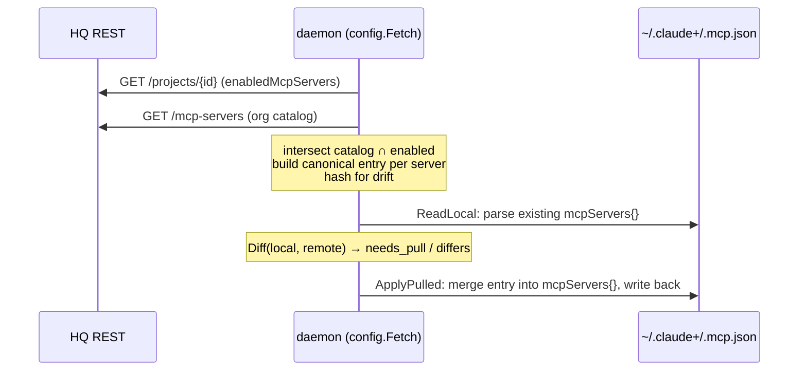

# feat: MCP Servers catalog (tab + project/agent attachment)

## Summary

Add **MCP servers** as a first-class org-catalog item type, modeled on the existing **Skills** and **Agents** features. The work lands a new top-level `/mcp-servers` tab (list / create / edit / delete), a per-project opt-in sub-tab, and an MCP-server picker inside the agent editor — exactly mirroring how skills are added to projects or attached to agents. The catalog is org-scoped, plaintext secrets reuse the existing org auth boundary, and there is **no bundle concept** (servers are flat, unlike skill bundles).

The one mechanic that genuinely differs from skills: where a skill materializes as a `SKILL.md` file on the daemon, an MCP server materializes as an **entry merged into `~/.claude+/.mcp.json`** — which is already a seeded, claude+-owned file (`wrapper/internal/config/overlay.go:45`). Everything else (DTOs, keys, repo, REST, project opt-in, agent union-on-add, web tabs, RTK Query hooks, drift/reconcile) is a near-mechanical parallel of the skills/agents code already in the tree.

---

## Problem Frame

Today an org can curate **skills** and **agents** in Command HQ and opt projects into them; a connected `claude+` daemon materializes exactly the opted-in set into its isolated `~/.claude+` config root. MCP servers — the third pillar of a Claude setup — have no equivalent. They can only be configured by hand-editing `.mcp.json` on each machine, with no central catalog, no per-project opt-in, and no way to bundle them into an agent definition.

This feature closes that gap by making MCP servers a managed catalog item with the same lifecycle as skills/agents: author once in HQ, opt projects in (directly or via an agent), and let the daemon sync them down.

**Scope boundary:** This plan does not change how skills or agents behave. It adds a parallel item type and the one new materialization path (`.mcp.json` merge). Bundling, secret encryption, and remote-transport OAuth flows are out of scope (see Scope Boundaries).

---

## Key Technical Decisions

### KTD1 — MCP server is a _structured_ catalog record, not a markdown body

Skills store a freeform `body` (the `SKILL.md`). An MCP server instead stores **structured config**: a `transport` discriminator with per-transport fields. This is the authoritative shape the wrapper reconstructs into a `.mcp.json` entry — there is no separate `body` field.

```ts
// directional schema sketch — see U1 for the authoritative Zod
type McpServer =
  | {
      name;
      scope;
      transport: 'stdio';
      command: string;
      args: string[];
      env: Record<string, string>;
      createdBy?;
    }
  | {
      name;
      scope;
      transport: 'http' | 'sse';
      url: string;
      headers: Record<string, string>;
      createdBy?;
    };
```

Supports **stdio + remote (http/sse)** transports (per scoping decision). The Zod schema is a discriminated union on `transport`; the editor renders different fields per branch.

### KTD2 — Org-only scope, reusing the exact skills auth model

MCP servers key under `SCOPE#org#<org>` with SK `MCPSERVER#<name>`, exactly like `skillKey`/`agentKey` (`packages/backend/src/db/keys.ts:94`). Catalog writes are gated by `canWriteOrgCatalog` + `isAdmin`; project opt-in is gated by admin-or-owner (`projectForOptIn`, `packages/backend/src/rest/projects.ts:414`). No new auth primitives.

### KTD3 — Plaintext secrets, documented trust boundary

`env`/`headers` values (API keys, tokens) are stored as plaintext in DynamoDB and served to authed org members — the same trust model skills' bodies already use. This is a deliberate v1 simplification; KMS/env-ref resolution is a documented follow-up (see Risks R1).

### KTD4 — No bundles

Unlike skills (`kind: 'skill' | 'bundle'`, `members[]`, flatten/dissolve), MCP servers are flat. This drops the entire bundle machinery: no `kind` discriminator-for-grouping, no `/members`, `/dissolve`, `/usage`-of-bundle, no `flattenBundle`. Agent union-on-add becomes a plain name union (no transitive expansion).

### KTD5 — Catalog UI modeled on Agents, project UI modeled on Skills

The `/mcp-servers` catalog + editor mirror `packages/web/src/screens/Agents/` (structured editor, no bundle drill-down) rather than `Skills/` (which carries bundle UI). The per-project sub-tab mirrors `packages/web/src/screens/ProjectDetail/ProjectSkills.tsx`. The reusable `SkillCombobox` (`packages/web/src/components/SkillCombobox.tsx`) is generic (`{ name, hint }`) and is reused for the agent-editor MCP picker.

### KTD6 — Wrapper materializes by merging into `.mcp.json`

The daemon's drift/diff engine (`wrapper/internal/config/sync.go`) is already generic over `Kind`. Adding `KindMcp` requires only: a `ReadLocal` reader that parses `.mcp.json` (one item per `mcpServers` key), an `ApplyPulled` writer that **merges** a single entry into `.mcp.json` (not a whole-file overwrite), and a `remote.go` fetch that builds the canonical entry from the structured HQ record. Hash parity hinges on **identical canonical JSON serialization** on both the read and apply sides (see Risks R2).

---

## High-Level Technical Design

### Component parallel (what mirrors what)



### Materialization data flow (the one novel path)



Triggers satisfied: 5-package component graph (component diagram) and a multi-step cross-process materialization flow (sequence diagram). The schema sketch in KTD1 covers the DSL/shape design.

---

## Output Structure

New files (existing files are modified in place; see per-unit `Files`):

```
packages/backend/src/rest/mcpServers.ts        # catalog REST handler (mirrors skills.ts, no bundle verbs)
packages/web/src/screens/McpServers/
  McpServers.tsx                                # catalog list (mirrors Agents.tsx)
  McpServerEditor.tsx                           # create/edit (mirrors AgentEditor.tsx)
packages/web/src/screens/ProjectDetail/
  ProjectMcpServers.tsx                         # per-project opt-in (mirrors ProjectSkills.tsx)
wrapper/internal/config/mcp.go                  # .mcp.json read/merge helpers (canonical serialization)
```

---

## Implementation Units

### U1. Shared DTOs: MCP server schema + project/agent fields

**Goal:** Define the catalog record shape and the two attachment arrays so every downstream layer compiles against one source of truth.

**Requirements:** Foundational — every other unit depends on this.

**Dependencies:** none.

**Files:**

- `packages/shared/src/dto.ts` (add `mcpServerSchema`/`McpServer`, `MCP_TRANSPORTS`; add `enabledMcpServers` to `projectSchema`; add `mcpServers` to `agentSchema`)
- `packages/shared/test/dto.test.ts` (or the existing shared test file — locate the skills schema tests and mirror)

**Approach:**

- `mcpServerSchema` = `z.discriminatedUnion('transport', [...])`:
  - `stdio`: `command: z.string().min(1)`, `args: z.array(z.string()).default([])`, `env: z.record(z.string()).default({})`
  - `http`/`sse`: `url: z.string().url()`, `headers: z.record(z.string()).default({})`
  - Common to both: `name`, `scope: scopeRefSchema`, `createdBy: createdBySchema.optional()`.
- `projectSchema`: add `enabledMcpServers: z.array(z.string()).default([])` with a doc-comment mirroring `enabledSkills` (lines 28–33). The `.default([])` keeps legacy project records valid.
- `agentSchema`: add `mcpServers: z.array(z.string()).default([])` next to `skills`/`tools` (line 185), with `.default([])` for back-compat.
- Mirror authorship/back-compat doc-comment style already in the file.

**Patterns to follow:** `skillSchema` (lines 207–237), `agentSchema` (lines 174–190), `projectSchema.enabledSkills/enabledAgents` (lines 28–39).

**Test scenarios:**

- A valid `stdio` server (command + args + env) parses; `args`/`env` default to `[]`/`{}` when omitted.
- A valid `http` server (url + headers) parses; an invalid (non-URL) `url` fails.
- A record with an unknown `transport` fails the discriminated union.
- A legacy project JSON lacking `enabledMcpServers` parses with the field defaulted to `[]`.
- A legacy agent JSON lacking `mcpServers` parses with the field defaulted to `[]`.

---

### U2. DB keys + repo: CRUD, project opt-in, agent union-on-add

**Goal:** Persist MCP servers and wire the project/agent opt-in mutators.

**Requirements:** Backend persistence for the catalog + attachment.

**Dependencies:** U1.

**Files:**

- `packages/backend/src/db/keys.ts` (add `mcpServerKey`)
- `packages/backend/src/db/repo.ts` (add `putMcpServer`/`getMcpServer`/`deleteMcpServer`/`listMcpServers`; `addMcpServerToProject`/`removeMcpServerFromProject`; extend `addAgentToProject` to union `agent.mcpServers`)
- `packages/backend/test/repo.test.ts` (or existing repo test file — mirror skills coverage)

**Approach:**

- `mcpServerKey(scope, name) = { PK: SCOPE#<scopeId>, SK: MCPSERVER#<name> }` — copy `skillKey` (keys.ts:94).
- Repo CRUD copies `putSkill`/`getSkill`/`deleteSkill`/`listSkills` (repo.ts:549–592). `listMcpServers(org, userId?)` follows the same org+user merge via `listScoped` + `resolveScoped` for shadowing parity (even though catalog is org-only today, this keeps the pattern identical and future-proof).
- `addMcpServerToProject`/`removeMcpServerFromProject` copy `addSkillToProject`/`removeSkillFromProject` (repo.ts:613–631) against `project.enabledMcpServers`.
- Extend `addAgentToProject` (repo.ts:640–660): after the skills union, union `agent.mcpServers` (plain names — **no flatten**, no bundles) into `project.enabledMcpServers`. `removeAgentFromProject` stays a pure `enabledAgents` prune (does not strip servers), matching the skills decision (repo.ts:662–673).

**Patterns to follow:** the entire `// --- Agents + skills (scoped)` and `// --- Project opt-in` sections of `repo.ts`.

**Test scenarios:**

- put → get round-trips an stdio and an http server unchanged.
- `listMcpServers` returns only `MCPSERVER#`-prefixed items in the org partition; skills/agents in the same partition are not returned.
- `addMcpServerToProject` is idempotent (adding twice yields one entry); `remove` drops it.
- `addAgentToProject` for an agent with `mcpServers: ['a','b']` unions both into `enabledMcpServers` (de-duped against any already present).
- `removeAgentFromProject` leaves `enabledMcpServers` intact.
- A missing project/server returns `undefined` (no throw), matching skills.

---

### U3. Backend REST: catalog handler + project opt-in + agent gate

**Goal:** Expose CRUD and project enable/disable over REST.

**Requirements:** API surface for the web + wrapper.

**Dependencies:** U2.

**Files:**

- `packages/backend/src/rest/mcpServers.ts` (new — list/get/create/update/delete/usage; **no** members/dissolve/scope verbs)
- `packages/backend/src/rest/projects.ts` (add `enableProjectMcpServer`/`disableProjectMcpServer`; route them in `handler`)
- `packages/backend/test/mcpServers.test.ts` (new), `packages/backend/test/project-optin.test.ts` (extend)

**Approach:**

- `mcpServers.ts` copies `skills.ts` minus bundle code: `resolveMcpServers` (no `flattenBundle`/`resolvedMembers` annotation — just return the list), `getMcpServer`, `createMcpServer` (forces org scope, stamps `createdBy`, admin-gated via `canWriteOrgCatalog`+`isAdmin`), `deleteMcpServer`, optional `getUsage` (count agents whose `mcpServers[]` includes the name — copy `usageCount` at skills.ts:138). `handler` routes `POST`/`PUT`/`DELETE`/`GET name`/`GET list` + `GET .../usage`.
- `projects.ts`: `enableProjectMcpServer` copies `enableProjectSkill` (projects.ts:432) — validate the server exists in the org catalog via `repo.getMcpServer(orgScope(principal.org), name)` then `addMcpServerToProject`. `disableProjectMcpServer` copies `disableProjectSkill`. Add the route regex to `handler` (projects.ts:511): `/\/mcp-servers\/[^/]+$/`.
- Reuse `projectForOptIn` unchanged.

**Patterns to follow:** `packages/backend/src/rest/skills.ts` (handler + createSkill + getUsage), `enableProjectSkill`/`disableProjectSkill` (projects.ts:431–465).

**Test scenarios:**

- `GET /mcp-servers` returns the org catalog; empty when org has none.
- `POST /mcp-servers` as a non-admin → 403; as admin → 201 with `createdBy` stamped and scope forced to org (client-supplied scope ignored).
- `PUT /mcp-servers/:name` preserves the original `createdBy`.
- `POST` with an invalid body (bad transport / non-URL url) → 400.
- `DELETE /mcp-servers/:name` as admin → 200/204; as non-admin → 403.
- `GET /mcp-servers/:name/usage` returns the count of agents referencing it.
- `POST /projects/:id/mcp-servers/:name` by owner enables; by a stranger → 403; for a name not in the catalog → 404. Idempotent re-enable.
- `DELETE /projects/:id/mcp-servers/:name` disables; response carries the hydrated project with `enabledMcpServers`.

---

### U4. Route wiring: infra + local dev server

**Goal:** Make the new endpoints reachable in prod (API Gateway) and local dev.

**Requirements:** Deployment + local parity.

**Dependencies:** U3.

**Files:**

- `infra/lib/api-stack.ts` (add `mcpServersFn` Lambda, grant RW, register routes)
- `packages/backend/src/local/devServer.ts` (import handler, add route regexes)
- `infra/test/api-stack.test.ts` (extend route assertions)

**Approach:**

- `api-stack.ts`: add `const mcpServersFn = makeFn('RestMcpServersFn', 'rest_mcp_servers')` (line ~140), `grantReadWrite(mcpServersFn)` (line ~153), and routes mirroring skills (lines 241–246) minus bundle routes:
  - `r('/mcp-servers', [GET, POST], mcpServersFn, 'McpServers')`
  - `r('/mcp-servers/{name}', [GET, PUT, DELETE], mcpServersFn, 'McpServerByName')`
  - `r('/mcp-servers/{name}/usage', [GET], mcpServersFn, 'McpServerUsage')`
  - The project opt-in route `/projects/{projectId}/mcp-servers/{name}` is served by the existing **projects** Lambda — add it alongside the skills/agents project routes if project sub-routes are registered explicitly in `api-stack.ts` (check the project route block near line 237; mirror the skills/agents project-route registration).
- Confirm the Lambda entry name (`rest_mcp_servers`) matches the backend build's handler-naming convention used by `makeFn` (verify against how `rest_skills` maps to `skills.ts`).
- `devServer.ts`: import `handler as mcpServersHandler` (near line 21); add regexes mirroring skills (lines 239–245) minus bundle routes; add the project opt-in regex mirroring lines 216–219:
  - `/^\/mcp-servers\/(?<name>[^/]+)\/usage$/`, `/^\/mcp-servers\/(?<name>[^/]+)$/`, `/^\/mcp-servers$/`
  - `/^\/projects\/(?<projectId>[^/]+)\/mcp-servers\/(?<name>[^/]+)$/ → projectsHandler`

**Patterns to follow:** the skills/agents Lambda + route block in `api-stack.ts:139–247`; the route table in `devServer.ts:211–245`.

**Test scenarios:**

- `infra/test/api-stack.test.ts`: synth asserts the `/mcp-servers`, `/mcp-servers/{name}`, and `/mcp-servers/{name}/usage` routes exist with the expected methods.
- Manual/dev: `curl` against the dev server for list/create/enable round-trips (smoke, not a unit test).
- `Test expectation: none for the devServer route-table edit itself` — it is config; coverage comes from the REST handler tests (U3) exercised through the dev server.

---

### U5. Web API layer: RTK Query hooks + cache tag

**Goal:** Give the web app typed hooks for catalog CRUD and project opt-in.

**Requirements:** Frontend data access.

**Dependencies:** U1 (types), U3 (endpoints).

**Files:**

- `packages/web/src/api/baseApi.ts` (add `'McpServer'` tag; `useGetMcpServersQuery`, `useGetMcpServerQuery`, `useSaveMcpServerMutation`, `useDeleteMcpServerMutation`, `useEnableProjectMcpServerMutation`, `useDisableProjectMcpServerMutation`)
- `packages/web/src/api/baseApi.test.ts` if present (mirror skills hook tests)

**Approach:**

- Add `'McpServer'` to `tagTypes` (baseApi.ts:119).
- `useGetMcpServersQuery` copies `useGetSkillsQuery` (lines 350–354): `GET /mcp-servers`, `transformResponse: unwrapArray<McpServer>('mcpServers')`, `providesTags: ['McpServer']`.
- `useSaveMcpServerMutation` copies `useSaveAgentMutation` (lines 411–415): `POST /mcp-servers` (or `PUT` on edit — match the agent save convention), invalidates `['McpServer']`.
- `useEnableProjectMcpServerMutation`/`useDisableProjectMcpServerMutation` copy the skill project mutations (lines 420–437): `POST`/`DELETE /projects/:projectId/mcp-servers/:name`, invalidate `['Project', { type:'Project', id: projectId }]`.

**Patterns to follow:** the skills + agent endpoints in `baseApi.ts`.

**Test scenarios:**

- `Test expectation: none beyond type-check` for the hook definitions themselves (thin RTK wrappers); behavior is covered by the screen tests in U6/U7 and the backend tests in U3. If the repo has existing baseApi endpoint tests, add a query-builds-correct-URL assertion for `enable/disableProjectMcpServer`.

---

### U6. Web catalog UI: MCP Servers tab + editor + nav

**Goal:** A `/mcp-servers` top-level tab to list, create, edit, and delete catalog servers.

**Requirements:** The user-facing catalog parallel to Agents/Skills tabs.

**Dependencies:** U5.

**Files:**

- `packages/web/src/screens/McpServers/McpServers.tsx` (new — list)
- `packages/web/src/screens/McpServers/McpServerEditor.tsx` (new — create/edit, transport-aware fields)
- `packages/web/src/components/AppShell.tsx` (add `{ to: '/mcp-servers', label: 'MCP Servers' }` to `NAV`, line 14–21)
- `packages/web/src/app/router.tsx` (add `/mcp-servers`, `/mcp-servers/new`, `/mcp-servers/:name/edit` routes, ~lines 55–58)
- `packages/web/src/screens/McpServers/McpServers.test.tsx`, `McpServerEditor.test.tsx` (new)

**Approach:**

- Model `McpServers.tsx` on `Agents.tsx` (card grid, author filter, no bundle drill-down). Each card shows name, transport badge, command/url summary, author.
- `McpServerEditor.tsx` modeled on `AgentEditor.tsx`: name (disabled on edit), a **transport select** (`stdio`/`http`/`sse`) that conditionally renders either `command + args + env` (stdio) or `url + headers` (http/sse). `env`/`headers` are key/value row editors. Save via `useSaveMcpServerMutation`; delete via `useDeleteMcpServerMutation` with a confirm.
- Admin-gate the create/edit/delete affordances the same way the Skills/Agents screens do (check how those screens read admin from `useGetMeQuery` and hide write controls).

**Patterns to follow:** `packages/web/src/screens/Agents/Agents.tsx` + `AgentEditor.tsx`; `AppShell.tsx` NAV; `router.tsx` agent routes.

**Test scenarios:**

- List renders cards from a mocked `useGetMcpServersQuery`; empty state when none.
- Editor: selecting `stdio` shows command/args/env fields; switching to `http` swaps to url/headers and hides command.
- Saving an stdio server calls the save mutation with the correct discriminated payload.
- Invalid url in http mode surfaces a validation error and blocks save.
- Non-admin user does not see create/edit/delete controls.
- Nav: `MCP Servers` link renders and routes to `/mcp-servers`.

---

### U7. Web attachment UI: project sub-tab + agent-editor picker

**Goal:** Add MCP servers to a project directly, and attach them to an agent definition.

**Requirements:** The two attachment paths that mirror skills-on-project and skills-on-agent.

**Dependencies:** U5, U6.

**Files:**

- `packages/web/src/screens/ProjectDetail/ProjectMcpServers.tsx` (new)
- `packages/web/src/screens/ProjectDetail/ProjectLayout.tsx` (add `{ to: 'mcp-servers', label: 'MCP Servers' }` to `SUBTABS`, lines 9–17)
- `packages/web/src/app/router.tsx` (add the project sub-route under `ProjectLayout`)
- `packages/web/src/screens/Agents/AgentEditor.tsx` (add an MCP-server picker section + `mcpServers` pills, mirroring the skills picker at lines 112–156)
- `packages/web/src/screens/ProjectDetail/ProjectMcpServers.test.tsx` (new), `AgentEditor.test.tsx` (extend)

**Approach:**

- `ProjectMcpServers.tsx` copies `ProjectSkills.tsx`: a `SkillCombobox` (reused; pass MCP server names as options) to add from the catalog, pills with remove buttons, backed by `useGetProjectQuery` + enable/disable mutations. Show transport + summary per enabled server.
- `AgentEditor.tsx`: add a second picker block under the skills picker bound to `draft.mcpServers`, with a `toggleMcpServer` helper copying `toggleSkill` (lines 50–53). The save payload already carries `mcpServers` once U1 lands.
- Reuse `SkillCombobox` with `hint` set to the transport (e.g. `"stdio"`), no new combobox component.

**Patterns to follow:** `ProjectSkills.tsx` (combobox + pills + enable/disable), `AgentEditor.tsx` skills picker (lines 112–156), `ProjectAgents.tsx` for the union display note.

**Test scenarios:**

- Project sub-tab lists enabled servers from a mocked project; adding via combobox calls `enableProjectMcpServer`; removing calls `disableProjectMcpServer`.
- Enabling an **agent** that declares `mcpServers` reflects those servers as enabled on the project after refetch (covered end-to-end by U3's union test; here assert the UI re-renders the unioned set).
- Agent editor: toggling an MCP server adds/removes it from the draft and the saved payload includes `mcpServers`.
- `SUBTABS` renders the `MCP Servers` sub-tab and routes correctly.

---

### U8. Wrapper materialization: KindMcp + `.mcp.json` merge + drift

**Goal:** Make a connected `claude+` daemon sync opted-in MCP servers into `~/.claude+/.mcp.json` with correct drift detection.

**Requirements:** The end-to-end payoff — opted-in servers actually appear in the daemon's Claude config.

**Dependencies:** U3 (REST contract).

**Execution note:** Hash-parity is the failure-prone seam. Start with a characterization test that round-trips a server record → canonical entry → `.mcp.json` → re-read → hash, asserting `in_sync`, before wiring it into the live fetch loop.

**Files:**

- `wrapper/internal/config/mcp.go` (new — `.mcp.json` parse + canonical entry build + merge-write)
- `wrapper/internal/config/claude.go` (add `KindMcp`; extend `ReadLocal` to read `.mcp.json`; extend `ApplyPulled` to merge)
- `wrapper/internal/config/remote.go` (add `remoteMcpServer`; fetch `GET /mcp-servers`; intersect with `project.enabledMcpServers`; build canonical body; extend `Push`)
- `wrapper/internal/config/sync_test.go`, `wrapper/internal/config/mcp_test.go` (new), `wrapper/internal/config/remote_test.go` (extend)

**Approach:**

- `Kind`: add `KindMcp Kind = "mcp"` (claude.go:20). `Diff`/`Reconcile`/`DriftReport` are already kind-generic — no change.
- **ReadLocal:** MCP items don't live one-file-per-item. Add a reader that opens `~/.claude+/.mcp.json` (and `~/.claude/.mcp.json`, user-wins on collision per existing precedence) and emits one `Item{Kind: KindMcp, Name: <serverKey>}` per `mcpServers` entry, `Hash = hashContent(canonicalJSON(entry))`. `Path` points at the `.mcp.json` file (shared) — note that `Reconcile`'s `needs_push` branch reads `it.Path` as a whole file, which is wrong for a single MCP entry; handle MCP push by serializing the specific entry, not `os.ReadFile(it.Path)` (see Risks R2).
- **canonical serialization (`mcp.go`):** one function used by both read and apply — marshal the entry with sorted keys / stable field order so the hash computed from the HQ-built entry equals the hash of the locally-stored entry. This is the linchpin of drift correctness.
- **ApplyPulled:** for `KindMcp`, read `.mcp.json` (or `{}`), set `mcpServers[name] = entry`, write back — a **merge**, never a whole-file overwrite (other servers and unrelated keys are preserved).
- **remote.go Fetch:** add `remoteMcpServer` struct (transport + fields), `GET /mcp-servers`, intersect names with `proj.EnabledMcpServers` (add field to `remoteProject`, line 96), build the canonical entry as the cached "body", hash it. **Construct the `.mcp.json` entry from the structured fields** — there is no markdown body to fall back on.
- **Push:** `KindMcp` case posts `{ name, scope, transport, ...fields }` to `/mcp-servers` (minimal authoring payload, like the skill/agent push at remote.go:209).

**Patterns to follow:** `ReadLocal`/`ApplyPulled` (claude.go:51–150), `Fetch`/`Body`/`Push` (remote.go:110–227), `Diff`/`Reconcile` (sync.go).

**Test scenarios:**

- `canonicalJSON` produces byte-identical output for two entries that differ only in key order.
- Round-trip: HQ record → canonical entry → ApplyPulled into empty `.mcp.json` → ReadLocal → `Diff` reports `in_sync` (hash parity).
- ApplyPulled merges: an existing unrelated `mcpServers` entry and unrelated top-level `.mcp.json` keys survive the write.
- Fetch intersects: a catalog server **not** in `enabledMcpServers` is excluded; one that is, is included with a correct hash.
- Drift: a locally edited entry hashes as `differs`; an HQ-only server is `needs_pull`; a local-only one is `needs_push`.
- Reconcile pull writes the entry and is idempotent (second run is a no-op).
- A malformed local `.mcp.json` surfaces as an `Err` item, not a panic, and does not blank the other kinds.
- Stdio and http servers both round-trip (env and headers preserved).

---

## Scope Boundaries

**In scope:** org catalog CRUD for MCP servers (stdio + http/sse), per-project opt-in, agent-definition attachment with union-on-add, web tab + editor + project sub-tab + agent-editor picker, wrapper materialization into `.mcp.json` with drift/reconcile.

### Deferred to Follow-Up Work

- **Seeding** built-in MCP servers (the skills seed reads repo `.claude/skills/`; there is no analogous repo source for MCP servers). The catalog simply starts empty — no seed unit. Add later if a starter set is desired (would mirror `packages/backend/src/seed/skills.ts`).
- **Usage-aware delete UI** (warn when deleting a server attached to agents/projects) — the `/usage` endpoint lands in U3 but wiring a confirmation UI is follow-up.
- **`/mcp-servers/{name}/scope`** and any tier machinery — retired-by-design for the org-only catalog (mirrors the skills 410).

### Explicit Non-Goals

- **Bundles** for MCP servers (per scoping decision).
- **Secret encryption / KMS / env-ref resolution** — plaintext is the v1 trust model (KTD3, R1).
- **Remote-transport OAuth / auth handshakes** beyond static headers.
- **Changing skills/agents behavior** in any way.

---

## Risks & Mitigations

### R1 — Plaintext secrets in DynamoDB and over the wire

`env`/`headers` may carry API keys, stored unencrypted and served to any authed org member; they also land in `.mcp.json` on the daemon host. **Mitigation:** This matches the existing skills trust model (bodies are already served in the clear to org members); document the limitation in the MCP server schema doc-comment and the editor UI. KMS/env-ref is a tracked follow-up. **Do not** log `env`/`headers` values in REST or wrapper logs.

### R2 — Hash-parity / single-file merge mismatch (highest-risk seam)

MCP servers break two skills assumptions: (a) one-file-per-item, and (b) HQ serves a ready-made body to hash. If the wrapper's canonical serialization of the HQ-built entry differs by even a key order or whitespace from the locally-stored entry, every server shows perpetual `differs`. Additionally, `Reconcile`'s `needs_push` path `os.ReadFile(it.Path)` would read the **whole** `.mcp.json`, not one entry. **Mitigation:** a single shared `canonicalJSON` helper used on both sides (U8); a dedicated push path for `KindMcp` that serializes the specific entry; the characterization round-trip test is the first thing written (U8 execution note).

### R3 — Lambda handler-name convention for the new function

`makeFn('RestMcpServersFn', 'rest_mcp_servers')` must map to the built `mcpServers.ts` handler. **Mitigation:** U4 verifies the naming against how `rest_skills` resolves before relying on it; if the convention is filename-derived, name the entry accordingly.

### R4 — `.mcp.json` shape drift vs. Claude's real format

Claude's `.mcp.json` server-entry shape (e.g. `type` vs `transport`, exact field names for http/sse) must match what Claude actually reads. **Mitigation:** the wrapper's `mcp.go` is the single place that maps the catalog record → on-disk entry; pin it to the format the seeded `.mcp.json` already uses on the dev machine and add a test fixture from a real entry.

---

## Dependencies / Sequencing

```
U1 (shared) ─┬─> U2 (repo) ─> U3 (REST) ─┬─> U4 (routes)
             │                            ├─> U5 (web api) ─> U6 (catalog UI) ─> U7 (attach UI)
             │                            └─> U8 (wrapper)
```

U1 unblocks everything. U2→U3 are strictly ordered. U4, U5, and U8 can proceed in parallel once U3 lands. U6 precedes U7. U8 is independent of the web units and can be built/tested against the dev server.

---

## Test Strategy

- **Unit (backend):** repo CRUD + opt-in (U2), REST handlers incl. auth gates and validation (U3) — mirror `skills.test.ts`/`project-optin.test.ts`.
- **Unit (shared):** schema parse/defaults/back-compat (U1).
- **Unit (web):** screen tests with mocked RTK hooks (U6/U7).
- **Unit (wrapper):** canonical-serialization + round-trip + drift + merge (U8) — the highest-value tests given R2.
- **Infra synth:** route presence (U4).
- **Manual smoke:** dev server CRUD + enable + a real daemon picking up a server into `.mcp.json`.

---

## Sources & Research

All file/line references are from the current tree:

- Data model: `packages/shared/src/dto.ts` (skillSchema, agentSchema, projectSchema).
- Keys: `packages/backend/src/db/keys.ts` (skillKey/agentKey).
- Repo: `packages/backend/src/db/repo.ts` (skills CRUD, project/agent opt-in, expandAgentSkills).
- REST: `packages/backend/src/rest/skills.ts`, `packages/backend/src/rest/projects.ts` (opt-in handlers + router).
- Routes: `infra/lib/api-stack.ts:139–247`, `packages/backend/src/local/devServer.ts:211–245`.
- Seed (for the deferred seeding note): `packages/backend/src/seed/skills.ts`.
- Web: `packages/web/src/api/baseApi.ts`, `screens/Agents/*`, `screens/Skills/*`, `screens/ProjectDetail/{ProjectSkills,ProjectAgents,ProjectLayout}.tsx`, `components/{SkillCombobox,SkillCard}.tsx`, `components/AppShell.tsx`, `app/router.tsx`.
- Wrapper: `wrapper/internal/config/{claude,sync,remote,overlay}.go` (Kind, ReadLocal, ApplyPulled, Diff/Reconcile, Fetch/Push, the seeded `.mcp.json`).
