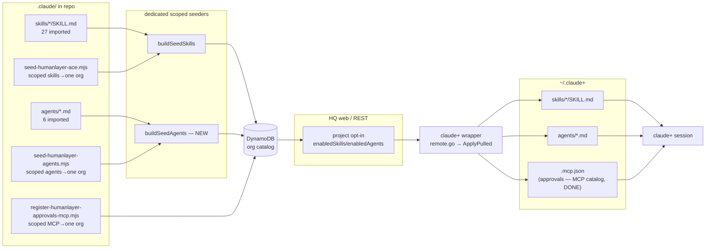

# feat: Adopt HumanLayer ACE as Command HQ's engineering workflow

## Summary

Import **everything HumanLayer ships** — all 27 of its bundled slash-commands and all 6 of its research subagents — into the Command HQ org catalog as the canonical engineering workflow, replacing whatever currently fills that role. Commands become HQ **skills** (the wrapper has no `commands/` concept — only `skills/` and `agents/` materialize), subagents become HQ **agents**, and the set ships as a new `humanlayer-ace` bundle registered to a **single org** (initially `test org`) via a dedicated scoped seed script — deliberately kept **out** of the shared `.claude/skills/bundles.json` so it never propagates org-wide. A new pure `buildSeedAgents` builder plus a **dedicated scoped script** (`seed-humanlayer-agents.mjs`, parallel to the skills one and likewise kept out of `starter.ts`/`seed-all-orgs.mjs`) registers the **agents** for the same single org, establishing a repo-managed agent convention that parallels skills.

HumanLayer's human-in-the-loop **approvals MCP** already works locally in `claude+` (registered in `~/.claude+/.claude.json`), so HITL is dogfoodable today. The MCP-servers catalog (`docs/plans/2026-06-07-001-feat-mcp-servers-tab-plan.md`) has since **landed** — `mcpServerSchema`, REST, repo methods, and the wrapper's `~/.claude+/.mcp.json` merge are all done — so single-org distribution is now **in scope** here: register `humanlayer-approvals` as a scoped MCP-server record (`infra/scripts/register-humanlayer-approvals-mcp.mjs`) and attach it per-project (`enabledMcpServers`) or via `agent.mcpServers`. Only *org-wide* rollout stays out of scope, consistent with the test-org-only containment rule.

The third-party `compound-engineering` plugin is **unrelated** to this work and is removed as part of the cleanup, not treated as a source.

---

## Problem Frame

Command HQ curates skills and agents in an org catalog and syncs the opted-in set down to each connected `claude+` daemon's isolated `~/.claude+` config root. Today the catalog has Command HQ's own *platform* tooling (the `command-hq-starter` bundle: forge, weekly-update, progress, skill authoring) but **no engineering workflow** — no research, plan, implement, validate, commit loop. Developers who want one install the third-party `compound-engineering` plugin per-machine (the repo's `compound-engineering` skill is just an installer for it, seeded at narrow user scope and deliberately excluded from the org default — `packages/backend/src/seed/skills.ts:74-78`).

HumanLayer has invested heavily in this exact problem ("Advanced Context Engineering for Coding Agents"): a research → plan → implement → validate workflow built on parallel research subagents, plus a human-in-the-loop approval mechanism for high-stakes operations. The decision is to adopt that workflow wholesale as Command HQ's engineering workflow rather than build or curate one. This plan imports it through the existing catalog machinery so every opted-in project gets it, and wires it to the approvals MCP so HITL is available now and distributes org-wide when the MCP catalog lands.

---

## Source Inventory

**Location:** `C:\Users\mattd\AppData\Roaming\npm\node_modules\humanlayer\.claude\` (npm `humanlayer@0.17.2-npm`). Paths below are repo-relative *targets*; the source is this read-only package directory.

**27 commands → skills** (`.claude/commands/<name>.md`, frontmatter `description` + optional `model`):
`ci_commit`, `ci_describe_pr`, `commit`, `create_handoff`, `create_plan`, `create_plan_generic`, `create_plan_nt`, `create_worktree`, `debug`, `describe_pr`, `describe_pr_nt`, `founder_mode`, `implement_plan`, `iterate_plan`, `iterate_plan_nt`, `linear`, `local_review`, `oneshot`, `oneshot_plan`, `ralph_impl`, `ralph_plan`, `ralph_research`, `research_codebase`, `research_codebase_generic`, `research_codebase_nt`, `resume_handoff`, `validate_plan`.

**6 subagents → agents** (`.claude/agents/<name>.md`, frontmatter `name` + `description` + `tools` + `model`):
`codebase-analyzer` (sonnet; Read, Grep, Glob, LS), `codebase-locator` (sonnet; Grep, Glob, LS), `codebase-pattern-finder` (sonnet; Grep, Glob, Read, LS), `thoughts-analyzer` (sonnet; Read, Grep, Glob, LS), `thoughts-locator` (sonnet; Grep, Glob, LS), `web-search-researcher` (sonnet; WebSearch, WebFetch, TodoWrite, Read, Grep, Glob, LS).

No name collisions exist with the current catalog (`hq-*`, `gstack`, `playwright-cli`, `compound-engineering`).

---

## Key Technical Decisions

### KTD1 — Commands import as skills, not commands
The wrapper materializes only `skills/` and `agents/` under `~/.claude+` (`wrapper/internal/config/overlay.go:72`, `claude.go:62-73`); there is no `commands/` directory and the REST surface is `/skills` + `/agents` only. Each HumanLayer command therefore becomes `.claude/skills/<name>/SKILL.md`: the markdown body is preserved verbatim; frontmatter is rewritten from `description` (+ `model`) to the skill shape `name` + `description`. The `description` is augmented with trigger phrasing per the repo's authoring convention (`.claude/skills/hq-create-skill/SKILL.md`) so the skill is discoverable.

### KTD2 — Preserve HumanLayer's original names
HumanLayer's commands cross-reference each other by name (e.g. `oneshot` launches `create_plan`, `create_worktree` launches `implement_plan`) and its commands invoke its subagents by their kebab names (`codebase-locator`, etc.). Renaming to the repo's kebab-case convention would silently break those references throughout the bodies. Decision: **keep the source names** — snake_case for the command-derived skills, kebab-case for the agents — accepting snake_case skill names as a deliberate exception to the kebab convention. Rationale beats convention here: an intact workflow is the whole point of adopting HumanLayer's research.

### KTD3 — Model pins survive on agents, not on skills
`skillSchema` (`packages/shared/src/dto.ts:207-237`) has **no `model` field**, so the `model: opus` pin on planning/research commands is dropped — those skills run at the session's model. `agentSchema` (`dto.ts:182-204`) **does** carry `model` (and `tools`), and per KTD8 those fields now *render* into the materialized subagent's frontmatter rather than being stored-but-discarded — so the 6 subagents keep AND apply their `sonnet` pin and declared `tools`. This is an accepted fidelity loss for the command (skill) layer only (see Risks R2); the workflow still functions, it just isn't model-pinned per skill.

### KTD4 — Dedicated scoped agent seeder (parallel to skills, test-org-only)
The disk seed registers skills only (`buildSeedSkills`, `packages/backend/src/seed/skills.ts`); agents are otherwise REST-only. The 6 agents are now **vendored into `.claude/agents/`** (KTD2/U2). To make their registration reproducible and repo-managed (not one-off REST calls) **without** leaking org-wide, add a pure `buildSeedAgents(org, files)` (`packages/backend/src/seed/agents.ts`) that parses each agent file's frontmatter (`name`, `description`, `tools`, `model`) + body and emits `agentSchema` records (`prompt` = body, `tools` = parsed list, `skills` = `[]`), and drive it from a **dedicated scoped script** `infra/scripts/seed-humanlayer-agents.mjs` — keyed on `SEED_ORG`, parallel to `seed-humanlayer-ace.mjs`, and deliberately **NOT** wired into `starter.ts` / `seed-all-orgs.mjs` (those propagate org-wide; test-org-only). This is the only net-new backend mechanism; everything else reuses existing paths.

### KTD5 — Register `humanlayer-ace` to a single org (not org-wide); keep the platform bundle
The imported skills are grouped into a new `humanlayer-ace` bundle and registered at **org scope for one org** (initially `test org`) via a dedicated script (`infra/scripts/seed-humanlayer-ace.mjs`). Crucially it does **not** add the bundle to the shared `.claude/skills/bundles.json`: that manifest feeds both the `acme` template's clone-on-create (`starter.ts`) and the every-org backfill (`seed-all-orgs.mjs`), either of which would push the set org-wide. Keeping it out of the manifest — and registering only against the explicit target org — contains it to that org's catalog and nowhere else. The script reuses the canonical `buildSeedSkills` builder (parity-safe) with an in-memory manifest. The existing `command-hq-starter` platform bundle (forge/weekly/progress/skill-authoring) **stays** untouched. The 6 agents register at org scope for the same org via their own dedicated scoped script (KTD4 / U3; agents have no bundle concept; `addAgentToProject` unions their declared skills on opt-in — `repo.ts:640`). *(Status: the 27 skills + bundle are already registered to `org#test org`; see U4.)*

### KTD6 — Approvals: local now, single-org catalog registration in scope (MCP catalog DONE)
The `humanlayer-approvals` MCP (transport `stdio`; `command: humanlayer`, `args: ["mcp","claude_approvals"]`, `env: {}`) is already registered at `~/.claude+/.claude.json` top-level `mcpServers`, so `claude+` sessions can call `mcp__humanlayer-approvals__request_permission` today. High-stakes skills (`commit`, `implement_plan`, `create_worktree`, `debug`) get a small shared approval directive referencing that tool by name, degrading gracefully when it is absent. The MCP-servers catalog (`docs/plans/2026-06-07-001-feat-mcp-servers-tab-plan.md`) has **landed** — `mcpServerSchema` (discriminated union on `transport`), `packages/backend/src/rest/mcpServers.ts`, `mcpServerKey`/`putMcpServer`, and the wrapper merge into `~/.claude+/.mcp.json` are all done; agents can declare `mcpServers[]`, and adding an agent to a project unions them into the project's `enabledMcpServers`. So catalog registration is now **in scope** for a single org via a dedicated scoped script (`infra/scripts/register-humanlayer-approvals-mcp.mjs`), with project opt-in (`enabledMcpServers`) or `agent.mcpServers` attachment. **Org-wide distribution stays out of scope** (test-org-only). See U9.

### KTD7 — Remove the `compound-engineering` installer skill
It is an installer for an unrelated third-party plugin and has no role once HumanLayer is the workflow. Delete `.claude/skills/compound-engineering/` and scrub its references from seed comments and the user-grant fallback list (`packages/backend/src/seed/skills.ts`, `starter.ts`).

### KTD8 — An agent is a structured record rendered to subagent frontmatter
An HQ agent is **not** a bare prompt — it is a structured record (`name`, `description`, `model`, `tools`, `prompt`) that *renders* to a valid Claude Code subagent file, exactly as a skill record renders to its full `SKILL.md`. Today the wrapper writes only the raw `prompt` to `~/.claude+/agents/<name>.md` with no frontmatter (`remote.go` caches `a.Prompt` as the body and hashes it; `claude.go:178-199` writes it verbatim), so the stored `model` and `tools` are **discarded** and there is no `description` field at all (`agentSchema`, `dto.ts:182-204`). This unit fixes the definition: `description` is added to the schema as the **mandatory delegation trigger** Claude Code uses to decide which subagent to invoke, and the wrapper materializes the agent as `--- name/description/tools/model --- + prompt` (omitting `tools` when empty and `model` when `""`, including `"inherit"`), hashing that **same** rendered string for drift parity. This mirrors the MCP-server *structured-record-rendered-to-config* pattern (plan 001's KTD1/KTD6: a structured catalog record reconstructed into an on-disk `.mcp.json` entry, hashed canonically on both sides). Model + tools are no longer stored-but-discarded — they render. Reference: `agentSchema` (`dto.ts:182-204`), the wrapper materialization (`remote.go`), and the subagent frontmatter shape Claude Code reads (`claude.go:132-149`).

---

## High-Level Technical Design

### Component parallel — what each source maps to

| HumanLayer source | HQ catalog record | Materialized at | Registration path |
|---|---|---|---|
| `commands/<cmd>.md` (description, model) | Skill (`kind:skill`, body=full md) | `~/.claude+/skills/<cmd>/SKILL.md` | seeder (extended bundle) |
| `.claude/agents/<name>.md` (name, desc, tools, model) | Agent (name, **description**, model, tools[], prompt) | `~/.claude+/agents/<name>.md` = **frontmatter (name/description/tools/model) + prompt** (rendered, KTD8) | dedicated scoped `seed-humanlayer-agents.mjs` (new `buildSeedAgents`) |
| approvals MCP (stdio) | MCP-server catalog record (transport `stdio`, **DONE**) | `~/.claude+/.mcp.json` (wrapper merge) | dedicated scoped `register-humanlayer-approvals-mcp.mjs` (single org) |

### Registration + materialization data flow



The only novel mechanism is `buildSeedAgents` (NEW); every other edge already exists for skills. The MCP catalog has **landed**, so the `humanlayer-approvals` record reaches `~/.claude+/.mcp.json` through the same project opt-in → wrapper merge path the skills/agents use — `register-humanlayer-approvals-mcp.mjs` writes the single-org record (U9). Note the `W --> CA` edge: the wrapper materializes each agent as a **rendered subagent file** — frontmatter (`name`/`description`/`tools`/`model`) **+ prompt**, hashed over that same rendered string (KTD8) — not a bare prompt; this is what makes the stored `model`/`tools` actually take effect on disk.

---

## Output Structure

```
.claude/
  skills/
    ci_commit/SKILL.md
    commit/SKILL.md
    create_plan/SKILL.md
    create_plan_nt/SKILL.md
    implement_plan/SKILL.md
    research_codebase/SKILL.md
    validate_plan/SKILL.md
    ... (27 total, original snake_case names)
    bundles.json                       # UNCHANGED — humanlayer-ace deliberately NOT added here
  agents/                              # repo-managed agents directory (vendored, kebab names)
    codebase-analyzer.md
    codebase-locator.md
    codebase-pattern-finder.md
    thoughts-analyzer.md
    thoughts-locator.md
    web-search-researcher.md
infra/scripts/
  seed-humanlayer-ace.mjs              # scoped SKILLS registration to one org (test org)
  seed-humanlayer-agents.mjs           # NEW: scoped AGENTS registration to one org (parallel to ace)
  register-humanlayer-approvals-mcp.mjs # NEW: scoped MCP registration to one org (approvals)
packages/backend/src/seed/
  agents.ts                            # NEW: buildSeedAgents (pure builder; mirrors buildSeedSkills)
  skills.ts                            # compound-engineering grant reference scrubbed (DONE)
```

The agent and MCP seeders are **dedicated scoped scripts** keyed on `SEED_ORG` — deliberately NOT wired into `starter.ts` / `seed-all-orgs.mjs` (those propagate org-wide; test-org-only). The per-unit Files lists remain authoritative; the implementer may adjust layout if a better one emerges.

---

## Implementation Units

### U1. Import the 27 commands as skills
**Goal:** Every HumanLayer command exists as a repo-managed HQ skill with valid frontmatter and verbatim body.
**Requirements:** Adopts the full HumanLayer command set (KTD1, KTD2).
**Dependencies:** none.
**Files:** `.claude/skills/<name>/SKILL.md` × 27 (names per Source Inventory).
**Approach:** For each command, create `skills/<name>/SKILL.md`. Body = the source markdown verbatim. Frontmatter = `name: <name>` (matching the directory) + a folded `description` that preserves the source description and adds trigger phrasing ("Use when the user says `/<name>`…") so the skill is discoverable. Drop the `model:` key (KTD3). Do **not** rewrite intra-body references to other commands/agents — KTD2 keeps names stable so they stay valid.
**Patterns to follow:** Frontmatter shape and folded-description style of existing skills (`.claude/skills/hq-init/SKILL.md`); the minimal parser the seed relies on (`infra/scripts/seed-skills.mjs` `parseFrontmatter`).
**Test scenarios:** Test expectation: none — content import, no behavior. Verified structurally in U7 (every SKILL.md parses through `parseFrontmatter` yielding a non-empty `name` + `description`).

### U2. Vendor the 6 subagents as repo-managed agent files *(DONE)*
**Goal:** Establish `.claude/agents/` and populate it with the 6 research subagents, frontmatter intact.
**Requirements:** Adopts HumanLayer's research subagents (KTD2, KTD4, KTD8).
**Dependencies:** U8 (the agent record + render contract must exist before agent files are vendored against it).
**Files:** `.claude/agents/{codebase-analyzer,codebase-locator,codebase-pattern-finder,thoughts-analyzer,thoughts-locator,web-search-researcher}.md`.
**Approach:** The 6 subagents are **vendored into `.claude/agents/`** (repo root, alongside `.claude/skills/`) verbatim, preserving `name` + `description` + `tools` + `model` frontmatter and body. Kebab names are kept (KTD2) — the imported skills reference these exact names. This directory is the source the dedicated agent seeder reads in U3. *(Status: all 6 files present at `.claude/agents/*.md`.)*
**Patterns to follow:** The agent record shape in `packages/backend/test/agents.test.ts:37-39` (`{ name, scope, model, prompt, skills, tools }`).
**Test scenarios:** Test expectation: none — content vendoring. Frontmatter parse is exercised by U3's tests.

### U3. Dedicated scoped agent seeder (parallel to the skills one)
**Goal:** Agents seed from `.claude/agents/*.md` the way the ACE skills seed from `.claude/skills/*` — through a **dedicated scoped script** keyed on `SEED_ORG`, so the 6 subagents land in **one** org's catalog reproducibly and **never propagate org-wide**.
**Requirements:** KTD4 — durable, repo-managed agent registration. TEST-ORG-ONLY containment (mirrors the skills seeder).
**Dependencies:** U8, U2.
**Files:** `packages/backend/src/seed/agents.ts` (new pure builder), `infra/scripts/seed-humanlayer-agents.mjs` (new dedicated scoped script, parallel to `seed-humanlayer-ace.mjs`), `packages/backend/test/seedAgents.test.ts` (new). **Deliberately NOT** `starter.ts`, `seed-skills.mjs`, or `seed-all-orgs.mjs` — wiring into those would push the agents into the acme template clone / every-org backfill (org-wide), which the test-org-only rule forbids.
**Approach:** Add a pure `buildSeedAgents(org, files)` mirroring `buildSeedSkills` (`seed/skills.ts:80-123`): parse each agent file's frontmatter (`name`, `description`, `tools` → string[], `model`) + body, emit `agentSchema.parse({ name, scope: orgScope(org), model, description, prompt: body, tools, skills: [] })` with `createdBy:{userId:'system',name:'system'}`. It parses `description` from the source frontmatter (alongside `tools`/`model`) so the materialized subagent carries its delegation trigger (KTD8); a source file lacking `description` defaults to `''` (schema default). The dedicated script `seed-humanlayer-agents.mjs` reads ONLY the 6 vendored `.claude/agents/*.md` files (explicit list, like `ACE_SKILLS` in the ace script), imports the compiled `buildSeedAgents` + `agentKey` from `packages/backend/dist` for record/key parity, and upserts each at org scope for the REQUIRED `SEED_ORG` (idempotent). It supports `SEED_DRY_RUN=1` (report-only, no writes) and refuses to run without `SEED_ORG`, exactly like `seed-humanlayer-ace.mjs`. Run: `SEED_ORG="test org" SEED_DRY_RUN=1 node infra/scripts/seed-humanlayer-agents.mjs` to preview; drop `SEED_DRY_RUN` to write. A human runs the real registration later.
**Patterns to follow:** `seed-humanlayer-ace.mjs` end-to-end (required `SEED_ORG`, explicit member list, in-process `parseFrontmatter`, compiled-`dist` builder/key import, `SEED_DRY_RUN` gate, per-record `PutCommand`); `buildSeedSkills` purity + idempotency (`seed/skills.ts`); `putAgent`/`agentKey` semantics (`packages/backend/src/db/{repo,keys}.ts`).
**Test scenarios:**
- Happy path: `buildSeedAgents` over the 6 files yields 6 org-scoped records; `model`/`tools`/`description` parsed correctly (e.g. `web-search-researcher` → `tools:[WebSearch,WebFetch,TodoWrite,Read,Grep,Glob,LS]`, `model:'sonnet'`, non-empty `description`); `prompt` equals the file body; `skills:[]`.
- Description seeding: a source file's frontmatter `description` is carried onto the record verbatim; a file lacking `description` yields `description:''` (schema default, no crash).
- Edge: a file missing `tools` frontmatter → `tools:[]` (not crash); missing `model` → record rejected by `agentSchema` (model is min-1) — assert the builder surfaces/skips rather than writing an invalid record.
- Containment: the builder/script target only the explicit `SEED_ORG`; nothing reads or writes `bundles.json`, `starter.ts`, or `seed-all-orgs.mjs`, so a different org's catalog is unchanged.
- Idempotency: running the seeder twice writes one record per agent (second run converges).
- Dry-run: `SEED_DRY_RUN=1` reports 6 records and writes nothing.

### U4. Bundle the skills and register them to a single org
**Goal:** The 27 skills form a `humanlayer-ace` bundle registered at org scope for **one** org (initially `test org`), not org-wide; the platform bundle is untouched.
**Requirements:** KTD5.
**Dependencies:** U8, U1, U3.
**Files:** `infra/scripts/seed-humanlayer-ace.mjs` (dedicated scoped registration). Deliberately **not** `.claude/skills/bundles.json`.
**Approach:** The script reads only the 27 imported skill dirs, builds an **in-memory** manifest (`{ 'humanlayer-ace': { members: [all 27] } }`), and runs it through the canonical `buildSeedSkills` so the 27 skills + the bundle record all land at org scope for the explicit `SEED_ORG`. It does **not** modify the shared `bundles.json`, which is what prevents `seed-all-orgs.mjs` / the `acme` template clone from propagating the set to other orgs. Run: `SEED_ORG="test org" node infra/scripts/seed-humanlayer-ace.mjs` (idempotent upsert; supports `SEED_DRY_RUN=1`). *(Already executed — 28 records confirmed in `org#test org`.)*
**Patterns to follow:** `seed-skills.mjs` (record build + `skillKey` put); the org-vs-grant scoping rule in `buildSeedSkills`.
**Test scenarios:**
- Happy path: after running, the `humanlayer-ace` bundle record + all 27 member skills exist at org scope for the target org (verified: 27 skills + bundle in `org#test org`).
- Containment: a *different* org's catalog is unchanged — the set did not propagate (it is absent from `bundles.json`, so `seed-all-orgs` won't pick it up).
- Edge: a manifest member with no matching SKILL.md is dropped from the bundle's stored `members` (existing `known.has` filter) — assert no dangling member.
- Regression: `command-hq-starter` members and scope are unchanged by the addition.

### U5. Approval directive in high-stakes skills *(DONE)*
**Goal:** High-stakes skills request human approval via the already-registered approvals tool, degrading gracefully when it is absent.
**Requirements:** KTD6.
**Dependencies:** U1.
**Files:** `.claude/skills/{commit,implement_plan,create_worktree,debug}/SKILL.md` (directive appended — all 4 present).
**Approach:** A short, shared "Human approval" directive is appended to the four high-stakes skill bodies instructing the agent, before irreversible/outward-facing actions, to call `mcp__humanlayer-approvals__request_permission` when that tool is available and to proceed normally when it is not (graceful degradation — keeps the skill usable in non-`claude+` contexts). No `--permission-prompt-tool` launch flag or wrapper edit here; catalog registration of the approvals MCP for the single org is owned by U9 (the MCP catalog has landed). *(Status: directive verified in all 4 SKILL.md bodies via `request_permission`.)*
**Patterns to follow:** Tool naming `mcp__<server>__<tool>` from the registered server `humanlayer-approvals`; the soft/optional phrasing used by existing skills when a capability may be absent.
**Test scenarios:** Test expectation: none — instructional content. Behavior verified manually in U7 (a high-stakes action in a `claude+` session triggers a `request_permission` prompt; the same skill run where the tool is absent proceeds without error).

### U6. Remove the compound-engineering installer skill + scrub seed comments *(DONE)*
**Goal:** The unrelated third-party installer is gone and the catalog no longer references it.
**Requirements:** KTD7.
**Dependencies:** none (independent; sequence anytime).
**Files:** `.claude/skills/compound-engineering/` (deleted); `packages/backend/src/seed/{skills,starter}.ts` (`compound-engineering` references scrubbed from the user-granted built-ins comments/examples).
**Approach:** The directory is removed and the seed references are scrubbed so the documented grant set (`gstack`, `playwright-cli`) no longer names it. No bundle listed it, so no manifest edit was required. *(Status: `.claude/skills/compound-engineering/` absent; `grep compound-engineering packages/backend/src/seed/` returns nothing.)*
**Patterns to follow:** The existing grant-owner comment block (`seed/skills.ts:74-78`).
**Test scenarios:**
- Regression: after a fresh seed, the catalog contains **no** record named `compound-engineering` at any scope; `gstack`/`playwright-cli` grants are unaffected.

### U7. End-to-end verification in a claude+ session
**Goal:** Prove the imported workflow registers, syncs, and runs — including a live approval prompt.
**Requirements:** Validates KTD1–KTD6 end to end.
**Dependencies:** U1–U6, U9.
**Files:** none (verification only); optionally `docs/plans/...-002-...-plan.md` checkboxes.
**Approach:** Seed locally against the test org (`npm run build -w @harness/backend`, then the dedicated scoped scripts: `SEED_ORG="test org" node infra/scripts/seed-humanlayer-ace.mjs` for skills + bundle, `… seed-humanlayer-agents.mjs` for the 6 agents, `… register-humanlayer-approvals-mcp.mjs` for the approvals MCP). Opt a test project into the `humanlayer-ace` bundle, the 6 agents, and the `humanlayer-approvals` MCP (`enabledMcpServers`), run `claude+ sync-skills` (`/hq-update-skills`), and confirm `~/.claude+/skills/*`, `~/.claude+/agents/*`, and the `humanlayer-approvals` entry in `~/.claude+/.mcp.json` materialize. Smoke-test the workflow: `research_codebase` fans out to `codebase-locator`/`codebase-analyzer`; `create_plan` → `implement_plan`; and a high-stakes `commit` triggers the approvals prompt.
**Patterns to follow:** The sync/opt-in procedure documented in `.claude/skills/hq-add-skill/SKILL.md` (registration → per-project opt-in → `sync-skills`).
**Test scenarios:**
- Integration: opted-in project session lists all 27 skills + 6 agents; a research command actually dispatches the subagents; the approval prompt fires for a high-stakes action and is absent (no crash) when the MCP is unregistered.

### U8. Make agents first-class — description field + frontmatter render *(DONE)*
**Goal:** An HQ agent becomes a *structured record* that renders to a valid Claude Code subagent file. Today the wrapper writes only the raw `prompt` to `~/.claude+/agents/<name>.md` with **no frontmatter**, so the stored `model` and `tools` are silently discarded and there is no `description` at all. After this unit an agent carries a `description`, and materializing it produces a real subagent file with `name`/`description`/`tools`/`model` frontmatter — mirroring how a skill already materializes as its full `SKILL.md` (KTD8).
**Requirements:** KTD8 — agents are structured records rendered to subagent frontmatter. This is a foundational data-model fix the agent-import path depends on.
**Dependencies:** none. **Sequences first** (before U2/U3/U4).
**Files:** `packages/shared/src/dto.ts` (add `description` to `agentSchema`), `packages/backend/src/rest/agents.ts` (passthrough + doc-comment), `wrapper/internal/config/remote.go` (`remoteAgent` fields + `renderAgentFile` + hash over the rendered file + push round-trip parse), `packages/web/src/screens/Agents/AgentEditor.tsx` (description field + tests).
**Approach:**
- **Schema:** add `description: z.string().default('')` to `agentSchema` (`dto.ts:182-204`). The `.default('')` is **required for back-compat** — existing agent records and tests have no `description`, and an org-only additive change must not invalidate them. This is additive and does not conflict with plan 001's `mcpServers[]` addition on the same schema.
- **REST:** `packages/backend/src/rest/agents.ts` passes `description` through create/update unchanged (it already passes `model`/`tools`); document that the field is the delegation trigger Claude Code uses to pick a subagent.
- **Wrapper render (the core change):** extend `remoteAgent` with `Description`, `Tools []string`, and `Model` (today it carries only `Name`/`Scope`/`Prompt`, so `model`/`tools` never reach disk). Add a `renderAgentFile(a remoteAgent) string` that emits the **MATERIALIZED AGENT FILE FORMAT**:

  ```
  ---
  name: <name>
  description: <description>
  tools: <tools joined with ", ">      ← OMIT this line entirely when tools is empty
  model: <model>                       ← OMIT this line entirely when model is "" (include "inherit")
  ---
  <prompt>
  ```

  with exactly one trailing newline after the prompt. In `Fetch`, set the agent's cached body to this rendered string and compute its `Hash` over that **same** rendered string (replacing the current `hashContent([]byte(a.Prompt))` over the bare prompt). This is the **hash-parity** requirement from the SHARED CONTRACT: the body served/materialized and the hash must be computed over one identical rendered string, so a freshly pulled agent reads back `in_sync` — exactly how skills already hash the full `SKILL.md` body (`remote.go:196-204`). `ApplyPulled` already writes `body` verbatim to `agents/<name>.md` (`claude.go:178-199`); no change there once the body is the rendered file.
- **Push round-trip:** the `KindAgent` push path must parse the rendered file back into `{name, description, tools, model, prompt}` (strip the frontmatter, split `tools` on `", "`) so pushing a locally-edited agent does not double-wrap frontmatter or smuggle the `---` block into `prompt`. This mirrors the skill push, which round-trips the full `SKILL.md`.
**Patterns to follow:** the skill body+hash parity in `Fetch` (`remote.go:196-204`); `ApplyPulled`'s verbatim write and the "writing exactly `body` keeps the local hash equal to the HQ hash" invariant (`claude.go:163-199`); the subagent frontmatter shape Claude Code reads (`claude.go:132-149`); the agent record shape in `packages/backend/test/agents.test.ts`.
**Test scenarios:**
- Schema back-compat: an agent JSON lacking `description` parses with `description === ''`; a provided `description` is preserved verbatim through `agentSchema.parse`.
- Wrapper render — full: an agent with `tools` and a non-`inherit` `model` renders all four frontmatter lines + body + exactly one trailing newline.
- Wrapper render — omissions: empty `tools` omits the `tools:` line entirely; `model:""` omits the `model:` line; `model:"inherit"` **includes** the `model: inherit` line.
- Hash parity: `Fetch` → `ApplyPulled` (materialize) → `ReadLocal` re-hash equals the served `Hash` (`Diff` reports `in_sync`).
- Push round-trip stability: render → push-parse → render again yields a byte-identical file (no double frontmatter, `prompt` free of the `---` block).
- Web editor: the AgentEditor exposes a `description` field whose value is included in the saved payload.

### U9. Register the `humanlayer-approvals` MCP for a single org
**Goal:** The approvals MCP that already works locally is registered as a **catalog** record for one org (`test org`), so projects/agents in that org can opt into it and have it materialize into `~/.claude+/.mcp.json` — no longer just a hand-placed local entry.
**Requirements:** KTD6. Consumes the **now-landed** MCP-servers catalog (`docs/plans/2026-06-07-001-feat-mcp-servers-tab-plan.md`). TEST-ORG-ONLY containment.
**Dependencies:** U4 (the ACE skills/bundle exist to attach approvals to); the MCP catalog (DONE: `mcpServerSchema`, `rest/mcpServers.ts`, `mcpServerKey`/`putMcpServer`, wrapper `.mcp.json` merge).
**Files:** `infra/scripts/register-humanlayer-approvals-mcp.mjs` (new dedicated scoped script). **Deliberately NOT** `starter.ts` / `seed-all-orgs.mjs` / `bundles.json` — single-org only.
**Approach:** A dedicated scoped script parallel to `seed-humanlayer-ace.mjs`: it requires `SEED_ORG`, imports the compiled `mcpServerKey` (and any builder) from `packages/backend/dist`, and upserts ONE `mcpServerSchema` record — `{ name: 'humanlayer-approvals', transport: 'stdio', command: 'humanlayer', args: ['mcp','claude_approvals'], env: {} }` at org scope (the tool surfaces in-session as `mcp__humanlayer-approvals__request_permission`). It supports `SEED_DRY_RUN=1` and refuses without `SEED_ORG`. After registration, attach it per project via `enabledMcpServers` (project opt-in) or via an ACE agent's `mcpServers[]` (adding the agent to a project unions the server into `enabledMcpServers`). A human runs the real write later. Org-wide rollout is explicitly NOT done here.
**Patterns to follow:** `seed-humanlayer-ace.mjs` (required `SEED_ORG`, compiled-`dist` key import, `SEED_DRY_RUN` gate, per-record `PutCommand`); `mcpServerSchema` / `mcpServerKey` / `putMcpServer` (`packages/shared/src/dto.ts`, `packages/backend/src/db/{keys,repo}.ts`); the wrapper's catalog-MCP → `~/.claude+/.mcp.json` merge.
**Test scenarios:**
- Happy path: after running, a single `humanlayer-approvals` MCP-server record (transport `stdio`, the exact `command`/`args`/`env`) exists at org scope for the target org.
- Containment: a different org's catalog has no such record; `bundles.json`/`starter.ts`/`seed-all-orgs.mjs` are untouched.
- Dry-run: `SEED_DRY_RUN=1` reports the one record and writes nothing.
- Attach + materialize (covered in U7): an opted-in project's session shows `humanlayer-approvals` in `~/.claude+/.mcp.json` and the `request_permission` tool resolves.

---

## Scope Boundaries

### In scope
- Importing all 27 HumanLayer commands as skills and all 6 subagents as agents.
- A **dedicated scoped agent seeder** (`seed-humanlayer-agents.mjs` + `buildSeedAgents`), parallel to the skills seeder and likewise kept out of `starter.ts`/`seed-all-orgs.mjs` (new mechanism, test-org-only).
- A `humanlayer-ace` bundle registered to a single org (`test org`), not org-wide; removal of the `compound-engineering` installer.
- Referencing the already-local approvals tool from high-stakes skills.
- **Single-org registration of the `humanlayer-approvals` MCP** as a catalog record (`register-humanlayer-approvals-mcp.mjs`, U9), consuming the now-landed MCP-servers catalog, with project (`enabledMcpServers`) / agent (`mcpServers[]`) opt-in.

### Deferred to Follow-Up Work
- **Org-wide approvals distribution.** U9 registers `humanlayer-approvals` for a single org; pushing it to **all** orgs (template clone / every-org backfill) is out of scope under the test-org-only rule. Also defers the optional `--permission-prompt-tool` launch-flag enforcement at the wrapper.
- **Prune thoughts/Linear-coupled duplicates.** The `_nt`/`_generic` command variants and the `thoughts-*` agents exist because of HumanLayer's `thoughts/` and Linear coupling, which this plan does not integrate (see Risks R1). Once the workflow is live, consider collapsing the redundant planning/research variants and dropping the thoughts agents — a catalog-curation pass, not part of the initial "import everything" landing.
- **Per-skill model pinning.** If the lost `opus` pins on planning/research skills matter, add a model field to skills or split those into agents — out of scope here (KTD3).

### Explicit Non-Goals
- The HumanLayer `thoughts` system (HQ has its own docs/PRD knowledge layer).
- `hlyr launch` / the `hld` daemon as a session launcher (Command HQ owns session spawning; adopting it would conflict).
- Any change to how existing skills/agents or the `command-hq-starter` bundle behave.

---

## Risks & Mitigations

### R1 — Thoughts/Linear coupling means some imported commands reference infrastructure that won't exist
Many commands assume a `thoughts/` directory (`implement_plan` reads `thoughts/shared/plans/`) or Linear (`linear`, `ralph_*`, `founder_mode`, `oneshot`); `thoughts-locator`/`thoughts-analyzer` have nothing to search without thoughts. The `_nt` ("no thoughts") and `_generic` variants are HumanLayer's own thoughts-free versions. **Mitigation:** import everything per the directive, but document (Deferred) that the `_nt`/`generic` variants are the functional ones in HQ and the thoughts/Linear-coupled ones degrade to no-ops or missing-path errors until/unless that infra is added. Flag this prominently at review so the catalog-curation follow-up is a conscious choice, not a surprise.

### R2 — Skills lose per-command model pins
Planning/research commands pinned `model: opus`; as skills they inherit the session model (KTD3). **Mitigation:** accept for v1; the workflow is unchanged in structure. The fidelity loss is confined to the skill layer: the agents (the parallel fan-out) now both **keep AND render** their `model` (`sonnet`) and declared `tools` into the materialized subagent frontmatter (KTD8 / U8), where previously those fields were stored-but-discarded — so the research subagents run model-pinned and tool-scoped as intended. Per-skill model pinning remains a documented follow-up.

### R3 — Snake_case skill names deviate from the kebab convention
Tooling that assumes kebab names could mishandle them. **Mitigation:** the seed and wrapper key skills by directory/frontmatter `name` with no case constraint (`parseFrontmatter` accepts `[A-Za-z0-9_-]+`); U7 verifies materialization. The deviation is contained to names and justified by KTD2 (intact cross-references).

### R4 — Seeder agent extension could mis-handle frontmatter
The new `buildSeedAgents` parses richer frontmatter (`tools` list, `model`) than the skills path. **Mitigation:** U3's unit tests cover the tools-list parse, missing-`tools`, and missing-`model` (schema-reject) cases before any deploy; the builder is pure and idempotent like its skills sibling.

---

## Dependencies / Sequencing

1. **U8 sequences first.** It fixes the agent data-model + render contract (schema `description`, frontmatter materialization, hash parity) that the agent-import and agent-seed units build against. No dependencies; land it before U2/U3/U4.
2. **U1, U6** are independent and can land in parallel with U8 (content + deletion).
3. **U2** depends on U8 (vendors agent files against the corrected record/render contract). *(DONE)*
4. **U3** depends on U8 + U2 (needs the agent files and the `description` field to seed) — a **dedicated scoped script** (`seed-humanlayer-agents.mjs`), not wired into `starter.ts`/`seed-all-orgs.mjs`.
5. **U4** depends on U8 + U1 + U3 (bundle references skills; the scoped registration consumes the imported skill files). *(DONE: 27 skills + bundle in `org#test org`.)*
6. **U5** depends on U1 (edits skill bodies). *(DONE)*
7. **U9** depends on U4 + the landed MCP catalog — a dedicated scoped script registering the approvals MCP for the single org; in scope, not deferred.
8. **U7** depends on all (incl. U9); it is the acceptance gate.
9. **Org-wide** approvals/skill/agent distribution stays out of scope under the test-org-only rule.

---

## Sources & Research

- HumanLayer package assets: `C:\Users\mattd\AppData\Roaming\npm\node_modules\humanlayer\.claude\` (commands, agents, settings) — `humanlayer@0.17.2-npm`.
- Local approvals MCP registration: `~/.claude+/.claude.json` top-level `mcpServers.humanlayer-approvals` (stdio; `humanlayer mcp claude_approvals`).
- HQ catalog mechanics: `packages/shared/src/dto.ts:174-237` (agent/skill schemas), `packages/backend/src/rest/{skills,agents}.ts` (admin-gated CRUD, org-scope forcing), `packages/backend/src/seed/{skills,starter}.ts` (seeding), `packages/backend/src/db/repo.ts:605-696` (project opt-in, agent union-on-add).
- Wrapper materialization: `wrapper/internal/config/{overlay,remote,claude}.go` (skills/agents only; `ApplyPulled` writes bodies; no `commands/` dir).
- Registration procedure: `.claude/skills/hq-add-skill/SKILL.md`, `.claude/skills/hq-create-skill/SKILL.md`.
- MCP-server catalog (**landed**): `mcpServerSchema` (`packages/shared/src/dto.ts`, discriminated union on `transport`), `packages/backend/src/rest/mcpServers.ts`, `mcpServerKey`/`putMcpServer` (`packages/backend/src/db/{keys,repo}.ts`), wrapper merge into `~/.claude+/.mcp.json`; plan `docs/plans/2026-06-07-001-feat-mcp-servers-tab-plan.md`.
- Dedicated scoped seeders (the test-org-only pattern): `infra/scripts/seed-humanlayer-ace.mjs` (skills/bundle), and its siblings `seed-humanlayer-agents.mjs` (agents) and `register-humanlayer-approvals-mcp.mjs` (approvals MCP).
