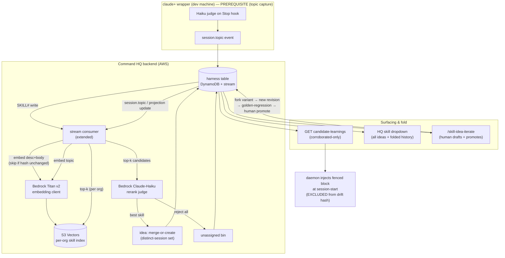

# feat: Skill-idea loop — session topics → corroborated ideas → human fold

## Summary

Build the full loop that turns auto-generated session topics into "ideas" attached to their best-matching skill, surfaces corroborated ideas read-only when a skill loads, lists every skill's ideas in a Command HQ dropdown, and lets a person fold the best ones into the skill via a new `/skill-idea-iterate` skill. Skill embeddings (Bedrock Titan v2, stored in S3 Vectors) are maintained on every write; topic→skill association (vector top-k + a Bedrock Claude-Haiku rerank) runs backend-side off the DynamoDB stream. Per the origin's "nothing deferred" directive, golden-set regression at fold and variant-scoped folding are in scope.

This plan covers the ideas loop only. The upstream topic pipeline is its **own active, reviewed feature plan** — `docs/plans/features/topic_focus_logging.html` (design: `docs/2026-06-06-conversation-topic-capture-design.md`) — and is a **hard prerequisite** built there, not re-planned here. This plan consumes its outputs: the `session.topic` fold into the projection's `topic`/`description` columns for routing, and the segment's `session.learning` `impl_learning`s as the idea content to fold.

---

## Problem Frame

Skills only improve when a person notices something and hand-edits them. Corrections and conventions that surface during real sessions evaporate when the session ends — the topic-capture design mines them into records but explicitly defers feeding them back (see origin: docs/2026-06-06-conversation-topic-capture-design.md §6). So the signal is captured and then sits, and a skill a hundred sessions later is no better for it. This feature is that deferred next tier, applied to skills: it routes session-derived findings to the right skill, gates them on independent corroboration before they touch a working session, and gives a human a deliberate path to fold the best into the skill body.

A research pass corrected three assumptions the brainstorm carried, and they shape the whole plan:

- **The vector tier is greenfield, not a reuse.** `SessionVector` is a schema + keys + two unused methods keyed per-*user*; the cosine file the infra comments cite (`packages/backend/src/forge/search.ts`) does not exist; `SearchStack` is synth-only, never deployed, with a public network policy. Nothing generates an embedding today.
- **The backend has no model capability by design** (no Anthropic SDK, no API key). Topic→skill association must run server-side (only the backend has the org-wide catalog), so this feature **introduces backend embedding generation and a backend rerank call** — a deliberate departure, satisfied with AWS Bedrock (IAM, no new key).
- **Catalog/`hq-*` skills are `built-in` and cannot be edited in place** (`packages/backend/src/rest/skills.ts` rejects in-place writes to a built-in base). Folding therefore forks a variant and promotes it — which makes variant-scoped folding effectively mandatory, and means re-seeding must not clobber a promoted pointer.

---

## Key Technical Decisions

- **Embeddings: Bedrock Titan Text Embeddings v2; store/search in Amazon S3 Vectors.** S3 Vectors is GA (Dec 2025), pay-per-use with no cost floor (~cents/month at catalog scale), AWS-native (stays in-account, IAM, no new vendor/secret), and scales to 2B vectors/index. Latency (~100ms) is irrelevant because association runs in the background off an event, not on a keystroke. OpenSearch Serverless NextGen is the documented scale-up path if interactive search over skills/ideas ever becomes a product need. The repo's existing `SearchStack` is Classic-generation and must NOT be deployed (idle-cost floor + public network policy).

- **Backend embeddings are a deliberate departure from the platform's "no server-side embeddings" stance.** `docs/plans/features/topic_focus_logging.html` (and the platform architecture it cites) explicitly *removed* server-side embeddings and assumed any semantic search would be reintroduced **client-side**. The ideas loop reverses that on purpose: topic→skill association needs the **org-wide skill catalog**, which only exists server-side — no single dev's wrapper has it. So embeddings + rerank run in the backend (Bedrock, IAM, no key). The client-side alternative was rejected because a wrapper can't see the whole org catalog to route against.

- **Association runs backend-side as retrieve-then-rerank.** Embed the topic → S3 Vectors top-k similar skills (per-org) → a Bedrock Claude-Haiku judge picks the single best or rejects all. The embedding pre-filter is the part Claude Code's native skill selection lacks (it loads all descriptions into the prompt and degrades past ~30–50); the judge rerank mirrors native selection over a focused set, keeping rerank cost flat as the catalog grows.

- **Three tuning knobs, all explicit with defaults:** pre-judge similarity floor (skills below it never reach the judge), judge confidence bar (below it → unassigned bin), idea-merge similarity threshold (within-skill same-lesson dedup), and corroboration `K` (default **2** distinct sessions). The idea-merge threshold biases **strict** — under-merge rather than over — so distinct lessons never falsely corroborate; `/skill-idea-iterate` is where a human merges near-duplicates the strict matcher missed.

- **An idea is a synthesized, skill-ready concept — not raw transcript.** On creation, a Bedrock call writes the lesson as crisp guidance that could be folded into a skill body as-is (sourced from the topic `description` + the segment's `impl_learning`s); the raw snippet is kept only as provenance. When a near-duplicate lands on the same skill, the merge **re-synthesizes** the summary to fold in the new nuance rather than discarding it — corroboration sharpens the concept, not just the count. (A third Bedrock call type — the idea-writer — alongside Titan embeddings and the Claude-Haiku rerank; Haiku is fine for it.)

- **Corroboration is a set of distinct `sessionId`s, deduped across segments.** Topic capture emits per `(sessionId, segmentId)`; the corroboration unit is the **session**, so one long multi-segment session counts once. Corroboration `= |distinct sessions|`; an idea is corroborated at `≥ K`. The set is monotonic (no decay in v1).

- **Surfacing is corroborated-only and server-enforced, injected outside the skill drift-hash.** The daemon hashes skill files (`wrapper/internal/config/remote.go`) to detect drift and re-pull. The candidate-learnings block must be injected at session-start materialize but **excluded from that hash**, or every corroboration change would force a re-pull on every machine. A dedicated endpoint returns only corroborated ideas (the gate is a server-side security boundary, never client-trusted).

- **Fold reuses the existing revision-then-promote machinery, human-gated, and forks a variant.** Folding writes a new revision via `putNewVersion` and a human promotes the `#TRUE` pointer — never a blind overwrite (prior research: curated +16.2pp vs unverified −1.3pp). Because catalog skills are built-in, the fold forks a variant; re-seeding must update only the base variant and never clobber a promoted `#TRUE` (consistent with the existing seed contract).

- **Re-embed is async off the existing DynamoDB stream consumer**, idempotent on a description+body hash (skip when unchanged) so the bulk seed write of every skill × every org doesn't storm the embedding API. Vectors carry an `embeddingModel`/`embeddingVersion` stamp; cross-version comparison is refused and triggers a backfill/reindex.

---

## High-Level Technical Design



---

## Output Structure (new files)

```text
infra/lib/
  vectors-stack.ts                      # S3 Vectors bucket + per-org index strategy, IAM
packages/backend/src/
  embeddings/bedrock.ts                 # Titan v2 embed client + model/version stamp
  embeddings/s3vectors.ts               # put / query S3 Vectors
  rerank/judge.ts                       # Bedrock Claude-Haiku topic→skill rerank
  ideas/associate.ts                    # topic ingest → top-k → rerank → idea/bin
  ideas/corroborate.ts                  # distinct-session merge + idempotency
  rest/ideas.ts                         # /ideas, /skills/{name}/ideas, candidate-learnings, fold
catalog/skills/hq-skill-idea-iterate/
  SKILL.md                              # the human-in-the-loop fold skill
```

Existing files extended: `packages/shared/src/dto.ts`, `packages/backend/src/db/{keys,repo}.ts`, `packages/backend/src/ws/streamConsumer.ts`, `packages/backend/src/rest/skills.ts`, `infra/lib/api-stack.ts`, `infra/scripts/bundle-backend.mjs`, `infra/scripts/seed-all-orgs.mjs`, `packages/web/src/api/baseApi.ts`, `packages/web/src/components/SkillCard.tsx`, `wrapper/internal/config/remote.go`.

---

## Dependencies / Prerequisites

- **Topic capture (hard prerequisite).** Consumes `session.topic` events (`packages/shared/src/events.ts` `sessionTopicEventSchema`) and the rich `description` they carry. Until topic capture ships, the loop cannot be tested end-to-end; develop against synthetic `session.topic` events.
- **AWS Bedrock access** in the deploy account (`us-east-1`, acct 066756666605) for Titan Text Embeddings v2 and Claude Haiku. New IAM permissions for the stream-consumer and rerank Lambdas.
- **Amazon S3 Vectors** available in the region (GA). New CDK stack.
- Build/test traps to respect (institutional memory): delete `infra/{lib,bin,test}/*.js` + `*.d.ts` before infra jest (stale-compiled-`.js` trap); new REST routes 404 until `cdk deploy ApiStack` + rebundle, and the web swallows 404 as empty-state — keep `devServer.ts` ROUTES in sync; after editing the new `hq-*` skill, push + re-seed all orgs.

---

## Implementation Units

**Sequencing note:** Phase P runs **first** and gates the rest — the ideas loop is built on top of a live `session.topic`/`session.learning` stream. Phases A, B, E can proceed in parallel after P; Phase C depends on P + A; Phases D, F, G follow.

### Phase P — Prerequisite: topic capture wired and working (do this first)

### U0. Verify and finish topic capture
**Goal:** Confirm the topic pipeline specced in `docs/plans/features/topic_focus_logging.html` is wired end-to-end — a live session relabels its topic and updates the projection's `topic`/`description` columns in DynamoDB, and correction turns persist `session.learning` records — and close any gaps before building the ideas loop on top.
**Requirements:** prerequisite for the whole loop (enables R4, R5; supplies idea content for R12/R13).
**Dependencies:** none — this is the first work.
**Files (per that plan's build outline — do not duplicate it here):** `wrapper/internal/judge/`, `wrapper/internal/topic/`, `wrapper/internal/daemon/runtime.go` (captureLoop gate/wiring), `wrapper/internal/capture/{hooks,jsonl}.go`, `packages/shared/src/events.ts`, `packages/backend/src/ws/{event,projection}.ts`, `packages/backend/src/db/{keys,repo}.ts`, `packages/backend/src/rest/projects.ts`, `packages/web/src/screens/Sessions/`.
**Approach:** The component pieces appear partially present (a Haiku judge, topic fold, event constructors, a projection fold), but the feature is `completion: 0` / not started, so the wiring is likely incomplete — and the exact gaps are unknown until audited. **Start by characterizing the live end-to-end path**, then audit it against that plan's 7-step build outline (event contract → projection/DTO → learnings store + ingest → read endpoint → judge runner → gate + wiring + fold → web). Run a real session and observe whether the columns actually update. Execute `topic_focus_logging.html` to close whatever is missing. **Do not re-plan or re-decide it here** — it owns the build outline, decisions D1–D4, gate thresholds, and security model; this unit only verifies and finishes it.
**Execution note:** Verify-then-fill-gaps — do not assume the pipeline is empty or complete; measure first.
**Test scenarios:** a live multi-topic session relabels the topic and updates the `topic`/`description` columns (visible in DynamoDB + the HQ Sessions table); a correction turn writes a `session.learning` impl record; backend-before-wrapper deploy ordering holds (unknown event kinds don't hard-reject ingest); a judge parse failure emits a marker rather than silently dropping a learning.
**Verification:** topic/description columns update from real sessions end-to-end and learnings are queryable via the read endpoint — the ideas loop now has a live `session.topic`/`session.learning` stream to consume.

### Phase A — Embedding & vector foundation

### U1. S3 Vectors infrastructure
**Goal:** Provision an S3 Vectors bucket and a per-org index strategy with least-privilege IAM. **Do not** deploy the existing Classic `SearchStack`.
**Requirements:** R4, R8 (enabling infra).
**Dependencies:** none.
**Files:** `infra/lib/vectors-stack.ts` (new), `infra/bin/infra.ts` (instantiate), `infra/test/vectors-stack.test.ts` (new).
**Approach:** One vector bucket; indexes namespaced per org (`<org>-skills`, `<org>-ideas`) or one index with an `org` filterable metadata key — choose per S3 Vectors filter limits (≤10 filterable keys). Float32, dimension 1024 (Titan v2 default). Grant put/query to the stream-consumer and ideas Lambdas only. Keep `SearchStack` un-instantiated.
**Patterns to follow:** stack/҂construct shape in `infra/lib/api-stack.ts`; wiring in `infra/bin/infra.ts:21-23` (note the deliberate SearchStack exclusion).
**Test scenarios:** synth asserts the vector bucket + index exist; IAM policy grants only the two Lambda roles; `SearchStack` is still NOT synthesized. `Test expectation: CDK assertion tests only — no runtime behavior.`
**Verification:** `cdk synth` includes the vectors stack; infra jest passes after deleting stale compiled `.js`.

### U2. Bedrock embedding client
**Goal:** A backend client that turns text into a stamped vector via Titan Text Embeddings v2.
**Requirements:** R8.
**Dependencies:** U1.
**Files:** `packages/backend/src/embeddings/bedrock.ts` (new), `packages/backend/src/embeddings/s3vectors.ts` (new), tests alongside.
**Approach:** `embed(text) -> { vector, model, version }`. Stamp `embeddingModel`/`embeddingVersion` on every vector. `s3vectors.ts` exposes `putVectors(index, items)` (batch) and `queryTopK(index, vector, k, {orgFilter, floor})`. No external API key — IAM/Bedrock runtime.
**Patterns to follow:** existing AWS SDK client construction in `packages/backend/src/db/repo.ts`.
**Test scenarios:** embed returns a 1024-length vector with model+version stamped; batch put chunks at the 500-vector limit; query passes the org filter and returns ≤k sorted by score; Bedrock error surfaces (not swallowed). Mock Bedrock + S3 Vectors clients.
**Verification:** unit tests green; a manual embed of a sample skill returns a stamped vector.

### U3. Skill embedding on write (stream-driven)
**Goal:** Regenerate a skill's embedding on every skill mutation, async off the stream, idempotent on content hash.
**Requirements:** R8, R9, R10.
**Dependencies:** U2.
**Files:** `packages/backend/src/ws/streamConsumer.ts` (extend), `packages/backend/src/db/keys.ts` (skill-vector key/metadata), `packages/shared/src/dto.ts` (add `embeddingVersion`/`descHash` to skill record), tests.
**Approach:** Add a branch for `PK begins SCOPE#org# AND SK begins SKILL# AND !isVersionSideRecord(SK)`. Compute a hash of `description + body`; if it equals the stored `descHash`, skip (no-op). Else embed and upsert to the org's skill vector index; stamp `descHash` + version. Eventually-consistent (R10).
**Patterns to follow:** existing `processRecord` `(PK,SK)`-prefix dispatch in `streamConsumer.ts`; `isVersionSideRecord` (`keys.ts`).
**Test scenarios:** SKILL# INSERT embeds + writes vector; MODIFY with unchanged hash skips; MODIFY with changed description re-embeds; `#TRUE`/`#r<N>` side-records are ignored; embed failure routes to retry/DLQ, not silent drop. `Covers AE5` (partial — seed path in U4).
**Verification:** writing a skill produces a stamped vector in S3 Vectors; editing only `files` unrelated to desc/body does not re-embed.

### U4. Seed re-embed without a storm
**Goal:** Seeding every skill × every org regenerates embeddings idempotently and without rate-limit storms.
**Requirements:** R11, AE5.
**Dependencies:** U3.
**Files:** `infra/scripts/seed-all-orgs.mjs` (extend), `packages/backend/src/ws/streamConsumer.ts` (throttle/batch), tests.
**Approach:** Seed writes already fire the stream, so re-embed rides U3 — but the hash-skip (U3) makes unchanged skills no-ops, killing most of the storm. Add batch/concurrency limiting in the consumer for bursts; ensure the DLQ + `reportBatchItemFailures` handle partial failures. Confirm seed targets the live `harness` table.
**Patterns to follow:** `seed-all-orgs.mjs` org loop; existing DLQ wiring in `api-stack.ts`.
**Test scenarios:** seeding an unchanged catalog produces zero new embeddings (all hash-skip); seeding a changed skill re-embeds only that one across all orgs; a burst of N writes is processed without unbounded concurrency. `Covers AE5.`
**Verification:** a full re-seed of all orgs re-embeds only changed skills; freshly-seeded skills are query-matchable.

### U5. Embedding model/version stamping + reindex migration
**Goal:** Make cross-version vector comparison impossible, and provide a backfill when the model changes.
**Requirements:** R8 (correctness), E3.
**Dependencies:** U2, U3.
**Files:** `packages/backend/src/embeddings/s3vectors.ts` (version guard), `infra/scripts/reindex-embeddings.mjs` (new), tests.
**Approach:** Query refuses to compare a query vector to index vectors of a different `embeddingVersion`. A reindex script re-embeds all skills for a target version and swaps the active version pointer.
**Patterns to follow:** `seed-all-orgs.mjs` for the org-walking batch script shape.
**Test scenarios:** a query with version v2 against v1 vectors raises rather than returning garbage; reindex re-embeds all skills and flips the active version; mid-reindex queries use the old version until the swap.
**Verification:** changing the configured model and running reindex produces a consistent, queryable index.

---

### Phase B — Idea data model & store

### U6. Idea + unassigned-bin schemas, keys, and repo methods
**Goal:** The persistent shape of an idea and the bin, with conditional-write corroboration.
**Requirements:** R12, R13, R15.
**Dependencies:** none (parallel with Phase A).
**Files:** `packages/shared/src/dto.ts` (`ideaSchema`, `unassignedEntrySchema`), `packages/backend/src/db/keys.ts` (`ideaKey`, `ideaPrefixForSkill`, `unassignedBinKey`), `packages/backend/src/db/repo.ts` (CRUD + conditional update), tests.
**Approach:** Idea `PK: SCOPE#org#<org>`, `SK: IDEA#<skillBaseName>#<ideaId>` (co-located with skills; invisible to `listSkills` because that scans the `SKILL#` prefix). Fields: `skillBaseName`, `org`, `text` (a **synthesized, skill-ready learned concept** — prose foldable into a skill body as-is, not raw transcript), `sources` (set keyed by `sessionId`: `{sessionId, segmentId, seq, snippet, projectId, repoId}` — `snippet` is raw evidence/provenance only), `status` (`open|folded`), `foldedIntoRev?`, `ideaEmbeddingVersion`, timestamps. Corroboration `= |distinct sessionId|`, derived. Bin: `SK: IDEABIN#<entryId>`. Conditional update mirrors `putSessionProjectionConditional` so a fold↔corroboration race is safe.
**Patterns to follow:** `learningKey` / `putLearning` (`keys.ts`, `repo.ts`); `putSessionProjectionConditional` for optimistic concurrency.
**Test scenarios:** put/get/list ideas for a skill; ideas don't leak into `listSkills`; corroboration counts distinct sessions (a session present twice counts once); conditional update rejects on stale version; bin entries list per org. `Covers R12, R15.`
**Verification:** ideas round-trip; a skill list read returns no idea rows.

### U7. Corroboration & within-skill dedup
**Goal:** Merge same-lesson findings, count distinct sessions deduped across segments, idempotent on re-emit.
**Requirements:** R12, R13, R14, AE4.
**Dependencies:** U2, U6.
**Files:** `packages/backend/src/ideas/corroborate.ts` (new), `packages/backend/src/embeddings/s3vectors.ts` (idea index), tests.
**Approach:** On a new finding for skill S: embed the idea text, query the org's *idea* index scoped to S; if top match ≥ idea-merge threshold, **merge — re-synthesize the existing idea's `text`** (a Bedrock idea-writer call) to fold in any nuance the near-duplicate adds, and add the session to the set (no-op if the session is already counted, AE4) — else create a new idea (and index its vector). Dedup segments within a session before incrementing (corroboration unit = session). The threshold is tuned so genuinely-different lessons stay separate, but near-duplicates merge-and-rewrite rather than spawning twins stuck below K. Threshold + K are config constants with documented defaults.
**Patterns to follow:** U2 query helper; conditional update from U6.
**Test scenarios:** two phrasings of the same lesson within threshold merge into one idea; two distinct lessons stay separate; same session across two segments counts once; re-emit from a counted session is a no-op (AE4); K=2 flips an idea to corroborated on the second distinct session (AE1, partial). `Covers AE4.`
**Verification:** corroboration counts reflect distinct sessions only; merges respect the strict threshold.

---

### Phase C — Association pipeline (backend)

### U8. Topic ingestion & top-k retrieval
**Goal:** On a topic event, embed it and fetch the top-k candidate skills with a similarity floor.
**Requirements:** R4, R5.
**Dependencies:** U0, U2, U3.
**Files:** `packages/backend/src/ws/streamConsumer.ts` (topic branch) or sibling consumer, `packages/backend/src/ideas/associate.ts` (new), tests.
**Approach:** Trigger off `session.topic` / projection `description` change. Resolve the session's org via the project pointer using `effectiveOrg`/stamped org (never `principal.org`). Embed the topic `description`; query the org's skill vector index for top-k; drop candidates below the pre-judge similarity floor. Association is catalog-wide and session-independent (R5) — candidates are not limited to skills active in the session.
**Patterns to follow:** projectId/org resolution in `packages/backend/src/ws/event.ts`; stream dispatch in `streamConsumer.ts`.
**Test scenarios:** a topic event yields top-k candidates from the correct org index; cross-org isolation (org A's topic never matches org B's skills); empty result when all candidates are below floor → hands off to the bin path (U9); org resolution falls back correctly when `principal.org` differs.
**Verification:** a synthetic topic event produces a scored candidate list scoped to its org.

### U9. Judge rerank → best skill or unassigned
**Goal:** Pick the single best skill from the candidates or reject all to the bin.
**Requirements:** R4, R6, R7.
**Dependencies:** U8.
**Files:** `packages/backend/src/rerank/judge.ts` (new, Bedrock Claude-Haiku), `packages/backend/src/ideas/associate.ts` (wire), tests.
**Approach:** Pass the topic + the k candidate skill names/descriptions to a Bedrock Claude-Haiku call; it returns the best `skillBaseName` with a confidence, or `none`. Below the judge confidence bar → route to the unassigned bin (R6); the bin is the new-skill backlog (R7). Two thresholds in play: the U8 similarity floor (does anything reach the judge) and the judge bar (does the judge accept).
**Patterns to follow:** the wrapper judge contract shape in `wrapper/internal/judge/judge.go` (strict structured verdict), adapted to Bedrock.
**Test scenarios:** clear match returns that skill; a near-tie picks one deterministically given fixed inputs (mock); all-low candidates → bin (AE2); judge returns `none` → bin; bin entry carries topic provenance. `Covers AE2.`
**Verification:** a topic with an obvious skill lands an idea there; an off-catalog topic lands in the bin.

### U10. Idea creation & re-evaluation move semantics
**Goal:** Turn an association result into a merged/created idea, and handle an evolving topic re-associating.
**Requirements:** R12, R13.
**Dependencies:** U7, U9.
**Files:** `packages/backend/src/ideas/associate.ts` (finalize), tests.
**Approach:** Synthesize the idea's `text` as a **skill-ready learned concept** — a Bedrock idea-writer call turns the topic's `description` + the segment's `impl_learning`s into crisp guidance that could be pasted into a skill body — not raw transcript. Associate per `(sessionId, segmentId)`; on re-evaluation that picks a *different* best skill, **move** the contribution — remove this session from the prior skill's idea set and add to the new one — rather than spraying partial credit. Carry full provenance (R15).
**Patterns to follow:** corroborate.ts (U7); conditional update (U6).
**Test scenarios:** first association creates/merges on skill X; a re-evaluation of the same segment now matching Y moves the session from X to Y (X's count decrements, Y's increments); provenance fields populated. `Covers R13.`
**Verification:** a drifting topic doesn't double-count across skills.

---

### Phase D — Surfacing

### U11. Candidate-learnings endpoint (corroborated-only)
**Goal:** Serve only corroborated ideas for a skill, capped and ranked, with the gate enforced server-side.
**Requirements:** R16, R17.
**Dependencies:** U6.
**Files:** `packages/backend/src/rest/ideas.ts` (new) or `rest/skills.ts` (extend), route in `infra/lib/api-stack.ts`, bundle entry in `infra/scripts/bundle-backend.mjs`, tests.
**Approach:** `GET /skills/{name}/candidate-learnings` returns corroborated ideas (`|sessions| ≥ K`), ordered by corroboration then recency, capped at a tunable N (honors the >30–50 / context-degradation rationale). Uncorroborated ideas are never returned here — the filter is a security boundary, not client-trusted. `noAuth` route (device token), like other `/skills` routes.
**Patterns to follow:** handler/deps pattern + `noAuth` in `rest/skills.ts`; route helper `r(...)` in `api-stack.ts`.
**Test scenarios:** returns only `≥K` ideas; folded ideas excluded; respects the cap and ordering; an uncorroborated-only skill returns an empty list; org scoping enforced. `Covers R16, R17.`
**Verification:** endpoint returns corroborated-only; probing it for a skill with only single-session ideas returns empty.

### U12. Daemon session-start injection (outside the drift hash)
**Goal:** Inject the fenced candidate-learnings block into the materialized skill without triggering re-pull churn or editing the stored body.
**Requirements:** R16.
**Dependencies:** U11.
**Files:** `wrapper/internal/config/remote.go` (materialize path), wrapper tests.
**Approach:** At session-start materialize, fetch candidate-learnings and write a clearly-fenced block into the on-disk `SKILL.md`, but **exclude that block from `hashSkillFiles`** so it never registers as drift (the canonical files stay the hash basis). Inject for every materialized skill regardless of how it was enabled (direct/bundle/agent). Inject nothing when the list is empty.
**Execution note:** Add a characterization test of `hashSkillFiles` before changing the materialize path — the drift loop is timing-sensitive legacy.
**Patterns to follow:** `hashSkillFiles` / drift-pull loop in `remote.go`.
**Test scenarios:** injected block does not change the drift hash (no re-pull); fold/corroboration change refreshes the block next session without a re-pull storm; empty list injects nothing; block is fenced and visually separated from the body. `Covers R16.`
**Verification:** corroboration changes don't cause perpetual re-pulls; the agent sees the block in-session.

---

### Phase E — Command HQ UI

### U13. All-ideas endpoint
**Goal:** Serve every idea for a skill (corroborated + uncorroborated + folded history) for HQ.
**Requirements:** R18.
**Dependencies:** U6.
**Files:** `packages/backend/src/rest/ideas.ts` (extend), route + bundle entry, tests.
**Approach:** `GET /skills/{name}/ideas` returns all ideas with status + corroboration + provenance + folded marker. Org-scoped.
**Patterns to follow:** `getProjectLearnings` shape; `rest/skills.ts` handler conventions.
**Test scenarios:** returns corroborated, uncorroborated, and folded ideas; org-scoped; folded ideas carry `foldedIntoRev`. `Covers R18.`
**Verification:** endpoint returns the full set for a skill.

### U14. HQ skill ideas dropdown
**Goal:** A per-skill dropdown in the full-screen skill view listing all proposed ideas.
**Requirements:** R18.
**Dependencies:** U13.
**Files:** `packages/web/src/api/baseApi.ts` (`getSkillIdeas` query + `Idea` tag), `packages/web/src/components/SkillCard.tsx` (dropdown), tests.
**Approach:** Add an RTK-Query `getSkillIdeas` (mirror `getProjectLearnings`, `transformResponse: unwrapArray('ideas')`, per-skill tag). Render a dropdown in `SkillCard` / `SkillBodyModal` showing each idea with its corroboration count and status; folded ones grouped as history.
**Patterns to follow:** `getProjectLearnings` query, `VariantSwitcher` gating in `SkillCard.tsx`.
**Test scenarios:** dropdown lists corroborated/uncorroborated/folded with correct badges; empty state renders; query invalidates on fold. `Covers R18.`
**Verification:** opening a skill in HQ shows its ideas dropdown.

### U15. Unassigned bin view
**Goal:** Surface the org's unassigned bin as a backlog for new skills.
**Requirements:** R6, R7.
**Dependencies:** U9, U13.
**Files:** `packages/backend/src/rest/ideas.ts` (`GET /ideas/unassigned`), `packages/web/src/screens/` (new bin screen mirroring `SessionsTable`), `baseApi.ts`, tests.
**Approach:** Org-readable list of bin entries with topic text + provenance + frequency. Acting on an entry (create a skill from it) is admin-gated.
**Patterns to follow:** `SessionsTable.tsx` read-table pattern.
**Test scenarios:** bin lists org entries; recurring topics show frequency; non-admins read but can't action. `Covers R6, R7.`
**Verification:** off-catalog topics appear in the bin view.

---

### Phase F — Fold loop

### U16. Fold & mark-folded endpoints + permissions
**Goal:** Endpoints to fold an idea into a skill revision and mark it folded, with reconciled permissions.
**Requirements:** R19, R20, R21.
**Dependencies:** U6.
**Files:** `packages/backend/src/rest/skills.ts` (fold + mark-folded; built-in guard at the in-place-write check), route + bundle, tests.
**Approach:** Fold writes a new revision via the existing `putNewVersion` (forks a variant for built-ins) and leaves `#TRUE` until promote; a `POST /skills/{name}/ideas/{ideaId}/fold` marks the idea `folded` with `foldedIntoRev` after the revision write. Reconcile the existing split (revision write is admin-gated; promote is open) — make fold + promote require the same skill-edit permission; the device-token session's admin status is resolved server-side from the profile.
**Patterns to follow:** `createSkill`/`putNewVersion`/`promoteSkill` and the built-in guard in `rest/skills.ts`.
**Test scenarios:** fold into a built-in forks a variant (no 409); promote repoints `#TRUE`; mark-folded sets status + rev; non-admin device token cannot fold; conditional write prevents a fold↔corroboration race (C3). `Covers R20, R21.`
**Verification:** folding a built-in skill produces a promotable variant revision; the idea flips to folded.

### U17. `/skill-idea-iterate` catalog skill
**Goal:** The human-in-the-loop skill that drafts a merge and promotes it.
**Requirements:** R19, R20, R21.
**Dependencies:** U13, U16.
**Files:** `catalog/skills/hq-skill-idea-iterate/SKILL.md` (new), `catalog/skills/bundles.json` (membership if applicable).
**Approach:** Read `$CLAUDE_PLUS_PROJECT_ID`/`$CLAUDE_PLUS_REPO`/`$CLAUDE_PLUS_API_URL` (never re-derive projectId; stop if empty). Fetch a skill's ideas, let the human pick, the agent drafts the merged revision body, write it (fork variant), run golden-regression (U18), then the human promotes; mark folded; close with the seed step. Description written trigger-phrase-rich (it's embedded and is what selection reasons over).
**Patterns to follow:** `catalog/skills/hq-update-skills/SKILL.md` frontmatter/body + injected-env contract + seed step.
**Test scenarios:** `Test expectation: none — authoring artifact; behavior is exercised via U16 endpoints and manual run.`
**Verification:** running `/skill-idea-iterate` against a skill with ideas drafts, promotes, and marks folded; after edit, push + re-seed all orgs.

### U18. Golden-set regression at fold
**Goal:** Capture each folded lesson as a before→after expectation and replay prior expectations before promoting.
**Requirements:** origin "nothing deferred" (golden-set regression).
**Dependencies:** U16.
**Files:** `packages/backend/src/db/{keys,repo}.ts` (`IDEAGOLD#<skillBaseName>#<id>`), `packages/backend/src/rerank/judge.ts` or a `golden.ts` checker, `rest/skills.ts` (gate promote on replay), tests.
**Approach:** On fold, persist the idea's before→after as a golden case co-located with the skill. Before a promote, replay the skill's golden cases against the candidate revision (a Bedrock judge check that the candidate still satisfies each prior expectation); surface any regression to the human, who decides. Non-blocking advisory in v1 (human is the gate) but recorded.
**Patterns to follow:** side-record key shape (`learningKey`); judge contract (U9).
**Test scenarios:** folding writes a golden case; a candidate that breaks a prior golden case flags it before promote; a clean candidate passes; replay is org-scoped.
**Verification:** a fold that would undo an earlier fold is flagged at promote time.

### U19. Variant-scoped folding + seed-safe promotion
**Goal:** Fold into the correct variant line and ensure re-seed never clobbers a promoted pointer.
**Requirements:** origin "nothing deferred" (variant-scoped folding).
**Dependencies:** U16.
**Files:** `packages/backend/src/rest/skills.ts` (variant target selection), `packages/backend/src/seed/skills.ts` + `infra/scripts/seed-all-orgs.mjs` (base-variant-only writes), tests.
**Approach:** Fold targets the variant implied by the idea's provenance (`repoId`/`authorUserId`) when present, else the org base (forked). Re-seed updates only the base variant and never overrides a promoted `#TRUE` (consistent with the existing seed contract); add an assertion/guard.
**Patterns to follow:** `variantInfix` / `truePointerKey` / `revisionKey`; the seed contract in `seed-all-orgs.mjs`.
**Test scenarios:** fold from a repo-scoped session targets that variant; a re-seed after a promote leaves the promoted `#TRUE` intact; base-variant content still updates on re-seed.
**Verification:** re-seeding all orgs preserves promoted folds.

### U20. Folded-idea lifecycle & resurrection rule
**Goal:** Define what happens to a folded idea and to new corroborations of an already-folded lesson.
**Requirements:** R21.
**Dependencies:** U7, U16.
**Files:** `packages/backend/src/ideas/corroborate.ts` (folded-aware merge), tests.
**Approach:** Folded ideas drop from candidate-learnings (U11) but persist as HQ history (U13). A new session matching a folded idea does NOT resurrect it into the live block; it attaches to the folded idea as post-fold evidence (visible in HQ) — preventing the live block from re-surfacing a lesson already in the body. Document the monotonic, no-decay corroboration choice.
**Patterns to follow:** status handling in U6/U7.
**Test scenarios:** post-fold new session attaches as evidence, does not re-surface; folded idea stays out of candidate-learnings; HQ shows the post-fold evidence under history. `Covers R21.`
**Verification:** a folded lesson never reappears in a working session.

---

### Phase G — Lifecycle, isolation, observability

### U21. Skill delete/rename → idea orphan policy
**Goal:** Keep ideas coherent when their skill disappears or is renamed.
**Requirements:** A2, A3 (origin flow gaps).
**Dependencies:** U6.
**Files:** `packages/backend/src/rest/skills.ts` (delete path), `packages/backend/src/db/repo.ts`, tests.
**Approach:** Ideas key off `skillBaseName` + org. On skill delete, cascade the skill's ideas to the unassigned bin (preserving corroboration as signal) rather than orphaning rows. Rename is delete+create today — treat it as cascade-to-bin then re-association on the new name's next topic. Also delete the skill's vector from S3 Vectors.
**Patterns to follow:** `deleteSkill` in `repo.ts`.
**Test scenarios:** deleting a skill moves its ideas to the bin and removes its vector; a renamed skill's ideas land in the bin, not orphaned; HQ no longer shows them under the dead name.
**Verification:** no idea rows point at a non-existent skill.

### U22. Cross-org isolation
**Goal:** Guarantee one org's ideas/vectors/bin never reach another's sessions.
**Requirements:** F2 (data isolation).
**Dependencies:** U8, U11.
**Files:** tests across `ideas/associate.ts`, `rest/ideas.ts`, `embeddings/s3vectors.ts`.
**Approach:** Every idea/bin record is `SCOPE#org#` partitioned; every S3 Vectors query carries the org filter; candidate-learnings + all-ideas endpoints scope by `effectiveOrg`. Add explicit isolation tests.
**Patterns to follow:** `listScoped` org partitioning; `effectiveOrg`.
**Test scenarios:** org A topic never retrieves org B skills; org A's candidate-learnings never returns org B ideas; a malformed/missing org is rejected, not defaulted.
**Verification:** isolation tests green across the pipeline.

### U23. Observability for silent-failure modes
**Goal:** Make embedding/association failures visible instead of failing to empty-state.
**Requirements:** E1, E2 (research-surfaced risks).
**Dependencies:** U3, U8.
**Files:** `packages/backend/src/ws/streamConsumer.ts` (metrics + DLQ alarms), `infra/lib/api-stack.ts` (alarm), a `skills-missing-embeddings` probe endpoint/script, tests.
**Approach:** Emit metrics for embed successes/failures and association outcomes; alarm on DLQ depth; a probe that lists skills whose `descHash` has no matching current-version vector (stale/missing). Mirrors the "this stack fails to empty-state, not error" lesson.
**Patterns to follow:** existing DLQ wiring in `api-stack.ts`.
**Test scenarios:** a skill with a stale/missing embedding shows in the probe; repeated embed failures raise the DLQ alarm; association-to-bin rate is observable.
**Verification:** a deliberately failed embed is visible via probe/alarm, not silent.

---

## Scope Boundaries

**In scope (pulled in per "nothing deferred"):** golden-set regression at fold (U18), variant-scoped folding (U19), embeddings + vector search (Phase A/C).

**Deferred to Follow-Up Work:**
- OpenSearch Serverless NextGen migration — only if interactive, user-facing semantic search over skills/ideas becomes a product need.
- Corroboration decay/staleness — v1 is monotonic; revisit if old ideas accumulate.
- Multi-skill association for a single idea — v1 attaches to the single best skill; near-ties accept the miss.

**Outside this feature's identity:**
- A general per-message annotation/feedback system — ideas are candidate amendments to skills, not freeform notes.
- Re-planning topic capture — it is a prerequisite owned by `docs/2026-06-06-conversation-topic-capture-design.md`.

---

## Risk Analysis & Mitigation

- **Backend model capability is net-new (long pole).** Embedding + rerank on Bedrock is a first for this backend. Mitigation: isolate behind `embeddings/` + `rerank/` modules with mocked tests; IAM-only (no key); start with skill embedding (U3) before association (U8) so the foundation is proven first.
- **Surfacing churn via the drift hash.** If the candidate block enters `hashSkillFiles`, every corroboration re-pulls every machine. Mitigation: U12 excludes the block from the hash; characterization test first.
- **Built-in fold + re-seed clobber.** A promoted fork could be overwritten by re-seed. Mitigation: U19 base-variant-only seed guard + test.
- **Embedding-version skew.** A model change silently breaks all matching. Mitigation: U5 version stamp + refuse-cross-version + reindex.
- **Seed re-embed storm.** N orgs × catalog. Mitigation: U3 hash-skip + U4 throttle/idempotency.
- **Deploy lag.** New routes 404 (look like empty state) until `cdk deploy ApiStack` + rebundle. Mitigation: prerequisite checklist + keep `devServer.ts` ROUTES in sync; probe 401-vs-404.

---

## Open Questions (deferred to implementation)

- Exact threshold values: pre-judge similarity floor, judge confidence bar, idea-merge similarity, candidate-block cap N. Tune against real topics; seed with conservative defaults (strict merge, K=2).
- Whether to embed description-only vs description+body, and chunking for long bodies (start description + truncated body; revisit if retrieval is weak).
- One S3 Vectors index with an `org` filter vs per-org indexes — decide against S3 Vectors filter/scale limits during U1.
- Whether the association trigger extends `streamConsumer.ts` or runs as a sibling consumer (latency/idempotency call at U8).

---

## Sources & Research

- Origin requirements: docs/brainstorms/2026-06-08-skill-idea-loop-requirements.md
- Prerequisite (own active plan): docs/plans/features/topic_focus_logging.html — the topic pipeline that folds `session.topic` into the projection `topic`/`description` columns and appends `session.learning` records; design: docs/2026-06-06-conversation-topic-capture-design.md. Note: that plan and the platform architecture removed server-side embeddings (assumed client-side reintroduction); this plan deliberately reintroduces them server-side (see Key Technical Decisions).
- Ideation lineage: docs/ideation/ (this session) — K-independent-sessions gate (gene-regulatory / pharmacovigilance), insertion-time scoring (Generative Agents), corroborated-only surfacing (AKU progressive disclosure; >20% context-degradation), human-gated fold (curated +16.2pp vs unverified −1.3pp).
- AWS vector landscape (verified, 2025–2026): Amazon S3 Vectors GA Dec 2025 (pay-per-use, no floor, 2B vectors/index); OpenSearch Serverless NextGen GA May 2026 (scale-to-zero) as the scale-up path; Bedrock Titan Text Embeddings v2 ($0.02/M tokens, 1024-dim); Bedrock Claude Haiku for rerank. S3 Vectors chosen for cost + AWS-native residency; latency is a non-issue for background association.
- Claude Code skill selection is model-driven over name+description (not embeddings); embedding/BM25 retrieval exists only as the separate API-level Tool Search — confirming the skill embedding index must be built here.
- Codebase: `packages/shared/src/dto.ts` (skill + SessionVector schemas), `packages/backend/src/db/{keys,repo}.ts` (skill/revision/TRUE-pointer keys, `isVersionSideRecord`, `putNewVersion`, conditional writes), `packages/backend/src/ws/streamConsumer.ts` (existing stream consumer to extend), `packages/backend/src/rest/skills.ts` (handler pattern, built-in guard, permission split), `infra/lib/{api-stack,search-stack}.ts` (table + stream + DLQ; synth-only Classic search), `infra/scripts/seed-all-orgs.mjs` (seed contract), `packages/web/src/api/baseApi.ts` + `components/SkillCard.tsx` (RTK-Query + skill view), `wrapper/internal/config/remote.go` (drift hash / materialize), `wrapper/internal/judge/judge.go` (judge contract shape).
