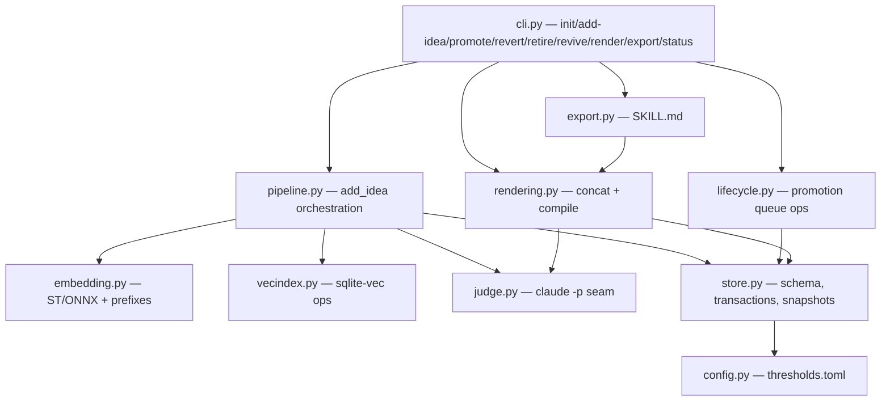
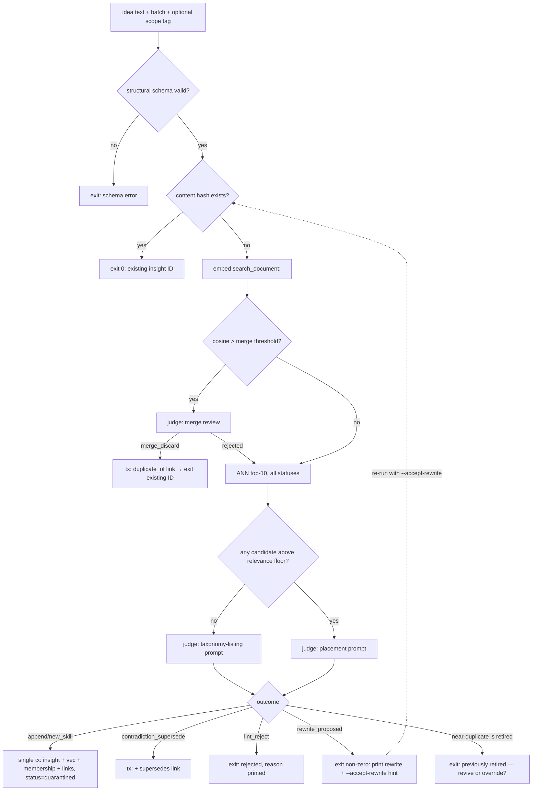

# feat: Agent Families Phase 0 — Library Core

## Summary

Build the standalone heart of the agent-families system: a Python package in a new isolated top-level directory `agent-families/` containing the SQLite data model (insights, skills, agents, families, traceability, spans, snapshots), the `add_idea` registration pipeline (local embeddings + cosine prefilter + headless-Claude routing judge), the insight lifecycle (quarantine → promote/revert → retire/revive through a single-writer queue), skill rendering (concatenation + delta-patch compilation), and SKILL.md export. Done means hand-written ideas register, route, render, and export end-to-end — no pipeline, explorer, grader, or reflector (Plans 2–4).

## Problem Frame

DESIGN.md §16 sequences the build so the library core ships first and alone: it is testable with hand-written ideas, every later phase depends on it, and its two hardest-to-change artifacts — the SQLite schema and the judge contract — should harden before any pipeline exists. The design is fully decided (§4–5, §12.1, §13, §15, §17); this plan turns it into implementable units and resolves the flow gaps surfaced in analysis (cold start, merge semantics, atomicity, snapshot timing).

---

## Requirements

**Storage and data model**

- R1. SQLite schema stores atomic insights (structural fields: precondition, action, expected outcome; scope tag; status `quarantined|active|dormant|retired`; fitness fields; embedding-model/dim pins; batch ID; provenance links `duplicate_of` / `supersedes`), skills as ordered membership over insight IDs, agents, and the four seeded families.
- R2. Traceability tables (FEAT, MSG, REQ, TKT, AC, SPAN, CHK, SCEN) and the span index exist as schema only — created, constrained, unused until Phase 1+.
- R3. Every library-state mutation is keyed by a snapshot ID; snapshots are logical version rows minted by the promotion queue on each active-set mutation (promote/revert/retire/revive), never on registration. Every status change is recorded in a status-transitions log keyed by snapshot, so library state at any past snapshot is reconstructible (state at S = latest transition with snapshot ≤ S, else initial status).
- R4. All active-set mutations flow through a single-writer promotion queue; concurrent `add-idea` is declared single-process for Phase 0 with `BEGIN IMMEDIATE` + busy-timeout as backstop and a uniqueness constraint on (agent_id, skill_name).

**Registration pipeline**

- R5. `add_idea` validates the structural schema, computes a content hash checked against insights *and* the merge log (exact duplicates and previously-merged ideas return the existing ID without embedding or judging), embeds with the pinned local model, runs the cosine merge prefilter (threshold from config), retrieves ANN top-10 across all statuses, and routes via the LLM judge.
- R6. The judge contract is a closed outcome enum — `append_to_skill | new_skill | merge_discard | contradiction_flag | contradiction_supersede | lint_reject | rewrite_proposed | no_placement` — returned as validated JSON via `--json-schema`; schema-violating output retries N times (config) with the violation fed back, then hard-fails with no writes. Each judge call type (placement, merge review, taxonomy listing, compile) carries an allowed-outcome subset enforced application-side; an out-of-subset or dangling-reference response (e.g., `append_to_skill` naming a nonexistent skill) is treated as a schema violation — same retry-then-fail path.
- R7. Registration is atomic: insight row, vec row, membership row, and any links commit in one transaction only after the judge returns; no partial writes exist in any failure mode.
- R8. Merge semantics: prefilter hits are judged (never silently auto-merged); `merge_discard` writes a merge-log row (content hash, structural fields, `duplicate_of` → the existing insight, batch, timestamp) and returns the existing ID; a rejected merge proposal falls through to normal placement.
- R9. Contradiction semantics: `contradiction_supersede` records a `supersedes` link and a contradiction flag at registration; retiring the superseded insight is a manual decision (`retire`), surfaced by `status`. Automated retire-on-promote / dissolve-on-revert is a marked Phase 3 seam (ratchet governance). Flags land in a contradictions table surfaced by `status`; reverting a challenger closes its flag.
- R10. The generalization lint never silently rewrites: on `rewrite_proposed` the CLI prints the rewrite and exits non-zero with "Re-run with `--accept-rewrite` to accept"; the flag re-enters the pipeline with the proposed text at the content-hash check. No interactive prompt.
- R11. Hand-written ideas carry a batch identity (`--batch` flag, defaulting to a per-session batch) so promotion and reversion address the same unit shape the Phase 3 reflector will use.

**Lifecycle**

- R12. `promote`/`revert` operate on batches; `retire`/`revive` on insight or skill IDs (operating only on `retired` in Phase 0 — dormant transitions are Phase 3); all mint snapshots via the queue. Revert removes a batch-created skill only when no non-reverted members remain; otherwise the skill survives, reverted members flip status, and `status` flags it "created by reverted batch".
- R13. Lifecycle operations never delete or rewrite vec rows — status visibility is a query-time join. Visibility matrix: `add-idea` dedup sees all statuses; render/export see active (plus quarantined when `--include-quarantined`); future runtime retrieval sees active only.
- R14. Re-registering an idea whose near-duplicate is retired surfaces "previously retired — revive or override?" instead of admitting it fresh.

**Rendering and export**

- R15. The concatenation renderer is byte-stable: membership order is append order, deterministic output for a fixed (skill, snapshot, status-filter) triple. Only the default active-only rendering is cached, keyed (skill_id, snapshot_id) and computed lazily; `--include-quarantined` renders compute fresh every time (quarantined membership changes within a snapshot, so it is not a function of the cache key).
- R16. Delta-patch compilation (explicit `render --compile`) produces a compiled document with per-section provenance annotations to insight IDs; a failed compile leaves the prior compiled doc untouched; the compiler never modifies insights; concat remains the always-available fallback.
- R17. Export writes Claude Code SKILL.md (frontmatter `name`/`description`, body = current rendering) with deterministic slugification, collision suffixing, and empty-skill skipping.

**CLI, config, bootstrap**

- R18. CLI commands: `init`, `add-idea`, `promote`, `revert`, `retire`, `revive`, `render`, `export`, `status`.
- R19. `init` seeds the four families (planner, worker, verifier, context-retriever) each with one generic specialist agent, writes the default thresholds config with provenance comments, applies schema migrations, and pre-fetches the pinned embedding model.
- R20. The thresholds config (TOML) carries every threshold with provenance and tuning-metric comments (§17); load is fail-fast validated; unknown keys are errors.
- R21. `status` reports counts by status, pending batches, open contradiction flags, empty skills, current snapshot ID, embedder + dim, and config summary.
- R22. Judge preflight verifies the Claude CLI is present and authenticated before any pipeline write; embedding startup asserts the stored embedding-model/dim pins match config.

**Testing**

- R23. The judge call sits behind a single seam with record/replay JSON fixtures keyed by request hash; the full test suite runs offline with zero Claude quota; `record` mode refreshes fixtures deliberately.
- R24. An end-to-end acceptance test registers a curated set of hand-written ideas (including an exact duplicate, a near-duplicate, a contradiction, and a target-trivia lint case) and asserts routing, lifecycle, rendering, and export outcomes.

---

## Key Technical Decisions

- **Isolated top-level directory, self-contained toolchain.** `agent-families/` at repo root, inner package `agent_families` (hyphens aren't importable), `pyproject.toml` + `uv.lock` inside it, zero references from root `package.json` — the `wrapper/` (Go) precedent. Repo touches: `.gitignore` Python section, `.prettierignore` entry.
- **Python 3.12 + uv, src layout.** onnxruntime 1.26 requires ≥3.11; 3.12 has mature Windows wheels across the stack. `uv init --package` scaffolding with `[project.scripts]` console entry.
- **Embedding: `nomic-ai/nomic-embed-text-v1.5`, sentence-transformers `backend="onnx"`, 768-dim, cosine.** Task prefixes prepended literally (`search_document:` at index, `search_query:` at routing, `clustering:` reserved for splitting). `trust_remote_code` no longer required (transformers ≥5.5) but passed for belt-and-suspenders. Dimension is pinned once — vec0 DDL `float[768] distance_metric=cosine` — Matryoshka truncation deliberately not used in Phase 0.
- **Vector store: sqlite-vec 0.1.9 vec0 virtual table in the same DB file** — same-transaction participation with ordinary tables is what makes R7's atomicity a one-line rule. Pre-1.0 risk accepted (see Risks). Insert via `serialize_float32`; KNN via `MATCH ... AND k = ?`.
- **Judge invocation: `claude -p` via stdin, `--output-format json --json-schema <schema> --tools "" --strict-mcp-config --max-turns 1 --no-session-persistence --model sonnet`.** On Windows, resolve the npm `.cmd` shim to its underlying `node.exe` + CLI entry script and invoke node directly, so argv never passes through cmd.exe re-parsing (quote/`%`/`^` mangling, ~8K argv cap); `encoding="utf-8"`; schema as a single argv element; content via stdin. Implementation-time check: if `--json-schema` accepts a file path, schema-via-tempfile is an acceptable simpler alternative. `--bare` is NOT adopted until verified against subscription auth — it skips OAuth, which would break the no-API-key constraint; the plan treats `--bare` as a tested toggle, not a default.
- **Cold start:** `init` seeds the §3 taxonomy; when ANN returns no candidates above the relevance floor, the judge receives a taxonomy listing (families + agents + skill names) instead of a neighbor list and may only choose `new_skill` or `no_placement` (enforced application-side per R6's allowed-outcome subset rule).
- **Merge = discard-new with `duplicate_of` link, always judged.** Preserves the atomic-insights invariant (no LLM-authored merged text); fitness side-effects deferred to Phase 3 (fields written, nothing reads them).
- **Membership written at registration; renderers filter by status.** Keeps revert = status flip, render byte-stability = (membership order × status filter), and avoids staged-placement bookkeeping.
- **Snapshots = logical version rows minted on active-set mutation.** Registration of quarantined insights does not mint; `render`/`export` accept `--snapshot` defaulting to current.
- **Record/replay seam, hand-rolled.** One `run_judge(prompt, schema, model) -> JudgeResult` function owns the subprocess; fixtures keyed `sha256(sorted-json(prompt, schema, model))` storing the full envelope; modes `replay` (default, missing fixture = failure) / `record` / `passthrough` via env var. `pytest-subprocess` for the runner's own invocation/error-path unit tests. No volatile data in judge prompts: no timestamps, no absolute paths, and no full-precision similarity scores — cosine values are quantized to 3 decimals or omitted entirely (ONNX CPU floats differ at the last bits across machines, which would break fixture replay on any second machine).
- **Config: TOML with comment-carried provenance.** One `thresholds.toml`; every entry documents source (paper/default) and tuning metric; loader rejects unknown keys.

---

## High-Level Technical Design

### Module topology



### add_idea flow (decision spine)



### Operation × status visibility

| Operation | quarantined | active | dormant | retired |
|---|---|---|---|---|
| add-idea dedup/ANN | ✓ | ✓ | ✓ | ✓ (triggers R14 prompt) |
| render / export (default) | — | ✓ | — | — |
| render `--include-quarantined` | ✓ | ✓ | — | — |
| runtime retrieval (Phase 1+) | — | ✓ | — | — |
| promote/revert/retire/revive | operate on status; never touch vec rows | | | |

`dormant` is schema-only in Phase 0 — no operation produces it (fitness-driven demotion is Phase 3 ratchet governance); it appears in the matrix for forward-compatibility only.

### Judge contract (one schema, all calls)

Outcome enum per R6, plus fields: `target_skill_id?`, `new_skill {agent_id, name, description}?`, `duplicate_of?`, `supersedes?`, `scope_tag {value, justification}`, `lint {verdict, rewrite?}`, `confidence`. Retry-on-violation policy and preflight live in `judge.py`; prompts carry no timestamps or absolute paths (fixture-key stability, R23).

---

## Output Structure

```text
agent-families/
├── pyproject.toml              # uv-managed; console script: af = agent_families.cli:main
├── uv.lock
├── thresholds.toml             # written by `af init`; provenance-commented
├── README.md
├── src/agent_families/
│   ├── cli.py
│   ├── config.py
│   ├── store.py                # schema DDL/migrations, transactions, snapshots, queue
│   ├── embedding.py
│   ├── vecindex.py
│   ├── judge.py
│   ├── pipeline.py             # add_idea
│   ├── lifecycle.py
│   ├── rendering.py
│   └── export.py
└── tests/
    ├── fixtures/judge/         # recorded envelopes, committed
    ├── test_store.py
    ├── test_embedding.py
    ├── test_judge.py
    ├── test_pipeline.py
    ├── test_lifecycle.py
    ├── test_rendering.py
    ├── test_export.py
    └── test_e2e.py
```

Tree is a scope declaration; the implementer may adjust layout.

---

## Implementation Units

### U1. Scaffold, config, and repo isolation

- **Goal:** A bootable, testable empty package with the thresholds config system.
- **Requirements:** R18 (skeleton), R20
- **Dependencies:** none
- **Files:** `agent-families/pyproject.toml`, `agent-families/src/agent_families/{cli.py,config.py}`, `agent-families/thresholds.toml` (template), `agent-families/tests/test_config.py`, `.gitignore` (Python section), `.prettierignore` (+`agent-families/`)
- **Approach:** `uv init --package`, Python 3.12 pin, src layout, `af` console script with stub subcommands. Config loader: TOML → typed dataclass, fail-fast on unknown keys/invalid ranges; every threshold entry carries provenance + tuning-metric comments (active cap 50, cosine merge 0.92, relevance floor, judge retries, etc. per DESIGN §17).
- **Patterns to follow:** `wrapper/` self-containment precedent (no root package.json wiring).
- **Test scenarios:** valid config loads with all defaults; unknown key errors with the key named; out-of-range value (cosine > 1.0, negative cap) errors; missing file directs to `af init`; `af --help` lists all nine subcommands.
- **Verification:** `uv run af --help` and `uv run pytest` pass on a fresh clone with no repo-root changes beyond the two ignore files.

### U2. SQLite schema, store layer, snapshots, promotion queue

- **Goal:** The complete data model with transactional discipline and snapshot/queue mechanics.
- **Requirements:** R1, R2, R3, R4
- **Dependencies:** U1
- **Files:** `agent-families/src/agent_families/store.py`, `agent-families/tests/test_store.py`
- **Approach:** Single DB file; DDL for insights/skills/agents/families/batches/contradictions/merge_log/status_transitions/snapshots + traceability tables (FEAT/MSG/REQ/TKT/AC/SPAN/CHK/SCEN, constrained but unused) + span index. `merge_log` (content_hash, structural_fields_json, duplicate_of → insights.id, batch_id, judged_at) carries discarded merge outcomes. `status_transitions` (insight_id, from_status, to_status, snapshot_id) is written by every queue operation; state-at-snapshot S = latest transition with snapshot_id ≤ S, else initial status; skill rows record their creating batch so membership-at-snapshot is derivable. Snapshot = row in `snapshots` (id, parent_id, created_at, mutation summary); minted only by queue operations. Queue = serialized writer: `BEGIN IMMEDIATE`, busy_timeout, queue table for audit. Uniqueness: (agent_id, skill_name). Store exposes context-managed transactions so U5 composes one atomic registration.
- **Test scenarios:** schema creates idempotently; insight CRUD with Phase 0 lifecycle statuses (quarantined, active, retired — dormant accepted by the enum, produced by nothing); skill membership ordering preserved; snapshot minted on promote-shaped mutation and not on insert; state-at-snapshot query reconstructs an insight's status after a promote→retire sequence; merge_log insert + content-hash lookup round-trip; two concurrent `BEGIN IMMEDIATE` writers serialize (second blocks/succeeds); (agent_id, skill_name) duplicate rejected; traceability tables accept and constrain rows.
- **Verification:** test suite green; `sqlite3 .schema` matches DESIGN §4/§12.1 entities.

### U3. Embedding service and vector index

- **Goal:** Pinned local embeddings with prefix discipline, stored and searchable in sqlite-vec.
- **Requirements:** R5 (embed + ANN halves), R13 (visibility joins), R22 (pin assertion)
- **Dependencies:** U2
- **Files:** `agent-families/src/agent_families/{embedding.py,vecindex.py}`, `agent-families/tests/{test_embedding.py,test_vecindex.py}`
- **Approach:** `SentenceTransformer("nomic-ai/nomic-embed-text-v1.5", backend="onnx")`, CPUExecutionProvider pinned, prefixes prepended literally by call-site intent. vec0 table `float[768] distance_metric=cosine`; insert via `serialize_float32` in the same transaction as the insight row; KNN `MATCH ? AND k = ?` joined to insights for status. Startup assertion: stored `embedding_model`/`embedding_dim` match config. `HF_HOME` honored; first-run download owned by `init` (U9), offline error message names the fix.
- **Execution note:** integration tests hit the real model (small, local, free) — mark slow tests; unit tests for prefix/serialization logic mock the encoder.
- **Test scenarios:** same text embeds identically across calls (determinism with fixed provider); `search_document:` vs `search_query:` prefixes produce different vectors; KNN on a seeded 50-insight library returns the planted neighbor first with cosine distance in expected range; visibility join filters by status per the matrix; pin-mismatch (config says 512) fails startup with migration guidance; missing model + `HF_HUB_OFFLINE=1` produces the documented error.
- **Verification:** seeded similarity smoke test passes on Windows CPU within tolerance.

### U4. Judge runner with record/replay seam

- **Goal:** One hardened seam owning every `claude -p` call, fully testable offline.
- **Requirements:** R6 (mechanics), R22 (preflight), R23
- **Dependencies:** U1
- **Files:** `agent-families/src/agent_families/judge.py`, `agent-families/tests/test_judge.py`, `agent-families/tests/fixtures/judge/`
- **Approach:** `run_judge(prompt, schema, model) -> JudgeResult`. Invocation per KTD (stdin content, argv schema, `--tools ""`, utf-8, node-entrypoint resolution on Windows). Parse envelope: `is_error`/`subtype`, `structured_output`, cost fields logged. Preflight: executable found + cheap auth check, cached per process. Retries: schema-violation feedback loop, N from config, then raise with no side effects. Replay/record/passthrough modes via env var; fixtures keyed by request hash storing full envelopes. `--bare` behind a config flag, default off, with a TODO referencing the subscription-auth verification.
- **Test scenarios:** fixture replay returns parsed result with zero subprocess calls; missing fixture in replay mode fails with the request hash named; `pytest-subprocess`: malformed JSON → retry then raise; non-zero exit → JudgeUnavailable; `claude` not on PATH → preflight error naming install step; envelope with `is_error: true` subtype surfaces; schema-violating `structured_output` triggers the feedback retry exactly N times; a schema containing quotes, `%`, and `^` round-trips through the runner unmodified (Windows quoting probe).
- **Verification:** full suite passes with no `claude` on PATH; one `record`-mode smoke test documented (not in CI).

### U5. add_idea pipeline

- **Goal:** The complete registration flow per the decision spine — atomic, idempotent, judged.
- **Requirements:** R5–R11, R14
- **Dependencies:** U2, U3, U4
- **Files:** `agent-families/src/agent_families/pipeline.py`, `agent-families/tests/test_pipeline.py`
- **Approach:** Stage order per the flow diagram: structural validation → content-hash fast path → embed → merge prefilter (judged, never silent) → ANN with relevance floor → placement or taxonomy-listing prompt → single transaction writing insight (status=quarantined, batch ID) + vec row + membership + links. Per-call-type allowed-outcome subsets enforced application-side (out-of-subset or dangling `target_skill_id` = schema-violation path, per R6). Scope tag: CLI-supplied or judge-proposed; overrides logged. Lint outcomes per R10 (flag-only re-entry). Retired-near-duplicate path per R14.
- **Test scenarios (fixture-driven, every judge outcome):** Covers the e2e curated set at unit level — happy-path append; new-skill creation under the right agent; exact duplicate exits before embedding (assert no encoder call); near-duplicate merge_discard writes a merge-log row with `duplicate_of` and returns existing ID; resubmitting the merged idea exits via the merge-log fast path with no encoder call; merge rejection falls through to placement; contradiction_supersede writes link + flag, leaves Z active (no automated retirement); lint_reject exits non-zero with reason; rewrite_proposed exits non-zero printing the rewrite, and re-running with `--accept-rewrite` re-enters at the content-hash check; taxonomy-prompt response of `append_to_skill` (out-of-subset) triggers the violation retry path and writes nothing; judge failure after retries leaves zero rows (atomicity probe: count all tables before/after); cold-start taxonomy prompt path on empty library; retired near-duplicate triggers the revive-or-override exit; relevance floor routes low-cosine candidates to taxonomy prompt.
- **Verification:** every enum outcome has at least one test; atomicity test passes under injected judge failure.

### U6. Lifecycle operations

- **Goal:** Batch promote/revert and insight/skill retire/revive through the queue, with snapshot minting and link resolution.
- **Requirements:** R3, R12, R13, R14 (revive side)
- **Dependencies:** U2, U5
- **Files:** `agent-families/src/agent_families/lifecycle.py`, `agent-families/tests/test_lifecycle.py`
- **Approach:** All ops queue-serialized, each minting one snapshot and writing status-transition rows. Promote: quarantined→active for the batch; `supersedes` links are *not* auto-resolved — the seam is marked in `lifecycle.py` for Phase 3 ratchet governance; superseded insights are retired manually. Revert: active/quarantined→retired for the batch; contradiction flags raised by reverted insights close; batch-created skills removed only when no non-reverted members remain (R12). Retire/revive: status flips on `retired` only; revive is unconditional with the Phase 3 cap-tournament seam stubbed and marked. No vec mutations anywhere (R13).
- **Test scenarios:** promote flips whole batch and mints exactly one snapshot; promote with a `supersedes` link present leaves the superseded insight untouched (Phase 3 seam probe); reverting a challenger closes its contradiction flag; revert removes a batch-created empty skill; reverting batch A does *not* remove an A-created skill that batch B appended to — the skill survives flagged, B's member intact (no orphan); retire last member leaves skill row present and flagged empty; revive restores searchability under the visibility matrix; vec rowcount identical before/after every op; snapshot parent chain is linear and gapless.
- **Verification:** property-style test — any sequence of lifecycle ops preserves: vec rows immutable, snapshot chain integrity, no orphan membership.

### U7. Rendering: concatenation and delta-patch compile

- **Goal:** Byte-stable rendering with provenance-annotated compiled documents.
- **Requirements:** R15, R16
- **Dependencies:** U2, U4 (compile uses the judge seam's runner for the compile LLM call)
- **Files:** `agent-families/src/agent_families/rendering.py`, `agent-families/tests/test_rendering.py`
- **Approach:** Concat renderer: deterministic template over (skill, snapshot, status filter), membership in append order. Cache keyed (skill_id, snapshot_id), lazy, invalidated by definition (new snapshot = new key); only the default active-only rendering is cached — quarantine-inclusive renders always compute fresh (R15). Compile: explicit `render --compile`; LLM produces section-edits with insight-ID provenance annotations; output written atomically (temp + rename) only on success; prior compiled doc untouched on failure; compiled docs stored with their snapshot key. Insights are never modified by compilation.
- **Test scenarios:** same inputs render byte-identical output across runs and platforms (assert bytes, not string equality — newline discipline pinned); adding an insight changes only the appended region of concat output; render at an old `--snapshot` reproduces the old bytes; quarantined members excluded by default, included with flag; a cached active-only render is unaffected by a subsequent registration, while `--include-quarantined` reflects the new quarantined member immediately (no stale cache); compile failure (fixture: malformed output) leaves previous compiled doc intact; compile success records per-section insight-ID annotations resolvable back to rows; empty skill renders empty body and is flagged.
- **Verification:** byte-stability test runs twice in CI-like conditions; compile path covered by fixtures only (no live calls).

### U8. SKILL.md export

- **Goal:** Skills export as valid Claude Code skill files.
- **Requirements:** R17
- **Dependencies:** U7
- **Files:** `agent-families/src/agent_families/export.py`, `agent-families/tests/test_export.py`
- **Approach:** Frontmatter `name` (slugified: lowercase, hyphens, length-capped) + `description` (the skill's load-bearing description); body = current rendering (compiled if present, else concat). Collision policy: deterministic numeric suffix within an export set. Empty skills skipped with a notice. Output dir is caller-supplied.
- **Test scenarios:** exported file parses as valid frontmatter + body; name slugification handles spaces/punctuation/length; two skills slugifying identically get stable distinct suffixes; empty skill is skipped and reported; re-export over an existing dir is idempotent (same bytes).
- **Verification:** an exported skill loads in Claude Code (manual smoke, documented).

### U9. CLI assembly, init, and end-to-end acceptance

- **Goal:** The nine commands wired, cold start solved, and the curated e2e proof.
- **Requirements:** R18, R19, R21, R24, R22 (init half)
- **Dependencies:** U1–U8
- **Files:** `agent-families/src/agent_families/cli.py`, `agent-families/tests/test_e2e.py`, `agent-families/README.md`
- **Approach:** `init`: migrations, four-family/four-agent seed, thresholds.toml write, embedding model pre-fetch with progress + offline guidance. `status` per R21. All commands exit non-zero on failure with actionable messages. README documents the record/replay workflow, the manual `record` smoke procedure, and the e2e fixture-chain property: placement prompts depend on prior registrations, so the chain re-records as a unit whenever prompt templates or the curated idea set change.
- **Test scenarios:** Covers R24 — `init` on empty dir then `status` shows seeded taxonomy and zero insights; curated idea set (≥8 ideas: one per judge outcome incl. duplicate/near-dup/contradiction/lint-trivia) registers with expected routing; `promote` then `render` shows promoted content and `export` produces loadable SKILL.md files; `revert` restores prior snapshot's rendering byte-identically; `status` reflects every state change; second `init` is a safe no-op.
- **Verification:** `uv run pytest` green offline from fresh clone (model cache primed); e2e transcript reviewed against DESIGN §4–5 invariants.

---

## Scope Boundaries

**Deferred to later phases (seams marked in code, not stubbed with fake logic):**

- Active-cap tournament admission on promote/revive (Phase 3) — unconditional in Phase 0
- Automated supersede resolution (retire-on-promote / dissolve-on-revert) — Phase 3 ratchet governance; Phase 0 records links and flags, retirement is manual
- Dormant-status transitions — fitness-driven demotion to dormant is Phase 3; the status exists in schema and the visibility matrix, but no Phase 0 operation produces it; `retire`/`revive` operate only on `retired`
- Quarantine *validation* (failed-slice replay, held-out benchmark) — Phase 0 `promote` is a human decision by design
- Fitness reads, retirement-by-fitness, overfitting detection — fields written, nothing consumes them
- Traceability table writes — Phase 1–2 populate; Phase 0 only creates
- Skill/agent splitting, routing replay — Phase 3
- Run-scoped memory, reflector, episodes — Plans 2–4

**Non-goals:**

- No reuse of, or reference to, any existing repo code — isolation per the `wrapper/` model
- No API-key usage; subscription-auth `claude -p` only
- No ANN index tuning (brute-force is the decision at this scale)
- No multi-process `add-idea` support (declared single-process; queue covers lifecycle)

---

## Risks & Dependencies

- **June 15, 2026 billing change:** headless/Agent-SDK usage on subscriptions moves to a separate monthly "Agent SDK credit." Phase 0's judge usage is light (and replay-tested), but the *training loop's* economics (Plans 2–4) must be re-validated against the credit's actual size when published. Owner: revisit before Plan 2 implementation.
- **`--bare` vs subscription auth:** docs say `--bare` skips OAuth — adopting it would silently require an API key. Treated as off-by-default config until empirically verified. (KTD)
- **sqlite-vec pre-1.0:** storage format may break before v1.0. Mitigation: pinned version; embeddings re-derivable from insight text at migration cost.
- **Judge nondeterminism across model updates:** fixtures freeze behavior for tests, but live routing quality can drift with model versions; the `--model` pin lives in config, and Phase 3's routing-replay machinery is the durable answer.
- **First-run model download (~0.5 GB)** on Windows: HF symlink warning and MAX_PATH caveats documented in `init` guidance (`HF_HOME` short path recommended).

---

## Sources & Research

- DESIGN.md §4 (data model), §5 (registration/lifecycle), §12.1 (traceability), §13 (embedding/vector stack), §15 (orchestration, parallel invariants), §17 (threshold discipline) — origin for every requirement above
- Flow analysis (this session): 23 gaps; gaps 1–18 resolved as R5–R22 and KTDs; gaps 21–23 routed to Scope Boundaries seams
- Library verification (June 2026): sqlite-vec 0.1.9 API (vec0 DDL, `serialize_float32`, `k=?`, same-file transactions); sentence-transformers 5.5.1 ONNX backend + nomic prefix discipline + `trust_remote_code` no longer needed; `claude -p` current flags (`--json-schema` → `structured_output`, `--tools ""` vs `--allowedTools`, stdin 10MB cap, Windows `.cmd` shim + utf-8); uv 0.11 src-layout conventions; record/replay: no standard subprocess-VCR exists — hand-rolled fixture cache + `pytest-subprocess` is the documented norm
- Repo reconnaissance: npm workspaces are an explicit list (new dir invisible); no CI gate touches new dirs; `wrapper/` precedent; `.gitignore` has a vestigial Python section to extend; next plan number confirmed
