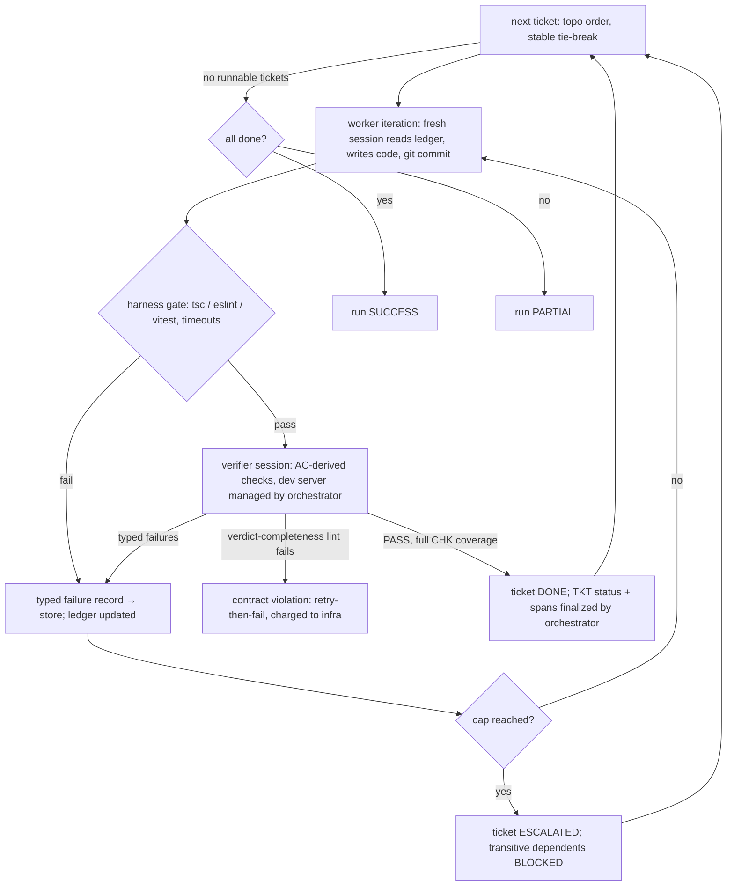

# feat: Agent Families Phase 1 — Pipeline Skeleton

## Summary

Build the plan → work → verify pipeline running on hand-written toy specs: a checkpointable Python orchestrator driving live `claude -p` agent sessions through Ralph loops, with the deterministic harness gate, typed failure records, shadow-mode tripwires, per-agent permission profiles, the pinned output-stack template, and full trace capture from the first run. Done means a toy spec goes plan → tickets → code → verified end-to-end in the pinned stack, the full trajectory queryable in the span store, and the suite still running offline via a scripted-agent fake. No explorer, grader, reflector, episodes, or skill retrieval (Plans 3–4); prompts are hardcoded.

## Problem Frame

Phase 0 built the library and its store; Phase 1 (DESIGN §16) builds the pipeline that will eventually consume it. The two hardest-to-change surfaces this plan fixes are the **run/ticket state machine** (the vocabulary every later phase — episodes, increments, attribution — is defined in) and the **live-session seam** (a second invocation class beside Phase 0's single-shot judge, with its own testing discipline). Flow analysis surfaced 11 critical gaps (resume granularity, bounce accounting, store writership, REQ provenance bootstrap, verdict completeness, quota handling); each is resolved as a KTD below.

---

## Requirements

**Run and ticket lifecycle**

- R1. A run row is created per invocation, keyed by toy-spec ref and the current library snapshot ID (§15 invariant — recorded even though Phase 1 prompts read no skills); run terminals: `success | partial | plan_failed | aborted_quota | aborted_error`.
- R2. Tickets carry statuses `pending | in_progress | done | escalated | blocked`; execution follows deterministic topological order with a stable tie-break (resume reproducibility); an escalated ticket marks transitive dependents `blocked` and independent subtrees continue — after the workspace is **reset to the escalated ticket's start tag** (the orchestrator tags the workspace commit at each ticket start), so independents build from the last verified-good state rather than the escalated ticket's committed failing code; run outcome = `success` iff all tickets `done`, else `partial` (or a plan/abort terminal).
- R3. The orchestrator is **checkpointable at Ralph-iteration boundaries**: durable state is SQLite (run, tickets, iteration counters, ledger entries, spans) plus workspace git history with one commit per iteration. Resume detects orphaned spans (inserted `running` at spawn, finalized on exit), marks them `aborted`, discards the partial transcript, resets the workspace (`git reset --hard <last-iteration-commit>` + `git clean -fd`, no `-x` — the template's `.gitignore` must cover `node_modules` and build outputs, which is what makes the clean safe), and re-enters at the same iteration index without consuming cap. The orchestrator owns all commits, including committing whatever partial state exists when it kills a session on timeout.
- R4. Quota/rate-limit exhaustion is detected from the `claude -p` error envelope, checkpoints the run, and exits with terminal `aborted_quota` (configurable sleep-until-window alternative); quota failures consume no Ralph iterations and produce no agent-attributed failure records.

**Sessions and permissions**

- R5. A `run_session` seam (sibling of Phase 0's `run_judge`) owns every live agentic invocation: spawn via the Windows node-entrypoint rule, stream-json capture to JSONL, per-role `--allowedTools`/`--tools` profile, per-role model/`--max-turns`/wall-clock timeout from config, kill on timeout, span registration at spawn and finalization on exit.
- R6. Permission profiles enforce §8: planner has no execution or file-write tools beyond its structured output; worker writes only inside its workspace and may run only its own unit-test commands; verifier executes build/integration/browser checks. Agents never receive the store DB path — **the orchestrator is the sole store writer**; agents communicate exclusively through validated structured output (judge-style retry-on-violation).
- R7. A **scripted-agent fake** behind the `run_session` seam (applies known diffs, emits known verdicts/plans) lets the full pipeline test suite run offline with zero quota; live runs are documented smoke procedures, not CI.
- R8. A post-iteration containment assert scans the session's JSONL transcript for tool-use file paths (Write/Edit targets, Bash cwd) and asserts every touched path resolves under the workspace root, plus asserts the harness repo's own `git status` stays clean. (A workspace-internal git diff is structurally incapable of seeing outside writes — it is used only for `files_touched` derivation, never containment.) No sandboxing per the security non-goal.

**Planning stage**

- R9. The orchestrator chunks the toy spec into MSG rows (source = spec file + paragraph index, `mentions` empty — FEAT does not exist until Phase 2); the planner's extraction step writes REQ rows with `source → MSG` links, then TKT/AC rows with full traceability links, via structured output.
- R10. Planning is a Ralph loop: deterministic plan lints (REQ coverage matrix, non-empty REQ set, DAG acyclicity, AC presence and links, unit-of-work size budget, file-ownership partitioning at **warn level** in Phase 1) feed typed failures back; cap exhaustion → run terminal `plan_failed`. Judged plan checks are **explicitly deferred to Phase 2** (seam available via the Phase 0 judge; activated alongside AC-quality calibration); assumption *verification* is likewise deferred (its dependency is the Phase 2 explorer) — instead the planner output schema carries an `assumptions[]` field recorded with the plan.

**Ticket execution loop**

- R11. Worker Ralph iterations: fresh session reading the append-only ticket ledger (orchestrator-rendered view over store rows; the worker appends nothing — untrusted producer); each iteration ends in a workspace git commit; `SPAN.files_touched` is derived mechanically from the iteration diff.
- R12. The harness gate (tsc, eslint, vitest — each with orchestrator-enforced timeouts) runs after every worker iteration; **a gate bounce consumes a full Ralph iteration** (one counter; the gate is a cheap checker short-circuiting before the verifier); gate failures are typed failure records.
- R13. Typed failure records follow the §7 schema (failure_kind enum, location, expected, observed, repro_command) and are stored as store rows referenced by ledger entries and spans.
- R14. The verifier executes AC-derived checks itself (never anchoring on the worker's unit-suite results); every CHK row stores a structured repro envelope `{command, cwd (workspace-relative), timeout, expected_exit}` — no absolute paths. A **verdict-completeness lint** rejects any verdict lacking a CHK row per AC, and rejects PASS verdicts containing failing CHKs; violations follow retry-then-fail and are charged to infra, not the worker's cap.
- R15. The orchestrator manages the dev server for browser checks: start on a single configurable port (launched with `--strictPort`; bind failure retries with a new port inside the readiness loop), readiness probe, teardown, hard timeout; the verifier only drives the browser. Dynamic per-episode port-namespacing is a marked Phase 3 seam (§15 invariant 4 concerns parallel-episode isolation, not sequential runs).

**Trace, tripwires, accounting**

- R16. Every `claude -p` invocation (judge or session) registers a span `{run_id, family, agent, ticket_id, ralph_iteration, parent_span, status, model_version, prompt_set_version, files_touched, artifact_refs}`. Model and prompt-set versions are stamped per span — both are instrument events for later SPC/curve interpretation. At startup the orchestrator content-hashes all harness prompt templates into a **prompt-set manifest**, registers it in a `prompt_sets` table with stored template content (revert independence from git state), and an `af prompts list/activate <version>` operation reverts to any prior set; full transcripts persist as JSONL; span rows carry `num_turns`, `duration_ms`, and cost/token fields aggregated per ticket and per run at settlement. Phase 1 carve-out vs DESIGN §13's span shape: `episode`/`increment` columns are created NULLable and unwritten until Phase 2; `status` and the cost fields are permanent Phase 1 additions serving the checkpoint discipline (R3) and billing measurement. Sessions killed on timeout or orphaned never emit a final envelope — their spans finalize with cost/turn fields accumulated best-effort from per-message usage in the captured stream, flagged `cost_partial`; settlement sums include partials and report their count.
- R17. Tripwires run in **shadow mode**: per iteration, the orchestrator embeds an orchestrator-derived diff summary (nomic pin, model+dim recorded per event) and logs `{span_id, detector_kind, similarity, would_have_fired}` to a tripwire table; the no-progress detector logs canonical failure-set hashes per iteration. Nothing kills; the deliverable is the threshold-setting dataset (§17).

**Stack template and corpus**

- R18. A pinned output-stack template repo (React + Vite + TS strict + Hono + Drizzle + SQLite + Tailwind + shadcn, Vitest + Playwright wired, exact versions) is created and referenced by commit hash in config. Workspace instantiation **copies a once-installed template directory (`node_modules` included)** — `npm ci` is template maintenance, not per-workspace work; this is what makes the offline test contract (R7) honest. One workspace per run persists across tickets and is retained after the run (repro commands re-execute against it).
- R19. A toy-spec corpus is committed: one trivial single-ticket spec, one multi-ticket spec with dependencies, one spec with deliberate ambiguity (exercises `assumptions[]`), one spec engineered to force an escalation (exercises the unhappy state-machine arm); each carries expected outcome assertions for the e2e suite.
- R20. Phase 1 schema deltas route through Phase 0's migration mechanism: runs table, TKT.status, span status/cost/turn columns, tripwire table, failure-record table, ledger refs, and a constraint check that MSG rows permit empty `mentions`.

---

## Key Technical Decisions

- **Resume = iteration boundary, never mid-session.** A live session cannot be resumed across orchestrator death; the honest checkpoint is the Ralph-iteration boundary, made durable by git-commit-per-iteration + spans finalized on exit. Orphan detection is the resume entry point. (Flow Q1)
- **Gate bounce = full iteration.** One counter; prevents unbounded compile-error loops inside a quota window; gives the no-progress detector gate failures for free. (Q2)
- **Orchestrator is the sole store writer.** Anything else makes §8's effects-pinning and the verdict monopoly fiction; agents emit validated structured output only. (Q3)
- **MSG bootstrap without an explorer:** orchestrator-synthesized MSG rows per spec paragraph, empty `mentions`, planner extraction as designed — the traceability lints and future reflector queries run against real joins from day one instead of an ad-hoc Phase 1 shape Phase 2 would unwind. (Q4)
- **Two seams, not one:** `run_judge` (single-shot, replay-keyed) and `run_session` (multi-turn, tool-enabled, scripted-fake-tested). Request-hash replay is impossible for filesystem-nondeterministic sessions; pretending otherwise would silently abandon the zero-quota test discipline. (Q5)
- **Verdict-completeness lint** — deterministic, orchestrator-side: CHK coverage over ACs is what "done" means in Phase 1 (no grader exists); a PASS with partial coverage is MAST's incorrect-verification failure mode and is rejected mechanically. AC quality itself is unguarded until Phase 2's calibration — stated, not hidden. (Q6)
- **Continue independents, block dependents, run = `partial`.** Maximizes signal per run; the state machine vocabulary matches what §12's attribution queries expect. (Q7)
- **Two empirical probes early in implementation:** (a) the quota-exhaustion envelope shape — the June 15, 2026 subscription billing change lands *during* Phase 1, so detection must be verified against reality, not docs; (b) `--allowedTools` directory-scoped write containment behavior on Windows. Same epistemic posture as Phase 0's `--bare` note. (Q8)
- **Dev server is orchestrator-managed** (readiness probe, port allocation, teardown, timeout) — server lifecycle is real orchestration work that would otherwise be discovered mid-implementation inside the verifier's permission profile. (Q9)
- **Template repo is a Phase 1 unit** pinned by commit hash; versions are a harness responsibility (model priors lag framework churn, §14). (Q10)
- **Ledger is a rendered view, not a second writer surface.** Store rows are canonical; the per-ticket ledger the worker reads is orchestrator-rendered with span/CHK refs; the worker communicates only via final structured output (§7 untrusted-producer).
- **Tripwire dataset discipline:** embed orchestrator-derived diff summaries (not worker self-summaries), record embedder model+dim per event (thresholds are not portable across embedders, §17).

---

## High-Level Technical Design

### Ticket execution loop (state machine spine)

### Run state machine

`created → planning → executing → settled(success | partial)`, with `plan_failed` exiting from planning, and `aborted_quota | aborted_error` exits from any state via checkpoint. Resume re-enters at the recorded state: orphaned spans aborted, workspace reset to last iteration commit, same iteration index, cap unconsumed.

### Module additions (within `agent-families/src/agent_families/`)

`pipeline/` subpackage: `orchestrator.py` (run loop, state machine, checkpoint/resume), `sessions.py` (run_session seam + scripted fake), `planning.py` (MSG synthesis, planner contract, plan lints), `ticket_loop.py` (worker/gate/verifier loop, ledger rendering), `gate.py` (harness commands + timeouts), `devserver.py`, `tripwires.py` (shadow detectors), `workspace.py` (template instantiation, git discipline, containment assert). Toy specs in `agent-families/specs/`.

---

## Implementation Units

### U1. Phase 1 schema migration

- **Goal:** All Phase 1 tables/columns exist via the Phase 0 migration mechanism.
- **Requirements:** R1, R2, R13, R16, R17, R20
- **Dependencies:** Phase 0 U2 (store)
- **Files:** `agent-families/src/agent_families/store.py`, `agent-families/tests/test_store.py`
- **Approach:** Migration adding: runs (id, spec_ref, snapshot_id, status, totals), TKT.status, span columns (status, num_turns, duration_ms, cost fields), failure_records, tripwire_events, ledger_entries (refs to spans/CHK/failures); verify MSG rows accept empty `mentions` (constraint relax if Phase 0 forbade it).
- **Test scenarios:** migration applies on a Phase 0 database without data loss; run row round-trip with all terminals; ticket status transitions recorded in status_transitions analog for tickets (or dedicated audit) — verify the state enum rejects unknown values; span insert `running` → finalize; orphan query returns unfinalized spans; tripwire event insert with model+dim fields.
- **Verification:** Phase 0 suite still green post-migration.

### U2. Output-stack template repo and workspace lifecycle

- **Goal:** The pinned stack template exists; workspaces instantiate from it with git discipline.
- **Requirements:** R18, R8 (assert), R11 (commit-per-iteration plumbing)
- **Dependencies:** none (parallel with U1)
- **Files:** `agent-families/template/` (the pinned stack app), `agent-families/src/agent_families/pipeline/workspace.py`, `agent-families/tests/test_workspace.py`
- **Approach:** Template: Vite + React + TS strict + Hono + Drizzle/SQLite + Tailwind + shadcn, Vitest + Playwright configured, exact pinned versions, `npm ci`-able lockfile; referenced by commit hash in config. `workspace.py`: instantiate by copying the once-installed template (`node_modules` included; `npm ci` happens only at template creation/maintenance, with timeout and documented network-failure handling), per-iteration commit helper, ticket-start tagging (escalation reset target per R2), transcript-based containment assert (R8), retention policy (keep after run). Template `.gitignore` must cover `node_modules` and build outputs (load-bearing for R3's `git clean -fd`).
- **Execution note:** template boot is the visible deliverable — `npm ci && npm run typecheck && npm test` green from a fresh copy.
- **Test scenarios:** instantiation produces a workspace whose gate commands all pass on the empty template; commit helper creates one commit per call with iteration metadata; containment assert passes on a transcript whose tool-use paths stay inside the workspace and fails on a transcript with a planted outside-path write; ticket-start tag + reset restores the pre-ticket state including removal of untracked files; instantiation failure (simulated install error) surfaces actionable message; template hash mismatch vs config errors at startup.
- **Verification:** fresh-clone template boot documented and reproduced.

### U3. `run_session` seam and scripted-agent fake

- **Goal:** One hardened seam for live multi-turn sessions, fully testable offline.
- **Requirements:** R5, R6 (profiles), R7, R4 (envelope classification), R16 (span hooks)
- **Dependencies:** U1
- **Files:** `agent-families/src/agent_families/pipeline/sessions.py`, `agent-families/tests/test_sessions.py`
- **Approach:** Spawn per Phase 0's node-entrypoint/utf-8 KTDs; stream-json → JSONL transcript file + final envelope parse; per-role config (model, max-turns, wall-clock timeout, `--allowedTools`/`--tools` profile); kill on timeout with span finalized `timeout`; quota/rate-limit envelope classification (empirical probe documented as first implementation task); span registered `running` at spawn, finalized with cost/turn fields. Scripted fake: a session double driven by per-test scripts (apply diff X to workspace, emit structured output Y) selected via env var, mirroring the seam's interface exactly. Fixture diffs are committed beside the toy specs and must survive the *real* gate — a dedicated canary test applies each fixture to a fresh template copy and runs tsc/eslint/vitest, so a template version bump that breaks fixtures fails loudly as a fixture problem, not a phantom pipeline bug. Kill/orphan cost handling per R16 (`cost_partial` accumulation from per-message stream usage).
- **Test scenarios:** fake applies a scripted diff and returns scripted output through the same interface; timeout kills and finalizes span as `timeout`; malformed structured output triggers retry-then-fail; quota-classified envelope raises the distinct quota exception (fixture-driven); span lifecycle (running→finalized) verified; per-role profile flags assembled correctly per config (pytest-subprocess assertion on argv).
- **Verification:** suite green with no `claude` on PATH; live smoke procedure documented.

### U4. Orchestrator core: run/ticket state machine, checkpoint/resume

- **Goal:** The run loop with durable state and honest resume.
- **Requirements:** R1, R2, R3, R4
- **Dependencies:** U1, U2, U3
- **Files:** `agent-families/src/agent_families/pipeline/orchestrator.py`, `agent-families/tests/test_orchestrator.py`
- **Approach:** State machine per HTD; deterministic topo order (tie-break: ticket ID); escalation → workspace reset to ticket-start tag, dependents blocked, independents continue; settlement computes run terminal + cost aggregation. Checkpoint = store state (already durable per-write) + iteration-boundary discipline; gate outcomes are persisted to the store sub-iteration so a post-gate resume skips straight to the verifier without double-charging cap; resume: detect orphan spans → abort them, reset workspace per R3, re-enter loop. Quota exception → checkpoint + `aborted_quota`. A test-only `crash_at(step)` injection seam in the loop drives deterministic kill-point tests (real subprocess termination reserved for one coarse e2e). Orchestrator tests use an injectable stub gate; the real gate runs only in U6's tests and the U8 e2e.
- **Test scenarios (scripted-fake driven):** linear DAG executes in order; diamond DAG with mid-failure blocks only dependents and yields `partial`; kill between gate and verifier → resume completes ticket without double-charging cap; kill mid-worker-session → orphan span aborted, workspace reset, iteration replayed at same index; quota exception mid-run → `aborted_quota`, resume completes; run with all tickets done → `success`; deterministic re-run of the same fake script produces identical ticket ordering.
- **Verification:** resume tests pass under forced kills at three distinct points.

### U5. Planning stage

- **Goal:** Toy spec → MSG → planner session → linted, traceable plan, or `plan_failed`.
- **Requirements:** R9, R10
- **Dependencies:** U3, U1
- **Files:** `agent-families/src/agent_families/pipeline/planning.py`, `agent-families/tests/test_planning.py`
- **Approach:** MSG synthesis (paragraph chunking, source refs, empty mentions); planner structured-output contract (REQ/TKT/AC + links + `assumptions[]`); deterministic lints: REQ coverage, non-empty REQ set, DAG acyclic, AC presence/links, size budget, file-ownership (warn-level, recorded); lint failures → typed feedback → planner Ralph iteration; cap → `plan_failed`. Optional judged checks via the Phase 0 judge seam.
- **Test scenarios (fake planner scripts):** valid plan persists full traceability joins (REQ→MSG, TKT→REQ, AC→TKT queryable); cyclic DAG output → typed lint failure → corrected on scripted iteration 2; empty REQ extraction → lint failure not crash; zero-ticket plan → coverage lint fires; overlapping file ownership → warn recorded, plan accepted; `assumptions[]` persisted and surfaced in run report; cap exhaustion → `plan_failed`, nothing downstream runs.
- **Verification:** lint outcomes enumerated in tests 1:1 with the lint list.

### U6. Ticket loop: worker, harness gate, verifier

- **Goal:** The per-ticket Ralph loop with gate, typed failures, evidence-complete verdicts, and dev-server management.
- **Requirements:** R11–R15
- **Dependencies:** U2, U3, U4
- **Files:** `agent-families/src/agent_families/pipeline/{ticket_loop.py,gate.py,devserver.py}`, `agent-families/tests/{test_ticket_loop.py,test_gate.py,test_devserver.py}`
- **Approach:** Ledger rendered per iteration from store rows (read-only to worker); worker session → commit → containment assert → gate (commands with timeouts; bounce = iteration; typed failure on fail) → verifier session with orchestrator-managed dev server (readiness probe, allocated port, teardown, hard timeout); verifier structured verdict → verdict-completeness lint (CHK per AC, repro envelope shape validated, no absolute paths) → TKT done or typed failures → next iteration; cap → escalated.
- **Test scenarios (fake-driven):** Covers the loop: gate failure consumes an iteration and writes a typed record with repro command; three identical scripted gate failures show identical failure-set hashes (feeds no-progress detector); verifier PASS missing one AC's CHK → rejected as contract violation, retried, charged to infra not cap; verifier PASS with full coverage closes ticket and finalizes spans; repro envelope with absolute path rejected by validation; dev server: readiness probe gates verifier start, `--strictPort` bind failure retries with a new port, teardown on verdict, hung server killed at timeout; escalation path: cap exhaustion marks ticket escalated and dependents blocked; escalation followed by an independent ticket whose gate passes (workspace was reset to the ticket-start tag — the escalated ticket's failing code does not poison the gate).
- **Verification:** every R11–R15 clause has a 1:1 test; loop runs end-to-end on the trivial toy spec with fakes.

### U7. Trace capture, shadow tripwires, accounting

- **Goal:** Full-fidelity spans + the tripwire threshold-setting dataset + cost curves.
- **Requirements:** R16, R17
- **Dependencies:** U3, U4
- **Files:** `agent-families/src/agent_families/pipeline/tripwires.py`, `agent-families/tests/test_tripwires.py`
- **Approach:** Span finalization already in U3; this unit adds: orchestrator-derived diff summaries per iteration → nomic embedding (Phase 0 embedding service, `clustering:` prefix not needed — use `search_document:`; record model+dim) → consecutive-iteration cosine logged with `would_have_fired` against the config threshold; failure-set canonical hashing per iteration; settlement aggregation of cost/turns per ticket/run into the run row.
- **Test scenarios:** two identical scripted iterations log similarity ~1.0 and `would_have_fired: true` (shadow only — loop continues); distinct iterations log lower similarity; failure-set hash stable under failure-record reordering; tripwire events carry model+dim; run settlement totals equal the sum of span costs; nothing is ever killed by a detector in Phase 1 (assert loop completion despite fired flags).
- **Verification:** a fake run produces a queryable tripwire dataset with both detectors represented.

### U8. Toy-spec corpus and end-to-end acceptance

- **Goal:** The committed corpus exercising happy, dependent, ambiguous, and escalation paths; the pipeline's e2e proof.
- **Requirements:** R19, plus end-to-end coverage of R1–R18
- **Dependencies:** U1–U7
- **Files:** `agent-families/specs/{01-trivial.md,02-multi-ticket.md,03-ambiguous.md,04-escalation.md}`, `agent-families/tests/test_pipeline_e2e.py`, `agent-families/README.md` (pipeline section)
- **Approach:** Four specs per R19 with per-spec expected outcomes (ticket counts, terminal states, assumptions recorded, escalation arm exercised); e2e suite runs the full orchestrator with scripted fakes (offline, CI-safe); README documents the live smoke procedure (one real run of `01-trivial.md` against the actual CLI, expected cost noted) and the two empirical probes (quota envelope, Windows write containment).
- **Test scenarios:** Covers R19 — trivial spec: one ticket, `success`, full trace chain queryable (run→ticket→spans→CHK with repro envelopes); multi-ticket spec: dependency order respected, `success`; ambiguous spec: `assumptions[]` non-empty in run report; escalation spec: scripted persistent failure → ticket escalated, dependent blocked, run `partial`; resume e2e: kill the multi-ticket run mid-flight, resume to `success`.
- **Verification:** `uv run pytest` green offline from fresh clone **with the template primed** (one documented online `npm ci` at template setup — the workspace-instantiation copy model makes everything downstream offline); live smoke on the trivial spec documented with observed cost.

---

## Scope Boundaries

**Deferred to later phases (seams marked, not faked):**

- Tripwire kill mode and threshold values — Phase 2+, set from this phase's shadow dataset (§17)
- Question budget / explorer Q&A channel — Phase 2; Phase 1 ships only the planner `assumptions[]` field
- Assumption verification (retriever → human simulator) — Phase 2
- Judged plan checks (independent implementability, AC testability, adversarial pass) — seam available via the Phase 0 judge; activated in Phase 2 alongside AC-quality calibration
- File-ownership lint *enforcement* (serializing conflicting tickets) — Phase 2 rehearsal-pass prerequisite; Phase 1 records warns with no consumer by design
- Per-episode port-namespacing (§15 invariant 4) — Phase 3 parallel episodes; Phase 1 uses a single configurable strict port
- Mutation-seeded verifier audits, suspect-verdict downgrading — Phase 2 calibration
- Rehearsal pass, DAG waves, worktree fan-out — Phase 2+ (§11); Phase 1 is the convergence-pass mechanic only
- Skill retrieval into pipeline prompts — prompts are hardcoded until the library integration phase (Plan 4)
- Escalation beyond record-and-halt (no human-in-the-loop UI)
- Episodes, increments, registry, grading — Plans 3–4

**Non-goals:** no sandboxing beyond the containment assert (security non-goal); no parallel ticket execution (sequential; parallel-readiness = keying + single-writer discipline only); no API-key usage.

---

## Risks & Dependencies

- **June 15, 2026 billing change lands mid-Phase-1:** headless usage moves to a separate Agent SDK credit. The quota-envelope probe is the *first* implementation task, and the run-level cost aggregation (R16) exists precisely to measure burn against whatever the credit turns out to be. Pipeline economics re-validated before Plan 3 implementation.
- **Permission-profile semantics on Windows** (`--allowedTools` patterns, directory scoping) verified by probe before U6 hardens around them.
- **Template priming is a hard prerequisite, not an optimization:** the copy-installed-template model (R18) is what makes the offline e2e contract true; the one online `npm ci` at template creation is documented as a setup step, like Phase 0's model-cache priming.
- **Live-session nondeterminism**: scripted fakes make CI deterministic, but live smoke results will vary; the corpus expectations are written against fakes, with the live smoke asserting only terminal state, not trajectory.
- Phase 0 plan's risks (sqlite-vec pre-1.0, `--bare` auth) carry forward unchanged.

---

## Sources & Research

- DESIGN.md §3 (families), §7 (Ralph loops, typed failures, tripwires, contracts), §8 (permissions, verdict monopoly), §11 (increment mechanics this phase's loop grows into), §12.1–12.2 (traceability the lints and spans must honor), §13 (trace capture, two-tier memory seams), §15 (orchestration, parallel invariants, model tiers), §16 (Phase 1 definition), §17 (shadow-mode discipline, threshold provenance)
- Phase 0 plan (`docs/plans/2026-06-10-001-feat-agent-families-phase0-library-core-plan.md`): store/migration mechanism, judge seam KTDs (node entrypoint, utf-8, retry-then-fail), config discipline — all consumed here
- Flow analysis (this session): 17 gaps + 10 resolved questions; gaps 1–11 became R1–R17 and the KTD list; gaps 12–17 resolved in unit approaches; deferrable items routed to Scope Boundaries
- Library verification (June 2026, from Plan 1 research): `claude -p` flags and envelope shape, Windows subprocess discipline, stack-template version pins
