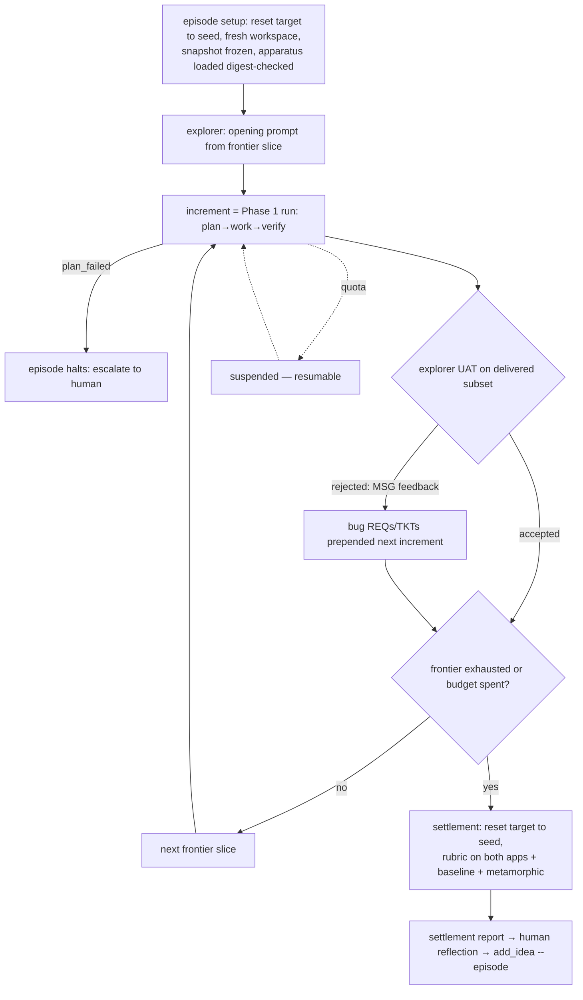

# feat: Agent Families Phase 2 — Explorer + Grader

## Summary

Run real graded episodes against linkding with a human as the manual reflector: the target-app harness, the grader-side feature registry with runtime-confirmed evidence, the exploration frontier ledger, the explorer agent (UI-only prompts, verified-oracle Q&A, UAT), episodes/increments layered on Phase 1 runs, the resolve-cache-replay scenario harness, differential grading at settlement with a debiased judge protocol, and the two calibration instruments (mutation-seeded verifier audits, frozen replay set). Done means one full episode against linkding ends in a settlement report the human can navigate via a trace-query CLI and turn into hand-written ideas through `add_idea`. Rehearsal pass, improvement-tier grading, and the automated reflector are Plan 4.

## Problem Frame

Phases 0–1 built the library and a pipeline that can build toy specs. Phase 2 (DESIGN §16) closes the *observation* side of the loop: a real legacy target, a behavioral spec extracted by an explorer that simulates a customer, and a grader that measures the clone against the running target — with a human doing reflection so the registration machinery and grading instruments are validated before any automation trusts them. The two hardest-to-change artifacts here are the **episode/increment state machine** (a delta on Phase 1's run machine that every later phase inherits) and the **FEAT identity discipline** (scenarios, frontier, and every MSG `mentions` anchor on FEAT IDs forever).

---

## Requirements

> **R3 RECONCILIATION (terminology-only) — see plan 2026-06-12-010 (Phase C) R11.**
> Phase 2 is **~untouched** by the R3 reform: the explorer, grader, registry, and
> frontier are **training-only stage-roles** R3 §3 keeps verbatim. The only change
> is wording — "explorer agent" / "grader agent" read as "explorer stage-role" /
> "grader stage-role"; there is **no family/agent routing** assumption hidden in
> the episode wiring (the runtime routes by stage, never by a per-request family
> router). No requirement below is superseded or rewritten.

**Episode and increment structure**

- R1. An `episodes` table sits above Phase 1 runs: episode = one target × one library snapshot × one fresh workspace × one settlement. **An increment is exactly one Phase 1 run** (`run.episode_id` + `increment_index`); workspace ownership moves from run to the **target engagement**: created at the target's first episode, persisting across increments *and* episodes (each episode continues the same product; fresh workspaces only in Plan 5's rebuild-probe episodes), retained after settlement; TKT/MSG/REQ/SPAN IDs are globally unique, episode-scoped only for display.
- R2. Runs gain an **acceptance stage**: after a run settles, explorer UAT yields `accepted | rejected` on the *delivered subset* — escalated tickets carry into the next increment's plan automatically and are never re-discovered via UAT (no double-counting). A `plan_failed` increment halts the episode and escalates to the human.
- R3. Episode terminals: `frontier_exhausted | budget_spent | aborted_error`; plus a resumable non-terminal `suspended` — mid-increment quota exhaustion uses Phase 1's checkpoint (`aborted_quota` → resume) and suspends the episode, never counting as `budget_spent`.
- R4. Episode budget = max-increments cap AND a cost ceiling (fed by Phase 1 R16's per-run aggregation), checked at increment boundaries; both values in the thresholds config.

**Target environment contract**

- R5. linkding runs via docker-compose pinned **by image digest** (tag `sissbruecker/linkding:1.45.0`), named volume (never a Windows bind mount — SQLite WAL corruption risk), `LD_SUPERUSER_NAME/PASSWORD` for headless superuser, `LD_DISABLE_BACKGROUND_TASKS=True` (determinism — no favicon/snapshot workers), readiness = poll `GET /health` for `status: "healthy"`.
- R6. Seeding is API-driven: an `ApiToken` minted headlessly via `manage.py shell` (the v1.45 `bookmarks.models.ApiToken` model — not the DRF token), bookmarks/tags created via `POST /api/bookmarks/` loops (no rate limit), seed manifest committed. **Reset-to-seed at episode start and again at settlement start**; all cached target-side evidence and a11y fingerprints are defined against post-seed state.
- R7. Dual-app settlement concurrency: a static port-allocation table (linkding compose port, clone dev-server port — disjoint); the orchestrator owns the clone dev server across UAT and settlement (extending Phase 1's `devserver.py` with hold-open semantics); per-episode container/port namespacing remains the Phase 3 seam.

**Feature registry and frontier**

- R8. Registry pre-research enumerates features from source, routes, and UI traversal; every FEAT row is **runtime-confirmed with captured evidence** before it exists ("source proposes, runtime confirms"); expected linkding surface ≈ 18 areas / 40–60 testable behaviors.
- R9. FEAT identity discipline: every registry row is stamped with the target image digest; a digest mismatch at episode setup is a hard error; FEAT IDs are append-only and never reused; removed features become status `deprecated` (frontier drops them, scenarios archive, MSG history stays valid).
- R10. The frontier ledger tracks per-FEAT exploration status (`unexplored | partially-explored | explored | newly-discovered`) and drives increment requests (least-investigated first; slice size from config). **Mention-coverage guarantee:** at every settlement, a deterministic audit joins registry FEATs against all MSG `mentions` for the target; FEATs never mentioned in any prompt/Q&A across episodes are **force-scheduled** into the next episode's opening slice ahead of the normal ordering — coverage converges by mechanism, not by trusting explorer behavior or planner elicitation (which only ever sharpens details of features the explorer volunteers; it was never the discovery channel). **Newly-discovered flow:** the explorer enqueues the observation with UI evidence → a grader-side confirmation step mints the FEAT row + its scenario manifest(s) → only then is the feature mentionable (FK from `mentions` to FEAT enforces it).

**Explorer subsystem**

- R11. The opening prompt is written by a **fresh explorer exploration session on the target UI**, instructed to describe features beyond the already-built set (known from its own accepted-delivery history; differential clone-vs-target browsing is legal — both are UI), frontier-ordered with force-scheduled items first. It and all subsequent requests land as MSG rows tagged `mentions: [FEAT-*]`; UAT feedback is likewise explorer-authored MSG rows with mentions — the next increment's planner extracts REQs from them and writes ordinary TKT/AC rows tagged `kind: bug`, prepended before the new frontier slice and counted in increment budget (full §12 traceability preserved; no REQ-less ticket type exists).
- R12. **Verified oracle:** every Q&A answer is grounded in a fresh observation and validated by a grader-side checker before crossing the wall. **Checker contract:** questions carry mandatory FEAT mentions (the retrieval mechanism); checker input = (question, answer text, the explorer's fresh-observation a11y snapshot, the registry evidence for the mentioned FEATs); single-shot judge with default-fail framing; output = `{verdict, contradiction: {claim, evidence_ref, observed}}` — the contradiction object is what the retry prompt embeds. Rejection → fresh-context re-answer with contradiction evidence (N retries, config); retries are grader-side, consume no question budget; final failure → typed `answer_unavailable`, slot refunded, tuple queued for human review.
- R13. Question budget: hard cap per increment; the **plan-checker converts the planner's `assumptions[]` into questions** (closing Phase 1's seam), and conversions count against the cap; over-budget assumptions are recorded `unverified` on the plan (typed risk, not a blocker); question N+1 receives a typed `budget_exhausted` bounce, logged for the elicitation-efficiency metric (features recovered per question, measured against the registry). UAT feedback is budget-free — acceptance is not elicitation.
- R14. Fresh-context answering: each question batch is answered by a new explorer instance reading the persistent registry-facing Q&A log — no long-lived simulator session.
- R15. Explorer containment is **structural — the explorer session has no tools at all**: it emits structured browse requests `{action, selector, args}` as output; the orchestrator executes them via Playwright and returns accessibility-tree observations as text (orchestrator-mediated browse). This reuses the structured-output retry discipline, makes the offline fake trivial (scripted observations), and means containment needs no enforcement — there is nothing to misuse. A transcript-scan assert (Phase 1 R8 pattern) remains as defense-in-depth. (Playwright-MCP-in-session was considered and rejected: it requires extending `run_session` with MCP lifecycle plumbing no phase has built, and makes containment behavioral instead of structural.)

**Scenario harness**

- R16. Registry entries yield scenario manifests (JSON: NL steps, expected outcome, tolerance tier) authored at FEAT-mint time and stored in the per-target apparatus cache.
- R17. Resolution: a constrained one-step resolver (headless Claude via the judge seam's invocation discipline) maps NL step → `{action, selector, args}`, cached per (scenario, app) keyed by accessibility-tree fingerprint; replay executes as plain Playwright with zero LLM calls; evidence (a11y snapshot + screenshot) captured per step. **Fingerprint normalization (load-bearing):** the fingerprint hashes a normalized structural skeleton — roles + accessible names of interactive/landmark elements only, repeated content rows collapsed to a count-free shape, text content/dates/numeric counts stripped — so routine data mutation does not invalidate caches; this is what lets the target cache accumulate hits while scenarios mutate state.
- R18. Typed resolver outcomes include `element_absent` (distinct from ambiguous-match): the first unresolvable step on the clone fails the scenario as `feature_absent`, skips remaining steps, attempts no healing, and captures the stopping snapshot — separating "not built" from "built wrong" exactly as the attribution tree needs.
- R19. Self-healing: a failed replay step re-resolves that step only, updates the cache, and must pair with a deterministic post-assertion. Heal telemetry is **per-app**: clone-side healing is expected churn (new DOM each episode); within-settlement state mutation on the target does **not** register as a heal (the R17 normalization absorbs it) — only fingerprint-stable re-resolutions or hard failures count. A target-side heal flags the FEAT's evidence `stale` and surfaces in the settlement report; a target-side hard failure marks the scenario `invalid` and excludes it from the score denominator.

**Grading at settlement**

- R20. Settlement executes the full registry-anchored rubric on both apps: tolerance tiers (must/should/free), deterministic assertions first, one LLM judgment per scenario *comparison* on a11y-tree diffs (binary + CoT, default-fail framing, panels only on low-confidence/disagreement), screenshots archived as evidence — never judge input.
- R21. The baseline property checklist (target-independent: server-side validation, authz-on-direct-access, no stack traces) probes the clone's own endpoints; the metamorphic tier (create-then-list, edit-then-revert identity, refresh idempotence) runs target-free.
- R22. SCEN rows are finally written: keyed (target, episode, snapshot_id), carrying tier, verdict, judge metadata (single/panel), and evidence refs — **including the judge-input a11y-diff payloads** (replay re-judging needs the original inputs, not just screenshots).
- R23. The **settlement report** is the human reflector's entry point: overall score + tier breakdown, with scenarios for FEATs never requested in any increment broken out as an **unreached-frontier bucket** (full-denominator score per §10's full-coverage fairness, but budget-vs-capability made visible); failed scenarios listed with an embedded named trace command (`af trace chain <SCEN>` — the attribution join lives once, in the CLI, where Plan 4's Stage A will reuse it, not in the report renderer); a dedicated UAT-accepted-but-scenario-failed section (typed tag; attribution rule deferred to Plan 4); instrument health (mutation-audit results); every row carrying a ready-to-paste trace-query CLI command.

**Calibration instruments**

- R24. Mutation-seeded verifier audits: hand-authored known-bad diffs injected into the verify queue on a config cadence; **every mutant ships with a witness** (a repro command demonstrating the bad behavior on the mutated build, executed before any verifier pass counts as a false-pass — the equivalent-mutant guard); a verifier passing a witnessed mutant is flagged and its verdicts since the last clean audit are marked `suspect` (recorded and surfaced only — enforcement is Phase 3).
- R25. Frozen replay set — **bootstrap only in Phase 2**: the first N (≥20, config — a Phase 2 exit criterion; Plan 4's SPC bootstrap depends on it) hand-verified linkding verdict pairs (with their judge-input payloads, per R22) are persisted as the frozen set. The re-judging cadence, drift tolerance, and `instrument_suspect` flagging machinery move to Plan 4, where their consumer (control charts) lives; in Phase 2 the human is the loop and inspects drift manually if at all.

**Reflection support**

- R26. A trace-query CLI: spans by ticket/increment/episode, iteration diffs, evidence lookup, transcript open — the commands the settlement report embeds.
- R27. `add_idea` gains provenance: required `--episode` for Phase 2 ideas, optional `--scenario`/`--ticket` evidence refs, stored as columns the Phase 3 reflector will populate mechanically.

---

## Key Technical Decisions

- **Increment = one Phase 1 run.** Everything inherits this: episodes/increments are tables above runs, the span schema's NULLable `episode`/`increment` columns (Phase 1 R16 carve-out) get their writers, MSG/REQ accumulate across increments (the Q&A transcript *is* the requirements statement, §9), and Phase 1's reset/checkpoint semantics survive unchanged inside an increment. (Flow Q1)
- **Budget = increments cap + cost ceiling, enforced at increment boundaries; quota suspends, never spends.** (Q2)
- **Oracle failure arm:** retry-with-evidence → `answer_unavailable` + slot refund + human review queue. A perfect oracle failing its own checker is a registry gap or checker bug — exactly what Phase 2 exists to catch. (Q3)
- **Bug tickets are ordinary tickets.** UAT feedback enters as MSG rows; REQ extraction and AC authorship stay with the planner; `kind: bug` is a tag, not a type. §12's queries never special-case. (Q4)
- **Digest pinning is the FEAT stability mechanism.** Registry keyed by image digest; mismatch is a hard setup error; the full re-research migration procedure is deferred — the keying makes staleness loud, which is the non-deferrable part. (Q5)
- **Plan-checker owns assumption→question conversion, on budget.** The budget trains elicitation; free verification would untrain it. (Q6)
- **Target environment contract:** reset-to-seed at episode start + settlement start; caches defined against post-seed state; static port table; orchestrator holds the clone server open across UAT and settlement. (Q7)
- **The settlement report is a product requirement, not a log.** Phase 2's purpose is recording the navigation moves the Plan 4 reflector will mimic; the report is where those moves start. (Q8)
- **linkding specifics locked by research:** v1.45.0 by digest; `ApiToken` model (not DRF tokens); `/health` readiness; background tasks disabled; named volume; POST-only logout (Playwright must click, not GET); CSRF handled by form-fill.
- **Test tiers:** unit/orchestration tests run offline with scripted fakes (Phase 1 discipline); scenario-harness and grader integration tests require local Docker + the primed linkding stack and are a separately-marked suite (not CI-offline); live explorer/judge smoke is documented procedure. The offline contract covers everything that doesn't inherently need the target.

---

## High-Level Technical Design

### Episode state machine (delta on Phase 1's run machine)

### Question round-trip

Pipeline question → budget gate (typed `budget_exhausted` bounce when spent) → fresh-context explorer (registry + Q&A log) → fresh UI observation → grader-side checker vs registry → pass: text answer + MSG row | fail: retry with evidence ×N → `answer_unavailable` + refund + review queue.

### Module additions

`pipeline/` gains `episode.py` (episode loop, UAT, budget, suspension), `explorer.py` (prompt/Q&A/UAT sessions + containment), `oracle_check.py` (grader-side answer checker). New `grading/` subpackage: `registry.py` (pre-research + mint path), `frontier.py`, `target_env.py` (compose lifecycle, seeding, reset), `scenarios.py` (manifests, resolver, cache, replay, healing), `settle.py` (rubric execution, judges, report), `calibrate.py` (mutation audits, frozen replay). CLI gains `trace` subcommands and episode commands.

---

## Implementation Units

### U1. Phase 2 schema migration

- **Goal:** Episodes/increments, FEAT/frontier/manifest/Q&A tables, SCEN keys, report storage, idea provenance.
- **Requirements:** R1, R3, R9, R10 (tables), R22, R23 (storage), R27
- **Dependencies:** Phase 1 U1
- **Files:** `agent-families/src/agent_families/store.py`, `agent-families/tests/test_store.py`
- **Approach:** Migration: episodes (target, digest, snapshot_id, status, budget fields), `run.episode_id`/`increment_index`/`acceptance`, FEAT (digest-stamped, append-only, status incl. `deprecated`), frontier, scenario_manifests, qa_log (questions, answers, checker verdicts, budget accounting), review_queue, settlement_reports, SCEN key/tier/judge columns, insight provenance columns (`episode_id`, evidence refs). Backfill-safe on Phase 0/1 data.
- **Test scenarios:** migration idempotent over a Phase 1 database; FEAT append-only constraint (update of ID rejected, status flip allowed); mentions FK rejects unconfirmed FEAT; run acceptance enum; episode suspension round-trip; SCEN row requires episode + snapshot keys.
- **Verification:** Phases 0–1 suites green post-migration.

### U2. Target harness: linkding lifecycle

- **Goal:** Boot, seed, reset, and health-check the pinned target.
- **Requirements:** R5, R6, R7 (port table half)
- **Dependencies:** none
- **Files:** `agent-families/targets/linkding/{docker-compose.yml,seed_manifest.json}`, `agent-families/src/agent_families/grading/target_env.py`, `agent-families/tests/test_target_env.py`
- **Approach:** Compose per research (digest pin, named volume, superuser env vars, background tasks disabled, port from the static table); readiness polls `/health` for `healthy`; token mint via `manage.py shell` one-liner against the `ApiToken` model, idempotent by (user, name); seeding loops `POST /api/bookmarks/` from the committed manifest; reset-to-seed = volume drop + re-boot + re-seed (cold path ~tens of seconds, amortized per episode); `docker cp`-based DB snapshot documented as the faster alternative if reset time matters.
- **Test scenarios (marked docker-required):** boot reaches healthy; seed produces expected bookmark/tag counts via API; reset returns API counts to seed state after mutations; token mint idempotent; digest mismatch detection fails setup with the documented error.
- **Verification:** documented one-command bring-up on Windows Docker Desktop.

### U3. Registry pre-research and frontier ledger

- **Goal:** The grader-side FEAT registry with runtime confirmation, and the frontier that drives episodes.
- **Requirements:** R8, R9, R10
- **Dependencies:** U1, U2
- **Files:** `agent-families/src/agent_families/grading/{registry.py,frontier.py}`, `agent-families/tests/{test_registry.py,test_frontier.py}`
- **Approach:** Pre-research runs as a `run_session` with a **grader profile** (Read/Grep/Bash scoped to the target source checkout, plus the orchestrator-mediated browse channel); source acquisition is pinned — `git clone --depth 1 --branch v1.45.0` into `agent-families/targets/linkding/source/` (gitignored), verified against the image digest at setup. Enumerate from source + `urls.py` routes + UI traversal; each candidate confirmed on the running app with captured evidence (a11y snapshot/screenshot) before the FEAT row is minted; manifests authored at mint (U4's format). Frontier seeded from registry; slice selection = least-investigated, size from config; newly-discovered queue → incremental confirmation → mint → mentionable.
- **Test scenarios:** registry rows all carry evidence refs and the current digest; a planted source-only feature (dead code analog) is not minted without runtime confirmation; deprecation flow archives scenarios and drops frontier entries while MSG history stays queryable; mint path makes a newly-discovered feature mentionable and authorable; frontier ordering deterministic.
- **Required acceptance tests** (named MUST-tests, do not weaken; add a `## Conformance` mapping):
  - `test_source_only_feature_not_minted` — a feature present in source/routes but **not reachable/confirmable on the running app** (dead code, disabled flag) is NOT minted as a FEAT.
  - `test_runtime_confirmed_feature_minted_with_evidence` — a feature confirmed on the running app IS minted, carrying an evidence ref (a11y snapshot/screenshot) and the current image digest.
  - `test_feat_ids_append_only` — a registry refresh never renumbers or reuses a FEAT id; a vanished feature flips to `deprecated`, it is not deleted.
- **Verification:** linkding registry lands in the expected 40–60 behavior range with evidence per row (docker-required suite).

### U4. Scenario harness: resolve, cache, replay, heal

- **Goal:** Behavioral scenarios executable on two different DOMs at training-loop cost.
- **Requirements:** R16, R17, R18, R19
- **Dependencies:** U1, U2; Phase 0 U4 (judge invocation discipline)
- **Files:** `agent-families/src/agent_families/grading/scenarios.py`, `agent-families/tests/test_scenarios.py`
- **Approach:** Manifest format (NL steps, expected outcome, tier); constrained resolver = one NL step + a11y tree → `{action, selector, args}` via single-shot structured call (judge seam mechanics; typed `element_absent`/`ambiguous` outcomes); cache key = SHA256(step, URL pattern, a11y fingerprint) scoped (scenario, app); replay as plain Playwright with per-step evidence; `feature_absent` short-circuit per R18; self-heal per R19 with per-app telemetry channels and the target-side `stale`/`invalid` escalation. Offline resolver tests run against **committed static a11y-tree fixtures** (captured once, never re-captured in CI); fixture refresh is a deliberate recorded operation tied to seed-manifest or target-pin changes (Phase 1's canary-test pattern).
- **Test scenarios:** resolution fixture-driven (recorded resolver outputs): cache hit replays with zero resolver calls; fingerprint change forces re-resolution of only the changed step; `element_absent` on clone step 1 → `feature_absent`, remaining steps skipped, no healing, snapshot captured; heal on clone logs to clone channel and pairs with post-assertion; planted target-side heal flags FEAT evidence stale; target hard failure marks scenario `invalid` and the denominator excludes it (docker-required for live-tree cases; resolver itself fixture-tested offline).
- **Required acceptance tests** (named MUST-tests, do not weaken; add a `## Conformance` mapping):
  - `test_fingerprint_ignores_content_mutation` — two accessibility-tree states differing ONLY in row content, dates, or numeric counts produce the **identical** fingerprint (within-settlement state mutation must not invalidate the target cache).
  - `test_fingerprint_detects_structural_change` — a structural change (added/removed interactive element or landmark) produces a **different** fingerprint.
  - `test_target_cache_survives_mutation` — after a scenario mutates target state, a subsequent cached resolution still hits with zero resolver calls (the "target cache accumulates hits forever" economics hold).
- **Verification:** one full scenario executes on live linkding via cached resolutions twice, second run zero LLM calls (documented smoke).

### U5. Explorer subsystem

- **Goal:** Prompt-writing, verified-oracle Q&A, UAT, and containment.
- **Requirements:** R11–R15
- **Dependencies:** U1, U3; Phase 1 U3 (`run_session`)
- **Files:** `agent-families/src/agent_families/pipeline/{explorer.py,oracle_check.py,planning.py}` (planning.py: the `assumptions[]`→question conversion hook closes Phase 1's seam), `agent-families/tests/{test_explorer.py,test_oracle_check.py}`
- **Approach:** Explorer sessions are tool-less and emit structured browse requests; the orchestrator executes via Playwright and returns a11y observations (R15 — structural containment, trivially fakeable); prompt/UAT/answers emitted as structured output → orchestrator writes MSG rows with mentions (FK-checked); oracle checker per R12's contract (mentioned-FEAT retrieval, fresh-observation snapshot + registry evidence in, `{verdict, contradiction}` out, default-fail); retry/refund/review-queue per R12; budget gate + `assumptions[]` conversion in the plan-checker per R13; fresh-context per batch per R14.
- **Test scenarios (fixture/fake-driven):** prompt MSG rows carry only confirmed FEAT mentions (unconfirmed → FK rejection path exercised); checker pass and contradiction paths; final-failure → `answer_unavailable` + slot refund + review-queue row; budget exhaustion bounce typed and logged; assumptions[] converted and budget-counted; over-budget assumption recorded `unverified`; UAT rejection produces MSG feedback rows that the (fake) planner turns into `kind: bug` tickets with full REQ links; containment assert fires on a planted Bash tool-use in the transcript.
- **Verification:** every R12/R13 arm has a 1:1 test.

### U6. Episode orchestration

- **Goal:** The delivery loop over Phase 1 runs: slices, UAT, bug-ticket carry-in, budget, suspension, halts.
- **Requirements:** R1–R4 (behavioral halves)
- **Dependencies:** U1, U3, U5; Phase 1 U4
- **Files:** `agent-families/src/agent_families/pipeline/{episode.py,workspace.py,orchestrator.py}` (the latter two are Phase 1 modules this unit amends), `agent-families/tests/test_episode.py`
- **Approach:** Episode setup (digest check, target reset, workspace create-or-load per R1, apparatus load); loop: frontier slice → explorer request → increment (Phase 1 run with episode FKs) → UAT → accept/reject → budget check → next slice or settlement handoff; `plan_failed` halts to human; quota suspends (resume re-enters mid-episode). **Workspace dual-mode contract:** runs accept an optional injected workspace (episode mode) and default to per-run instantiation (standalone toy-spec mode) — Phase 1's existing tests stay green as the regression gate. **UAT briefing artifact:** the orchestrator renders the increment's delivered scope as the explorer's own request MSGs joined to FEAT mentions, filtered to `done` tickets (escalated/blocked excluded — never UAT-discovered), passed as text; the UAT session runs tool-less against the held-open clone server.
- **Test scenarios (fake-driven):** two-increment episode accumulates MSG/REQ across increments (increment 2's planner sees increment 1's transcript); UAT rejection injects bug tickets prepended to increment 2 and they count against its budget; escalated ticket carries into next plan and does not appear in UAT feedback; budget cap at increment boundary settles with `budget_spent`; cost ceiling trips from aggregated run costs; quota mid-increment suspends and resumes to completion; `plan_failed` halts with human-escalation record; settlement-handoff resets target before rubric.
- **Verification:** episode lifecycle property test — any fake sequence preserves: library frozen (no writes), IDs globally unique, workspace persists across increments, every run carries episode FKs.

### U7. Grader settlement and report

- **Goal:** The full dual-app rubric run and the human-facing settlement report.
- **Requirements:** R7 (dual-app half), R20–R23
- **Dependencies:** U2, U4; Phase 1 U6 (devserver hold-open extension)
- **Files:** `agent-families/src/agent_families/grading/settle.py`, `agent-families/src/agent_families/pipeline/devserver.py` (hold-open extension), `agent-families/tests/test_settle.py`
- **Approach:** Settlement: target reset → both apps up (port table; clone server held open) → scenario execution per U4 on both → deterministic tier first → judge comparisons (binary+CoT, default-fail, panel on low confidence/disagreement; judge seam) → baseline probes against clone endpoints → metamorphic tier → SCEN rows + report assembly (score, tier breakdown, pre-joined failure chains, UAT-divergence section, instrument health, embedded CLI commands).
- **Test scenarios:** fixture-driven verdict assembly: must-tier failure with panel disagreement escalates to panel and records judge metadata; default-fail framing applied (prompt fixture asserts wording); UAT-accepted-but-scenario-failed lands in its report section with typed tag; `invalid` scenarios excluded from denominator; report rows carry runnable trace CLI strings; SCEN keys complete; (docker-required) one live mini-settlement over a 3-scenario manifest set.
- **Verification:** report renders from a synthetic episode fixture deterministically.

### U8. Mutation-seeded verifier audits

- **Goal:** Measure the verifier before anything trusts it (§16 places this in Phase 2 explicitly).
- **Requirements:** R24, R25 (bootstrap-persistence half only)
- **Dependencies:** U7; Phase 1 U6
- **Files:** `agent-families/src/agent_families/grading/calibrate.py`, `agent-families/fixtures/mutants/`, `agent-families/tests/test_calibrate.py`
- **Approach:** Mutant fixtures = hand-authored bad diffs against the template stack, each with a witness repro command; audit run injects a mutant build into the verify queue, executes the witness first (equivalent-mutant guard), then scores the verifier; false-pass → flag + `suspect` marking of verdicts since last clean audit (recorded, surfaced in reports; no enforcement). Frozen-replay **persistence only**: a utility persists hand-verified verdict pairs (with judge-input payloads per R22) as the frozen set; the re-judging harness, drift tolerance, and `instrument_suspect` propagation ship in Plan 4 with their consumer.
- **Test scenarios:** witness failing on the mutant blocks the audit (mutant disqualified, not verifier-flagged); verifier false-pass flags and marks suspect range correctly; clean audit clears the window; frozen-set persistence round-trips verdict pairs with their judge inputs.
- **Verification:** one seeded mutant audit runs end-to-end against the fake verifier in CI.

### U9. Trace-query CLI, idea provenance, and episode e2e

- **Goal:** The human reflector's tools, and the end-to-end proof.
- **Requirements:** R26, R27, e2e over R1–R25
- **Dependencies:** U1–U8
- **Files:** `agent-families/src/agent_families/cli.py`, `agent-families/tests/test_e2e_episode.py`, `agent-families/README.md`
- **Approach:** `af trace` subcommands (spans by ticket/increment/episode, iteration diff, evidence open, transcript path); `af add-idea --episode/--scenario/--ticket`; episode commands (`af episode start/resume/status/report`). E2e: full fake-driven episode (fake planner/worker/verifier/explorer scripts + fixture resolver) through settlement and report; docker-required variant runs registry + one increment + mini-settlement against live linkding with fake pipeline agents.
- **Test scenarios:** e2e fake episode produces a settlement report whose every embedded CLI command executes successfully (including `af trace chain <SCEN>` — the attribution join Plan 4's Stage A will reuse); `add_idea --episode` rejects unknown episode; ideas registered from the e2e episode carry full provenance; README documents the manual-reflection workflow (read report → trace queries → add_idea) and the hand-verification step that seeds the frozen replay set (verify the first N SCEN verdicts before Phase 3 begins — the set must be non-empty when Plan 4's control charts arrive).
- **Verification:** `uv run pytest` offline-green (docker suite separately marked and green locally); one documented live mini-episode.

---

## Scope Boundaries

**Deferred to Plans 4–5 (seams marked):**

- Rehearsal pass (fan-out, DAG waves, one-shot metric) — **Plan 5**; episodes run convergence only
- Improvement-tier grading (perf/design/structure bonuses) — **Plan 5**; equivalence + baseline + metamorphic only
- Automated reflector (Stage A/B), quarantine validation, promotion gates — the human is the reflector; `promote` stays a human decision
- UAT-accepted-but-scenario-failed *attribution rule* — surfaced and tagged here, classified there
- Suspect-verdict and tripwire *enforcement* — recorded here, consumed there
- Run-scoped working memory — explicitly Plan 4 (feeds the reflector's success channel)
- Frozen-replay re-judging harness (cadence, drift tolerance, `instrument_suspect` propagation) — Plan 4, with the control charts that consume it; Phase 2 only persists the hand-verified set
- Registry re-research migration procedure on digest bump — keying makes staleness loud; the procedure ships when first needed
- Question-budget annealing, persona rotation — fixed values; elicitation-efficiency telemetry logged as the baseline
- Kanboard/RealWorld targets — harness is target-generic; only linkding ships in this plan

**Non-goals:** no LangSmith/Langfuse integration (trace CLI first; vendor UI only if it proves insufficient); no parallel episodes; no API-key usage.

---

## Risks & Dependencies

- **Episode reset time** (volume drop + reboot + reseed) may dominate short episodes — the `docker cp` DB-snapshot fast path is documented as the fallback; measure in U2.
- **Resolver economics on the clone** are a budgeted per-episode line item by design (fresh DOM each episode); the cost curve from Phase 1 R16 plus U4's resolver call counts decide whether manifest batching is needed — measure before optimizing.
- **Oracle checker quality is load-bearing**: a lax checker silently breaks the perfect-oracle premise. The review queue (R12) plus hand-verification during target #1 are the calibration; the frozen replay pattern can be extended to the checker if drift appears.
- **linkding docs-vs-source drift**: facts pinned against v1.45.0 source (ApiToken model, `/health`, management commands); re-verify the token mint one-liner if the pin ever bumps.
- Phase 0/1 plans not yet implemented — contract drift between plans propagates; the per-plan schema migrations are the integration points to watch.
- Subscription billing change (June 15) re-validated before this plan's implementation begins (Phase 1's probe owns it).
- **Run-scoped working memory is deferred to Plan 4** — Phase 2 increments run without cross-ticket knowledge sharing, so build quality per increment will sit below §11's steady-state model; ideas written from Phase 2 episodes should account for this variance source.

---

## Sources & Research

- DESIGN.md §9 (explorer, boundaries, budget), §10 (grading architecture, judge protocol, scenario harness, calibration), §11 (episodes/increments, lifetimes, replay policy), §12 (traceability, attribution consumers), §13 (apparatus caching), §15 (ports/parallel seams), §16 (Phase 2 definition, opening sequence), §17 (threshold discipline)
- Phase 0 and Phase 1 plans: store/migrations, judge seam, `run_session`, run state machine, devserver, span carve-out — all consumed as contracts
- Flow analysis (this session): 16 critical gaps + 7 deferrable + 8 resolved questions — mapped 1:1 into R1–R27, KTDs, and Scope Boundaries
- linkding research (this session, verified against v1.45.0 source): image/tag/digest, compose shape, `LD_SUPERUSER_*`, `LD_DISABLE_BACKGROUND_TASKS`, `/health` endpoint, `ApiToken` model + headless mint, API surface and no-rate-limit seeding, ~18 feature areas / 40–60 behaviors, WAL-on-bind-mount warning, POST-only logout, CSRF notes
