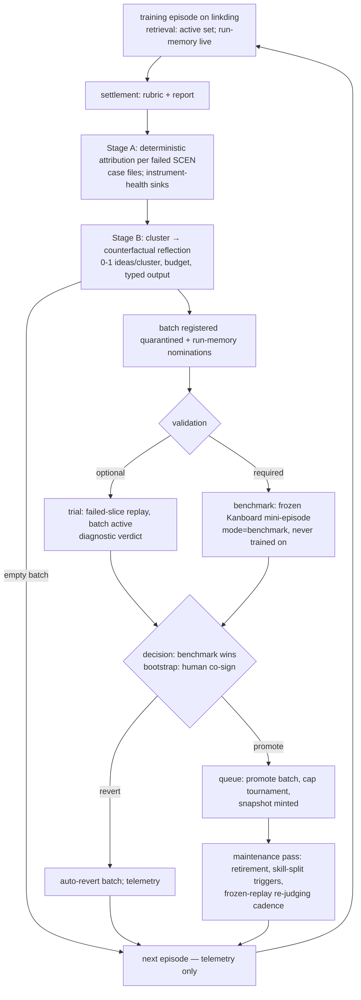

# feat: Agent Families Phase 3a — Close the Learning Loop

## Summary

Make the system learn from its own episodes: specialists finally read the library (retrieval into prompts), run-scoped working memory gives increments within-episode learning, the automated reflector (Stage A deterministic attribution + Stage B counterfactual reflection) replaces the human, and the full lifecycle closes — quarantined batches validated against a held-out Kanboard micro-benchmark, promoted or auto-reverted through the queue, with fitness reads, ratchet governance, and skill splitting activating. Done means one fixture-driven learning cycle runs end-to-end (episode → reflect → validate → promote → next episode retrieves the new insights), and a live cycle is documented. Plan 5 owns scale: benchmark suite/epochs, rehearsal + one-shot metric, improvement tier, agent splitting, parallel episodes, enforcement modes.

## Problem Frame

Plans 0–3 built a library nothing reads, a pipeline that doesn't learn, and a grader whose findings a human converts to ideas. This plan wires the loop: retrieval makes the library consequential, the reflector makes grading consequential, and validation makes the reflector accountable. The flow analysis surfaced the structural prerequisites — a run-mode taxonomy (`training | trial | benchmark`), an epoch column, an append-only fitness-event log — and one scheduling decision that dwarfs the rest: the held-out micro-benchmark requires a second target, so **Kanboard onboards here**, not in Plan 5.

---

## Requirements

**Schema spine**

- R1. Migration (Phase 1 U1 pattern): run/episode `mode` enum (`training | trial | benchmark`) gating quarantine visibility, fitness exclusion, and SPC eligibility; nullable `epoch` column on episodes (Plan 5 populates); an append-only **fitness-event log** keyed (insight, episode, run-mode, event kind) — fitness state at any snapshot is reconstructible, no snapshot minting on fitness writes; episode-scoped `workflows` table (run memory); batch-validation records (batch ↔ trial/benchmark episode refs ↔ verdict); agent-lineage seam columns (Plan 5's agent split lands on them).

**Retrieval into pipeline prompts**

- R2. Per-family retrieval query: planner = concatenated increment-request MSGs + Q&A transcript; worker = ticket text + ACs; verifier = ACs + latest typed-failure records. Queries embed with `search_query:`; skills rank by max member-insight cosine. **Scope = the family's whole active pool with an own-skills prior** (not the agent's partition alone — ownership ≠ reachability, DESIGN §4 "What an agent is"): the working agent's own active skills are weighted up and claim most of the budget; siblings' insights enter only as a relevance-gated fallback for the remainder (the boundary-ticket case, e.g. an API contract needing both backend and frontend insights). In Phase 3a there is one generic agent per family, so own-pool = family-pool and this is a no-op seam; the prior/fallback split takes effect once agents split (Plan 5). The own-skills budget share is a config dial (start high — specialists stay sharp).
- R3. Injection budget per session (~4k tokens, config): fill in rank order, drop whole skills (never truncate mid-skill), **log every drop** (truncation events are future split telemetry).
- R4. Quarantined insights are retrievable only in `mode=trial` runs for their batch (the visibility-matrix exception is mode-keyed, not ambient).

**Run-scoped working memory**

- R5. Induction: one single-shot structured call (judge seam, cheap tier per §15) fired on verifier-pass, producing a typed workflow row (episode-scoped; dies at settlement); counted against the increment cost ceiling.
- R6. Injection: workflows enter later workers' ledgers under R3's budget, **ranked above library skills** (fresher). Nomination: at settlement the reflector nominates only workflows whose source tickets are UAT-accepted AND unimplicated in any failed SCEN chain; survivors submit through `add_idea` (normal gauntlet, batch-tagged). Nomination and submission are this plan's reflector responsibility end-to-end — Plan 5 adds no success-channel work.

**Reflector Stage A (deterministic)**

- R7. The §12.2 decision procedure runs per failed SCEN over the traceability store, reusing `af trace chain` as its join; step 7's discriminator re-executes stored CHK repro envelopes and runs the coverage-instrumented scenario to locate breaking tickets via `SPAN.files_touched` + increment tags. **The coverage substrate is a deliverable of this plan**: the stack template gains an instrumented mode (vite-plugin-istanbul or Playwright's V8 coverage API browser-side, c8 on the Hono server) with a merge step yielding per-scenario source-mapped file lists — no earlier plan built this.
- R8. Micro-judgments: elicitability via the probe-question taxonomy table (LLM fires only for out-of-taxonomy FEATs); answer-contradiction is a lookup of Phase 2's stored checker verdicts.
- R9. Attribution output `{primary, contributing[]}`. **Explorer/grader attributions have no library family** (Phase 0 seeds four): they become instrument-health records in the Phase 2 review queue, not ideas; branch-1 ties (elicitable vs explorer-prompt) resolve to PLANNER(elicitation) when the FEAT's probe category was unprobed, else instrument-health. Stage A emits the case file (implicated rows + evidence refs) for Stage B. **The Plan 3 UAT-divergence class resolves here:** UAT-accepted-but-scenario-failed items classify by whether the failing behavior had a delivered AC — covered-and-verified → the step-7 discriminator path (AC-quality / verifier); outside the delivered ACs → PLANNER (AC coverage); visibly broken within the explorer's own UAT briefing scope → explorer-acceptance, sinking to instrument-health.

**Reflector Stage B (LLM)**

- R10. Clustering first: failed items grouped by (ticket | FEAT | failure-signature hash); one fresh-context reflection per cluster, seeded with the case file and armed with trace-query tools; the counterfactual prompt; 0–1 ideas per cluster with explicit no-lesson permission.
- R11. Per-episode idea budget (~5–8, config); when clusters exceed it, rank: must-tier failures first, then cluster size, then confidence. An **empty batch is a legal episode outcome** (settle, no validation cycle, telemetry row).
- R12. Typed output validation: `counterfactual_insight` must pass the structural schema; `implicated_existing_insights` must reference insights active at the episode snapshot (same-batch quarantined refs are a validator error in training episodes; legal in trials, where they feed the batch verdict only); `scope_tag_proposal` flows to the registration judge as designed.
- R13. `attribution_override` wins over Stage A for the idea's own attribution and causal blame when `confidence ≥` threshold (config); both records persist; override rate per link type is contract-tightening telemetry (§12.3).

**Validation and promotion lifecycle**

- R14. **The micro-benchmark is a Kanboard mini-episode**: a frozen 12–20 must-tier scenario slice, fixed frontier, fixed seed, `mode=benchmark`, never used for training. (Same-target linkding slices were rejected: non-regression on the training target measures memorization, not generalization.)
- R15. Validation per batch: *(a) optional* failed-slice replay — `mode=trial` run per failing increment, worktree branched from that increment's base commit in the retained episode workspace, retrieval = active set + the batch under trial, pass = the originating SCENs pass when re-executed via the scenario harness (verifier-pass alone is too weak — the AC may be the bug), budgeted by a per-batch validation cost ceiling, skippable when quota-tight, **diagnostic only**; *(b) required* — the micro-benchmark must not regress. **Benchmark wins all conflicts**: replay-pass + benchmark-regress = revert; replay-fail + benchmark-pass = promote with a `replay_miss` telemetry flag.
- R16. Bootstrap rule (until ≥10 benchmark points AND the ≥20-pair frozen replay set is measured): revert on score drop > max(2× measured **benchmark-instrument σ**, 5pp on must-tier); a human co-signs every promote/revert during bootstrap. Benchmark-instrument σ is measured empirically from **replicate benchmark episodes at an unchanged snapshot** (replicates count toward the ≥10 points) — a benchmark run is a full mini-episode with live agent sessions, so its variance is grader noise *plus* build nondeterminism; the grader-replay σ is a documented lower bound only, and judge σ for the Kanboard slice comes from re-judging that slice's own stored judge inputs, not the linkding frozen set. After bootstrap, SPC control limits (individuals chart over benchmark scores, σ from the replicate distribution) decide — act on special-cause only. Model-version or prompt-set changes (stamped on every episode per the §17 instrument-event rule) annotate the chart and recompute limits; scores spanning an instrument change are never compared directly.
- R17. Promote/auto-revert through the single-writer queue (Phase 0 mechanics); default deny; batch keyed (episode, snapshot); N=1 batches in this plan — the parallel batch-merge machinery is schema-seamed only (per-batch keying + joint-confirmation record), built in Plan 5.
- R18. The frozen-replay re-judging harness ships here (deferred from Plan 3): cadence, drift tolerance, and `instrument_suspect` written as **episode-level flags** propagated to scores and report banners. This plan also **excludes flagged scores from its own SPC computations**; curriculum-level consumption (rotation/epoch decisions) is Plan 5's half of the contract.

**Ratchet and splitting**

- R19. Fitness reads activate. Event semantics: *retrieval* = insight actually rendered into a session prompt (post-budget); *win* = the session's ticket reaches `done` AND is unimplicated in any failed SCEN chain at settlement; *loss* = causal blame only (final attribution's `implicated_existing_insights`); computed once at settlement, written by the orchestrator; `trial`/`benchmark` events land in a separate channel read only by validation.
- R20. Cap tournament on promote: admission past the active cap (~50/agent) displaces the weakest incumbent by fitness; ties favor incumbents; displaced insights go dormant. Outcome-driven retirement per §4 runs in the maintenance pass.
- R21. **Skill split only** (agent split is Plan 5 — no router exists and routing replay has zero historical decisions; it gates on a `min_routing_decisions` threshold only Plan 5's volume can produce). Skill split per §6: trigger evaluated in a post-promotion maintenance pass through the queue, skipped while any batch is mid-validation; quarantined members follow the nearest child centroid; delta-compile and export caches invalidate per Phase 0 semantics.

**Second target**

- R22. Kanboard onboards via the target-generic Phase 2 harness: compose pin by digest, seeding, registry pre-research, frontier — scoped to what the micro-benchmark slice needs first, full registry allowed to grow later; the frozen slice and its hand-verified verdicts are this unit's deliverable.

---

## Key Technical Decisions

- **Run-mode taxonomy is the spine.** `training | trial | benchmark` gates quarantine visibility, fitness writes, and SPC eligibility in one column — without it, trial contamination silently poisons the ratchet's signal. (Flow Q-set)
- **Kanboard is the micro-benchmark, onboarded now.** §5's required validation check is unimplementable without a held-out target; same-target slices measure memorization. The scheduling cost is real and accepted. (Q1)
- **Retrieval contract pinned per family** (queries, prefix, max-member-cosine ranking, whole-skill drops, drop logging). Three families inventing three answers was the alternative. (Q2)
- **Fitness = rendered, won-if-done-and-unimplicated, lost-only-on-causal-blame, written once at settlement** via an append-only event log with no snapshot minting. Co-occurrence punishes bystanders; causal blame doesn't. (Q3)
- **Failed-slice replay = trial-mode worktree from the increment's base commit** (Phase 1 built the tags; §5's "fresh workspace" wording yields to the cheaper machinery), pass = source SCENs pass, diagnostic only. (Q4)
- **Agent split deferred** — building a router + split validation against zero routing decisions produces unvalidatable artifacts. Lineage schema lands as the seam. (Q5)
- **Benchmark-wins conflict rule + explicit bootstrap gate with human co-sign.** The first ~10 batches are otherwise governed by nothing. (Q6)
- **Explorer/grader attribution sink = instrument-health records**, not a hasty fifth family; seeding an explorer family waits for Plan 5 evidence that its ideas have volume. (Q7)
- **Run-memory induction is a budgeted single-shot call with a settlement-standing nomination filter** — a UAT-accepted ticket later implicated by a failed scenario must not seed the success channel. (Q8)
- **Stage B is stingy by construction**: cluster-first, 0–1 per cluster, no-lesson permission, episode budget, ranked overflow — every quantitative memory-curation result says selectivity is where value comes from.
- **Increment-base refs are minted explicitly.** Phase 1 tags *ticket* starts; nothing mints an increment-base ref. The episode orchestrator (Phase 2 U6 contract, amended here) tags `increment-base` at each increment start; trial replay (R15a) and Plan 5's rehearsal both branch from that ref — one contract, two consumers.
- **Post-settlement re-execution owns its environment.** The clone dev server's Phase 2 lifetime ends at settlement; Stage A's repro/coverage re-execution and trial replay each perform their own bring-up — clone server restarted against the retained workspace (Stage A) or built from the trial worktree (replay), target reset-to-seed before any scenario re-execution, clone DB state per the scenario's self-contained-setup rule.

---

## High-Level Technical Design

### The closed loop

### Module additions

`library/retrieval.py` (queries, ranking, budget, injection), `pipeline/runmemory.py` (induction, ledger injection, nomination), `reflector/` subpackage: `stage_a.py` (attribution engine), `stage_b.py` (clustering, reflection, output validation, batch formation), `validate.py` (trial replay, benchmark episodes, decision rule, bootstrap), `maintenance.py` (fitness settlement writes, ratchet, skill split, replay cadence). Kanboard artifacts under `agent-families/targets/kanboard/`.

---

## Implementation Units

### U1. Schema spine migration

- **Goal:** Run modes, epoch, fitness-event log, workflows, validation records, lineage seam.
- **Requirements:** R1
- **Dependencies:** Phase 2 U1
- **Files:** `agent-families/src/agent_families/store.py`, `agent-families/tests/test_store.py`
- **Test scenarios:** mode enum rejects unknowns; fitness events append-only and reconstructible per (insight, snapshot); trial-mode events excluded from a training-mode fitness query; workflows rows die with episode settlement (cascade or status); batch-validation record round-trip; epoch nullable.
- **Verification:** Phases 0–2 suites green post-migration.

### U2. Retrieval into prompts

- **Goal:** The library becomes consequential.
- **Requirements:** R2, R3, R4
- **Dependencies:** U1; Phase 0 U3 (embedding), Phase 1 U3 (sessions)
- **Files:** `agent-families/src/agent_families/library/retrieval.py`, `agent-families/tests/test_retrieval.py`; touches `pipeline/{planning.py,ticket_loop.py}` (prompt assembly points)
- **Approach:** Query construction per R2; rank skills by max member-insight cosine over the agent's active set (trial mode: + batch members); render via Phase 0's renderer; budget fill with whole-skill drops, every drop logged with rank and size.
- **Test scenarios:** each family's query assembles from the specified artifacts (fixture-checked); ranking honors max-member cosine (planted near-duplicate insight dominates); budget overflow drops lowest-ranked whole skill and logs it; quarantined insight invisible in training mode, visible in its batch's trial mode; injected prompt section is byte-stable for fixed inputs.
- **Verification:** a planted high-relevance skill demonstrably appears in a fake session's prompt; drop log populated under a tight budget.

### U3. Run-scoped working memory

- **Goal:** Within-episode learning with a clean nomination path.
- **Requirements:** R5, R6
- **Dependencies:** U1, U2; Phase 1 U6
- **Files:** `agent-families/src/agent_families/pipeline/runmemory.py`, `agent-families/tests/test_runmemory.py`
- **Test scenarios:** induction fires on verifier-pass only (fixture); workflow row injected into a later ticket's ledger above library skills under one budget; cost counted against increment ceiling; settlement kills the table; nomination excludes a workflow whose source ticket is implicated in a failed SCEN (the Phase 2 UAT-divergence tag finally consumed); survivor submits through add_idea with batch tag.
- **Verification:** two-ticket fake increment shows ticket 2's prompt containing ticket 1's workflow.

### U4. Kanboard onboarding + frozen micro-benchmark

- **Goal:** The held-out instrument exists.
- **Requirements:** R14, R22
- **Dependencies:** Phase 2 U2/U3/U4 (target-generic harness)
- **Files:** `agent-families/targets/kanboard/{docker-compose.yml,seed_manifest.json}`, `agent-families/src/agent_families/grading/benchmark.py`, `agent-families/tests/test_benchmark.py`
- **Approach:** Kanboard pinned by digest (PHP/SQLite, official image), seeded via its API/CLI; registry pre-research scoped to the benchmark slice's feature areas; the frozen slice = 12–20 must-tier scenarios, fixed frontier and seed, hand-verified verdicts persisted (frozen-replay pattern); `mode=benchmark` episode runner = fixed-frontier mini-episode that never registers ideas and writes fitness to the excluded channel.
- **Test scenarios (docker-required where live):** Kanboard boots/seeds/resets; slice scenarios execute on the target with cached resolutions; benchmark episode produces a score keyed (target, epoch, snapshot, mode); ideas/fitness provably not written from benchmark mode; slice immutability guarded (hash of manifest set).
- **Verification:** replicate benchmark episodes at an unchanged snapshot quantify benchmark-instrument σ (expect it well above grader-replay σ — build nondeterminism dominates); the replicate distribution is the bootstrap deliverable R16 consumes.

### U5. Reflector Stage A

- **Goal:** Deterministic attribution with honest sinks.
- **Requirements:** R7, R8, R9
- **Dependencies:** U1; Phase 2 U9 (`af trace chain`)
- **Files:** `agent-families/src/agent_families/reflector/stage_a.py`, `agent-families/tests/test_stage_a.py`
- **Approach:** Procedure steps 1–8 as queries over the chain join; step 7 re-executes CHK repro envelopes (workspace retained per Phase 1 R18) and runs the coverage-instrumented scenario for breaking-ticket location — this unit delivers the coverage substrate (template instrumented mode: vite-plugin-istanbul/V8 + c8, merge to per-scenario file lists) and owns its environment bring-up (clone server restart, target reset) per the KTD; probe-taxonomy table seeded from the Phase 2 registry clusters; explorer/grader sinks to instrument-health; case-file assembly.
- **Test scenarios:** one fixture per branch outcome (communicated-no → elicitable vs not; extracted-no; covered-no; specified-no; implemented-no; verified-no; discriminate both arms — repro-still-passes → AC-quality, repro-now-fails → breaking ticket located by planted coverage trace; answer-contradiction lookup); contributing[] populated on multi-cause fixture; instrument-health record written instead of an explorer idea.
- **Verification:** every §12.2 step has a 1:1 fixture test; the worked example from DESIGN §12.4 reproduces.

### U6. Reflector Stage B and batch formation

- **Goal:** Stingy, validated, counterfactual reflection.
- **Requirements:** R10–R13
- **Dependencies:** U5; Phase 0 U4 (judge seam), Phase 1 U3 (sessions with trace tools)
- **Files:** `agent-families/src/agent_families/reflector/stage_b.py`, `agent-families/tests/test_stage_b.py`
- **Approach:** Cluster by (ticket | FEAT | failure-signature); reflection sessions get the case file + read-only trace-query tools; counterfactual prompt with no-lesson permission; output validator (structural schema, active-at-snapshot implicated refs, override confidence gate); budget ranking (must-tier, cluster size, confidence); batch formation + run-memory nominations; registration through Phase 0 `add_idea` with episode/scenario provenance.
- **Test scenarios (fixture-driven):** clustering merges six same-cause SCEN failures into one cluster; no-lesson output produces no insight and a telemetry row; over-budget ranking drops the right clusters; validator rejects same-batch implicated ref in training mode and free-prose insights; override below confidence threshold recorded but not applied; empty batch settles legally; batch lands quarantined with full provenance.
- **Verification:** idea-per-cluster ≤1 enforced; a full fixture episode yields a batch whose every insight passes registration.

### U7. Validation and promotion

- **Goal:** Quarantine → trial/benchmark → promote or auto-revert, with bootstrap discipline.
- **Requirements:** R15–R18
- **Dependencies:** U1, U2, U4; Phase 2 U8 (frozen set)
- **Files:** `agent-families/src/agent_families/reflector/validate.py`, `agent-families/tests/test_validate.py`
- **Approach:** Trial replay per R15(a) (worktree from the minted increment-base ref, batch-active retrieval, environment bring-up per the KTD — trial build served, target reset — SCEN re-execution as pass criterion, cost ceiling, skippable); benchmark gate per R15(b); decision rule (benchmark wins; `replay_miss` telemetry); bootstrap rule + human co-sign prompt; post-bootstrap SPC (individuals chart, σ from frozen replay); promote/revert through queue; frozen-replay re-judging harness (cadence, tolerance, `instrument_suspect` propagation).
- **Test scenarios:** replay-pass + benchmark-regress reverts; replay-fail + benchmark-pass promotes with flag; bootstrap threshold math (2σ vs 5pp max); co-sign required during bootstrap and not after; SPC limits computed from ≥10 points flag only special-cause; reverted batch leaves no active insights and its validation record explains why; `instrument_suspect` propagates to scores since last clean replay.
- **Verification:** the full decision table (replay × benchmark × bootstrap) has a 1:1 test.

### U8. Ratchet and skill split

- **Goal:** Fitness-driven governance and the first self-reorganization.
- **Requirements:** R19–R21
- **Dependencies:** U1, U7; Phase 0 U2/U6 (store, lifecycle)
- **Files:** `agent-families/src/agent_families/reflector/maintenance.py`, `agent-families/tests/test_maintenance.py`
- **Approach:** Settlement fitness writes per R19; maintenance pass (post-promotion, queue-serialized, skipped mid-validation): retirement of persistent losers, cap tournament on admissions, skill-split trigger → k-means k=2 + silhouette accept → LLM thematic fallback → names/descriptions regenerated → caches invalidated; quarantined members to nearest child centroid; agent-split left as a gated stub on `min_routing_decisions`.
- **Test scenarios:** rendered-but-failed insight gets no loss without causal blame; win requires done + unimplicated; tournament displaces weakest, ties favor incumbents, displaced go dormant; retirement respects the event-log reconstruction; split on a 30-insight fixture skill produces two children with provenance-correct membership incl. quarantined follow-the-centroid; split deferred while a batch is mid-validation; benchmark/trial fitness channels never feed the ratchet.
- **Verification:** property test — any maintenance sequence preserves: insights never deleted, vec rows untouched, every membership change snapshot-keyed.

### U9. Learning-cycle e2e

- **Goal:** The closed loop, proven on fixtures and documented live.
- **Requirements:** end-to-end over R1–R22
- **Dependencies:** U1–U8
- **Files:** `agent-families/tests/test_e2e_learning.py`, `agent-families/README.md`
- **Approach:** Fixture cycle: fake episode with planted failures → Stage A/B produce a deterministic batch → trial + benchmark fixtures decide promote → next fake episode's retrieval provably includes the promoted insight → maintenance pass runs. Live procedure documented: one linkding episode → reflect → Kanboard benchmark → human co-sign → promote, with observed costs.
- **Test scenarios:** the promoted insight appears in the follow-up episode's planner prompt (the loop is closed); revert path leaves the follow-up episode's prompts unchanged; full provenance chain queryable from insight back to the SCEN that taught it; cost accounting covers reflection + validation as separate line items.
- **Verification:** offline e2e green; live cycle documented with costs before Plan 5 begins.

---

## Scope Boundaries

**Deferred to Plan 5:** benchmark *suite* + epochs/rotation/transfer probes; rehearsal pass + one-shot metric; improvement-tier grading; **agent split + family router** (gated on `min_routing_decisions`); parallel episodes + batch-merge execution (schema seam only here); tripwire kill-mode and suspect-verdict *enforcement* (this plan's episodes keep the Phase 1 shadow-mode tripwire logging running throughout — the threshold-setting dataset keeps growing); explorer-family seeding (instrument-health records accumulate the evidence); persona rotation, budget annealing; RealWorld calibration target. **The §11 overfitting detector stays dormant here** — it needs multi-target fitness data that only Plan 5's pool rotation produces; until then, single-target overfitting is detected only by the Kanboard benchmark.

**Non-goals:** no API-key usage; no LangGraph migration; sequential only.

---

## Risks & Dependencies

- **Kanboard onboarding cost** is the schedule risk — scoped registry (benchmark slice first) bounds it; if it overruns, the documented fallback is a linkding held-out-FEAT slice (weaker: memorization-not-generalization, accepted only as a stopgap).
- **Validation quota burn is new spend** (trial + benchmark per batch + induction calls) atop episodes — all metered via Phase 1's cost fields; the per-batch validation ceiling and skippable replay are the relief valves; re-validate against the post-June-15 Agent SDK credit before implementation.
- **Reflector quality is unproven by construction** — Phase 2's manual-reflection records are the calibration corpus; Stage B's first batches run with human co-sign already mandated by the bootstrap rule.
- **Grader σ depends on Phase 2's ≥20-pair frozen set** (now an explicit Phase 2 exit criterion).
- Cross-plan contract drift (four unimplemented plans deep) — each plan's schema migration remains the integration checkpoint.

---

## Sources & Research

- DESIGN.md §4–§6 (ratchet, lifecycle, splitting), §11 (training loop, replay policy), §12 (reflector spec — implemented here as written), §13 (two-tier memory, retrieval), §15 (batch policy, tiers), §17 (bootstrap/threshold discipline)
- Plans 0–3: consumed contracts (store/judge/sessions/episodes/scenario harness/`af trace chain`/frozen set)
- Flow analysis (this session): 13 critical gaps + 6 deferrals + 8 resolved questions, mapped into R1–R22 and KTDs; cross-plan drift fixes applied to Plan 3 (deferral pointers, frozen-set N)
- Research base (this session): GEPA/ACE/Library-Drift/TextGrad/Huang/MAST findings underpin the stinginess, quarantine-default-deny, and benchmark-wins decisions
