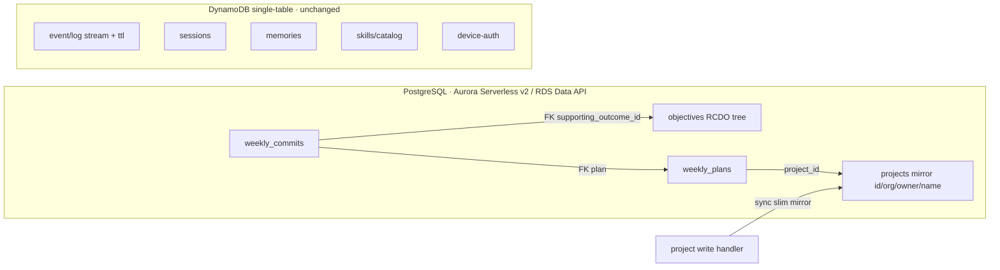
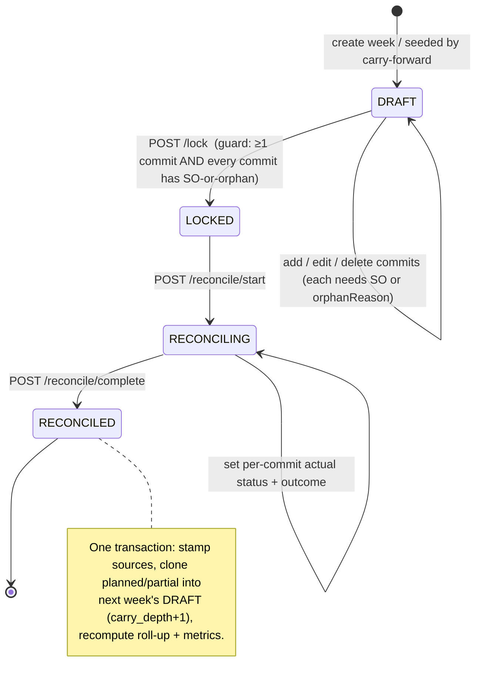

# feat: Weekly Commit Lifecycle — itemized commits, full state machine, Postgres strategic-execution domain, derived chess layer, concentration metrics, manager brief

**Origin:** `docs/inspiration/st6_prd.md` (ST6 "Weekly Commit Module" PRD) — adapted to this repo's stack.
**Companion ideation:** `docs/ideation/2026-06-10-weekly-chess-layer-and-alignment-metric.md` (the chess-layer + metric bundle this plan adopts).
**Status:** Plan (not yet implemented).
**Depth:** Deep (cross-cutting: new Postgres datastore, objectives migration, shared schema, REST, roll-up, React UI, agent skill, infra).

---

## Summary

Replace the current two-state weekly **prose blob** (`WeeklyUpdate`) with the PRD's structured weekly commit lifecycle, and in the process move the **strategic-execution domain to PostgreSQL** (the operational/log/session domain stays on DynamoDB):

- **Itemized weekly commits**, each carrying **either** a hard-linked Supporting Outcome (SO) **or** a typed `orphanReason` — enforced at lock.
- A **derived "chess layer"**: `category` and a **WSJF-from-the-tree** `priority` are *computed* from the plan unit + the linked SO's RCDO position, not hand-tagged.
- A **full lifecycle state machine**: `DRAFT → LOCKED → RECONCILING → RECONCILED`, with **carry-forward** (with provenance + `carryDepth`) of incomplete items into next week's `DRAFT`.
- **Planned-vs-actual reconciliation** per commit.
- A rewired **objective roll-up** whose **single source of truth is reconciled weekly commits** (the GitHub `progressPct` feed is removed).
- A deleted conformity score, **replaced by three un-gameable signals**: a **Strategic Concentration Index** (Herfindahl/entropy over RCDO nodes, vs. a declared focus/explore posture), **strategic starvation** (which SOs got zero), and **carry-aging**.
- A real **`managerUserId` manager↔report model** feeding an **agent-authored exception/divergence brief** (not a grid).
- Both entry paths preserved (**agent + UI**): a **plan-anchored** `/hq-weekly-update` proposes commits from `docs/plans/` U-IDs and reconciles from git; a React editor lets humans ratify/edit/reconcile. Reconciliation **calibration** feeds back into the agent's next proposal.

The PRD's Spring Boot/Java stack is out of scope, but its **PostgreSQL 16.4 + Flyway-style migrations** are honored: Postgres via Aurora Serverless v2 + the RDS Data API, with a typed TS query layer (Drizzle/Kysely) standing in for Flyway.

---

## Problem Frame

Today (`packages/backend/src/rest/weekly.ts`, `packages/shared/src/dto.ts:770`):

- A `WeeklyUpdate` is `{ projectId, isoWeek, done, plan, conformityScore?, validated }` — two prose strings + a boolean. Lifecycle is two states. No itemization, no per-commit SO link, no reconciliation, no carry-forward.
- The roll-up (`packages/backend/src/projections/rollup.ts`) derives SO % from project `progressPct` (GitHub `PROGRESS.md`); the weekly report feeds nothing.
- Objectives, weekly, sessions, the event/log stream, memories, skills, and device-auth all share one DynamoDB single table (`infra/lib/api-stack.ts`). Objectives are queryable only org-wide (`listObjectives`), projects only by owner (`listProjectsForUser`, GSI1 `USER#`). There is no org-scoped project query and no manager/team concept.

The PRD wants every weekly commitment to map to a Supporting Outcome through a complete lifecycle (commit → prioritize → reconcile → manager review), giving real-time strategic-alignment visibility. That domain is **relational** — enforced links are foreign keys, the roll-up is a join, the metrics are aggregates — so it moves to Postgres; the append-heavy, key-addressed log stream stays on Dynamo.

### Scope decisions (confirmed with user)

1. **Datastore split:** the strategic-execution domain (objectives + weekly) moves to **PostgreSQL**; the operational/log/session domain stays on **DynamoDB**. PRD's Java is ignored; its Postgres + migrations are honored.
2. **SO linkage:** **hard-enforced** at lock — a commit must carry an SO **or** a typed `orphanReason`; "neither" is rejected (KTD9/KTD10).
3. **Scope:** 100% of the PRD lifecycle — itemized commits, derived chess layer, full state machine, reconciliation, carry-forward, and a manager brief with team roll-up. Phased.
4. **Entry model:** both agent + UI (agent-native parity preserved); the agent path is **plan-anchored**.
5. **Single source of truth:** objective roll-up derives **only** from reconciled weekly commits; the GitHub `progressPct` feed is removed.
6. **Metrics:** the "ladders-up" conformity score is deleted and replaced by concentration + starvation + carry-aging (KTD8).

### Non-goals

- No Spring Boot / Java / Module Federation / Auth0 / Outlook Graph work.
- No change to the operational Dynamo domain except the event-stream TTL (U20) and removing the `progressPct→rollup` consumer.
- No weighted 1:N SO fan-out (T1 resolved to primary + informational secondaries; true fan-out deferred — KTD9).
- No full org-chart role system; the manager model is a single `managerUserId` edge (KTD6).

---

## Requirements & Traceability

| R-ID | Requirement (from PRD) | Units |
| --- | --- | --- |
| R1 | Weekly commit CRUD with RCDO hierarchy linking (enforced SO link or orphan) | U1, U2, U3 |
| R2 | Chess layer for categorization and prioritization (now **derived**) | U1, U6, U10 |
| R3 | Full lifecycle state machine DRAFT → LOCKED → RECONCILING → RECONCILED → Carry Forward | U1, U4, U5 |
| R4 | Reconciliation view comparing planned vs. actual | U4, U11 |
| R5 | Carry-forward of incomplete items to next week | U5 |
| R6 | Strategic alignment visibility — reconciled commits are the single roll-up source | U6, U16, U17 |
| R7 | Org-structured listing (now a Postgres `WHERE org = ?`) | U2, U16 |
| R8 | Manager dashboard with team roll-up (reports-scoped exception brief) | U8, U12, U18 |
| R9 | Agent + UI entry parity (plan-anchored agent) | U9, U10, U11, U13, U19 |
| R10 | Pagination for team views (PRD: up to 2000 records) | U8, U12 |
| R11 | Migration of legacy prose weekly records + objectives to Postgres | U14, U16 |
| R12 | Alignment/health metrics (concentration, starvation, carry-aging) | U17, U8, U12 |

---

## Key Technical Decisions

### KTD7 — Persistence split: Postgres for the strategic-execution domain, DynamoDB for the operational domain
The enforced SO link is a foreign key, the roll-up is a commit↔objective join, the manager roll-up and PRD metrics are `GROUP BY` aggregates, and `reconcile/complete` wants a transaction (stamp N source commits + insert N clones atomically). All of that is native in Postgres and awkward in Dynamo (fan-out reads, app-level integrity, no aggregation). So **objectives, `weekly_plans`, `weekly_commits`, and a slim `projects` mirror** move to Postgres. The **event/log stream, sessions, memories, skills/catalog, and device-auth stay on DynamoDB** — append-heavy, key-addressed, single-partition reads where Dynamo wins. Objectives move too (not just weekly) because they are the FK target of the SO link and a join partner in the roll-up. **Datastore: Neon serverless Postgres** (free tier, scales to zero — preserves the stack's zero-idle-cost ethos that Aurora would break) via its **HTTP driver** (`@neondatabase/serverless` / Drizzle `neon-http`), so the Lambdas need **no VPC wiring** (the property that originally made the RDS Data API attractive, without the standing cost). The Neon connection string lives in Secrets Manager and is injected as a Lambda env var (mirroring the device-token-secret pattern at `api-stack.ts:95`) — no Aurora cluster, no VPC, no Data API. **Query layer: Drizzle** (schema + migrations in one typed place — the Flyway stand-in). **Tests:** `pglite` (in-process WASM Postgres) so the repo layer runs in vitest with no live database; dev can use a local Docker Postgres or a Neon dev branch. The `projects` mirror (id, org, owner, name) is synced on project write so manager joins never reach back into Dynamo.

### KTD1 — Two relations: `weekly_plans` (the week) + `weekly_commits` (the items)
`weekly_plans` is keyed `(project_id, iso_week)` and carries lifecycle `status`, transition timestamps, and the declared concentration `posture`. `weekly_commits` has a surrogate `id`, an FK to its plan, an FK to its Supporting Outcome (`supporting_outcome_id` — nullable only when `orphan_reason` is set, enforced by a CHECK), the derived `category`/`priority`, the reconciliation `status` + `actual_outcome`, and carry provenance (`carried_from_week`, `carried_to_week`, `carry_depth`). Replaces the Dynamo overloaded-SK design entirely.

### KTD2 — Lifecycle on the plan; transitions are explicit endpoints with server-enforced legality
`status ∈ { DRAFT, LOCKED, RECONCILING, RECONCILED }`. Each transition is its own `POST` (`/lock`, `/reconcile/start`, `/reconcile/complete`); a pure `canTransition(from, to)` is the single source of truth (illegal → `409`). "Carry Forward" is the **output action** of `/reconcile/complete`, not a fifth persistent state. The old `validated` boolean and `POST /publish` are removed (LOCK is the new "publish").

### KTD3 — Carry-forward seeds the next week's DRAFT, with provenance and depth
On `/reconcile/complete`, every commit whose reconciled `status ∈ { planned, partial }` is cloned into the next ISO week's `DRAFT` plan (created if absent), with `carried_from_week` set, `carried_to_week` set on the source, and `carry_depth = source.carry_depth + 1`. `carry_depth ≥ 3` raises a "decompose or kill" nudge (not a block). The whole step runs in one Postgres transaction.

### KTD4 — The chess layer is DERIVED, not hand-tagged *(rewritten)*
`category` and `priority` are computed, not entered:
- **`category`** is a read-through projection of the plan implementation-unit (its phase/section/intent) + the linked SO's RCDO position. Vocabulary is shared with the orphan reasons (KTD10): `KTLO | Incident | Exploration | ExternalAsk | Delivery | Strategic` (the exact set finalized in U1). The agent proposes it; a human may override, and an override that contradicts the derived value is **flagged**, not silently accepted.
- **`priority`** is **WSJF-from-the-tree**: Cost of Delay is inherited from the commit's RCDO position (its branch's weight × how far behind that branch is, from the roll-up), and Job Size is the plan unit's estimate. The commit list self-sorts by this derived leverage; manual drag is a flagged override. This removes the prior design's redundant `priority` enum **and** free `order` integer (double-bookkeeping that drifts).
- **Optional (not core):** give "chess" real semantics via *tempo/initiative* (does the commit unblock downstream U-IDs on the critical path?) and a *sacrifice / slip / zugzwang* distinction on the carry chain (deliberate deprioritization vs. unplanned spillover vs. "the plan line is spent"). Scoped as a refinement in U17, not required for the core.

### KTD5 — Roll-up's single source of truth is reconciled weekly commits *(rewritten)*
`leafPct(soId)` derives **only** from that SO's reconciled commits: `done = 1.0`, `partial = 0.5`, `planned/dropped = 0.0`, mean over the SO's commits in the latest reconciled window. The GitHub `progressPct` feed is **removed** — no fallback. Consequence (intended): an SO with no reconciled weekly data reads **0%** until its first reconciliation. Internal-node roll-up (mean of children) is unchanged. Orphan commits and `alsoAdvances` secondaries contribute **nothing** to leaf credit (KTD9/KTD10).

### KTD6 — Real manager↔report model; the view is an exception brief *(rewritten)*
Replace the `isAdmin`-as-manager shortcut with a `managerUserId` field on `userProfileSchema` (`dto.ts:203`, alongside the existing `admin`/`adminOrgs`). A manager's team = users whose `managerUserId` is them. The manager view is **reports-scoped** (not all-org-admin) and is an **agent-authored exception/divergence brief**: highest-leverage commit not started, lowest-concentration report, oldest carry, longest-starved SO, anything that failed to lock — defaulting to "nothing needs you." Optional ranking by KL-divergence between a report's effort concentration and the org's active Rally Cries. Pagination still satisfies the 2000-record target (Postgres keyset pagination).

### KTD8 — Conformity deleted; replaced by concentration + starvation + carry-aging *(rewritten)*
Under hard-enforced linkage, "does work ladder up?" is structurally 100% — a dead metric. Delete it. Replace with three distinct, un-gameable signals computed off the single-source roll-up (U17):
- **Strategic Concentration Index** — Herfindahl/entropy over the RCDO nodes a person/team's reconciled commits touch, priority-weighted, foldable IC→team→org. Reported as **divergence from a declared `posture`** (focus vs. explore) so it never punishes legitimate breadth.
- **Strategic starvation/coverage** — which Supporting Outcomes received **zero** commits this window, weighted by how far behind they are.
- **Carry-aging** — `carry_depth` distribution; `≥3` = decompose/kill; optional claims-development run-off view for chronic over-commitment.

### KTD9 — T1 resolved: primary SO link + informational `alsoAdvances` *(new)*
A commit has one **primary** `supporting_outcome_id` that drives **all** roll-up and concentration math, plus an optional **informational** `also_advances: string[]` of secondary SO ids that surface in the leverage/manager view but **never split roll-up credit**. Not strict 1:1, not weighted 1:N. Keeps the headline metrics clean (one point per commit in node-space) while making cross-cutting work legible. True weighted fan-out is deferred.

### KTD10 — T2 resolved: typed orphan lane *(new)*
A commit must carry **either** `supporting_outcome_id` **or** `orphan_reason` (enum: `KTLO | Incident | Exploration | ExternalAsk`); a DB CHECK + the lock guard reject "neither" (enforcement intact — orphan is a *typed non-link*, not a hole). Orphan commits are excluded from roll-up/concentration and surface as a first-class **orphan-ratio** signal; a recurring orphan reason is the trigger to add a new Supporting Outcome. Orphan reasons share vocabulary with the derived `category` (an orphan commit's reason **is** its category — KTD4).

### KTD11 — Event-stream TTL is a backend-only attribute *(new)*
The Dynamo table already enables TTL on the `ttl` attribute (`api-stack.ts:71`, used for device-auth). Set a `ttl` epoch-seconds attribute on the event envelope at `appendEvent` (a configurable retention window) so the append-only log stream self-expires. **No infra change** — the table-level TTL is already on.

---

## High-Level Technical Design

### Persistence boundary



### Lifecycle state machine



### Postgres schema sketch (authoritative shape; exact DDL in U2/U16)

```
objectives(id PK, org, level, title, parent_id FK→objectives, weight, pct_cache)
projects_mirror(id PK, org, owner_user_id, name)            -- synced from Dynamo on project write
weekly_plans(project_id FK→projects_mirror, iso_week, status, posture,
             locked_at, reconciled_at, PRIMARY KEY(project_id, iso_week))
weekly_commits(id PK, project_id, iso_week, FK→weekly_plans,
               supporting_outcome_id FK→objectives NULL,
               orphan_reason NULL, also_advances text[],
               category, priority_numeric, title,
               status, actual_outcome,
               carried_from_week, carried_to_week, carry_depth,
               CHECK (supporting_outcome_id IS NOT NULL OR orphan_reason IS NOT NULL))
```

### What stays in DynamoDB
Sessions, the event/log stream (now with a `ttl` attribute — KTD11), memories, skills/catalog, device-auth — all unchanged. The only Dynamo edits are U20 (event `ttl`) and deleting the `progressPct → rollup` read path (U6/U16).

### File-structure decomposition map

| File | Responsibility | Unit |
| --- | --- | --- |
| `infra/lib/api-stack.ts` | Aurora Serverless v2 cluster, RDS Data API, DB secret, Lambda IAM/env; routes for new endpoints; (no TTL change — already on) | U15, U3, U4, U8 |
| `packages/backend/src/db/pg/client.ts` *(new)* | Data-API-backed query client + migration runner | U15 |
| `packages/backend/src/db/pg/schema.ts` + `migrations/` *(new)* | Drizzle/Kysely schema + SQL migrations for objectives, weekly_plans, weekly_commits, projects_mirror | U2, U16 |
| `packages/backend/src/db/pg/objectivesRepo.ts` *(new)* | objectives reads/writes on Postgres (replaces Dynamo objectives methods) | U16 |
| `packages/backend/src/db/pg/weeklyRepo.ts` *(new)* | weekly plan/commit CRUD, list-week, list-for-org, transition writes | U2 |
| `packages/shared/src/dto.ts` | weekly schemas, status/category/orphan/posture enums, `managerUserId`, WSJF inputs, T1/T2 fields | U1, U18 |
| `packages/backend/src/projections/weeklyLifecycle.ts` *(new)* | pure `canTransition`, carry-forward, WSJF priority, category derivation | U1, U5 |
| `packages/backend/src/rest/objectives.ts` | repoint reads/writes to `objectivesRepo` (Postgres) | U16 |
| `packages/backend/src/rest/weekly.ts` | commit CRUD + week read (Postgres-backed) | U3 |
| `packages/backend/src/rest/weeklyTransitions.ts` *(new)* | lock / reconcile-start / reconcile-complete (transactional) | U4 |
| `packages/backend/src/projections/rollup.ts` + `rollupRepo.ts` | single-source SQL roll-up (progressPct removed) | U6, U16 |
| `packages/backend/src/projections/weeklyMetrics.ts` *(new)* | concentration / starvation / carry-aging SQL | U17 |
| `packages/backend/src/rest/weeklyManager.ts` *(new)* | reports-scoped exception/divergence brief | U8, U18 |
| `packages/backend/src/db/repo.ts` | `appendEvent` sets `ttl`; project write syncs the PG mirror | U20, U2 |
| `packages/web/src/api/baseApi.ts` | RTK Query: commits, transitions, metrics, brief; tags | U9 |
| `packages/web/src/screens/ProjectDetail/ProjectWeekly.tsx` | DRAFT editor (SO-or-orphan picker, derived category/priority, posture, lock) | U10 |
| `packages/web/src/screens/ProjectDetail/WeeklyReconcile.tsx` *(new)* | planned-vs-actual reconciliation | U11 |
| `packages/web/src/screens/Weekly/ManagerBrief.tsx` *(new)* + `router.tsx` | exception/divergence brief + concentration | U12 |
| `catalog/skills/hq-weekly-update/SKILL.md` | plan-anchored proposal + reconcile-from-git + calibration read | U13, U19 |
| `packages/backend/src/projections/calibration.ts` *(new)* | per-person locked-vs-done calibration store + read | U19 |

---

## Phase 0 — Postgres foundation

Stand up the Neon Postgres connection + Drizzle query layer and move objectives onto Postgres before any weekly relation references them. Highest-risk piece; lands first.

**Success Criteria**
- *Automated:* a migration creates the schema in a `pglite` (in-process) Postgres; objectives repo unit tests pass against pglite; the objectives REST suite passes repointed to Postgres; `cdk synth` succeeds with the Neon-connection secret + env wired (no Aurora/VPC resources).
- *Manual (user-side — requires a deploy):* create a Neon project, set its connection string in Secrets Manager; deploy; confirm a Lambda reaches Neon over the HTTP driver (no VPC) and the Objectives screen renders unchanged off Postgres.

*Pause for human confirmation before Phase 1.*

### U15. Neon Postgres connection + Drizzle query layer

- **Goal:** A reachable Postgres with a typed Drizzle client and migration runner, wired into the Lambda stack — no VPC, no cluster.
- **Requirements:** R7 (enabler), R6 (enabler).
- **Dependencies:** none.
- **Files:** `infra/lib/api-stack.ts` (a Secrets-Manager secret `command-hq/neon-database-url` + inject its value as the `DATABASE_URL` Lambda env via the dynamic-reference path used for the device-token secret — no Aurora/VPC resources); `packages/backend/src/db/pg/client.ts` *(new)*; `packages/backend/src/db/pg/migrate.ts` *(new)*; `packages/backend/src/db/pg/migrations/` *(new)*; `packages/backend/package.json` (add `drizzle-orm`, `@neondatabase/serverless`, `pg`; dev `drizzle-kit`, `@electric-sql/pglite`).
- **Approach:** `client.ts` builds a Drizzle instance, selecting the driver by env: the **Neon HTTP driver** (`drizzle-orm/neon-http`) in Lambda from `DATABASE_URL` (HTTP — no VPC/security-group plumbing), and a **pglite** instance in tests (`drizzle-orm/pglite`) so the suite needs no live DB. The secret carries the full Neon connection URL (mirroring the device-token-secret dynamic reference at `api-stack.ts:95`). `migrate.ts` applies the ordered SQL files in `migrations/` (the Flyway stand-in) via `drizzle-kit`-generated SQL; it runs in CI/deploy before handler cutover and is also callable against pglite in tests.
- **Patterns to follow:** the Secrets-Manager dynamic-reference + `commonEnv` injection already in `api-stack.ts:95,122`; the esbuild bundle/`fromAsset` Lambda packaging (ensure the Neon driver bundles).
- **Test scenarios:** *Happy path:* `migrate` against a fresh pglite creates all tables; a `client` insert+select round-trips. *Edge:* re-running `migrate` is idempotent (no-op on an up-to-date schema). *Error:* a malformed migration aborts without partial apply. *Integration:* the same `client` API works over both the pglite and Neon-HTTP drivers (driver-selection is the only difference).
- **Verification:** `cdk synth` succeeds with the Neon secret + `DATABASE_URL` env wired and no Aurora/VPC resources; `migrate` + a round-trip pass against pglite in vitest.

### U16. Migrate objectives (RCDO tree) to Postgres

- **Goal:** Objectives live in Postgres as the FK target; reads/writes + roll-up reads repoint off Dynamo.
- **Requirements:** R6, R7, R11.
- **Dependencies:** U15.
- **Files:** `packages/backend/src/db/pg/schema.ts` (objectives table + `weight`, `pct_cache`); `packages/backend/src/db/pg/objectivesRepo.ts` *(new)*; `packages/backend/src/rest/objectives.ts` (repoint to `objectivesRepo`); `packages/backend/src/projections/rollupRepo.ts` (read objectives from Postgres); a one-shot `packages/backend/src/db/pg/migrateObjectives.ts` *(new)* reading the Dynamo `RCDO#` items and inserting them.
- **Approach:** Define the `objectives` table (id, org, level, title, parent_id self-FK, weight, pct_cache). Port `listObjectives`/`getObjective`/`putObjective`/`deleteObjective` to SQL behind the same REST contract (`objectives.ts` handlers unchanged in shape). `buildTree` can stay (pure) or become a recursive CTE — keep the pure builder for now, feed it SQL rows. The migration is idempotent (upsert by id) and org-scoped.
- **Patterns to follow:** existing `objectives.ts` admin/effective-org scoping; `recomputeRollup` purity (it keeps taking node arrays).
- **Test scenarios:** *Happy path:* seed a tree via `putObjective`, `listObjectives` returns it nested via `buildTree`. *Edge:* a node with no parent is a root; a cycle is still guarded by `recomputeRollup`. *Migration:* a Dynamo-sourced tree imports to Postgres with identical ids/levels; re-running is a no-op. *Integration:* `GET /objectives` returns the same shape it did on Dynamo.
- **Verification:** objectives REST suite green against Postgres; the Objectives screen is visually unchanged.

---

## Phase 1 — Data model & state machine

The weekly relations, the domain schemas (with derived chess fields + T1/T2), and the REST surface for itemized commits + transitions.

**Success Criteria**
- *Automated:* shared typechecks; weekly schema + lifecycle + repo + REST CRUD + transition suites pass; objectives/foundation suites stay green.
- *Manual:* hand-run create week → add commits (SO or orphan) → lock → reconcile against a sandbox Postgres; confirm illegal transitions 409 and the SO-or-orphan CHECK rejects "neither."

*Pause for human confirmation before Phase 2.*

### U1. Weekly domain model: schemas, derived-chess fields, status machine

- **Goal:** Zod schemas + enums for the plan and commit, the WSJF inputs, T1/T2 fields, the declared posture, and a pure `canTransition`.
- **Requirements:** R1, R2, R3.
- **Dependencies:** none (schema-level; persistence is U2).
- **Files:** `packages/shared/src/dto.ts` (replace `weeklyUpdateSchema`; keep a deprecated alias for U14); `packages/backend/src/projections/weeklyLifecycle.ts` *(new)* — `canTransition` + the legal table, plus stubs for `deriveCategory` and `wsjfPriority` (filled in U6); `packages/backend/test/weeklyLifecycle.test.ts` *(new)*.
- **Approach:**
  - `weeklyStatusSchema = z.enum(['DRAFT','LOCKED','RECONCILING','RECONCILED'])`.
  - `commitCategorySchema = z.enum(['KTLO','Incident','Exploration','ExternalAsk','Delivery','Strategic'])` (shared with orphan reasons; the orphan subset is `KTLO|Incident|Exploration|ExternalAsk`).
  - `orphanReasonSchema = z.enum(['KTLO','Incident','Exploration','ExternalAsk'])`.
  - `commitOutcomeStatusSchema = z.enum(['planned','done','partial','dropped'])`.
  - `postureSchema = z.enum(['focus','explore'])`.
  - `weeklyCommitSchema`: `{ id, projectId, isoWeek, title, supportingOutcomeId?, orphanReason?, alsoAdvances: string[] default [], category, priorityNumeric (number), status default 'planned', actualOutcome?, carriedFromWeek?, carriedToWeek?, carryDepth int default 0 }` with a **refinement** enforcing `supportingOutcomeId` XOR-or-at-least-one `orphanReason` (mirrors the DB CHECK). `category`/`priorityNumeric` are present but **derived** server-side (clients don't author them; an override path is U10).
  - `weeklyPlanSchema`: `{ projectId, isoWeek (regex), status default 'DRAFT', posture default 'focus', lockedAt?, reconciledAt? }`.
  - `canTransition`: legal pairs only (`DRAFT→LOCKED`, `LOCKED→RECONCILING`, `RECONCILING→RECONCILED`).
- **Patterns to follow:** existing enum+schema idiom (`OBJECTIVE_LEVELS`/`objectiveNodeSchema` `dto.ts:704`; `DEVICE_AUTH_STATUSES` `dto.ts:785`).
- **Test scenarios:** *Happy path:* a commit with an SO parses; one with only `orphanReason` parses; defaults apply. *Error:* a commit with **neither** SO nor orphan fails the refinement; bad `isoWeek` fails; unknown category fails. *Edge:* `alsoAdvances` omitted → `[]`; `carryDepth` 0 default. *canTransition:* all legal pairs true; `DRAFT→RECONCILED`, `LOCKED→DRAFT`, `RECONCILED→*` false (Covers R3).
- **Verification:** shared typechecks; lifecycle tests green; deprecated `WeeklyUpdate` alias still exported for U14.

### U2. Postgres weekly relations + query layer

- **Goal:** `weekly_plans` + `weekly_commits` tables, the slim `projects` mirror, and the repo methods the REST layer consumes.
- **Requirements:** R1, R7.
- **Dependencies:** U1, U15, U16.
- **Files:** `packages/backend/src/db/pg/schema.ts` (+`weekly_plans`, `weekly_commits`, `projects_mirror`, the SO-or-orphan CHECK, indexes on `(project_id, iso_week)` and `org`); `migrations/` SQL; `packages/backend/src/db/pg/weeklyRepo.ts` *(new)* — `upsertPlan`, `getPlan`, `listPlansForProject`, `createCommit`, `updateCommit`, `deleteCommit`, `listWeekCommits`, `listProjectsForOrg(org, {limit,cursor})`; `packages/backend/src/db/repo.ts` (project write also upserts the PG mirror); `packages/backend/test/weeklyRepo.test.ts` *(new)*.
- **Approach:** Standard relational CRUD. `listProjectsForOrg` is `SELECT … WHERE org = $1 ORDER BY id` with keyset pagination (the GSI2 the prior plan added is unnecessary — KTD7). The mirror upsert is a small write appended to the existing Dynamo project-write path so the two stores agree (id/org/owner/name only).
- **Patterns to follow:** `objectivesRepo` (U16) for the Data-API query shape; the existing project-write handler for the mirror hook.
- **Test scenarios:** *Happy path:* upsert a plan + 3 commits; `listWeekCommits` returns 3. *Edge:* the SO-or-orphan CHECK rejects a commit with neither at the DB layer. *Pagination:* `listProjectsForOrg` honors `limit` + `cursor` round-trip (Covers R10). *Integration:* a project write lands a mirror row visible to `listProjectsForOrg`.
- **Verification:** `weeklyRepo.test.ts` green against sandbox Postgres.

### U3. REST: weekly commit CRUD + week read

- **Goal:** Read a week (plan + commits) and create/update/delete commits during DRAFT.
- **Requirements:** R1, R2, R9.
- **Dependencies:** U1, U2.
- **Files:** `packages/backend/src/rest/weekly.ts` (rewrite: `GET /projects/:pid/weekly`, `GET /projects/:pid/weekly/:week`, `POST …/commits`, `PUT …/commits/:cid`, `DELETE …/commits/:cid`; remove `putWeekly`/`publishWeekly`); `infra/lib/api-stack.ts` (routes); `packages/backend/test/weekly.test.ts` (rewrite).
- **Approach:** Keep `ownedProject` ownership. Reject commit create/update unless the week is `DRAFT` (planned fields frozen at LOCK — `409`), except the reconciliation actual-fields path (allowed in RECONCILING — U4). On create, the server **derives** `category` + `priorityNumeric` (U6 helpers) rather than trusting client values; an explicit override is a distinct flagged field (U10). The SO FK (or orphan) is validated by Postgres; a dangling SO id is a `400`/`409` surfaced clearly.
- **Patterns to follow:** current `weekly.ts` dispatch + `parseBodySafe`/`badRequest`/`ok`; device-token bearer auth tests.
- **Test scenarios:** *Happy path:* create 2 commits (one SO, one orphan) → week auto-DRAFT → `GET` returns both with derived category/priority. *Error:* commit with neither SO nor orphan → `400`; create/update when `LOCKED` → `409`; dangling SO id → `400`. *Edge:* `DELETE` missing commit → `404`; client-sent `category`/`priority` ignored in favor of derived. *Auth:* non-owner → `404`; device token works.
- **Verification:** rewritten `weekly.test.ts` green; routes reachable.

### U4. REST: lifecycle transitions (transactional)

- **Goal:** lock / reconcile-start / reconcile-complete with enforced legality and the SO-or-orphan lock guard.
- **Requirements:** R3, R4.
- **Dependencies:** U1, U2, U3; carry-forward from U5; metrics recompute from U6/U17.
- **Files:** `packages/backend/src/rest/weeklyTransitions.ts` *(new)*; `infra/lib/api-stack.ts` (routes); `packages/backend/test/weeklyTransitions.test.ts` *(new)*.
- **Approach:** Each handler checks `canTransition` (→ `409`), applies side effects in a Postgres transaction, stamps the timestamp.
  - `lockWeek`: guard ≥1 commit **and** every commit has SO-or-orphan (re-checked server-side) → else `409` with a structured `blockers[]` (commitId + reason) so the UI/agent can self-correct. Derives final `priorityNumeric` for ordering.
  - `startReconcile`: `LOCKED → RECONCILING`.
  - `completeReconcile`: requires every commit terminal (not `planned`) → else `409` listing them; sets `RECONCILED`; runs carry-forward (U5) + roll-up/metrics recompute (U6/U17) in the same transaction.
- **Patterns to follow:** the prior `publishWeekly` recompute-on-publish flow, now transactional in Postgres.
- **Test scenarios:** *Happy path:* DRAFT→LOCKED with all commits SO-or-orphan stamps `lockedAt`. *Error:* LOCK with a commit missing both → `409` + `blockers[]`; empty week → `409`; illegal transition → `409`; complete with a still-`planned` commit → `409`. *Integration:* complete triggers carry-forward (U5) + metric recompute (U17) atomically. *Edge:* re-lock an already-LOCKED week → `409`.
- **Verification:** `weeklyTransitions.test.ts` green; full create→lock→reconcile→complete path exercised.

---

## Phase 2 — Reconciliation outputs & metrics

Carry-forward, the single-source roll-up, and the three replacement metrics. Mostly SQL + pure logic.

**Success Criteria**
- *Automated:* carry-forward + roll-up + metrics unit tests pass; U4 integration assertions (carry-forward, leaf `pct`, concentration) pass.
- *Manual:* reconcile a mixed week; confirm only incomplete items seed next week's DRAFT with `carry_depth+1`, the linked SO `pct` reflects reconciled completion (and an SO with no weekly data reads 0%), and the concentration/starvation numbers compute.

*Pause for human confirmation before Phase 3.*

### U5. Carry-forward + carry-aging

- **Goal:** Pure carry-forward computation + transactional wiring into `completeReconcile`.
- **Requirements:** R5.
- **Dependencies:** U1, U4.
- **Files:** `packages/backend/src/projections/weeklyLifecycle.ts` (`nextIsoWeek`, `carryForwardCommits`); `packages/backend/src/rest/weeklyTransitions.ts` (call it); `packages/backend/test/weeklyLifecycle.test.ts` (extend).
- **Approach:** Select commits with `status ∈ {planned, partial}`; clone with new id, `isoWeek = next`, `status: 'planned'`, `actualOutcome` cleared, `carriedFromWeek = source`, `carryDepth = source.carryDepth + 1`; stamp `carriedToWeek` on sources. `nextIsoWeek` handles year/week rollover (W52/53 → next year W01). `carryDepth ≥ 3` flags a decompose/kill nudge (surfaced, not blocking). Optional sacrifice/slip/zugzwang tagging is deferred into U17.
- **Patterns to follow:** `recomputeRollup` purity.
- **Test scenarios:** *Happy path:* 4 commits (2 done, 1 partial, 1 planned) → 2 clones next week, `carryDepth` incremented, status reset. *Edge:* `dropped` never carries; `nextIsoWeek('2026-W52')→'2027-W01'`. *Edge:* a commit at `carryDepth 2` carrying again reaches 3 and raises the nudge. *Integration (U4):* sources show `carriedToWeek` after complete.
- **Verification:** carry-forward tests green; mixed week produces exactly the incomplete clones with correct depth.

### U6. Single-source roll-up (progressPct removed)

- **Goal:** `leafPct` derives only from reconciled weekly commits; the GitHub feed is gone.
- **Requirements:** R6.
- **Dependencies:** U1, U2, U4, U16.
- **Files:** `packages/backend/src/projections/rollup.ts` (rewrite `leafPct`; `recomputeRollup` internal-node math unchanged); `packages/backend/src/projections/rollupRepo.ts` (gather reconciled commits per SO from Postgres; drop the `progressPct` read); `packages/backend/src/projections/weeklyLifecycle.ts` (`deriveCategory`, `wsjfPriority` filled here — they read RCDO position/weight); `packages/backend/test/rollup.test.ts` (rewrite).
- **Approach:** `leafPct(soId)` = mean over that SO's latest-reconciled-window commits (`done=1.0`, `partial=0.5`, else `0`); **no fallback** — empty → 0%. Orphan commits and `alsoAdvances` contribute nothing. `wsjfPriority` = CoD (branch weight × behind-ness from the roll-up) / JobSize (unit estimate); `deriveCategory` projects plan-unit + SO position to the category enum. Internal nodes remain mean-of-children.
- **Patterns to follow:** existing `leafPct`/`recomputeRollup`; `rollupRepo` gather-compute-persist.
- **Test scenarios:** *Happy path:* SO with reconciled (2 done, 1 partial) → 83.33; parent rolls up the mean. *Edge:* SO with no reconciled data → **0%** (progressPct removed — regression-guard the removal). *Edge:* orphan-only week contributes 0 to its (absent) SO. *Integration:* `completeReconcile` moves the SO `pct_cache` to the reconciled value.
- **Verification:** rollup tests green incl. the progressPct-removal guard; objective `pct` traces to reconciled commits.

### U17. Metrics: concentration, starvation, carry-aging

- **Goal:** The three KTD8 signals as SQL/CTE, foldable IC→team→org.
- **Requirements:** R12.
- **Dependencies:** U2, U6.
- **Files:** `packages/backend/src/projections/weeklyMetrics.ts` *(new)*; `packages/backend/test/weeklyMetrics.test.ts` *(new)*.
- **Approach:**
  - **Concentration:** Herfindahl/entropy over the distinct SO nodes a subject's reconciled commits touch, priority-weighted, normalized; reported as signed divergence from the plan's declared `posture` (`focus` expects high concentration, `explore` low).
  - **Starvation:** the set of org SOs with zero commits in the window, weighted by `(1 − pct_cache)` so far-behind starved SOs rank highest.
  - **Carry-aging:** distribution of `carry_depth`; count `≥3`; optional run-off triangle (locked-week-N scope still unreconciled at N+1, N+2).
  - All three accept an aggregation scope (user / team / org) via the same query parameterized by the subject set.
- **Patterns to follow:** `rollupRepo` gather/compute; keep the math pure where possible for unit testing.
- **Test scenarios:** *Concentration:* 8 commits on 2 SOs scores higher than 8 on 8; `explore` posture inverts the "good" direction. *Starvation:* an SO at 10% with no commits ranks above one at 90% with no commits. *Carry-aging:* three commits at depth ≥3 are counted; depth-1 items aren't. *Fold:* team scope = union of its members' subject sets yields a single team number.
- **Verification:** `weeklyMetrics.test.ts` green; numbers reproducible from fixture data.

---

## Phase 3 — Manager model & team brief

The `managerUserId` edge and the reports-scoped exception/divergence brief.

**Success Criteria**
- *Automated:* `managerUserId` schema/repo tests + manager-brief endpoint tests (reports-scoping, pagination, non-manager rejection) pass.
- *Manual:* set a manager over 2–3 reports; hit the brief; confirm it shows only that manager's reports, the exception items, and concentration, with pagination.

*Pause for human confirmation before Phase 4.*

### U18. Manager↔report model (`managerUserId`)

- **Goal:** A lightweight manager edge on the user profile + the reports query.
- **Requirements:** R8.
- **Dependencies:** none (profile-level; can land early).
- **Files:** `packages/shared/src/dto.ts` (add `managerUserId?: string` to `userProfileSchema` at line 203); the profile read/write handlers (persist it); `packages/backend/src/db/pg/` or the profile store (a `listReports(managerUserId)` — reports are users, so this can be a Dynamo profile query or a PG mirror column; choose per where profiles live); tests alongside the profile suite.
- **Approach:** Add the field beside `admin`/`adminOrgs` (it complements, not replaces, admin). `listReports` returns the users whose `managerUserId` matches. Keep it minimal — a single edge, no org-chart.
- **Patterns to follow:** existing `userProfileSchema` + profile read/write; `effectiveOrg` scoping.
- **Test scenarios:** *Happy path:* set `managerUserId` on two users → `listReports(mgr)` returns both. *Edge:* a user with no manager appears in nobody's reports; a manager with no reports → empty. *Auth:* a user can't set another user's manager edge (only self/admin per the profile-write rules).
- **Verification:** profile tests green; `listReports` returns the expected set.

### U8. Manager brief endpoint (reports-scoped, exception/divergence, paginated)

- **Goal:** `GET /weekly/manager` returning the agent-style exception/divergence brief for the caller's reports.
- **Requirements:** R8, R10, R12.
- **Dependencies:** U2, U6, U17, U18.
- **Files:** `packages/backend/src/rest/weeklyManager.ts` *(new)*; `infra/lib/api-stack.ts` (route); `packages/backend/test/weeklyManager.test.ts` *(new)*.
- **Approach:** Resolve the caller; gather `listReports`; for each report's latest week, assemble exceptions (highest-leverage commit not started, lowest-concentration report, oldest carry, longest-starved SO, lock failures). Compute per-report concentration (U17) and optional KL-divergence vs. the org's active Rally-Cry distribution. Return a structured brief with a "nothing needs you" empty state. Page over reports (keyset). A caller with no reports → empty brief (no 403 needed — scoping is by edge, not a role gate; admins may still view org-wide via a separate flag if desired).
- **Patterns to follow:** `listObjectives` effective-org scoping; `rollupRepo` gather loop, now SQL.
- **Test scenarios:** *Happy path:* manager with 2 reports → brief groups exceptions per report. *Edge:* all-green reports → "nothing needs you"; a report with no weeks → null week node. *Pagination:* `limit`/`cursor` round-trip (Covers R10). *Divergence:* a report aligned but concentrated on a dormant Rally Cry surfaces via KL-divergence.
- **Verification:** `weeklyManager.test.ts` green; brief is reports-scoped + paginated.

---

## Phase 4 — Frontend

Editor, reconciliation, manager brief. RTK Query first.

**Success Criteria**
- *Automated:* web typechecks; component tests for editor/reconcile/brief pass; ESLint/Prettier clean.
- *Manual:* drive the full lifecycle in the browser (draft commits with SO-or-orphan + derived category/priority → lock → reconcile → carry-forward visible next week); open the manager brief; confirm reports-scoping + pagination.

*Pause for human confirmation before Phase 5.*

### U9. RTK Query: commits, transitions, metrics, brief

- **Goal:** Wire the new endpoints with correct cache tags.
- **Requirements:** R9.
- **Dependencies:** U3, U4, U8, U17.
- **Files:** `packages/web/src/api/baseApi.ts` (replace `getWeekly`/`putWeekly`/`publishWeekly` with `getWeek`, `getWeeks`, `createCommit`, `updateCommit`, `deleteCommit`, `lockWeek`, `startReconcile`, `completeReconcile`, `getManagerBrief`; add `WeeklyCommit` tag; invalidate `Objective` on reconcile-complete).
- **Approach:** Follow existing weekly builder shapes (`baseApi.ts:557,782,803`), `unwrapOne`/`unwrapArray`. Transitions invalidate `['Weekly','WeeklyCommit']`; `completeReconcile` also `['Objective']`. Manager brief paginated via a cursor arg.
- **Patterns to follow:** existing weekly + objectives endpoints; `tagTypes` (`baseApi.ts:220`).
- **Test scenarios:** *Test expectation: none beyond typecheck* unless the web package has RTK unit tests; else assert invalidation on create-commit + complete-reconcile (behavior covered in U10–U12).
- **Verification:** web typechecks; hooks exported.

### U10. Weekly DRAFT editor (SO-or-orphan picker, derived chess, posture, lock)

- **Goal:** Turn `ProjectWeekly.tsx` into a DRAFT editor.
- **Requirements:** R1, R2, R3, R9.
- **Dependencies:** U9.
- **Files:** `packages/web/src/screens/ProjectDetail/ProjectWeekly.tsx` (rewrite); optional `WeeklyCommitRow.tsx` *(new)*; `packages/web/test/ProjectWeekly.test.tsx` *(new)*.
- **Approach:** Show the lifecycle badge + the week's declared `posture` control. In DRAFT: editable commit rows — title, a picker that is **either** a Supporting Outcome (from `useGetObjectivesQuery` filtered to `supporting_outcome`) **or** an `orphanReason`; derived `category` + `priority` shown **read-only** with an explicit "override" affordance that flags when it contradicts the derived value. List auto-sorts by derived priority; manual drag is a flagged override. "Lock week" calls `lockWeek`, disabled (with inline `blockers[]` reasons) until ≥1 commit and every commit has SO-or-orphan. Not-DRAFT → read-only, reconciliation routes to U11.
- **Patterns to follow:** current `ProjectWeekly.tsx` + primitives (`Pill`, `Bar`, `ScreenHeader`); `CatalogPicker` for the SO picker; `AgentEditor`/`McpServerEditor` form patterns.
- **Test scenarios:** *Happy path:* add a commit with an SO → derived category/priority render; lock enabled. *Edge:* lock disabled with a per-commit reason while a commit has neither SO nor orphan; an orphan commit is accepted. *Edge:* overriding derived priority shows the override flag. *Integration:* SO picker lists only `supporting_outcome` nodes.
- **Verification:** component test green; create→lock works in-browser.

### U11. Reconciliation view (planned vs. actual)

- **Goal:** Two-column planned-vs-actual for `RECONCILING` weeks.
- **Requirements:** R4, R9.
- **Dependencies:** U9, U10.
- **Files:** `packages/web/src/screens/ProjectDetail/WeeklyReconcile.tsx` *(new)*; `packages/web/src/app/router.tsx` (nested `weekly/reconcile` or a mode toggle); `packages/web/test/WeeklyReconcile.test.tsx` *(new)*.
- **Approach:** Left = planned (title, SO/orphan, derived priority, read-only). Right = actual: `status` select (`done`/`partial`/`dropped`) + `actualOutcome`, saved via `updateCommit` (actual-fields path). Start/Complete buttons call the transitions; complete disabled until all commits terminal. On complete, surface carry-forward ("3 items carried to 2026-W24, 1 now at depth 3 — consider decomposing") and the refreshed concentration.
- **Patterns to follow:** the two-column `flex gap` already in `ProjectWeekly.tsx:47`.
- **Test scenarios:** *Happy path:* all terminal → complete enabled → shows carry-forward + depth nudge. *Edge:* complete disabled while any `planned`. *Edge:* a `done` commit shows no carry; `partial` flagged carrying. *Integration:* completing invalidates objectives (SO % updates on the Objectives screen).
- **Verification:** component test green; reconcile→complete works with carry-forward visible next week.

### U12. Manager brief screen

- **Goal:** Render the reports-scoped exception/divergence brief.
- **Requirements:** R8, R10, R9, R12.
- **Dependencies:** U8, U9.
- **Files:** `packages/web/src/screens/Weekly/ManagerBrief.tsx` *(new)*; `packages/web/src/app/router.tsx` (route `weekly/manager`, shown when the user has reports); `packages/web/test/ManagerBrief.test.tsx` *(new)*.
- **Approach:** Consume `getManagerBrief` (paginated). Render exceptions grouped per report with concentration (`Bar`) and a deep link to that report's project weekly tab; a "Load more" follows the cursor; "nothing needs you" empty state. The nav entry shows only when the caller has reports.
- **Patterns to follow:** `Weekly.tsx` grid + `Objectives.tsx` rendering; `Bar`/`Pill`.
- **Test scenarios:** *Happy path:* 2 reports → grouped exception rows. *Edge:* all-green → empty-state; a user with no reports sees no nav entry. *Pagination:* "Load more" appends. *Integration:* a row deep-links to `/projects/:id/weekly`.
- **Verification:** component test green; manager reviews the team brief with pagination.

---

## Phase 5 — Agent parity, calibration, migration, retention

Plan-anchored agent, calibration feedback, legacy migration, event-stream TTL.

**Success Criteria**
- *Automated:* calibration store test + legacy-migration test pass; event-`ttl` set on append; no suite regresses.
- *Manual:* run `/hq-weekly-update` in a connected repo — it proposes plan-anchored SO-linked commits, locks, reconciles from git, and next week proposes a right-sized set; legacy prose weeks still render; old events carry a `ttl`.

### U13. Plan-anchored `/hq-weekly-update`

- **Goal:** The agent proposes commits from plan U-IDs and reconciles from git, matching the new contract.
- **Requirements:** R9, R1, R3, R4.
- **Dependencies:** U3, U4.
- **Files:** `catalog/skills/hq-weekly-update/SKILL.md` (rewrite contract + steps).
- **Approach:** (1) Read the active `docs/plans/*.md`; project the implementation-units the user intends into `WeeklyCommit` proposals, carrying the **SO link from the plan's requirements-traceability table** (proposed, not guessed) or an `orphanReason` when a unit ladders to nothing; `POST …/commits` each. (2) The human ratifies/edits links in the UI; the agent does not self-lock past unratified links (enforcement at the human boundary). (3) `POST …/lock`. (4) At week end: `POST …/reconcile/start`, fill each commit's actual `status` + `actualOutcome` from git + plan-unit progress (observed), `POST …/reconcile/complete`. The skill no longer sends category/priority (derived) or a conformity score (deleted). Update the POST contract + dry-run.
- **Patterns to follow:** existing SKILL.md structure; `$CLAUDE_PLUS_PROJECT_ID` usage preserved.
- **Test scenarios:** *Test expectation: none — SKILL.md authoring.* Verified by running it (creates plan-anchored SO-linked commits, locks, reconciles); backend contract covered by U3/U4.
- **Verification:** running it yields plan-anchored commits visible in the U10 editor and a lockable week.

### U19. Reconciliation calibration feedback

- **Goal:** Persist per-person locked-vs-done calibration; the agent reads it to right-size next week's proposal.
- **Requirements:** R9.
- **Dependencies:** U4, U13.
- **Files:** `packages/backend/src/projections/calibration.ts` *(new)* (compute + store on `completeReconcile`); a read endpoint or field on an existing weekly read; `catalog/skills/hq-weekly-update/SKILL.md` (read it in step 1); `packages/backend/test/calibration.test.ts` *(new)*.
- **Approach:** On `completeReconcile`, compute the person's locked-vs-done rate (and whether high-priority items shipped first) over a trailing window; persist it (Postgres, keyed by user). The skill reads it and proposes a commit count scaled to the rate ("you complete ~60% — here are the 6 highest-leverage units, not 10"). Advisory; never blocks.
- **Patterns to follow:** `rollupRepo` compute-on-transition; per-project memories as the precedent for agent-read state.
- **Test scenarios:** *Happy path:* 6/10 done over the window → calibration ≈ 0.6 stored. *Edge:* a first-ever week (no history) → no calibration, agent proposes unscaled. *Integration:* `completeReconcile` writes the calibration row.
- **Verification:** calibration test green; the skill reads a sane number.

### U14. Legacy weekly migration + back-compat

- **Goal:** Existing prose `WeeklyUpdate` records survive the move to Postgres and still render.
- **Requirements:** R11.
- **Dependencies:** U1, U2, U16.
- **Files:** `packages/backend/src/db/pg/migrateWeekly.ts` *(new)* (one-shot, idempotent: read Dynamo `WEEK#` items, insert a `weekly_plan` — `status: RECONCILED` if `validated` else `DRAFT` — and a single synthesized commit or a read-only prose note); `packages/backend/test/migrateWeekly.test.ts` *(new)*.
- **Approach:** Prefer a lossless import: each legacy week becomes a plan + a single `orphanReason: ExternalAsk` (or `Exploration`) commit carrying the prose in `actualOutcome`, so it renders read-only without itemized commits and without polluting roll-up (orphan = excluded). Keep the deprecated `WeeklyUpdate` alias (U1) for any straggler reader. Idempotent (upsert by `(project_id, iso_week)`).
- **Patterns to follow:** `migrateObjectives` (U16) idempotent import; `listMemories` safeParse-with-fallback tolerance.
- **Test scenarios:** *Happy path:* a `validated:true` legacy week imports as a `RECONCILED` plan with a read-only prose commit. *Edge:* a `validated:false` week → `DRAFT`. *Migration:* re-running is a no-op. *Integration:* the imported week renders in U10/U12 without breaking the itemized UI.
- **Verification:** migration test green; legacy weeks render.

### U20. Event-stream TTL

- **Goal:** The append-only log stream self-expires.
- **Requirements:** (operational hygiene; user-approved).
- **Dependencies:** none.
- **Files:** `packages/backend/src/db/repo.ts` (`appendEvent` sets a `ttl` epoch-seconds attribute = now + retention window); a retention-window constant/env; `packages/backend/test/ingest.test.ts` (extend to assert `ttl` is set).
- **Approach:** Compute `ttl = nowEpochSeconds + RETENTION_DAYS*86400` and write it on the envelope item. **No infra change** — the table TTL attribute `ttl` is already enabled (`api-stack.ts:71`). Pass the timestamp in (don't call `Date.now()` in pure code paths that forbid it; the REST/ingest handler supplies it).
- **Patterns to follow:** device-auth items already set `ttl` (the same attribute); reuse that convention.
- **Test scenarios:** *Happy path:* an appended event carries a `ttl` ≈ now + window. *Edge:* a configurable window of 0/disabled omits `ttl` (events never expire) if that's the chosen default. *Integration:* existing ingest tests still pass with the new attribute present.
- **Verification:** `ingest` tests green with `ttl` asserted; Dynamo reaps expired events in the sandbox.

---

## Open Questions (resolve during implementation)

1. **Datastore + query layer (U15):** ~~Aurora vs. alternatives; Drizzle vs. Kysely~~ — **resolved: Neon serverless Postgres (free tier, scales to zero) + Drizzle, with pglite for tests** (KTD7). Chosen as the cheapest option that preserves the stack's zero-idle-cost and no-VPC properties.
2. **WSJF weighting source (KTD4/U6):** where the RCDO `weight` and "behind-ness" come from — an explicit `weight` column on objectives (added in U16) vs. derived from tree depth. Default: explicit `weight` column, default 1.0.
3. **Declared-posture granularity (KTD8/U17):** is `posture` per-week, per-project, or per-person-quarter? Default: per-week on the plan (simplest); revisit if it's too noisy.
4. **Manager scope vs. admin (KTD6/U8):** do admins also get an org-wide brief alongside the reports-scoped one? Default: reports-scoped only for v1; admin org-wide is a flag if needed.
5. **Late carry-forward (U5):** if next week is already past DRAFT when a prior week reconciles late, append vs. re-open vs. queue. Default: append to next week's DRAFT; if next week is locked+, skip-with-note.
6. **Event retention window (U20):** the default `RETENTION_DAYS` (and whether some event types are exempt). Default: a single window, no exemptions; confirm the number.

*(T1 and T2 are resolved — KTD9 and KTD10. The chess-taxonomy and roll-up-blend questions from the prior draft are resolved by KTD4 (derived) and KTD5 (single source).)*

---

## Deferred to Follow-Up Work

- **Weighted 1:N SO fan-out** — KTD9 ships primary + informational secondaries; true credit-splitting fan-out is deferred until evidence demands it.
- **Tempo/initiative + sacrifice/slip/zugzwang** chess semantics (KTD4) — optional refinement, not core.
- **Full org-chart role model** beyond the single `managerUserId` edge (KTD6).
- **Notifications/escalation** for misaligned plans or overdue reconciliation (PRD's SQS/SNS).
- **Continuous (per-merge) reconciliation** — conflicts with the weekly batch lifecycle; revisit if weekly proves too coarse.
- **Module Federation remote** packaging.

---

## System-Wide Impact

- **New datastore:** PostgreSQL (Aurora Serverless v2 + Data API) is introduced alongside DynamoDB. Operationally the backend now spans two stores; the boundary is the persistence split (KTD7). Deploy adds a migration step (U15).
- **A shipped feature moves stores:** objectives (currently on Dynamo, working) migrate to Postgres (U16) — the Objectives REST + roll-up repoint; the screen is unchanged in shape.
- **Removed surface:** `weeklyUpdateSchema` prose shape, `putWeekly`/`publishWeekly`, `POST …/publish`, `usePutWeeklyMutation`/`usePublishWeeklyMutation`, the Dynamo objectives methods (superseded), and the GitHub `progressPct → rollup` consumer. Grep before deleting.
- **Roll-up semantics change:** objective `pct` now reflects reconciled weekly commits only; SOs without weekly data read 0% until first reconciliation (intended).
- **Conformity deleted:** the score and its UI go; concentration/starvation/carry-aging replace it.
- **Dynamo unchanged except:** the event `ttl` attribute (U20) and the project-write mirror sync (U2).
- **Auth posture:** project-scoped weekly stays owner-only; the manager brief is scoped by the `managerUserId` edge (not a role gate).
