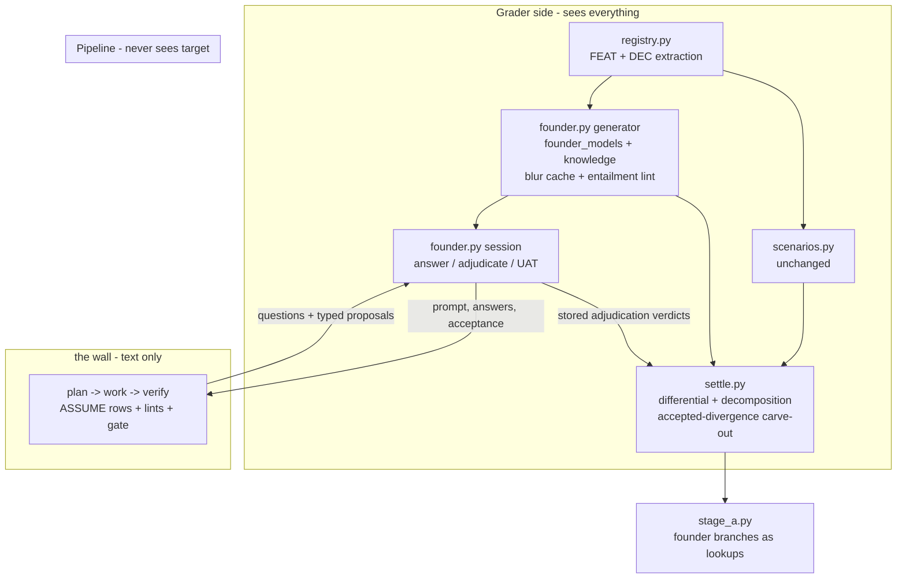

# feat: Agent Families Greenfield Mode — decision registry, assumption ledger, founder simulator, provenance & induction

**Origin:** `docs/agent-families/DESIGN.md` (the brownfield training loop this extends) + companion ideation `docs/ideation/2026-06-10-greenfield-leverage-ideation.md` (survivors S1–S12; this plan implements S1, S2, S4, S5, S6, S9, S10, S12 — S8's walking-skeleton lint deferred, see Deferred).
**Status:** Plan (not yet implemented).
**Revision:** 2 — 2026-06-10. Incorporates a four-lens review (feasibility-vs-code, coherence, adversarial, scope) against the *implemented* codebase. Headline changes: the new episode axis is **`world`**, not `mode` (the codebase already uses `mode` three ways); U13 rewritten as a real two-unit benchmark phase with a Kanboard registry prerequisite; U2 reframed as a **refactor** of the existing assumption machinery (`check_plan_assumptions`) rather than a parallel build; a typed PROPOSAL artifact + stored adjudication verdicts replace the fictional "deterministic" proposal join; an `accepted-divergence` settlement class reconciles the founder-acceptance and registry-differential oracles; blur text moves to a target-side cache with an entailment lint; elicitation-class batches must validate non-negative on **both** frozen benchmarks; a human-as-founder trial precedes automation; Phase F/G resequenced so seeding follows its validation substrate.
**Depth:** Deep (cross-cutting: schema migration, new grading module, planner contract refactor + lints, reflector attribution, library provenance + induction, config, benchmark).
**Layering:** Extends plans 001–004, which are now substantially **implemented** (`agent-families/src/agent_families/`). Phase A–B units gate on the Phase 0/1 code that exists today; Phase C–G units gate on the Phase 2/3a machinery they extend (note: plan-003 U9 episode run-assembly is still pending — U7 names it as a hard dependency). Nothing here blocks or reorders the existing phase plans.

---

## Summary

Give the factory a **greenfield training and deployment mode** without changing its architecture. The pipeline already operates greenfield — plan/work/verify never see the target, only prompt + Q&A text (DESIGN §9). What the target actually provides is training-side: a grading oracle, a *perfect* requirement source, and the elicitation signal. This plan replaces the second of those with a controlled imperfect one, and extends the first to grade what greenfield actually needs graded:

- A **decision registry** (`trace_dec`) extracted alongside the feature registry: the resolved design decisions every target embodies (auth model, tenancy, deletion semantics, empty states). Decisions, not features, are greenfield's dominant failure unit.
- An **assumption ledger** (`trace_assume`): the planner's existing `assumptions[]` flow is promoted from plan-document strings to typed, persisted, linted rows — every REQ traces to a MSG **or** an ASSUME, and top-risk assumptions must be confirmed before increment 1.
- A **founder simulator**: greenfield-world episodes replace the explorer's three roles (opening prompt, Q&A answering, UAT) with a persona answering from a **logged, seeded degradation** of the FEAT+DEC registries — ignorant where the log says so, never untruthful. The full registry stays the hidden grading oracle (backtranslation), so elicitation and proposal quality become measurable.
- A typed **PROPOSAL artifact** + grader-side **adjudication verdicts**, so settlement's decomposition (build failure vs. elicitation failure vs. accepted divergence) consumes stored verdicts rather than hidden text-matching.
- **Reflector attribution branches** for the new failure classes — lookups over `founder_knowledge` + adjudication verdicts, no new free-floating micro-judgments.
- **Insight provenance** (`manual | reflector | researched | seeded`) plus the **induction door** (`af induct <domain>`): research-sourced and hand-seeded skill priors enter through the normal `add_idea` gauntlet, validated against **both** frozen benchmarks (the existing Kanboard scenario-replay benchmark and the new greenfield episode benchmark).
- A **seeded Define-chain batch** with an explicit probation/occupancy policy so hand-written priors neither die on arrival nor ossify the library.

Deployment story unchanged in shape: at deployment the real user replaces the founder, the AC-derived + metamorphic verifier (DESIGN §10, already decided) replaces the differential oracle, and the trained elicitation skills + assumption ledger are what the user actually experiences.

---

## New vs. refactor inventory

The user-facing rule for implementers: **[NEW]** = net-new surface (tables, modules, prompts, metrics that don't exist today); **[REFACTOR]** = behavior-preserving-or-extending change to surface that already exists and has consumers. Every unit is tagged; mixed units itemize per file.

| Area | NEW | REFACTOR |
| --- | --- | --- |
| Schema (U1) | `trace_dec`, `trace_assume`, `trace_msg_dec_mentions`, `founder_models`, `founder_knowledge`, `founder_blur_cache`, `trace_proposal` + adjudication columns, `episodes.world`, `insights.provenance`, `batches.validation_class`, `[greenfield]` config section | `trace_req` rebuild (relax `source_msg_id NOT NULL`, add `source_assume_id`), `config.py` known-sections list, provenance backfill |
| Planner (U2–U3) | ASSUME typed fields, PROPOSAL contract, `rank_questions()` seam, provenance lint, assumption gate (orchestrator seam) | `assumptions[]` string→object contract, `check_plan_assumptions` subsumed into ASSUME rows, `_persist_plan`/`build_assumption_question`/UAT-briefing touchpoints |
| Grading (U4–U8) | DEC extraction output, degradation generator + blur lint, founder session, decomposition join + elicitation metrics, adjudication checker variant | registry pre-research prompt (second output array), `oracle_check` prompt-builder variant, mention-coverage audit world filter, settlement report extension |
| Episodes (U7) | greenfield world branch, fresh-workspace policy, rotation config | `EpisodeStages` binding, `af episode` CLI extension |
| Reflector/library (U9–U12) | provenance plumbing, world×provenance fitness telemetry, `af induct`, seed batch + probation policy | Stage A step-1 branch extension (via `Cause.aspect`), `validate.py` substrate routing |
| Benchmark (U13a/b) | greenfield episode benchmark instrument, pinned founder-model artifact | Kanboard port of the registry pre-research machinery (currently linkding-pinned) |

---

## Problem Frame

The training loop's signal generation is brownfield-only:

- The **explorer is a perfect oracle** (DESIGN §9): it answers every behavioral question correctly by re-observing the target. Real greenfield users *don't know the answers* — the design explicitly punts ("real-world fallible users are handled later via hand-written insights"). That punt is where greenfield leverage lives.
- The **elicitation signal** is the gap between an underselling prompt and a known registry. Nothing trains the planner to *surface decisions the informant never thought about* — the distinctive greenfield skill.
- **Assumptions are second-class:** the planner already emits and persists `assumptions[]` and `check_plan_assumptions` (`agent-families/src/agent_families/pipeline/planning.py:675`) already converts each into a budget-consuming question with a verified/unverified record — but as plan-document strings, not queryable rows. They carry no risk typing, no REQ provenance link, no gate, and no settlement grading. *(R1 of this plan's Problem Frame previously claimed assumptions "are not persisted, linted, or graded" — wrong on persistence; corrected. The refactor target is the existing machinery, not a parallel build.)*
- The **library cold-starts** in any new domain with no principled seeding path: `add_idea` exists, but there is no provenance distinction, no induction pass, and no validation substrate for elicitation-class insights.

Constraint honored throughout: the **perfect-oracle policy's reason** (§9 — unknown unreliability adds unrecoverable grading variance) is preserved by degrading *knowledge*, never *truthfulness*. Two corollaries the review sharpened: (a) blur text is itself LLM prose and must be **entailment-linted and cached target-side** or it manufactures accidental wrongness and benchmark drift (KTD3); (b) the founder's judged behaviors (proposal accept/reject, UAT) must be **narrowed, stored, and reconciled with the differential oracle** or judge noise enters the reward channel (KTD4).

### Vocabulary guard: three meanings of "mode"

The codebase already uses `mode` for (1) the run channel — `episodes.mode ∈ {training, trial, benchmark}` (`store.py:649`, migration v4), and (2) judge/session record-replay (`planning.py:751`, `oracle_check.py:214`). This plan's axis is the **third** thing and is therefore named **`world ∈ {brownfield, greenfield_backtranslated, greenfield_pure}`**. The two episode axes are orthogonal and both real: U13's benchmark episodes are simultaneously `mode = benchmark` and `world = greenfield_backtranslated`. No plan text below uses "mode" for the world axis.

### Scope decisions (from the ideation review + the four-lens review)

1. **Backtranslated greenfield only** in this plan: real targets, degraded informants, full-registry grading. Pure-greenfield episodes (ideation S3) are deferred; the world enum reserves the slot.
2. **Founders are ignorant, never wrong** — now enforced mechanically, not just by intent: blur entailment lint (U5), narrow proposal adjudication (U6), paraphrase-pooled scripted ignorance (U6).
3. **Question ranking v1 is risk-weight ordering** behind a seam; real EVPI later. The **proposal-first prompt paragraph is deferred to Phase D and world-gated** — its training gradient doesn't exist until the founder does, and an ungated prompt change would contradict the brownfield byte-identical regression guard (review finding; supersedes R1's Phase-B placement).
4. **DEC does not enter the frontier ledger.** The frontier drives delivery slicing and stays FEAT-keyed; DEC coverage is a lint + settlement concern. DEC-coverage lint v1 scopes to **mentioned DECs only**; the category-mandatory list is deferred until episode data shows what's systematically missed (grow-by-exception, §17 discipline).
5. **Brownfield benefits land first:** ASSUME refactor + provenance lint + gate improve the existing loop before any founder exists — Phases A–C are world-independent and must leave brownfield behavior byte-identical (regression-guarded).
6. **Dual-substrate validation:** elicitation-class batches must be non-negative on **both** the greenfield benchmark and the existing brownfield frozen benchmark before promotion. One shared library means greenfield-optimal insights can silently degrade brownfield; the second run is cheap against permanent contamination.
7. **Human-as-founder trial before automation** (the Phase 2 "you act as the reflector" precedent, §16): a hand-authored degradation log + a human playing founder on linkding validates the degradation strategy and the attribution branches before they're fixture-frozen.

### Non-goals

- No game/non-web domain curriculum (separate effort; machinery here is domain-agnostic by construction).
- No founder persona/style rotation (same policy as §9: fixed style until elicitation scores plateau).
- No deployment wrapper/UX for the assumption ledger beyond the artifact itself (packaging deferred per §15).
- No changes to the worker/verifier families, the Ralph loop, rehearsal, or batch-merge machinery.
- No walking-skeleton lint in this plan (deferred — it would ship disabled until DEC data exists and its category list is unresolved; see Deferred).

---

## Requirements & Traceability

| R-ID | Requirement | Units |
| --- | --- | --- |
| R1 | Decision registry: DEC extraction, storage, DEC mention links, DEC-coverage lint (mentioned-only v1) | U1, U4 |
| R2 | Assumption ledger: refactor existing `assumptions[]`/`check_plan_assumptions` flow into typed ASSUME rows; REQ provenance = MSG-or-ASSUME; provenance lint; pre-increment gate | U1, U2, U3 |
| R3 | Founder simulator: seeded degradation generator + blur cache/lint + founder session; human-founder trial first | U5, U5b, U6 |
| R4 | Greenfield episode world: opening prompt, Q&A, acceptance via founder; fresh-workspace policy; world-filtered coverage audit; rotation config | U6, U7 |
| R5 | Settlement decomposition (incl. accepted-divergence class) + elicitation metrics, world-keyed | U8 |
| R6 | Reflector Stage A branches over founder knowledge + adjudication verdicts | U9 |
| R7 | Insight provenance + world×provenance fitness telemetry + batch validation-class | U1, U10 |
| R8 | Researched-insight induction through the normal gauntlet, dual-substrate validated | U11 |
| R9 | Seeded Define-chain batch with probation/occupancy policy | U12 |
| R10 | Typed PROPOSAL artifact + stored grader-side adjudication | U2, U6, U8 |
| R11 | Risk-ranked questions behind a seam; proposal-first contract world-gated in Phase D | U2, U6 |
| R12 | Greenfield benchmark: Kanboard registry port + full-episode instrument with pinned founder model; dual-substrate routing | U13a, U13b, U11 |

---

## Key Technical Decisions

### KTD1 — DEC is a sibling of FEAT: same pre-research pass, second output table; mentions get a sibling table, not a rebuild **[NEW + small REFACTOR]**
The registration phase (`grading/registry.py`) is one structured-output session (`PRE_RESEARCH_SCHEMA`, `registry.py:325`) plus runtime confirmation. Decisions are extracted by the same instruments in the same pass — "this app resolved auth as session-cookie + role enum," "deletes are soft with a 30-day purge" — written to **`trace_dec`** (`id, target, digest, category, description, evidence_ref, status`), with the FEAT identity discipline (digest stamp, append-only triggers, `store.py:518`) as the template. `category` keys into the probe-question taxonomy (§17); clustering DEC categories across targets is the taxonomy's data-driven seeding substrate.

**Mentions:** `trace_msg_mentions(msg_id, feat_id)` already exists as a join table with an FK to `trace_feat` (`store.py:307`) and five consumers (frontier audit `frontier.py:139`, Stage A `stage_a.py:275,333`, UAT briefing `episode.py:408`, explorer write path, oracle-check evidence `oracle_check.py:106`). It is **not rebuilt**. DEC mentions get a sibling **`trace_msg_dec_mentions(msg_id, dec_id)`** with its own FK — zero consumer churn, per-kind FK integrity preserved (the "unminted features are unmentionable mechanically" guarantee at `explorer.py:24` rides that FK). A unified read, if ever wanted, is a view.

A one-line **DEC granularity rubric** ships in the registration prompt (one decision = one independently-reversible choice; "soft delete + 30-day purge + admin override" is three), and per-category DEC counts are charted per target so cross-target comparability of DEC-denominated metrics is observable.

### KTD2 — ASSUME is a refactor of the existing assumption flow, not a parallel mechanism **[REFACTOR + NEW fields]**
What exists today: `assumptions[]` is a required array of **strings** in the planner contract (`planning.py:162`), persisted into the plan document (`planning.py:643`); `check_plan_assumptions` (`planning.py:675–733`) converts each into a budget-consuming question via `build_assumption_question` (`planning.py:666`) and records `ASSUMPTION_VERIFIED/UNVERIFIED` (`planning.py:101`).

The refactor: the contract item becomes an **object** `{claim, risk_if_wrong (low|med|high), cheapest_test}`; persistence moves to **`trace_assume`** rows (`id, run_id FK, claim, basis, risk_if_wrong, cheapest_test, status (open|confirmed|invalidated), confirmed_by_msg?`) — **keyed by `run_id`**, not episode (Phase B exercises this on Phase-1 toy-spec runs, which have no episode; episode is derivable through `runs.episode_id` when present). `check_plan_assumptions` is **subsumed**: it reads/writes ASSUME rows as the single source of truth; the plan-document records become a rendered view. One mechanism, not two.

`trace_req` gains nullable `source_assume_id` and relaxes `source_msg_id NOT NULL` — a rename-copy-drop rebuild (SQLite), following the `trace_span` v2 precedent (`store.py:399–431`), with an exactly-one CHECK at insert time (decided: DB CHECK, not lint — earlier, simpler failure; the lint in U3 catches the planner-output-level violation before persistence). Consumers updated: `_REQUIREMENT_SCHEMA` (`planning.py:110`), `_persist_plan` (`planning.py:594`), and `render_uat_briefing` (`episode.py:394` — must render ASSUME-sourced REQs without a MSG).

### KTD3 — The founder model: target-side blur cache, entailment lint, stored goal statement; knowledge degrades, truthfulness never does **[NEW]**
Three tables: **`founder_models`** (`episode_id PK, target, seed, params_hash, goal_statement`) — the goal statement ("what I want this product to do for me") derives from the target's JTBD-level registry summary, is always intact, and now has a home; **`founder_knowledge`** (`id, episode_id FK, ref_kind (feat|dec), ref_id, state (intact|blurred|dropped), blur_id?`); **`founder_blur_cache`** keyed by `(target, ref_kind, ref_id, registry_entry_digest, seed, params_hash, prompt_set_version)` holding the generated blur prose.

Decisions the review forced:
- **Blur prose is cached target-side, not episode-side.** Episode-keyed regeneration would put prose variance inside every benchmark and validation run (a new episode = new prose on the same seed). With the cache, identical `(registry digest, seed, params, prompt)` → byte-identical blur forever; a prompt-set change is an instrument event (§17) that visibly invalidates the cache.
- **Blur entailment lint at generation time:** the registry entry must entail the blur — a blur may *omit* detail, never *assert* anything the registry contradicts ("30-day purge" → "items get cleaned up eventually" passes; → "cleaned up within a week" fails). Plus the generalization lint's vocabulary discipline: JTBD-level words only, no registry-distinctive phrasing (leak control — recovery must measure elicitation, not blur leakiness). Failed blurs regenerate; persistent failures fall back to `dropped`.
- **Seeding:** training episodes derive the seed from episode ID (replays reproduce, §9's persona trick). The **benchmark overrides with a fixed config seed** (KTD8) — the two schemes coexist explicitly; KTD3's episode-ID rule applies to training worlds only.
- **Stratification guard, deterministic:** "core-loop" = the top-N JTBD-linked FEATs (config N), determined from registry links, not a judge call; the guard requires ≥1 core item non-`dropped` (seed-sampled which). Guard-protected items are **excluded from recovery-rate denominators** so the guard can't skew the metric.
- The founder session answers **only** from these rows: `intact` → answer plainly; `blurred` → the cached blur, in spirit; `dropped` → scripted ignorance drawn from a small **paraphrase pool** (seed-selected, persisted) so the ignorance response isn't a single learnable verbatim tell.

### KTD4 — Settlement decomposition: stored verdicts in, accepted-divergence out, metrics thinned **[NEW]**
The decomposition is a join — but only because the joins consume **stored artifacts**, which this revision adds:

- **PROPOSAL is typed.** The planner contract gains `proposals[]`: `{id, topic, options[], recommended, linked_assume_id?}`. The pipeline cannot tag DEC/FEAT ids (the wall), so the grader-side founder session performs **mention adjudication** — an explicit, stored micro-judgment (oracle-check shape: verdict + confidence persisted to **`trace_proposal_adjudication`**) mapping each proposal/question to registry refs. Low-confidence adjudications route to the review queue. Stage A and settlement *look up* these verdicts; nothing text-matches at settlement time.
- **Proposal accept/reject is narrowed.** When the registry resolves the topic (a DEC exists), the judgment is binary-with-both-artifacts-in-hand: "does proposal P match recorded decision D?" — Stage-A micro-judgment #2 shape, checker-validated, verdict stored. When the registry is silent or the founder accepts a proposal that *diverges* from the recorded decision, the result is the third settlement class:
- **`accepted-divergence`:** scenarios testing a decision the founder explicitly accepted differently from the target are **excluded from the must-tier differential** and graded instead by AC-derived + metamorphic checks against the accepted spec (the §10 deployment-mode machinery, which already exists for exactly this shape). The build is never debited for honoring an acceptance the grader's own founder issued; Stage A's step 7 consumes the class tag so regression attribution skips these scenarios' differential arm.
- **Classification:** every scenario outcome joins `founder_knowledge × mentions (both tables) × qa_log × trace_proposal_adjudication × REQ/TKT/AC` into: *volunteered-and-built* (normal build signal), *surfaced-by-planner* (question-surfaced and proposal-surfaced credited separately — different skills), *never-surfaced* (elicitation miss), *accepted-divergence* (above).
- **Metrics v1 (thinned):** recovery rate (non-intact items surfaced / non-intact in scope, guard-exclusions applied), decisions-surfaced-per-question, proposal acceptance rate. **Proposals count as channel messages in every per-question denominator** (no free numerator pumping). Ledger precision/recall are **deferred** until the ASSUME↔DEC linkage has been exercised in real episodes (their "load-bearing" definition is unresolved; and precision must never debit registry-orthogonal assumptions — when it lands, its denominator is registry-adjudicable ASSUMEs only, with a separate ungraded "beyond-target" bucket, so the metric can't train brownfield-prior overfitting).
- **Lexicographic discipline unchanged:** the must-tier behavioral gate is untouched (minus the accepted-divergence carve-out); elicitation metrics are reported beside it, never folded in. A **founder-fishing telemetry counter** (low-information questions whose primary effect is classifying the founder's knowledge state) ships as settlement telemetry from day one.

### KTD5 — Provenance is a column; induction is a source, never a bypass; validation is dual-substrate **[NEW + small REFACTOR]**
`insights.provenance ∈ {manual, reflector, researched, seeded}` (migration; backfill predicate is explicit: batch `label LIKE 'reflect-ep%'` → `reflector` (`stage_b.py:609` convention), else `manual`). `batches` gains **`validation_class ∈ {code, elicitation, general}`** — the tag `validate.py`'s substrate routing reads; `af induct` and the seed loader set it.

**Validation routing (decided):** `code` → existing frozen benchmark; `elicitation` → **both** the greenfield benchmark (U13b) **and** the brownfield frozen benchmark, non-negative on each; `general` → both. Rationale: one shared library, family-wide retrieval — a greenfield-optimal insight ("always propose options") can degrade brownfield (the explorer answers open questions perfectly), and per-batch rollback attribution is gone by the time SPC curves show it. Fitness telemetry groups by **provenance × world** (world joined via episode) so "wins greenfield, loses brownfield" is a queryable fact, not an inference.

### KTD6 — `world` is an episode property; workspace, audit, and telemetry are world-aware **[NEW + small REFACTOR]**
`episodes.world ∈ {brownfield, greenfield_backtranslated, greenfield_pure}`, default `brownfield` (`greenfield_pure` reserved, unused). Runs/spans inherit world through `episode_id` — no new columns on runs/spans. Decisions the review forced:

- **Workspace semantics:** greenfield episodes use a **fresh workspace per episode** and are **excluded from §11 rebuild-probe promotion**. The persisted engagement clone is incoherent against a founder who "hadn't thought about" features the clone already implements; fresh-per-episode is the only consistent option (its real cost lands in the economics table, System-Wide Impact).
- **Mention-coverage audit gets a world filter:** `mention_coverage_audit` (`frontier.py:131`) currently joins all mentions for a target. Greenfield founder MSGs must **not** clear brownfield force-schedule flags — the audit's mention join filters to brownfield-world episodes. In greenfield episodes the audit doesn't run as a scheduler (coverage is the measured quantity); never-surfaced items are settlement classification, not force-scheduling input. The next greenfield episode's degradation is freshly seeded — there is no cross-episode coverage recovery loop in greenfield, by design, and the plan says so rather than leaving "off" ambiguous.
- Rotation fraction (default 0.25 once Phase D lands; 0.0 until then) lives in `[greenfield]` config; the scheduler picks world at episode creation. **The rotation leaves 0.0 only after a measured pilot episode** (economics gate, System-Wide Impact).
- Episode terminal: founder-satisfied reuses the existing `frontier_exhausted` status with a detail string — no `EPISODE_STATUSES` enum rebuild (`store.py:95`).

### KTD7 — Question ranking behind a seam; the gate auto-scales; proposal-first is Phase D, world-gated **[NEW + REFACTOR]**
The assumptions→questions conversion (existing, `planning.py:666–733`) consumes a new `rank_questions(candidates) -> ordered` seam: v1 orders by ASSUME `risk_if_wrong`, then (once U4 lands and weights exist in config) DEC-category weight, then stable order — a real EVPI estimator replaces the function later without touching callers.

**Assumption gate (resolves old Open Question 3 now, not "watch"):** the gate is **not a plan lint** — it fires in the orchestrator between plan acceptance and increment execution (the seam `check_plan_assumptions` already occupies post-persist), emitting a typed failure record and re-entering the planning Ralph loop on bounce. **k auto-scales: `k_effective = min(config_k, floor(question_budget / 2))`** so confirmations can never consume the whole increment budget; if elicitation starvation still appears at annealed budgets, confirmations move to the §9 mid-work side-budget (config flag, default off).

**Proposal-first prompt contract:** added to the planner template **in Phase D, gated on `world = greenfield_backtranslated`** — not Phase B. Hand-writing the rule before its training gradient exists (the founder's scripted decisive-answers-to-proposals behavior) would both undermine the signal and break the brownfield byte-identical guarantee. Brownfield planner prompts are unchanged by this plan.

### KTD8 — The greenfield benchmark is a full-episode instrument with a pinned founder model — not a scenario-replay twin **[NEW + REFACTOR]**
The existing frozen benchmark (`benchmark.py:837`) is deliberately *not* an episode: it replays 12 frozen scenarios with no planner, no Q&A, no exploration — it cannot measure elicitation. The greenfield benchmark is therefore a different instrument with a different (higher) unit cost and its own noise model:

- **Prerequisite (U13a):** port the registry pre-research machinery off its linkding pins (`registry.py:75` — `SOURCE_REPO_URL`/`SOURCE_TAG` are constants) and run Kanboard FEAT+DEC pre-research, hand-checked per the Phase 2 discipline.
- **Instrument (U13b):** one full greenfield episode on Kanboard — `mode = benchmark`, `world = greenfield_backtranslated` — with a **pinned founder-model artifact**: fixed config seed, frozen severity params, **and a pinned registry snapshot + blur-cache state** (a registry re-extraction or prompt-set change is an instrument event that visibly re-baselines; the seed alone does not pin the model). Score series: must-tier pass rate + the elicitation metric block, each control-charted; SPC math lives in `validate.py` (`spc_limits`, `validate.py:281`) — `calibrate.py` is verifier-audit machinery and stays out of it.
- **Gauge-R&R before gating:** repeated runs establish repeatability; the benchmark gates nothing until its noise is measured (§10 discipline). The elicitation gate is **recovery-rate-primary with capped secondaries** (anti-Goodhart shape, §10) — never an unweighted metric blend.

### KTD9 — Seeded/researched insights enter on probation; the seed batch is capped **[NEW]**
The ~50-per-agent active cap admits by fitness tournament — but a never-retrieved seeded insight has no fitness (it either dies on arrival or, once admitted, accumulates co-occurrence wins and ossifies). Policy: seeded/researched insights enter with a **grace window** (cannot displace or be displaced for N episodes, config), then face the normal tournament; the Define-chain batch's **active occupancy is capped (~15)** with the remainder dormant-on-registration; the provenance×world fitness table (U10) is the named decision telemetry, with a stated trigger: researched/seeded insights that lose to mined insights over M episodes shrink the induction pass to cold-start-only.

---

## High-Level Technical Design

### World flow



### Schema delta (all in `store.py`, as numbered migrations; rebuilds follow the v2 precedent at `store.py:399`)

```
trace_dec                  (id PK, target, digest, category, description, evidence_ref, status)        [NEW]
trace_msg_dec_mentions     (msg_id FK, dec_id FK, PRIMARY KEY(msg_id, dec_id))                          [NEW]
trace_assume               (id PK, run_id FK, claim, basis, risk_if_wrong, cheapest_test,
                            status, confirmed_by_msg FK NULL)                                           [NEW]
trace_proposal             (id PK, run_id FK, topic, options_json, recommended, linked_assume_id NULL)  [NEW]
trace_proposal_adjudication(proposal_or_msg_id, ref_kind, ref_id, verdict, confidence, checker_meta)    [NEW]
founder_models             (episode_id PK, target, seed, params_hash, goal_statement)                   [NEW]
founder_knowledge          (id PK, episode_id FK, ref_kind, ref_id, state, blur_id FK NULL)             [NEW]
founder_blur_cache         (id PK, target, ref_kind, ref_id, entry_digest, seed, params_hash,
                            prompt_set_version, blur_text, lint_verdict)                                [NEW]
trace_req                  REBUILD: source_msg_id nullable + source_assume_id NULL + exactly-one CHECK  [REFACTOR]
episodes                   + world TEXT NOT NULL DEFAULT 'brownfield' CHECK (...)   -- NOT mode         [NEW column]
insights                   + provenance CHECK IN (manual,reflector,researched,seeded), backfilled       [NEW column]
batches                    + validation_class CHECK IN (code,elicitation,general) DEFAULT 'general'     [NEW column]
settlement_reports         + elicitation_metrics_json                                                   [NEW column]
config.py                  _KNOWN_SECTIONS + 'greenfield'; GreenfieldConfig dataclass                   [REFACTOR]
```

### File-structure decomposition map

| File (repo-relative) | Responsibility | Tag | Unit |
| --- | --- | --- | --- |
| `agent-families/src/agent_families/store.py` | migrations above | NEW + REFACTOR | U1 |
| `agent-families/src/agent_families/config.py` | `[greenfield]` section, dataclass, fail-fast keys | REFACTOR | U1 |
| `agent-families/thresholds.toml` | `[greenfield]`: severity params, core-loop N, rotation_fraction=0.0, gate k, grace window, seed-occupancy cap, benchmark seed | NEW | U1, U13b |
| `agent-families/src/agent_families/pipeline/planning.py` | `assumptions[]` string→object; ASSUME persistence; `check_plan_assumptions` subsumption; `proposals[]` contract; `rank_questions` seam; provenance lint | REFACTOR (contract) + NEW (lint/seam) | U2, U3 |
| `agent-families/src/agent_families/pipeline/orchestrator.py` (or episode loop) | assumption gate at the plan-accepted → increment-execute seam | NEW (at existing seam) | U3 |
| `agent-families/src/agent_families/grading/registry.py` | DEC extraction (second output array + confirm/mint path); granularity rubric; (U13a) de-pin from linkding | REFACTOR | U4, U13a |
| `agent-families/src/agent_families/grading/founder.py` *(new file)* | degradation generator, blur cache + entailment lint, founder session (answer/adjudicate/UAT) | NEW | U5, U6 |
| `agent-families/src/agent_families/pipeline/oracle_check.py` | founder-model checker variant (new prompt builder over `check_answer` machinery, `oracle_check.py:206`; drops the fresh-observation block — no live app to observe) | REFACTOR (variant) | U6 |
| `agent-families/src/agent_families/pipeline/episode.py` | world branch in `EpisodeStages` bindings (`episode.py:220`); fresh-workspace policy; rotation | REFACTOR | U7 |
| `agent-families/src/agent_families/grading/frontier.py` | world filter on `mention_coverage_audit` (`frontier.py:131`) | REFACTOR | U7 |
| `agent-families/src/agent_families/cli.py` | `af episode start --world`; `af add-idea --provenance`; `af induct` | REFACTOR + NEW | U7, U10, U11 |
| `agent-families/src/agent_families/grading/settle.py` | decomposition join, accepted-divergence carve-out, metrics v1, fishing telemetry | NEW (in existing module) | U8 |
| `agent-families/src/agent_families/reflector/stage_a.py` | step-1 founder branches via `Cause.aspect` strings (`stage_a.py:154`) — no `FAILURE_KINDS` migration | REFACTOR | U9 |
| `agent-families/src/agent_families/reflector/maintenance.py` | provenance×world fitness table | REFACTOR | U10 |
| `agent-families/src/agent_families/reflector/validate.py` | `validation_class` substrate routing; dual-substrate rule; greenfield SPC series | REFACTOR | U10, U13b |
| `agent-families/src/agent_families/library/induction.py` *(new file)* | research session → structural candidates → `add_idea` | NEW | U11 |
| `agent-families/seeds/define-chain/` *(new dir)* | Define-chain insights as batch files + loader invocation | NEW | U12 |
| `agent-families/targets/kanboard/` | FEAT+DEC pre-research artifacts | NEW (per-target) | U13a |

---

## Phase A — Schema & config spine

Everything else hangs off the migration. Schema-only: no behavior change for existing worlds.

**Success Criteria**
- *Automated:* migrations apply idempotently to a copy of an existing store; all existing suites stay green; new tables round-trip in `tests/test_store.py`; config loads with `[greenfield]` present and still fail-fasts on unknown keys; the `trace_req` rebuild preserves row counts and existing FKs.
- *Manual:* `af status` on an existing store shows unchanged counts; `episodes.world` reads `brownfield` everywhere; provenance backfill spot-checked against batch labels.

*Pause for human confirmation before Phase B.*

### U1. Migration: greenfield schema + config section **[NEW tables/columns + REFACTOR: trace_req rebuild, config loader]**

- **Goal:** The full schema delta lands as numbered, reversible migrations, plus the `[greenfield]` config section and loader support.
- **Requirements:** R1, R2, R7, R10 (enabler for all).
- **Dependencies:** none (Phase 0 store is implemented; migration runner at `store.py:738` fits — numbered, append-only, idempotent version stamping).
- **Files:** `agent-families/src/agent_families/store.py`; `agent-families/src/agent_families/config.py` (**required** — `_KNOWN_SECTIONS` at `config.py:17` hard-errors on unknown sections, and every CLI path calls `load_config`); `agent-families/thresholds.toml`; `agent-families/tests/test_store.py`, `agent-families/tests/test_config.py`.
- **Approach:** New tables per the schema-delta block. **`episodes` gains `world`, never `mode`** — `episodes.mode` already exists (`store.py:649`, `{training, trial, benchmark}`) and stays untouched. `trace_req` is a rename-copy-drop rebuild (precedent `store.py:399–431`) relaxing `source_msg_id` and adding `source_assume_id` + exactly-one CHECK. `trace_msg_mentions` is untouched; `trace_msg_dec_mentions` is a sibling. Provenance backfill: `batches.label LIKE 'reflect-ep%'` → `reflector`, else `manual`. `batches.validation_class` defaults `general`. All enums CHECK-constrained. Config: add `greenfield` to `_KNOWN_SECTIONS`, a `GreenfieldConfig` dataclass (severity rates, core-loop N, rotation_fraction, gate k, grace-window, seed-occupancy cap, benchmark seed), provenance comments in TOML per convention.
- **Patterns to follow:** migration numbering + idempotency (`store.py:738`); trace_span v2 rebuild; thresholds provenance-comment convention.
- **Test scenarios:** *Happy path:* fresh store has all tables; migrated store preserves counts and backfills provenance/world. *Edge:* re-running migrations is a no-op; a REQ insert with both or neither source fails the CHECK; `trace_msg_dec_mentions` FK rejects an unminted DEC. *Error:* unknown `[greenfield]` key fails config load; missing section uses defaults (or fails — match existing sections' convention).
- **Verification:** full existing suite green post-migration; `af status` unchanged on a brownfield store.

---

## Phase B — Planner contract refactor & lints (brownfield-safe, world-independent)

The assumption refactor and its lint/gate improve the existing loop — no founder, no DEC, no world branch. Brownfield behavior must stay byte-identical except where the refactor intentionally extends it (typed assumptions); **no prompt-template behavior contract changes land here** (proposal-first is Phase D).

**Success Criteria**
- *Automated:* planner structured-output suite covers object-shaped `assumptions[]` and `proposals[]`; ASSUME rows persist and confirmation flips status; the provenance lint passes/fails fixtures; the gate bounces an unconfirmed high-risk ASSUME at the orchestrator seam; existing plan-lint suite green; a brownfield toy-spec run is behaviorally identical to pre-plan except assumption typing.
- *Manual:* run `agent-families/specs/03-ambiguous.md`; confirm ASSUME rows, lint catch on an orphan REQ fixture, gate bounce + re-plan.

*Pause for human confirmation before Phase C.*

### U2. Planner contract: ASSUME refactor, PROPOSAL artifact, ranked questions **[REFACTOR: existing assumptions flow · NEW: typed fields, proposals[], rank_questions]**

- **Goal:** The existing assumption machinery is refactored onto ASSUME rows; the contract gains typed proposals; questions are risk-ranked behind a seam.
- **Requirements:** R2, R10, R11.
- **Dependencies:** U1.
- **Files:** `agent-families/src/agent_families/pipeline/planning.py`; planner prompt template (schema description only — an instrument event: bump `prompt_set_version` stamped on planner spans, `sessions.py:652`; note there is no manifest file — that phrase from R1 is corrected); planning test suite.
- **Approach:** *(Refactor)* `assumptions[]` items become objects `{claim, risk_if_wrong, cheapest_test}` — touching the contract schema (`planning.py:162`), the document writer (`planning.py:643`), `build_assumption_question` (`planning.py:666`), and `check_plan_assumptions` (`planning.py:675`), which is subsumed to read/write `trace_assume` rows as source of truth (plan-document records become a rendered view; `ASSUMPTION_VERIFIED/UNVERIFIED` map to `confirmed/invalidated` + `confirmed_by_msg`). *(New)* `proposals[]` in the contract (`{id, topic, options[], recommended, linked_assume_id?}`) — persisted to `trace_proposal`; in Phase B nothing consumes them (the explorer answers questions; proposals are legal but unexercised until Phase D). *(New)* `rank_questions(candidates)`: v1 risk-order with stable ties; DEC-category weight slots in post-U4 when config weights exist (explicitly: weights are hand-authored config at first, mined later — not a Phase C deliverable).
- **Patterns to follow:** existing structured-output contract evolution; `run_judge`/`run_session` seams; prompt-version stamping.
- **Test scenarios:** *Happy path:* ambiguous fixture → ≥1 typed ASSUME persisted; an answered assumption question flips status with the MSG recorded; legacy string-shaped fixture transcripts fail schema cleanly (contract version bump). *Edge:* zero assumptions legal; `rank_questions` stable under ties; a proposal with no `linked_assume_id` persists. *Regression:* brownfield toy-spec run end-to-end matches pre-plan behavior except assumption shape.
- **Verification:** planning suite green; prompt-set version bumped and stamped.

### U3. Provenance lint + assumption gate **[NEW, at existing seams]**

- **Goal:** Two enforcement points: a pure lint (REQ provenance) and an orchestrator gate (assumption confirmation), each at the seam that fits it. *(The DEC-coverage lint moves to U4 where its data exists; the walking-skeleton lint is deferred from this plan.)*
- **Requirements:** R2.
- **Dependencies:** U1, U2.
- **Files:** `agent-families/src/agent_families/pipeline/planning.py` (lint — `lint_plan` at `planning.py:357` is a pure function over the plan dict; the provenance rule is checkable there since REQ source fields are in the plan output); `agent-families/src/agent_families/pipeline/orchestrator.py` / episode loop (the gate — **not** a plan lint: it fires between plan acceptance and increment execution, where `check_plan_assumptions` already runs, emitting a typed failure record and re-entering the planning Ralph loop on bounce); thresholds (`gate k`); test suites for both.
- **Approach:** *(Lint)* every REQ has exactly one of `source_msg`/`source_assume` — plan-dict-level check mirroring U1's DB CHECK, so the planner gets lint feedback before persistence fails. *(Gate)* top-`k_effective` open ASSUMEs by risk must be `confirmed`, where **`k_effective = min(config_k, floor(question_budget/2))`** (KTD7 — the gate can never consume the whole budget); bounce emits the typed record; confirmations consume the question budget via the existing flow.
- **Patterns to follow:** existing lint style (deterministic, typed failures); `check_plan_assumptions` invocation point for the gate's host.
- **Test scenarios:** *Lint:* fixture pass + fail (orphan REQ); zero-ASSUME all-MSG plan passes. *Gate:* unconfirmed high-risk ASSUME bounces with a typed record; k auto-scaling at budget 3 yields k=1; confirmed set passes; bounce → re-plan → pass round-trips.
- **Required acceptance tests** (named MUST-tests, do not weaken; add a `## Conformance` mapping):
  - `test_k_effective_caps_at_half_budget` - `k_effective = min(config_k, floor(question_budget/2))` exactly: budget 3 -> k=1; budget 10 with config_k=8 -> k=5; the gate can never consume the whole question budget (KTD7).
  - `test_provenance_lint_xor_source` - a REQ with BOTH `source_msg` and `source_assume`, or NEITHER, fails the lint; exactly one passes (mirrors U1's DB CHECK at plan-dict level).
  - `test_gate_bounces_unconfirmed_then_roundtrips` - an unconfirmed high-risk ASSUME bounces with a TYPED failure record; confirm -> re-plan -> passes (full round-trip).
- **Verification:** both suites green; ambiguous toy spec exercises lint + gate end-to-end.

---

## Phase C — Decision registry extraction

**Success Criteria**
- *Automated:* registry suite extended — DEC rows extracted from the linkding fixture with categories, granularity-rubric conformance, and evidence refs; `trace_msg_dec_mentions` joins work; the DEC-coverage lint (mentioned-only) passes/fails fixtures.
- *Manual:* eyeball the linkding DEC table (~10–20 decisions expected) per the Phase 2 hand-check discipline.

*Pause for human confirmation before Phase D.*

### U4. DEC extraction + DEC-coverage lint (mentioned-only v1) **[REFACTOR: registry pass · NEW: trace_dec output, lint]**

- **Goal:** `grading/registry.py` emits DEC rows alongside FEAT rows; DEC mentions are recordable; a store-backed coverage lint enforces explicit resolution of *mentioned* DECs.
- **Requirements:** R1.
- **Dependencies:** U1; Phase 2 registry machinery (implemented, linkding-scoped — fine for this unit; the Kanboard port is U13a).
- **Files:** `agent-families/src/agent_families/grading/registry.py` (PRE_RESEARCH_SCHEMA gains a `decisions` array + parallel confirm/mint path; granularity rubric line in the prompt — an instrument event); store consumers for DEC minting; a **store-backed lint pass** (new small function taking a Store handle, beside — not inside — the pure `lint_plan`) for DEC coverage; tests.
- **Approach:** Same instruments, second question: "what did this app *decide*?" Each DEC: probe-taxonomy `category` (out-of-taxonomy proposes one, §17 grow-by-exception), behavioral description (generalization-lint phrasing), runtime evidence ref; *source proposes, runtime confirms* entry-by-entry. **Coverage lint v1:** every DEC *mentioned in the increment's MSGs* is resolved by a question, a proposal, or an ASSUME — a join over `trace_msg_dec_mentions × qa_log × trace_assume × trace_proposal`; world-gated (no-op in brownfield). The category-mandatory list is deferred (Scope decision 4).
- **Patterns to follow:** FEAT confirm-on-runtime discipline + digest/append-only identity (`store.py:518`); the two-seam lint architecture from U3.
- **Test scenarios:** *Happy path:* linkding fixture yields DEC rows with categories + evidence. *Edge:* source-only decision excluded; out-of-taxonomy category flagged; compound decision split per the granularity rubric. *Lint:* mentioned-DEC unresolved → typed failure; unmentioned DEC ignored (v1 semantics); brownfield no-op.
- **Required acceptance tests** (named MUST-tests, do not weaken; add a `## Conformance` mapping):
  - `test_source_only_dec_not_minted` - a decision present in source but NOT runtime-confirmed is not minted (source proposes, runtime confirms - entry by entry).
  - `test_dec_coverage_mentioned_only` - a DEC mentioned in the increment's MSGs but unresolved (no question/proposal/ASSUME) -> typed failure; an UNMENTIONED unresolved DEC -> ignored (v1 semantics, no failure).
  - `test_dec_coverage_brownfield_noop` - the DEC-coverage lint is a no-op in brownfield world.
- **Verification:** registry suite green; linkding DEC table hand-check signed off; per-category DEC counts charted.

---

## Phase D — Founder simulator & greenfield episodes

The structural piece. Gate: Phase 2 episode machinery **including plan-003 U9 run assembly** (still pending at revision time — `episode.py:36` "U9's run assembly binds the real ones"); U7 cannot land before it.

**Success Criteria**
- *Automated:* degradation generator deterministic given (registry snapshot, seed, params) including blur prose (cache-keyed); blur entailment lint rejects contradicting blurs; founder checker passes/fails against the founder model; adjudication verdicts persist; a scripted end-to-end greenfield episode on linkding completes setup → increments → settlement.
- *Manual:* the U5b human trial signed off; one live greenfield linkding transcript reviewed (underselling matches the log, dropped-item ignorance uses pool paraphrases, proposals get adjudicated verdicts, acceptance reads plausibly with no blur-vocabulary echo).

*Pause for human confirmation before Phase E.*

### U5. Degradation generator + blur cache + blur lint **[NEW]**

- **Goal:** Deterministic founder models over FEAT+DEC registries, with target-side cached, entailment-linted blur prose.
- **Requirements:** R3.
- **Dependencies:** U1, U4.
- **Files:** `agent-families/src/agent_families/grading/founder.py` *(new — generator half)*; `agent-families/tests/test_founder.py` *(new)*.
- **Approach:** Input: target registries + `[greenfield]` params + seed (episode-ID-derived in training; config-overridden in benchmark — both paths explicit). Seeded RNG selects `dropped`/`blurred` sets; **deterministic stratification guard**: core-loop = top-N JTBD-linked FEATs from registry links, ≥1 core item non-dropped (seed-sampled), guard-protected items flagged for metric exclusion. Blur prose: look up `founder_blur_cache` by `(target, ref, entry_digest, seed, params_hash, prompt_set_version)`; on miss, generate via `run_judge`, run the **entailment lint** (registry entry entails blur; JTBD-level vocabulary only; verdict stored on the cache row), persist; lint failure → regenerate, persistent failure → fall back to `dropped`. Goal statement derives from the JTBD registry summary into `founder_models.goal_statement`. Writes `founder_models` + `founder_knowledge`.
- **Patterns to follow:** §9 deterministic-seed persona policy; `run_judge` fixture-recording for blur + lint calls.
- **Test scenarios:** *Happy path:* same inputs → byte-identical rows AND blur prose across two runs (cache path exercised live-shaped, not fixture-masked). *Edge:* rates at 0 → all intact; guard refuses an all-core-dropped draw; a registry re-extraction (new digests) visibly misses the cache. *Lint:* a blur asserting a contradiction is rejected; an omitting blur passes. *Error:* missing DEC table fails loudly.
- **Required acceptance tests** (named MUST-tests, do not weaken; add a `## Conformance` mapping):
  - `test_degradation_deterministic_including_blur` - same (registry snapshot, seed, params) -> byte-identical `founder_models` + `founder_knowledge` rows AND identical blur prose across two runs (cache path exercised live-shaped, not fixture-masked).
  - `test_core_loop_guard_refuses_all_core_dropped` - the stratification guard refuses an all-core-dropped draw (>=1 core JTBD-linked FEAT stays intact); guard-protected items are flagged for metric exclusion.
  - `test_blur_entailment_lint_rejects_contradiction` - a blur asserting a contradiction of its registry entry is rejected; an omitting/underselling blur passes; persistent lint failure falls back to `dropped`.
  - `test_blur_cache_keyed_by_digest` - a registry re-extraction (new `entry_digest`) misses the cache and regenerates (the cache key includes the digest).
- **Verification:** determinism + lint tests green; generated linkding model eyeballed.

### U5b. Human-as-founder trial **[NEW — manual validation step, no production code]**

- **Goal:** Validate the degradation strategy, the answering rules, and the downstream attribution semantics with a human playing founder, before automation freezes behavior into fixtures (the §16 "you act as the reflector" precedent).
- **Requirements:** R3 (de-risk).
- **Dependencies:** U5 (a generated degradation log to play from); U2/U3 (typed plan artifacts to elicit into).
- **Files:** none production; a short runbook note + the trial's transcripts/decisions recorded under `docs/` or the trial episode's traces.
- **Approach:** Generate (or hand-author) one linkding degradation log; a human answers the pipeline's questions strictly from it (ignorance script for dropped rows), adjudicates proposals, performs UAT; run settlement decomposition by hand against the log. Output: a list of prompt/behavior corrections for U6 and any decomposition-rule corrections for U8, recorded before either is implemented.
- **Test scenarios / Verification:** the trial happened; its corrections are written down and referenced by U6/U8; at least one correction list (possibly empty, with rationale) exists.

### U6. Founder answering, adjudication & acceptance session **[NEW session · REFACTOR: oracle_check variant]**

- **Goal:** A founder session that writes the opening prompt, answers questions, adjudicates proposal/question mentions, judges narrowed proposal accept/reject, and performs acceptance — from the founder model only — with answers checked for model-consistency.
- **Requirements:** R3, R4, R10, R11.
- **Dependencies:** U5, U5b; Phase 2 explorer/Q&A machinery (the three roles exist as injectable functions: `author_opening_prompt` `explorer.py:484`, `ask_question` `explorer.py:644`, `run_uat` `explorer.py:867`).
- **Files:** `agent-families/src/agent_families/grading/founder.py` (session half); `agent-families/src/agent_families/pipeline/oracle_check.py` (founder-model checker: a new prompt builder over the `check_answer` machinery (`oracle_check.py:206`) — **drops the fresh-observation block**, there is no live app for the founder to re-observe; reference = founder model rows); tests (scripted-session fakes per the `run_session` fake convention).
- **Approach:** Fresh-context per question batch (§9 pattern), reading `founder_models` + `founder_knowledge` + `qa_log`. Behavior: `intact` → answer plainly; `blurred` → cached blur in spirit; `dropped` → scripted ignorance from the **paraphrase pool** (seed-selected, persisted) + invite a proposal. **Adjudication (stored):** each question/proposal maps to registry refs via an explicit checked micro-judgment persisted to `trace_proposal_adjudication`; low-confidence → review queue. **Proposal verdicts (narrowed, KTD4):** registry-resolved topics get the binary match-judgment against the recorded DEC (verdict stored); registry-silent or divergence-accepted outcomes are tagged for U8's `accepted-divergence` class — the founder accepts/rejects *only* against `goal_statement` consistency, never against hidden registry detail. **UAT:** founder clicks the clone (legal — customers use the product) judging against its own model + the §10 content/presentation-separated rubric; the UAT prompt sees `founder_knowledge`/`goal_statement` only, never registry rows (Open-Question-1 leak control, auditable). This world also adds the **proposal-first prompt paragraph to the planner template, gated on world** (KTD7) — the gradient that teaches it now exists.
- **Patterns to follow:** explorer fresh-context answering + oracle-check retry/review-queue; tool-less structured browse for UAT; `EpisodeStages` injection.
- **Test scenarios:** *Happy path:* intact answered correctly; dropped → pooled ignorance + invite. *Adjudication:* a proposal maps to the right DEC with stored verdict; an ambiguous one routes to review. *Verdicts:* a proposal matching the recorded DEC accepted with `match` verdict; a divergent proposal consistent with the goal → accepted + divergence-tagged; one contradicting the goal → rejected. *Leak:* an answer asserting dropped-item content fails the checker; UAT prompt context contains no registry rows (assert on the built prompt). *Integration:* qa_log budget accounting identical to explorer mode (`budget_counted`, `store.py:567`).
- **Required acceptance tests** (named MUST-tests, do not weaken; add a `## Conformance` mapping):
  - `test_uat_prompt_contains_no_registry_rows` - assert on the BUILT UAT prompt: it contains `founder_knowledge`/`goal_statement` only and ZERO registry (FEAT/DEC) rows (Open-Question-1 leak control).
  - `test_answer_consistency_rejects_dropped_leak` - a founder answer asserting the real content of a `dropped` item fails the model-consistency checker.
  - `test_dropped_answered_with_pool_paraphrase` - a `dropped` item is answered with scripted ignorance from the seed-selected paraphrase pool plus a proposal invite - never the real content.
  - `test_proposal_verdicts` - a proposal matching the recorded DEC -> accepted `match`; a divergent-but-goal-consistent proposal -> accepted + divergence-tagged; a goal-contradicting proposal -> rejected (judged against `goal_statement` only, never hidden registry detail).
- **Verification:** scripted-fake suite green; one live Q&A transcript reviewed against the U5b corrections.

### U7. Episode world branch, workspace policy & rotation **[REFACTOR: episode/frontier/cli · NEW: world branch + policy]**

- **Goal:** `pipeline/episode.py` runs greenfield episodes end-to-end with coherent workspace and coverage semantics; the scheduler mixes worlds by config.
- **Requirements:** R4.
- **Dependencies:** U5, U6; **plan-003 U9 run assembly (hard gate — `af episode start` and stage binding don't exist yet: `cli.py:1019` has only `report`/`status`)**.
- **Files:** `agent-families/src/agent_families/pipeline/episode.py` (world branch in `EpisodeStages` bindings `episode.py:220`; fresh-workspace policy; founder-satisfied terminal as `frontier_exhausted` + detail string); `agent-families/src/agent_families/grading/frontier.py` (world filter on `mention_coverage_audit` `frontier.py:131` — greenfield mentions must not clear brownfield force-schedule flags); `agent-families/src/agent_families/cli.py` (`af episode start --world`); thresholds (`rotation_fraction` activated, pilot-gated); episode state-machine suite.
- **Approach:** Greenfield setup = brownfield setup + U5 generation + U6 session bound into the three stage seams. **Workspace: fresh per greenfield episode, excluded from §11 rebuild-probe promotion** (KTD6 — the persisted clone is incoherent against an ignorant founder). Delivery slicing driven by founder requests from its model; the coverage audit runs as **measurement only** in greenfield (no force-scheduling; never-surfaced is settlement's classification) and its mention join is world-filtered in both worlds. World stamps episodes; runs/spans inherit via `episode_id`.
- **Patterns to follow:** Phase 2 episode state machine + suspension/halt semantics, untouched in brownfield.
- **Test scenarios:** *Happy path:* `af episode start --world greenfield_backtranslated --target linkding` completes a scripted micro-episode in a fresh workspace. *Regression:* brownfield episodes byte-identical to pre-plan (the planner prompt is unchanged in brownfield — proposal-first is world-gated). *Audit:* greenfield MSG mentions do not clear brownfield force-schedule flags; brownfield audit output unchanged. *Edge:* rotation 0.0 never schedules greenfield; greenfield start on a DEC-less target fails typed at setup.
- **Required acceptance tests** (named MUST-tests, do not weaken; add a `## Conformance` mapping):
  - `test_greenfield_mentions_dont_clear_brownfield_flags` - greenfield MSG mentions do NOT clear brownfield force-schedule flags (the mention-coverage join is world-filtered).
  - `test_greenfield_audit_is_measurement_only` - in greenfield the coverage audit force-schedules nothing (never-surfaced is settlement's classification, not a re-schedule).
  - `test_greenfield_workspace_excluded_from_probe_promotion` - a fresh greenfield workspace is excluded from rebuild-probe promotion (KTD6 - incoherent against an ignorant founder).
  - `test_brownfield_episode_byte_identical` - a brownfield episode is byte-identical to pre-plan (planner prompt unchanged in brownfield; proposal-first is world-gated).
- **Verification:** state-machine suite green both worlds; one full live greenfield linkding episode to settlement.

---

## Phase E — Settlement decomposition & metrics

**Success Criteria**
- *Automated:* decomposition classifies fixture episodes into the **four** classes correctly (incl. accepted-divergence); metrics v1 compute; accepted-divergence scenarios excluded from the must-tier differential and graded by AC-derived/metamorphic checks; brownfield settlement byte-identical.
- *Manual:* one greenfield settlement report read against its transcript and the U5b decomposition-rule corrections.

*Pause for human confirmation before Phase F.*

### U8. Decomposition join + elicitation metrics v1 **[NEW, in existing settle.py]**

- **Goal:** Settlement classifies every scenario outcome against the founder model + stored adjudication verdicts, applies the accepted-divergence carve-out, and emits the thinned metric block, world-keyed.
- **Requirements:** R5, R10.
- **Dependencies:** U7.
- **Files:** `agent-families/src/agent_families/grading/settle.py`; `settlement_reports.elicitation_metrics_json` consumer; `agent-families/tests/test_settle.py` (greenfield fixtures **including a live-shaped adjudication path** — fixtures must consume stored verdicts, not hand-authored joins, so the tagging path is exercised).
- **Approach:** Joins per KTD4 over `founder_knowledge × trace_msg_mentions × trace_msg_dec_mentions × qa_log × trace_proposal(_adjudication) × REQ/TKT/AC × SCEN`. Four classes; question-surfaced vs proposal-surfaced credited separately. **Accepted-divergence:** excluded from the must-tier differential; graded via AC-derived + metamorphic checks (§10 deployment-mode machinery); Stage A step 7 consumes the class tag. **Metrics v1:** recovery rate (guard-exclusions applied), decisions-surfaced-per-question, proposal acceptance rate — proposals counted in all per-question denominators. Founder-fishing counter emitted as telemetry. Ledger precision/recall deferred (KTD4). No score blending: must-tier gate unchanged otherwise.
- **Patterns to follow:** Stage-A-style deterministic joins over stored artifacts; settlement-report embedded-trace-command convention.
- **Test scenarios:** *Happy path:* fixture with one per class classifies 1/1/1/1; metrics match hand computation. *Edge:* intact-item miss is pure build signal; surfaced-then-failed credits elicitation and debits build; an accepted-divergence scenario passing its AC-derived check contributes no must-tier failure; guard-protected dropped item absent from the recovery denominator. *Regression:* brownfield settlement byte-identical.
- **Required acceptance tests** (named MUST-tests, do not weaken; add a `## Conformance` mapping):
  - `test_four_class_classification` - a fixture with one scenario per class classifies 1/1/1/1; question-surfaced and proposal-surfaced are credited separately.
  - `test_accepted_divergence_excluded_from_must_tier` - an accepted-divergence scenario passing its AC-derived/metamorphic check contributes NO must-tier failure (grader-internal reclassification, not gate relaxation).
  - `test_guard_protected_absent_from_recovery_denominator` - a guard-protected dropped item is absent from the recovery-rate denominator.
  - `test_fixtures_consume_stored_verdicts` - the decomposition fixtures consume stored `trace_proposal_adjudication` verdicts (not hand-authored joins) so the tagging path is actually exercised.
  - `test_brownfield_settlement_byte_identical` - brownfield settlement output is byte-identical to pre-plan.
- **Verification:** settle suite green; live report sanity-checked.

---

## Phase F — Reflector branches & telemetry plumbing

Gate: Phase 3a reflector (implemented). *(Resequenced: induction and seeding moved to Phase G, after their validation substrate exists.)*

**Success Criteria**
- *Automated:* Stage A fixtures route the founder branches as lookups over stored verdicts; `af add-idea --provenance` round-trips; the provenance×world fitness table computes; `validation_class` routing selects substrates per KTD5.
- *Manual:* one live greenfield reflection batch's attributions spot-checked.

### U9. Stage A founder branches **[REFACTOR — extends step 1 via Cause.aspect]**

- **Goal:** `COMMUNICATED?` resolves the greenfield sub-attributions as lookups; no new free-floating micro-judgments.
- **Requirements:** R6.
- **Dependencies:** U8.
- **Files:** `agent-families/src/agent_families/reflector/stage_a.py`; Stage A suite.
- **Approach:** In greenfield world, step 1 (`stage_a.py:532` lookup + qa-join precedent at `stage_a.py:329`) joins the failed scenario's FEAT/DEC against `founder_knowledge` + `qa_log` + `trace_proposal_adjudication`: `intact`+unmentioned → planner-elicitation (existing); non-intact + no question → sub-kind `never_asked`; non-intact DEC + no proposal → `never_proposed`; non-intact + answered-ignorant + never revisited → planner-design. **Sub-kinds ride `Cause.aspect` free strings (`stage_a.py:154`) — no `FAILURE_KINDS` enum migration (`store.py:79` CHECK stays untouched).** The elicitability micro-judgment is skipped when the founder model answers it (table-driven). Adjudication verdicts are the lookup source for "was it proposed" — never re-judged here.
- **Test scenarios:** one fixture per branch; brownfield never touches the new branches; a surfaced non-intact item routes to the normal implemented/verified steps; a low-confidence adjudication routes to review rather than mis-attributing.
- **Required acceptance tests** (named MUST-tests, do not weaken; add a `## Conformance` mapping):
  - `test_founder_branches_are_lookups_without_llm` - with the judge seam mocked to RAISE, the greenfield sub-attributions (`never_asked`, `never_proposed`, planner-design, planner-elicitation) resolve as pure lookups over `founder_knowledge`/`qa_log`/`trace_proposal_adjudication`; adjudication verdicts are NEVER re-judged here.
  - `test_brownfield_stage_a_untouched` - brownfield never enters the new branches; a surfaced non-intact item routes to the normal implemented/verified steps.
  - `test_low_confidence_adjudication_routes_to_review` - a low-confidence adjudication routes to review rather than mis-attributing.
- **Verification:** Stage A suite green; live batch spot-checked.

### U10. Provenance & world telemetry plumbing **[REFACTOR: cli/lifecycle/maintenance/validate · NEW: the telemetry itself]**

- **Goal:** Provenance settable and visible; fitness queryable by provenance × world; batch validation-class routing wired.
- **Requirements:** R7.
- **Dependencies:** U1.
- **Files:** `agent-families/src/agent_families/cli.py` (`af add-idea --provenance`, default `manual` — existing flags `--batch/--episode` confirmed at `cli.py:893`); `agent-families/src/agent_families/lifecycle.py` (batch stamps: reflector auto-stamp; `validation_class` set at registration); `agent-families/src/agent_families/reflector/maintenance.py` (provenance×world fitness table — world joined via `fitness_events.episode_id → episodes.world`); `agent-families/src/agent_families/reflector/validate.py` (substrate routing reads `validation_class`; **dual-substrate rule for elicitation/general per KTD5**); tests.
- **Approach:** Mechanical plumbing; this unit **owns the KTD5/KTD6 wiring end-to-end** (the review found it previously scattered with no owner): maintenance report gains the provenance×world table (KTD9's decision telemetry), validate.py gains the class-driven substrate selection (greenfield substrate arrives in U13b; until then elicitation-class batches are **held in quarantine**, never silently validated on the wrong instrument).
- **Test scenarios:** flag round-trips; reflector auto-stamp; provenance×world grouping on fixture events; an elicitation-class batch pre-U13b stays quarantined with a typed hold reason.
- **Required acceptance tests** (named MUST-tests, do not weaken; add a `## Conformance` mapping):
  - `test_elicitation_batch_quarantined_pre_substrate` - before U13b's substrate exists, an elicitation-class batch stays quarantined with a TYPED hold reason (default-deny; never silently validated on the wrong instrument).
  - `test_provenance_world_fitness_grouping` - the maintenance fitness table groups correctly by provenance x world (world joined via `fitness_events.episode_id -> episodes.world`).
  - `test_provenance_flag_roundtrips_and_autostamp` - `af add-idea --provenance` round-trips (default `manual`); reflector batches auto-stamp `reflector`.
- **Verification:** CLI + maintenance + validate suites green.

---

## Phase G — Benchmark, induction & seeding (second increment)

Resequenced so the validation substrate precedes its consumers. This phase is separable as a second increment: Phases A–F yield runnable, human-validated greenfield episodes; Phase G makes their library effects safely promotable at scale.

**Success Criteria**
- *Automated:* Kanboard FEAT+DEC registries minted and hand-check-ready; two benchmark runs produce the identical founder model (pinned artifact) and comparable scores; substrate routing sends an elicitation batch to both benchmarks; induction produces a quarantined `researched` batch; the seed batch registers under the probation policy.
- *Manual:* Kanboard registry hand-check; Gauge-R&R repeatability recorded before any gating; seed-batch judge placements reviewed.

### U13a. Kanboard registry pre-research (FEAT + DEC) **[REFACTOR: de-pin registry machinery · NEW: per-target artifacts]**

- **Goal:** The registry pre-research machinery runs on Kanboard, producing the FEAT+DEC tables the greenfield benchmark's founder model needs.
- **Requirements:** R12.
- **Dependencies:** U4.
- **Files:** `agent-families/src/agent_families/grading/registry.py` (parameterize off the linkding pins — `SOURCE_REPO_URL`/`SOURCE_TAG` constants at `registry.py:75` become per-target config); `agent-families/targets/kanboard/` artifacts; tests.
- **Approach:** Port, don't fork: target-parameterized pre-research with the same confirm-on-runtime discipline; Kanboard's registry is the Phase-3a micro-benchmark slice's parent target, so its docker/boot machinery exists. Hand-check per the Phase 2 discipline (Kanboard registry expected materially larger than linkding's — budget the check).
- **Test scenarios:** linkding extraction unchanged post-parameterization (regression); Kanboard extraction mints FEAT+DEC with evidence; digest stamping keys the blur cache correctly.
- **Verification:** Kanboard FEAT+DEC tables hand-checked and signed off.

### U13b. Greenfield episode benchmark **[NEW instrument]**

- **Goal:** A frozen greenfield instrument: one full Kanboard greenfield episode with a pinned founder-model artifact, its own SPC series, wired as the elicitation validation substrate.
- **Requirements:** R12.
- **Dependencies:** U7, U8, U10, U13a.
- **Files:** thresholds (`benchmark_seed`, frozen severity params — instrument-event annotated on change); `agent-families/src/agent_families/reflector/validate.py` (greenfield SPC series via `spc_limits` `validate.py:281`; substrate activation — U10's quarantine hold lifts); benchmark runner config; tests.
- **Approach:** `mode = benchmark`, `world = greenfield_backtranslated`, fixed config seed, **pinned founder-model artifact** — the registry snapshot (digests) + blur-cache rows are pinned with the seed, so neither a registry re-extraction nor a prompt-set change can silently move the instrument (each is an annotated re-baseline). Score series: must-tier pass rate + elicitation metrics, control-charted. **Gauge-R&R before gating** (repeatability runs; the benchmark gates nothing until σ is measured). Gate shape: recovery-rate-primary, capped secondaries (KTD8). This instrument's unit cost is a full episode — its run cadence is budgeted, not per-batch-unbounded (validation cost ceiling per batch already exists in Phase 3a config).
- **Test scenarios:** two runs → identical founder model, comparable scores; a changed seed without an instrument-event annotation rejected by config validation; an elicitation-class batch routes to BOTH benchmarks and gates on both deltas.
- **Required acceptance tests** (named MUST-tests, do not weaken; add a `## Conformance` mapping):
  - `test_two_benchmark_runs_identical_founder_model` - two benchmark runs (fixed config seed) produce the IDENTICAL pinned founder model (registry-snapshot digests + blur-cache rows pinned with the seed).
  - `test_seed_change_without_instrument_event_rejected` - changing `benchmark_seed` (or a pinned param) WITHOUT an instrument-event annotation is rejected by config validation (the instrument cannot silently move).
  - `test_elicitation_batch_gates_on_both_benchmarks` - an elicitation-class batch routes to BOTH benchmarks and gates on both deltas.
  - `test_no_gating_before_gauge_rr` - the benchmark gates nothing until its repeatability (Gauge-R&R) sigma is measured and recorded.
- **Verification:** repeatability recorded; first real validation decision made on the instrument.

### U11. `af induct <domain>` — researched-insight induction **[NEW]**

- **Goal:** A research session emits structural-schema candidates entering the normal gauntlet as a `researched`, `elicitation`- or `general`-classed batch.
- **Requirements:** R8.
- **Dependencies:** U10, U13b (its validation substrate).
- **Files:** `agent-families/src/agent_families/library/induction.py` *(new)*; `agent-families/src/agent_families/cli.py` (`af induct <domain> [--family planner] [--class elicitation|general]`); tests with recorded fixtures.
- **Approach:** `run_session` with web-research tooling and a hard output contract: N candidates max (config), structural template, scope-tag proposal, source citation in evidence. Feeds the existing `add_idea` pipeline (`pipeline/__init__.py:506`) one candidate at a time. No special admission — cap, lint, quarantine, fitness apply; **probation per KTD9**. Truncation over the cap is logged (no silent caps).
- **Test scenarios:** fixture research output → quarantined `researched` batch; free-prose bounced; near-duplicate short-circuits to merge; over-cap truncation logged.
- **Verification:** induction suite green; one live batch through dual-substrate validation end-to-end.

### U12. Define-chain seed batch **[NEW content, existing door]**

- **Goal:** The agent-factories Define-phase mechanisms land as a `seeded`, probation-governed insight batch for the planner family.
- **Requirements:** R9.
- **Dependencies:** U10, U13b (validation substrate must exist before promotion — resequenced for exactly this).
- **Files:** `agent-families/seeds/define-chain/*.md` *(new — one insight per file, structural template)*; loader invocation (`af add-idea --batch define-chain-seed --provenance seeded` + class tag); registration check only.
- **Approach:** Distill `docs/agent-factories/groups/*` + DEFENSE.md Define-loop mechanisms into ~15–25 structural insights (MoSCoW-then-walking-skeleton, EARS-form ACs, boring-tech-first, Definition-of-Ready bounce, hypothesis-not-fact briefs, proposal-first phrasing), scope-tagged `universal`/`domain:greenfield-define`. Register through the normal door under **KTD9's probation policy: grace window + active-occupancy cap (~15), remainder dormant-on-registration**; quarantine validates dual-substrate. Judge merges with reflector-grown insights are expected and fine.
- **Test scenarios:** all candidates pass schema + lint; the batch is revertible as a unit; occupancy cap enforced at registration.
- **Verification:** batch registered, validated, promoted-or-rejection-understood; probation telemetry visible in the U10 table.

---

## Open Questions (resolve during implementation)

1. **Adjudication granularity (U6/U8):** one adjudication row per question/proposal, or per (item × registry ref) when one proposal touches several DECs? Default: per (item × ref), confidence per pair.
2. **Accepted-divergence persistence horizon:** an accepted divergence holds for the episode — does it persist to the *next* greenfield episode on the same target (fresh workspace, fresh degradation)? Default: no — each episode's divergences are episode-scoped; cross-episode product identity is a `greenfield_pure` concern.
3. **DEC category weights for `rank_questions` (U2/KTD7):** hand-authored config first; mined from cross-target clustering later — at what target count does mining replace hand-authoring? Default: revisit at ≥4 targets with DEC tables.
4. **Deployment parity of the ledger:** the real user should see/confirm ASSUMEs; surfacing form is a deployment-packaging question, deferred with it (§15).
5. **Rotation fraction (U7):** 0.25 after the pilot episode; world-keyed one-shot curves arbitrate; revisit at epoch boundaries.
6. **Blur severity scale (U5):** one level v1 (drop detail, keep intent); graded blur is a curriculum refinement once metrics exist.
7. **Kanboard registry size (U13a):** if FEAT+DEC pre-research lands well above the 15–60 qualification band, scope the benchmark's founder model to a module slice (the §11 OpenEMR pattern) rather than the full app.

---

## Deferred to Follow-Up Work

- **Walking-skeleton lint** (ideation S8): would ship disabled until DEC data exists and needs the category-mandatory list (itself deferred). Revisit after greenfield episodes show which increment-1 omissions actually bite.
- **DEC category-mandatory scope list:** grow-by-exception from episode data (Scope decision 4).
- **Ledger precision/recall metrics:** after ASSUME↔DEC linkage is exercised; registry-adjudicable denominator + ungraded beyond-target bucket as specified in KTD4.
- **Pure-greenfield episodes** (`greenfield_pure`, ideation S3): also the named long-term detector for registry-shape overfitting; a thin telemetry-only canary (1-in-N episodes, gating nothing) is the first slice when it lands.
- **Fallible founders** (wrong, not ignorant): reintroduces §9 variance; revisit on deployment evidence.
- **Founder persona/style rotation:** §9's trigger — planner-score plateau.
- **Real EVPI question ranking:** replaces `rank_questions` v1 behind its seam.
- **Synthetic stakeholder panel / premortem generator** (ideation S7): try as seeded/researched library content (U11/U12), not harness machinery.
- **Non-web domain curricula** (games via open-source oracles): separate plan.

---

## System-Wide Impact

- **Schema:** one migration set (U1); existing rows backfilled; `trace_req` rebuilt (the one structural refactor with existing consumers — `planning.py`, `episode.py` touchpoints itemized in U2); brownfield behavior regression-guarded in U2/U7/U8 tests.
- **Vocabulary:** the new axis is `world`; `mode` retains its two existing meanings (run channel; record-replay). Any future text using "mode" for the world axis is wrong by definition.
- **New modules:** `grading/founder.py`, `library/induction.py`; new CLI verb `af induct`; `af episode start --world`; one seed directory; Kanboard registry artifacts.
- **Prompt changes are instrument events:** planner contract schema (U2), registry decision-extraction prompt (U4), and the world-gated proposal-first paragraph (U6) each bump `prompt_set_version` (stamped on spans — there is no manifest file; SPC annotations + fixture re-records per §17).
- **Question-budget semantics:** unchanged mechanically; assumption confirmations compete inside it with the gate's `k_effective ≤ floor(budget/2)` ceiling; proposals count in per-question denominators.
- **Grading invariants:** the wall holds (founder emits text only; degradation grader-side; UAT prompt registry-free, asserted in tests); must-tier gating unchanged **except** the accepted-divergence carve-out, which is grader-internal reclassification, not gate relaxation; elicitation metrics reported lexicographically beside correctness.
- **Library governance:** induction/seeding are new sources through the same single door — cap, lint, quarantine, fitness, rollback identical; provenance + validation-class add observability and routing, not policy exceptions; KTD9's probation is the one admission-policy addition, scoped to non-earned provenance.
- **Training economics (honest accounting):** a greenfield episode adds, per increment: 1 founder-session call + 1 checker call per question; 1 adjudication + 1 verdict + 1 checker call per proposal (proposals are budget-counted, capping volume); gate bounces are full re-plan cycles; blur generation amortizes to ~zero via the target-side cache; **fresh workspace per episode means a from-scratch build every greenfield episode** (no persisted clone); U13b's instrument is a full episode per run. Mitigations: `rotation_fraction` starts 0.0 and leaves it only after a **measured pilot episode**; benchmark cadence is budget-capped; the per-batch validation cost ceiling (Phase 3a config) applies to dual-substrate runs.
