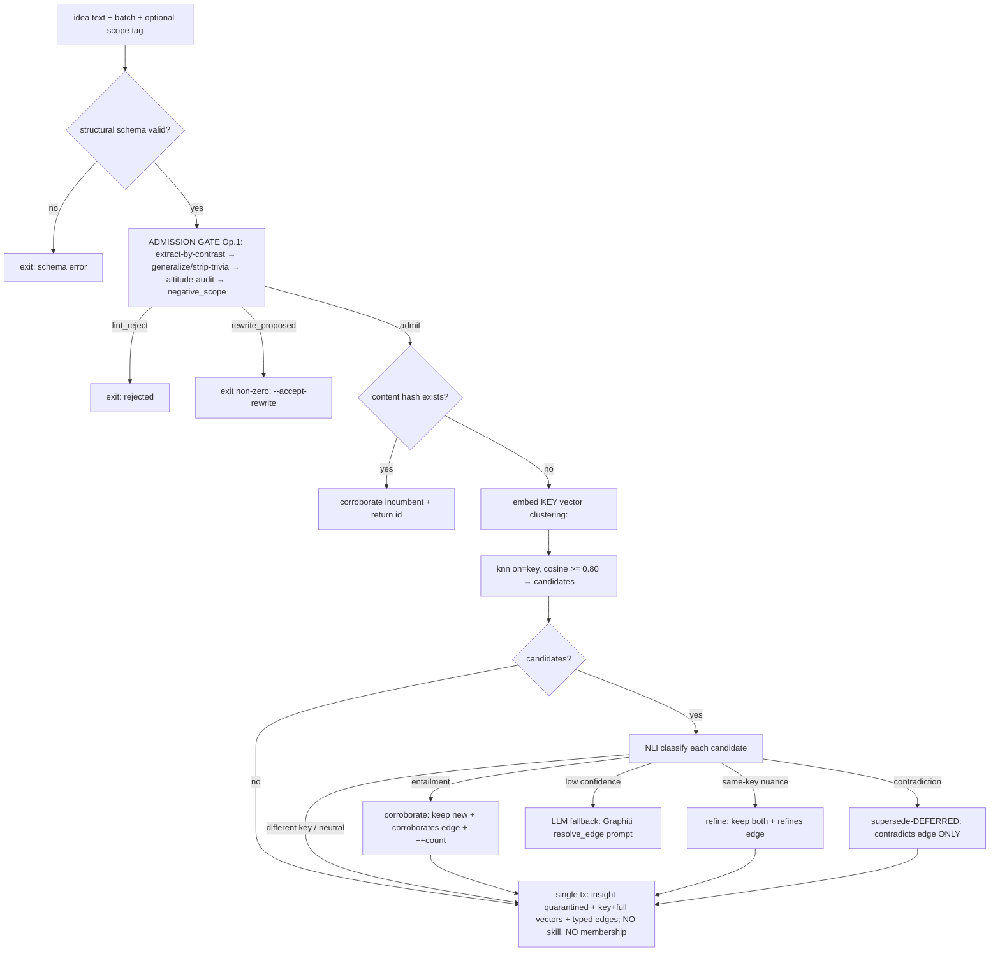

# feat: Agent Families R3 — Phase A: schema v6 + ingest gauntlet

## Summary

Replace the shipped Phase-0 **author-at-ingest** brain with the R3 **derive-from-graph** write path, keeping the entire data-model spine (atomic insights, snapshots, single-writer promotion queue, the `run_judge` record/replay seam). This plan ships the *gauntlet* only — the daily-value, trace-generating core — and deliberately does **not** build the §6 derive pass (that is plan 009). Concretely: `add_idea` stops authoring named skills; the cosine-0.92 dedup *verdict* (a shipped negation-blindness bug) is removed; ingestion becomes **admission gate (extract→generalize→altitude-audit) → key-collision candidate fetch → local-NLI classify (corroborate / refine / supersede-deferred / unrelated) → insert quarantined insight + 3 vectors + typed edges**; and the deferred-supersede `invalid_at` stamp moves to promotion through the queue. Done means hand-written and reflector ideas register through the R3 gate, contradictions are no longer silently merged, duplicates become corroboration votes, and `fitness_events` accumulate the usage traces plan 009's objective will consume.

## Problem Frame

The design note §8 and DESIGN §16 sequence R3 so the ingest gauntlet ships first: it is the original, load-bearing piece (the admission gate), it fixes a *shipped correctness bug* (cosine cannot separate a duplicate from a contradiction — a negation sits at cosine ~0.97, *closer* than a paraphrase at ~0.94, so `pipeline/__init__.py:584-632` silently merges contradictions), and it manufactures the traces the later derive pass needs. The audit (this session) confirmed every R3 delta maps onto concrete code, that several seams already exist exactly where R3 wants them (`_supersede_resolution_seam` at `lifecycle.py:68-75`, called at `:114`), and that the substrate carries forward unchanged. This plan turns the audit's change-list into implementable units and resolves the schema-rebuild decisions.

---

## Requirements

**Schema (migration v6)**

- R1. Add to `insights` (all backfill-safe `ALTER TABLE ... ADD COLUMN`, nullable): `negative_scope TEXT` ("when NOT to apply", §5 Op.1); `valid_at TEXT` / `invalid_at TEXT` (world/version validity, append-only, §5 temporal); `level INTEGER` on `skills` (the module hierarchy level, §4). The optional `rationale TEXT` ("because Z") is decided here, not deferred (KTD).
- R2. Widen the `provenance` enum to include `consolidated` (§4/§5 Op.3). The enum is a column-level CHECK added in `_SCHEMA_V5` (`store.py:922-923`); growing it requires a table rebuild OR dropping the CHECK to Python-enforced. **Decision in KTD.** Update `INSIGHT_PROVENANCES` (`store.py:160`).
- R3. New `insight_edges` table `(id, src→insights, dst→insights, weight REAL, kind, created_at)` with `kind ∈ {similarity, corroborates, refines, contradicts, generalizes_from}` and src/kind, dst/kind indexes. Append-only for the four semantic kinds; `similarity` is in the enum for forward-compat but **never written at v1** (the KNN graph is recomputed from sqlite-vec each derive pass, not materialized — DESIGN §6).
- R4. Corroboration count: add `corroborate` to `FITNESS_EVENT_KINDS` (`store.py:134`) — a snapshot-keyed, append-only vote on `fitness_events` (NOT a mutable `insights` counter, so it serves the §11 cross-target-recurrence signal). Requires a `fitness_events` rebuild (CHECK change) with the append-only-trigger ordering gotcha handled (KTD).
- R5. Three vectors per insight, in **one multi-column vec0 table** (empirically probed viable): `insight_vectors(insight_id PK, key_embedding float[d], full_embedding float[d])` at v1; `retrieval_embedding` added with the assign stage (plan 010). One table preserves the R7 same-transaction atomicity invariant. (`vecindex.py` change, not a `store.py` migration.)
- R6. Demote, don't drop: `insights.supersedes`/`duplicate_of` (superseded by `contradicts`/`corroborates` edges + `invalid_at`), the `contradictions` table (superseded by `contradicts` edges — but retained and read as the interim contradiction source until edges are populated), `skills.agent_id`/`name` NOT-NULL tension, `agents.base_prompt_specialty`/`active_cap`/`routing_decisions`. No drops (migration reversibility).

**Embedding & vector index**

- R7. `embedding.py`: three encode entry points — `embed_key(precondition, action)` (clustering: prefix, key text), `embed_full(text)` (clustering:, whole atom), `embed_retrieval(text)` (search_document:, additive/plan-010). Flip `CLUSTERING_PREFIX` from reserved to load-bearing; fix the module docstring (`embedding.py:1-17`, currently says clustering is "reserved, no Phase 0 caller"). Optional 256-dim Matryoshka truncation (truncate + L2-renormalize) gated on `config.embedding.matryoshka_dim`; `ensure_pins` pins the *effective* dim.
- R8. `vecindex.py`: one 3-column (2 at v1) vec0 table; `insert(insight_id, key_vector, full_vector, retrieval_vector=None)` in one transaction (R7 atomicity); `knn(vector, k, statuses, *, on="key"|"full"|"retrieval")` selecting the column (validated, never interpolated); fold in the U3 query-flattener fix (use `LIMIT` in the subquery, delete `pipeline/__init__.py:_knn_dedup_view` and its workaround).
- R9. New `nli.py` local cross-encoder seam (`cross-encoder/nli-deberta-v3-base`, CPU, ~400 MB, no quota) mirroring `judge.py`'s record/replay discipline: `classify(premise, hypothesis, *, model, mode) -> NliResult{label ∈ entailment|contradiction|neutral, confidence, request_hash}`; `replay`/`record`/`passthrough` via `AF_NLI_MODE`/`AF_NLI_FIXTURES`; `request_hash = sha256(sorted-json(model, premise, hypothesis))`; preflight = cached model-load asserting exactly 3 logits; hard-coded `{contradiction:0, entailment:1, neutral:2}` label map asserted at load. Deterministic on CPU → fixtures replay byte-identically.

**Ingest pipeline (`add_idea`)**

- R10. **Admission gate (Operation 1)** runs *before* embed (so the key vector is computed on the generalized text): extract-by-contrast → generalize-by-typed-substitution (the existing lint, with teeth — strip instance trivia, replace with typed placeholders) → decontextualize + altitude-audit emitting `negative_scope`. Emits the schema'd atom + scope_tag + negative_scope. The existing `lint`/`rewrite_proposed`/`lint_reject` machinery (`judge.py` schema lines ~104-113; `pipeline/__init__.py` dispatch) is promoted from a facet of the placement call to this standalone front gate.
- R11. **Key-collision candidate fetch**: embed key vector → `knn(on="key", ...)` at cosine ≥ ~0.80 — a *candidate filter*, never a verdict. The 0.92 `merge.cosine_threshold` verdict is removed; rename/repurpose to `merge.candidate_floor = 0.80`.
- R12. **NLI classify** each candidate into four append-only moves: **entailment → corroborate** (keep the new insight distinct, write a `corroborates` edge, append a `corroborate` fitness event on the incumbent stamped with the *current* standing snapshot — no snapshot minted at ingest); **same-key nuance → refine** (keep both, `refines` edge); **contradiction → supersede-DEFERRED** (write a `contradicts` edge ONLY; do not stamp `invalid_at`, do not touch incumbent status); **different key → unrelated**. The LLM judge + adopted Graphiti `resolve_edge` prompt are the **fallback** only when NLI confidence < threshold.
- R13. **Insert**: one transaction writing the insight (`status=quarantined`, + `negative_scope`/`provenance`), its 2 vectors, and its typed edges. **No `create_skill`, no `append_member`** — grouping is deferred to plan 009's derive pass. `create_skill`/`append_member` are demoted (kept for the future batch writer).
- R14. The judge `OUTCOMES` enum (`judge.py:57-66`) shrinks to admission-gate verdicts + NLI-fallback verdicts: remove `append_to_skill`, `new_skill`, `no_placement`; reinterpret `merge_discard`→`corroborate` (keep, never discard), `contradiction_flag`/`contradiction_supersede`→ the deferred edge path; keep `lint_reject`, `rewrite_proposed`. Every fixture keyed on the old schema must be re-recorded.
- R15. The exact content-hash fast path (`pipeline/__init__.py:543-569`) **corroborates** rather than silently no-ops on a hit (duplicates are votes) — increment the incumbent's corroboration count, return its id. (KTD if this proves noisy.)

**Lifecycle (deferred-supersede + dormant)**

- R16. Implement `_supersede_resolution_seam` (`lifecycle.py:68-75`, already called inside `promote_batch`'s queue block at `:114`): for each promoted insight with an open `contradicts` edge, re-check the contradiction (cheap deterministic NLI confirm — not a quota judge call inside the write txn), decide the winner by **authority > evidence-count > recency** (KTD pins precedence), stamp the loser's `invalid_at` + `set_status(loser, "retired", snapshot_id)` under the minted snapshot, and close the edge. Run admission/objective handoff (R17) first so only the surviving active set resolves supersedes. Add a `set_invalid_at` store writer. Extend `promote_batch`'s `LifecycleResult` with `retired_incumbent_ids`.
- R17. `_cap_tournament_seam` (`lifecycle.py:59-65`, called at `:113`, `:216`, `:263`): the fixed-cap tournament is removed (§6a governs survival in the slow loop, not at promotion). Make it a no-op to be deleted, OR a documented hook that does nothing at promotion. Rewrite the stale docstrings (`lifecycle.py:24-25, 60-64`). (Decision in KTD D-2.)
- R18. Add a `demote_to_dormant(store, child_ids, parent_insight_id)` lifecycle op (mirrors `retire_*`): one `queue_operation("consolidate", ...)`, `set_status(child, "dormant", snapshot_id)`, materialize `generalizes_from` edges. Extend `revive_insight` (`lifecycle.py:206-217`) to accept `dormant` as a revivable source (fix the error text at `:211-213`). (The *trigger* for consolidation is plan 009; this plan only builds the lifecycle op + dormant transition.)

**Reflector routing**

- R19. Route reflector output through the R3 gate, not the old placement judge. `reflector/stage_b.py` already reaches `add_idea` via `make_add_idea_registrar` (`:574-606`) — so once `add_idea` is the R3 gate, stage_b inherits Operation 1/2 for free. Remove stage_b's assumption that its text is final (generalization is owned by the gate, §13 — do not duplicate it in stage_b). Handle non-registration outcomes (lint_reject / rewrite_proposed / deferred-supersede) without crashing the `for lesson in selected` loop (`:717-745`). Surface a `corroborate` outcome as a corroboration vote keyed on the incumbent + distinct target (feeds §11 recurrence — one counter, not a separate tally).

**Config & testing**

- R20. `config.py`/`thresholds.toml`: new `[nli]` (`model`, `confidence_threshold`); `[merge]` 0.92→`candidate_floor` 0.80 with corrected provenance; `[embedding] matryoshka_dim` (optional, commented); demote `[lifecycle] active_cap` provenance comment to "superseded by §6a objective". `[graph]` (k≈15, Tanimoto) is reserved here, used in plan 009.
- R21. The full suite runs offline, zero quota: NLI replay fixtures (deterministic CPU), re-recorded judge fixtures for the new schema. An e2e acceptance test registers a curated set (exact duplicate → corroborate; near-duplicate → corroborate; nuance → refine; contradiction → contradicts-edge-only at ingest, then `invalid_at` stamped at promotion; target-trivia → lint_reject/rewrite) and asserts: no skill authored at ingest, contradictions never merged, corroboration counts incremented, `fitness_events` populated.

---

## Key Technical Decisions

- **3 vectors → one multi-column vec0 table (probed).** sqlite-vec 0.1.9 allows multiple `float[N]` columns in one vec0 table; the "one MATCH per query" limit is irrelevant (each `knn` targets one column). One table keeps R7 atomicity (all vectors of an insight in one row, one transaction) and `count()` as one assertion. Declare 2 columns at v1; adding `retrieval_embedding` later is a deliberate rebuild-migration (vec0 has no ALTER ADD COLUMN), consistent with the dim-pin discipline.
- **provenance += consolidated and fitness += corroborate both force table rebuilds** (column-level CHECKs). **Decision: do both rebuilds in v6**, using the V2/V5 rename-copy-drop precedent with `foreign_keys=OFF` (migrate loop already sets this) + `legacy_alter_table=ON` so child FKs stay bound. **Gotcha (sharpest migration risk):** `fitness_events` carries append-only triggers (`store.py:710-722`) — the old renamed table's `no_delete` trigger must be dropped *before* `DROP TABLE fitness_events_old`, or the drop trips its own trigger. Alternative considered and rejected: a mutable `insights.corroborations` counter — rejected because corroboration must be snapshot-reconstructible for the §11 signal.
- **Cosine is demoted from verdict to candidate filter; NLI renders the verdict.** This is the shipped-bug fix. The key vector exists precisely so contradictions collide on the rule's identity instead of hiding behind whole-atom cosine.
- **Supersede is deferred to promotion.** The contradiction is *detected* at ingest (NLI) and recorded as an edge; the active-state mutation (`invalid_at` + retire incumbent) waits for validation and rides the promotion queue's snapshot. This closes the "an unvalidated/hallucinated idea kills a live rule" hole and keeps registration snapshot-free.
- **NLI is local + deterministic** (CrossEncoder, `device="cpu"`, fixed model). This is what makes record/replay byte-stable and keeps the high-volume dup/contradiction classification off the one-Max-subscription quota; the LLM judge is the low-confidence fallback only.
- **`rationale` field: adopt now** (one nullable `ALTER TABLE insights ADD COLUMN rationale TEXT`) rather than risk a v7 for one column — the granularity research found the "because Z" load-bearing for code-rule reuse. It threads into `insert_insight`, the admission-gate schema, and the reflection schema.
- **`skills.name` nullable (lazy naming):** v6 needs derived modules to exist unnamed. **Decision: relax `skills.name` to nullable via the `skills` rebuild** (it's getting `level` anyway — combine into one rebuild) rather than placeholder-naming, per DESIGN §4 "name?/description? are nullable, filled lazily."
- **D-2 (where §6a admission lives) — decided:** promotion just *promotes* (the per-batch trust gate); §6a's derive pass later demotes/retires/consolidates by `cost(G)`. So `_cap_tournament_seam` becomes a deleted no-op, not a per-promote objective call (§6a defines no per-promotion move). This keeps `validate.py` and §6a orthogonal.

---

## High-Level Technical Design

### R3 add_idea decision spine (replaces the author-at-ingest spine)



### Status / snapshot discipline (unchanged invariants, new flows)

| Event | Mints snapshot? | Mutates active set? |
|---|---|---|
| `add_idea` insert (quarantined) | no | no |
| corroborate fitness event | no (stamped with current snapshot) | no |
| contradicts/corroborates/refines/generalizes_from edge write | no | no |
| promote_batch (incl. deferred-supersede `invalid_at` + retire incumbent) | **yes** (queue) | yes |
| demote_to_dormant (consolidation children) | **yes** (queue) | yes |

---

## Output Structure

```text
agent-families/src/agent_families/
├── store.py            # + _SCHEMA_V6; insert_insight gains negative_scope/valid_at/invalid_at/provenance/rationale;
│                       #   create_skill/append_member demoted; new set_invalid_at, insight_edges writers
├── embedding.py        # embed_key/embed_full/embed_retrieval; clustering prefix load-bearing; Matryoshka
├── vecindex.py         # one 3-col (2 v1) vec0 table; insert(3 vecs); knn(on=); LIMIT-fix; delete _knn_dedup_view caller
├── nli.py              # NEW: local CrossEncoder record/replay seam (mirror judge.py)
├── judge.py            # OUTCOMES shrunk; admission-gate + resolve_edge fallback schemas
├── pipeline/__init__.py# add_idea rewrite: gate → key-collision → NLI → insert; delete placement/taxonomy/merge-verdict
├── lifecycle.py        # _supersede_resolution_seam real; _cap_tournament_seam → no-op; demote_to_dormant; revive from dormant
├── reflector/stage_b.py# route through R3 gate; handle gate rejections; corroboration surfacing
├── config.py           # [nli], [merge]→candidate_floor, [embedding].matryoshka_dim, [graph] reserved
└── tests/fixtures/nli/ # NEW deterministic NLI fixtures
```

---

## Implementation Units

### U1. Migration v6 + store methods
- **Goal:** the R3 schema spine, backfill-safe over a Phase-0–007 DB.
- **Requirements:** R1–R6
- **Dependencies:** none
- **Files:** `store.py`, `tests/test_store.py`
- **Approach:** append `(6, _SCHEMA_V6)` to `MIGRATIONS` (`store.py:955`). Cheap ADD COLUMNs first (R1: negative_scope, valid_at, invalid_at, rationale on insights; level on skills). New `insight_edges` table + indexes + `INSIGHT_EDGE_KINDS` constant (R3). Rebuilds (R2 provenance, R4 fitness_events, skills.name-nullable) via rename-copy-drop with FK-off + legacy_alter_table + the trigger-drop-before-drop gotcha (KTD). Update `INSIGHT_PROVENANCES` (`:160`), `FITNESS_EVENT_KINDS` (`:134`). New writers: `insert_insight` signature gains negative_scope/valid_at/invalid_at/provenance/rationale (`:1188-1218`); `set_invalid_at(insight_id, value, snapshot_id)`; `add_insight_edge(src, dst, kind, weight)`; demote `create_skill`/`append_member` (keep, mark for the plan-009 batch writer).
- **Test scenarios:** v6 applies idempotently over a seeded V5 DB with rows present (backfill-safe); each rebuild preserves child FKs (skill_members, status_transitions, fitness_events.insight_id) and pre-existing rows; fitness_events append-only triggers survive the rebuild; `consolidated`/`corroborate` enums accepted; edge insert + kind CHECK; insert_insight round-trips the new columns; set_invalid_at writes under a snapshot.
- **Required acceptance tests** (named MUST-tests, do not weaken; add a `## Conformance` mapping):
  - `test_fitness_trigger_dropped_before_table_drop` - the `fitness_events` rebuild drops the renamed `_old` table's append-only `no_delete` trigger BEFORE `DROP TABLE fitness_events_old`; with the trigger left in place the DROP self-trips and the migration raises (the sharpest migration risk - assert the ordering, not just the end state).
  - `test_v6_idempotent_over_seeded_v5` - applying v6 twice over a V5 DB with rows present is a no-op the second time (version stamp gates it); row counts are byte-for-byte unchanged across both rebuilds and re-runs (zero rows lost or duplicated).
  - `test_rebuilds_preserve_child_fks` - after the provenance, fitness_events, and skills.name-nullable rebuilds, every child FK (`skill_members`, `status_transitions`, `fitness_events.insight_id`) still resolves to its parent row; an orphaned child row is impossible (FK-off + legacy_alter_table kept the bindings).
  - `test_enum_checks_accept_new_and_reject_unknown` - `provenance='consolidated'` and a `corroborate` fitness event insert succeed; an unknown provenance and an `insight_edges.kind` outside `{similarity,corroborates,refines,contradicts,generalizes_from}` are rejected by the CHECK.
  - `test_no_demoted_column_or_table_dropped` - `insights.supersedes`/`duplicate_of`, the `contradictions` table, and the demoted `skills`/`agents` columns all still exist post-v6 (reversibility - demote, never drop).
- **Verification:** migrate a copy of a real Phase-007 `library.db`; row counts unchanged; `.schema` matches the R3 entity set.

### U2. Embedding: three vectors + Matryoshka
- **Goal:** three prefix-correct encode entry points; optional truncation.
- **Requirements:** R7
- **Dependencies:** none
- **Files:** `embedding.py`, `tests/test_embedding.py`
- **Approach:** add `embed_key(precondition, action)` (clustering: over a deterministic `build_key_text`), `embed_full(text)` (clustering:), rename `embed_document`→`embed_retrieval` (search_document:); keep `embed_query`. Fix docstring (`:1-17`). Matryoshka: truncate `vector[:matryoshka_dim]` + L2-renorm before the length check; `ensure_pins` pins the *effective* dim. Update the ~10 `embed_document` call sites (note `pipeline/__init__.py:573` is NOT a rename — it splits into embed_key + embed_full; `tripwires.py:168` → embed_retrieval).
- **Test scenarios:** key vs full vs retrieval produce different vectors for the same atom; clustering-prefixed vectors differ from search_document ones; Matryoshka 256 truncation + renorm keeps unit norm; effective-dim pin mismatch fails startup; key text is precond+action only.
- **Required acceptance tests** (named MUST-tests, do not weaken; add a `## Conformance` mapping):
  - `test_key_prefix_is_clustering_not_search_document` - `embed_key`/`embed_full` apply the `clustering:` prefix and `embed_retrieval` applies `search_document:`; embedding the SAME atom through `embed_key` and `embed_retrieval` yields measurably different vectors (cosine < 1.0) - the prefix is load-bearing, not cosmetic.
  - `test_key_text_is_precondition_action_only` - `build_key_text(precondition, action)` excludes expected_outcome/rationale/negative_scope; two atoms with identical precondition+action but different outcomes produce the IDENTICAL key vector (collision on rule identity is the whole point of the key vector).
  - `test_matryoshka_truncate_then_renorm_unit_norm` - with `matryoshka_dim=256`, the returned vector has length 256 and L2 norm == 1.0 (within float tolerance); renormalization happens AFTER truncation, not before.
  - `test_effective_dim_pin_mismatch_fails_startup` - `ensure_pins` pins the EFFECTIVE (post-Matryoshka) dim; loading against a DB pinned to a different effective dim fails fast at startup, not silently at insert.
- **Verification:** seeded similarity smoke on CPU within tolerance.

### U3. Vecindex: 3-column table + on= + flattener fix
- **Goal:** atomic multi-vector storage and column-selectable KNN.
- **Requirements:** R5, R8
- **Dependencies:** U1
- **Files:** `vecindex.py`, `pipeline/__init__.py` (delete `_knn_dedup_view`), `tests/test_vecindex.py`, `tests/test_lifecycle.py` (note update)
- **Approach:** vec0 DDL → `insight_vectors(insight_id PK, key_embedding float[d], full_embedding float[d])` (retrieval column deferred to plan 010 as a rebuild-migration). `insert(insight_id, key_vector, full_vector, retrieval_vector=None)` guarded by `in_transaction`, `_check_dim` each. `knn(vector, k, statuses, *, on="key")` mapping to the column (validated set), using the `LIMIT`-in-subquery form (the documented flattener fix that `_knn_dedup_view` worked around — delete the workaround). Effective dim from config.
- **Test scenarios:** 3-vector insert in one transaction; partial-vector insert rejected; `knn(on="key")` vs `on="full")` search different columns; LIMIT form avoids the double-ORDER-BY flattener rejection; R13 visibility join intact; rowcount immutable under lifecycle.
- **Required acceptance tests** (named MUST-tests, do not weaken; add a `## Conformance` mapping):
  - `test_insert_is_atomic_partial_rejected` - `insert(insight_id, key_vector, full_vector)` writes BOTH columns in one transaction guarded by `in_transaction`; an injected failure between the two vectors leaves ZERO rows for that insight_id (no half-written insight - the R7 atomicity invariant).
  - `test_knn_on_selects_the_named_column` - `knn(..., on="key")` and `knn(..., on="full")` over a corpus where the two vectors disagree return DIFFERENT rankings; the column is chosen from a validated allow-list (`{key,full,retrieval}`) and is NEVER string-interpolated into SQL (an `on=` outside the set raises, not an injection).
  - `test_limit_subquery_avoids_flattener_rejection` - the `knn` query uses `LIMIT` inside the subquery (the documented flattener fix) and runs without the double-ORDER-BY flattener error that `_knn_dedup_view` worked around.
  - `test_knn_dedup_view_deleted_no_caller` - `_knn_dedup_view` is gone from `pipeline/__init__.py` and grep finds zero callers.
- **Verification:** the existing vec tests pass on the new table shape; `_knn_dedup_view` gone with no caller.

### U4. NLI seam (`nli.py`)
- **Goal:** a hardened local cross-encoder seam, fully offline.
- **Requirements:** R9
- **Dependencies:** none (parallel to judge.py)
- **Files:** `nli.py`, `tests/test_nli.py`, `tests/fixtures/nli/`
- **Approach:** mirror `judge.py` (`request_hash`, `replay/record/passthrough`, fixture format, `preflight`). `classify(premise, hypothesis, *, model, mode, fixtures_dir, _encoder=None)`; lazy `CrossEncoder` load `device="cpu"`; assert 3-class output + hard-coded label map at load; softmax-max = confidence; `HF_HUB_OFFLINE` honored with the `af init` hint.
- **Test scenarios:** replay returns the fixtured label with zero model load; missing fixture fails naming the hash; injected fake encoder drives label/confidence; a contradiction pair and a paraphrase pair classify distinctly (records committed); model-swap that changes class order fails at load.
- **Required acceptance tests** (named MUST-tests, do not weaken; add a `## Conformance` mapping):
  - `test_replay_byte_identical_zero_model_load` - in `replay` mode `classify` returns the fixtured `{label, confidence, request_hash}` byte-identically with the `CrossEncoder` load seam asserted NEVER called (zero model download, zero quota).
  - `test_label_map_asserted_at_load` - the hard-coded `{contradiction:0, entailment:1, neutral:2}` label map is asserted at model load; a model whose head emits a different class order (or not exactly 3 logits) fails preflight at LOAD, before any `classify` call - so a silent model swap cannot reorder labels and flip every verdict.
  - `test_request_hash_covers_model_premise_hypothesis` - `request_hash == sha256(sorted-json(model, premise, hypothesis))`; changing the model id (or premise/hypothesis) changes the hash and therefore misses the existing fixture (fixtures are not reusable across models).
  - `test_missing_fixture_fails_naming_hash` - replay against a missing fixture raises an error that names the exact request_hash (no silent passthrough to a live model in replay mode).
  - `test_contradiction_and_paraphrase_classify_distinctly` - with the recorded fixtures, a contradiction pair classifies `contradiction` and a paraphrase pair classifies `entailment`/`neutral` - distinct labels, proving the seam carries real signal not a constant.
- **Verification:** suite passes offline with no model download; one documented `record` smoke.

### U5. Admission gate (Operation 1)
- **Goal:** messy raw → transferable schema'd atom + negative_scope, as a standalone front gate.
- **Requirements:** R10, R14 (gate half)
- **Dependencies:** U4 (uses run_judge), U1 (negative_scope/rationale columns)
- **Files:** `pipeline/__init__.py` (gate functions), `judge.py` (schema), `tests/test_pipeline_gate.py`
- **Approach:** promote the existing `lint`/`rewrite_proposed`/`lint_reject` handling to a dedicated `run_judge` call placed *before* embed. Three sub-stages in the prompt: extract-by-contrast, generalize-by-typed-substitution (strip file paths/repo names/values → typed placeholders), decontextualize + altitude-audit ("one over-general misfire, one over-specific non-application") emitting `negative_scope`. Output: precondition/action/expected_outcome/rationale/negative_scope/scope_tag. Move `_resolve_scope_tag`/override-telemetry into the gate.
- **Test scenarios (fixture-driven):** a hyper-specific debugging transcript → generalized atom with typed placeholders + negative_scope; target-trivia → lint_reject; a borderline atom → rewrite_proposed with `--accept-rewrite` re-entry; scope-tag override logged.
- **Required acceptance tests** (named MUST-tests, do not weaken; add a `## Conformance` mapping):
  - `test_gate_runs_before_embed` - the admission gate `run_judge` call happens BEFORE the key-vector embed (assert call order via spies); the key vector is computed on the gate's GENERALIZED text, never the raw input.
  - `test_typed_substitution_strips_instance_trivia` - a hyper-specific input (file path, repo name, literal value) emerges with those replaced by typed placeholders; the generalized atom contains NONE of the stripped instance literals.
  - `test_negative_scope_emitted` - the gate output carries a non-empty `negative_scope` ("when NOT to apply") for an admitted atom; a borderline over-general atom is caught by the altitude audit.
  - `test_target_trivia_lint_rejected` - a target-trivia-only input returns `lint_reject` and produces NO downstream embed/insert (the gate exits early).
  - `test_rewrite_proposed_requires_accept_flag` - a borderline atom returns `rewrite_proposed` and exits non-zero; re-entry only proceeds with `--accept-rewrite` (the proposed rewrite is not silently adopted).
- **Verification:** every gate outcome has a fixture; the gate runs before embed (order asserted).

### U6. add_idea rewrite (key-collision + NLI + corroborate/refine/deferred-supersede)
- **Goal:** the R3 write path end-to-end; no group authored.
- **Requirements:** R11–R15, R14 (NLI half)
- **Dependencies:** U2, U3, U4, U5
- **Files:** `pipeline/__init__.py`, `judge.py` (OUTCOMES), `tests/test_pipeline.py`
- **Approach:** delete the placement/taxonomy judge + cosine-0.92 merge-verdict + `create_skill`/`append_member` (the audit's DELETE list: `pipeline/__init__.py:308-327, 334-385, 391-426, 584-668, 676-705` in part). Insert: gate (U5) → embed key → `knn(on="key", ≥0.80)` → NLI classify → corroborate (keep + `corroborates` edge + corroborate fitness event on incumbent with current snapshot) / refine (`refines` edge) / supersede-deferred (`contradicts` edge only) / unrelated → single tx writing insight (quarantined, + negative_scope/provenance/rationale) + key+full vectors + edges. Content-hash hit → corroborate (R15). Shrink `OUTCOMES` (R14); re-record all judge fixtures. `AddIdeaResult.skill_id` → removed/nulled; `code` values re-meaned (merged→corroborated).
- **Test scenarios:** exact dup → corroborate (no new skill, count++); near-dup → corroborate; nuance → refine (both kept); contradiction → contradicts-edge-only, incumbent untouched, `invalid_at` NULL at ingest; unrelated → plain insert; low-confidence NLI → judge fallback; atomicity (injected failure → zero rows); **no skill row created in any path**.
- **Required acceptance tests** (named MUST-tests, do not weaken; add a `## Conformance` mapping):
  - `test_contradiction_at_high_cosine_not_merged` - a contradiction pair colliding at cosine ~0.95 (the shipped negation-blindness bug, where a negation sits CLOSER than a paraphrase) is classified `contradiction` by NLI and written as a `contradicts` edge ONLY - it is NEVER merged/discarded; this is the regression test that proves the cosine-verdict bug is fixed.
  - `test_no_skill_row_created_in_any_path` - across ALL five moves (corroborate, refine, supersede-deferred, unrelated, content-hash-hit) the `skills` table gains ZERO rows and `create_skill`/`append_member` are never called - grouping is deferred to plan 009.
  - `test_supersede_deferred_leaves_incumbent_live` - a contradiction at ingest writes a `contradicts` edge but leaves the incumbent's status unchanged and its `invalid_at` NULL (no active-set mutation, no snapshot minted at ingest) - the deferred-supersede invariant.
  - `test_corroborate_keeps_distinct_and_votes` - entailment writes a `corroborates` edge, keeps the new insight DISTINCT (not discarded), and appends a `corroborate` fitness event on the incumbent stamped with the CURRENT standing snapshot (no new snapshot minted); the exact-content-hash hit takes the same corroborate path (R15), not a silent no-op.
  - `test_insert_atomic_zero_rows_on_failure` - an injected failure mid-insert leaves ZERO rows (no insight, no vectors, no edges) - the single-transaction guarantee.
  - `test_low_confidence_nli_falls_back_to_judge` - when NLI confidence < threshold the LLM judge (Graphiti `resolve_edge` prompt) is invoked as the fallback; above threshold the judge is NEVER called (NLI renders the verdict, judge is fallback only).
- **Verification:** every move covered; a contradiction at cosine ~0.95 is classified contradiction, not merged (the shipped-bug regression test).

### U7. Lifecycle: deferred-supersede at promotion + dormant
- **Goal:** activate the supersede seam at promotion; add the dormant transition.
- **Requirements:** R16, R17, R18
- **Dependencies:** U1, U6
- **Files:** `lifecycle.py`, `store.py` (set_invalid_at from U1), `tests/test_lifecycle.py`
- **Approach:** implement `_supersede_resolution_seam` (`:68-75`) inside `promote_batch`'s queue block: read open `contradicts` edges for promoted insights (interim source: `contradictions` table; R3-proper: `insight_edges`), re-check via cheap NLI confirm, decide winner by authority>evidence>recency, stamp loser `invalid_at` + `set_status(loser, "retired", snapshot_id)`, close edge; run after admission so only survivors resolve. `_cap_tournament_seam` → documented no-op (rewrite stale docstrings `:24-25, 60-64`). Add `demote_to_dormant`; extend `revive_insight` to accept `dormant` (fix `:211-213`).
- **Test scenarios:** promote a batch with a challenger → incumbent gets `invalid_at` + retired under the minted snapshot; challenger that fails validation never stamps; incumbent-wins case leaves challenger without invalidating; demote_to_dormant flips children to dormant under a snapshot + writes generalizes_from edges; revive from dormant restores active; no snapshot minted by a no-op promote.
- **Required acceptance tests** (named MUST-tests, do not weaken; add a `## Conformance` mapping):
  - `test_unvalidated_batch_cannot_retire_incumbent` - a challenger that does NOT pass validation/promotion never stamps the incumbent's `invalid_at` and never changes its status; only a promoted (validated) challenger riding the queue's minted snapshot can retire a live incumbent (the safety regression - an unvalidated/hallucinated idea cannot kill a live rule).
  - `test_supersede_resolution_runs_after_admission` - `_supersede_resolution_seam` runs AFTER the admission/objective handoff so only the surviving active set resolves supersedes; the loser is stamped `invalid_at` AND `set_status(loser,"retired",snapshot_id)` under the SAME minted snapshot, and the `contradicts` edge is closed.
  - `test_winner_precedence_authority_evidence_recency` - the winner is decided strictly by authority > evidence-count > recency; an incumbent-wins draw leaves the challenger live and the incumbent un-invalidated (precedence is applied in that exact order, not recency-first).
  - `test_demote_to_dormant_never_retires_children` - `demote_to_dormant` flips children to `dormant` (NOT `retired`) under a minted snapshot and writes `generalizes_from` edges; `revive_insight` accepts a `dormant` source and restores it to active (children are never retired, only dormant).
  - `test_noop_promote_mints_no_snapshot` - a promote batch with no contradicts edges and a no-op `_cap_tournament_seam` mints no extra snapshot and mutates no active set; the snapshot chain stays linear and gapless.
- **Verification:** an unvalidated batch cannot retire a live incumbent (the safety regression test); snapshot chain linear/gapless.

### U8. Reflector routing through the R3 gate
- **Goal:** reflector ideas pass Operation 1/2; corroboration = recurrence.
- **Requirements:** R19
- **Dependencies:** U6
- **Files:** `reflector/stage_b.py`, `reflector/validate.py` (surface retired-incumbent ids), `tests/test_stage_b.py`
- **Approach:** stage_b already calls `add_idea` via `make_add_idea_registrar` (`:574-606`) → inherits the R3 gate once U6 lands. Remove the "reflector text is final" assumption (drop any in-reflector generalization; the gate owns it). Wrap the `for lesson in selected` loop (`:717-745`) to catch lint_reject/rewrite_proposed/deferred-supersede as telemetry, not crashes. On a corroborate outcome, record the vote keyed on incumbent + distinct target (one counter feeding §11). `validate.py`: surface `LifecycleResult.retired_incumbent_ids`/closed contradictions in the `batch_validations` record.
- **Test scenarios:** a reflector lesson duplicating an existing insight → corroborate (not a second insight); a target-specific lesson → gate rewrite/reject handled without aborting the batch; promotion of a reflector batch retires a contradicted incumbent and the validation record names it.
- **Required acceptance tests** (named MUST-tests, do not weaken; add a `## Conformance` mapping):
  - `test_reflector_routes_through_r3_gate_no_separate_generalization` - reflector text reaches `add_idea` via `make_add_idea_registrar` and inherits the R3 gate; stage_b performs NO in-reflector generalization (the gate owns it, §13) - assert the duplicated generalization path is gone.
  - `test_gate_rejection_does_not_abort_batch` - a `lint_reject`/`rewrite_proposed`/deferred-supersede outcome inside the `for lesson in selected` loop is captured as telemetry and the loop CONTINUES with the remaining lessons (one bad lesson does not crash or abort the batch).
  - `test_corroborate_is_single_recurrence_counter` - a reflector lesson duplicating an existing insight records a corroboration vote keyed on incumbent + distinct target using the ONE corroborate fitness-event counter; NO separate recurrence tally exists anywhere (one counter feeds §11).
  - `test_validation_record_names_retired_incumbent` - promoting a reflector batch that retires a contradicted incumbent surfaces `LifecycleResult.retired_incumbent_ids`/closed contradictions in the `batch_validations` record (the retirement is named, not silent).
- **Verification:** stage_b registers via the R3 gate; no separate recurrence counter exists.

### U9. Config, thresholds, and e2e acceptance
- **Goal:** wire config; prove the gauntlet end-to-end offline.
- **Requirements:** R20, R21
- **Dependencies:** U1–U8
- **Files:** `config.py`, `thresholds.toml`, `tests/test_e2e_r3_ingest.py`
- **Approach:** add `[nli]`, `[merge].candidate_floor`, `[embedding].matryoshka_dim`, demote `active_cap` provenance, reserve `[graph]`. e2e: curated set exercising every move + the promote-time supersede; assert no skill authored, contradictions never merged, corroboration counts, `fitness_events` populated (the trace substrate plan 009 consumes).
- **Test scenarios:** R21 curated chain; second run idempotent; offline/zero-quota.
- **Required acceptance tests** (named MUST-tests, do not weaken; add a `## Conformance` mapping):
  - `test_e2e_curated_chain_every_move` - the curated set (exact dup → corroborate; near-dup → corroborate; nuance → refine; contradiction → contradicts-edge-only at ingest then `invalid_at` stamped at promotion; target-trivia → lint_reject/rewrite) drives each move exactly once and asserts the resulting edges/statuses; the contradiction is NEVER merged at any cosine.
  - `test_e2e_no_skill_authored_at_ingest` - after the full curated chain the `skills` table has ZERO rows authored at ingest (grouping deferred to plan 009).
  - `test_e2e_corroboration_and_fitness_populated` - corroboration counts increment on the right incumbents and `fitness_events` accumulate the usage traces (the substrate plan 009's objective consumes) - assert non-zero, snapshot-keyed rows.
  - `test_e2e_second_run_idempotent` - re-running the curated chain over the resulting DB produces no duplicate insights/edges and no spurious status changes (idempotent re-run).
  - `test_e2e_runs_offline_zero_quota` - the e2e completes with `claude` absent from PATH and NLI/judge in replay mode (zero quota, no model download).
- **Verification:** `uv run pytest` green offline from a migrated DB; e2e transcript reviewed against DESIGN §5.

---

## Scope Boundaries

**Deferred to plan 009 (derive pass):** the §6 Leiden/Infomap partition, the §6a objective, `derive_skills`, consolidation *triggering* (this plan builds the lifecycle op + dormant transition, not the trigger), module identity tracking, the retrieval rewrite, router/maintenance/agent_split demotion, rendering/export lazy-naming. **Deferred to plan 010:** the assign stage, the `retrieval_embedding` third vector, the stages pivot.

**Non-goals:** no derive pass; no Leiden/Infomap dependency added here (plan 009); no change to the stage runtime; no drop of demoted columns/tables (reversibility).

**Seams left in place (demoted, not deleted):** `create_skill`/`append_member` (for plan 009's batch writer), `contradictions` table (interim contradiction source), `skills`/`agents` columns.

---

## Risks & Dependencies

- **Fixture blast radius (largest test cost):** shrinking `OUTCOMES` changes `JUDGE_SCHEMA`, and `request_hash` includes the schema — every judge fixture invalidates and must be re-recorded. Budget for it.
- **The cosine-verdict bug is shipped** (`pipeline/__init__.py:584-632`): until U6 lands, contradictions at cosine ~0.97 are silently merged. U6 is the actual fix; the schema/NLI units alone don't close it.
- **fitness_events rebuild trigger-ordering** (U1): drop the old table's append-only triggers before the DROP or it self-trips. The single sharpest migration risk.
- **Re-embed backfill:** every existing insight needs 2 new clustering-prefixed vectors (key + full) — a non-SQL pass keyed by insight id, run after v6 DDL commits; the legacy single `insight_vectors` content was search_document-prefixed and is not reusable as key/full. Pin the effective dim before backfilling.
- **NLI determinism:** must stay `device="cpu"` + fixed model + committed fixtures; assert 3-class output so a silent model swap can't reorder labels and flip every verdict.
- **Open decisions to pin before coding:** winner-decision precedence (R16, recommend authority>evidence>recency); exact-hash-hit corroborates vs no-ops (R15); whether the re-check at promotion is NLI (cheap, in-txn) vs judge (quota, out-of-txn) — recommend NLI.

---

## Sources & Research

- DESIGN.md R3 §4 (data model, schema block), §5 (R3 registration pipeline, Operations 1/2/3, deferred-supersede, lifecycle), §13 (three-vector stack), §17 (config); design note §2a/§2b/§2c.
- Code audit (this session, six subsystem passes): store.py schema/methods; pipeline/__init__.py add_idea flow (verified 506-718); judge.py OUTCOMES; embedding.py/vecindex.py (sqlite-vec multi-column probe); lifecycle.py seams (68-75, 59-65); reflector/stage_b.py registrar (574-606). Every line-ref above traces to that audit.
- Research grounding (DESIGN §18 R3 sources): negation blindness (HEROS, e5); NLI vs GPT-4 on short pairwise (ECon 90.9 vs 76.4 F1); Dense X propositions; schema-grounded memory (key collision); AWM/MACLA generalization; ExpeL corroboration votes; Graphiti deferred-invalidate.
