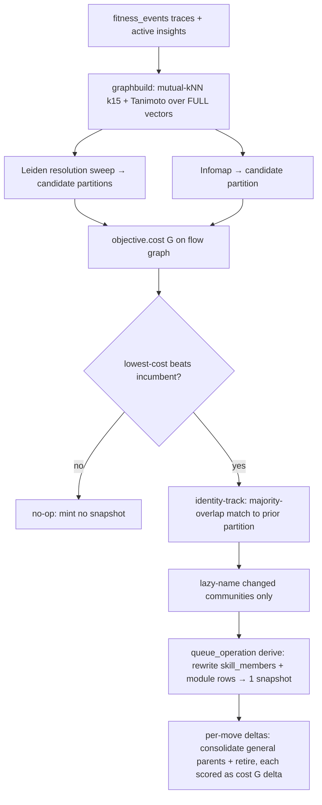

# feat: Agent Families R3 — Phase B: derive pass + organization objective + retrieval

## Summary

Build the R3 **slow loop**: group structure is *derived* from the insight graph, not authored. This plan adds the `derive_skills` batch pass — build a mutual-kNN+Tanimoto similarity graph over the full clustering vectors → propose partitions (hierarchical Leiden + Infomap) → **select the whole partition that minimizes the §6a organization objective** (map-equation codelength on usage traces) → lazily name changed communities → track module identity across passes → apply as **one snapshot-minting promotion-queue operation**. It also adds the two per-move deltas (consolidate — general parent + dormant children; retire — usage-conditioned survival), rewrites retrieval from whole-skill/family-scoped to **whole-store insight-level**, and demotes the R2 machinery this replaces (the family router, the cap-tournament, k-means/silhouette splitting, multi-persona boundary tickets). The §6a objective is built **first** — everything in §4–§6 defers to it.

## Problem Frame

Plan 008 shipped the gauntlet and started accumulating `fitness_events` (the usage traces). This plan consumes them. The audit found the R2 organization code concentrated in four files (`reflector/agent_split.py`, `library/router.py`, `library/retrieval.py`, `reflector/maintenance.py`) and that most of it is *deleted or replaced* — only the transactional apply/revert/lineage skeleton of `agent_split.py` (~120 of 683 lines) survives as the partition-move engine. The genuinely original piece is §6a; its v1 operational definition (the per-module codebook bit-cost, and the cold-start use of similarity as a proxy flow before co-retrieval traces exist) is the single most underspecified number and must be pinned before any partitioner is wired. New third-party dependencies (`graspologic-native`, an Infomap library) are **not currently installed** and must be added and verified against the Python 3.12 pin and the offline/deterministic test discipline.

---

## Requirements

**The organization objective (§6a) — build first**

- R1. `objective.py` computes `cost(G) = L(G) + L(traces | G)`. **`L(traces|G)` = the map-equation codelength** of a random walker on a flow graph (nodes = insights, edge weight = flow): per-access `≈ log2(#modules the trajectory enters) + log2(|module containing the insight|)` = between-module routing bits + within-module locate bits. **`L(G)` = storage bits** = active-insight count + a per-module codebook/description overhead (the bit-cost-per-module constant must be pinned numerically — KTD). Pure Python (numpy optional). Deterministic.
- R2. The flow graph edge weights are **similarity (mutual-kNN) at v1** (cold start, before co-retrieval traces are dense) and blend in **co-retrieval frequency** from `fitness_events` once traces accumulate (the seam, not the v1 default). The v1 objective is therefore computed over the similarity graph as a proxy flow — documented honestly (it slightly undercuts "measured on real usage traces" until traces exist).
- R3. Acceptance API: `beats_incumbent(candidate_partition, incumbent_partition, flow_graph) -> bool` (whole-partition selection); and `cost_delta(move) -> float` for the per-move operations (consolidate/retire). The objective **selects whole partitions** and scores **consolidate/retire as isolated deltas** — it never edits a partition move-by-move.

**Graph build (§6 step 1)**

- R4. `graphbuild.py` builds a **mutual-kNN / SNN graph at k≈15 over the full clustering vectors**, edges re-weighted by the **Tanimoto coefficient** `T(a,b)=a·b/(‖a‖²+‖b‖²−a·b)`. Recomputed from sqlite-vec each derive pass — **no materialized edge table** at <50k nodes (so `insight_edges` rows of `kind='similarity'` are never written). Output: `list[(src, dst, weight)]` over active insight ids.
- R5. `vecindex.py` exposes `all_neighbors(k, *, on="full", statuses=("active",)) -> dict[int, list[Neighbor]]` and `get_vector(insight_id, on) -> list[float]` (v1: per-node `knn` loop + self-edge drop; brute-force, sub-second at scale).

**Partitioning (§6 step 2)**

- R6. `partition.py` proposes candidate **whole partitions**: hierarchical Leiden via `graspologic_native.hierarchical_leiden` (Constant Potts Model, across a small **resolution sweep**), returning `level`/`parent_cluster`/`is_final_cluster`; and Infomap as the **matched alternative proposer** (it directly minimizes the §6a map equation). Both are *proposal generators feeding the same §6a scorer* — neither's internal objective is authoritative; A/B which wins is telemetry.
- R7. New dependencies `graspologic-native` + an Infomap library are added to `pyproject.toml` and **verified to resolve a wheel on Python 3.12** and to run **deterministically offline** (fixed seed for both — graspologic takes `seed`, Infomap needs a fixed seed) so the byte-stable-membership test discipline holds. A missing 3.12 wheel is a blocking surprise to surface early (KTD/risk).

**The derive pass (§6 steps 3–5)**

- R8. `derive.py::derive_skills(store, params, *, namer_fn, snapshot_id)`: build graph (R4) → propose (R6) → **select** the lowest-`cost(G)` candidate and adopt it only if it beats the incumbent partition (R3) → lazily name only changed communities → track identity → apply as **one `store.queue_operation("derive", ...)`** (mints a snapshot; a no-op pass mints nothing). Reuses the repurposed `agent_split` transaction engine (apply/revert/finalize), re-pointed onto module membership and snapshot-minting.
- R9. **Module identity tracking across passes** (§6 step 5, the one behavioral rewrite): re-derived communities are matched to the prior partition by **majority-overlap of member insight ids**, so a module's id, lazy name/description, fitness roll-ups, and `SKILL.md` export stay stable run-to-run. Net-new behavior (R2 had durable authored skill ids); the matching logic is new, the schema delta is small (the `skills` row keyed across snapshots + `level`/`parent_module` from plan 008).
- R10. **Lazy naming** (§6 step 4): a brief judge/CrossEncoder-free LLM pass over a changed community's central insights fills `skills.name`/`description`, only when membership changed AND a name is needed (display / export / coarse routing) — not every pass, not every community. Reuses the `agent_split` namer seam shape (live judge / scripted fake).
- R11. **Consolidation (§5 Op.3) as a per-move delta**: when a community accumulates many corroborating/refining specifics, synthesize a new general parent insight (`provenance=consolidated`, via the gate's generalization for altitude) with `generalizes_from` edges to its children; demote children to `dormant` via plan-008's `lifecycle.demote_to_dormant` (children preserved, never retired). Adopt only if it lowers `cost(G)`.
- R12. **Retirement → usage-conditioned survival**: replace `maintenance.py`'s net-fitness-≤-0-after-N-retrievals counter with a censored-survival hazard on usage, scored as an isolated `cost(G)` delta. Keep `settle_fitness` (the trace writer) and the earned-exposure candidacy shape.

**Retrieval rewrite (§4)**

- R13. `library/retrieval.py::retrieve` becomes **whole-store, insight-level**: KNN over all active insights on the retrieval vector (v1 stopgap: the full vector until plan 010 stores the `search_document:` retrieval vector), ranked by cosine, relevance-gated, budget-filled at **insight** granularity. Delete the own-skills prior (`DEFAULT_OWN_SKILLS_SHARE`, the own/sibling budget split, `own_skills_share`), the family-pool scope (`_family_skills`, `family_id`/`working_agent_id`), whole-skill ranking, and the entire R14c boundary-ticket subsystem (`retrieval.py:420-658`). Keep the query builders, `count_tokens`, mode-keyed quarantine visibility, `render_injection_section`.

**Demotions (R2 machinery this replaces)**

- R14. `library/router.py`: demote to dead code (keep file + `routing_decisions` table for reversibility). Its sole production caller is `agent_split.replay_agreement` — removed in R15, so no production caller remains.
- R15. `reflector/agent_split.py`: gut to the partition-move engine — keep `execute_split`/`revert_split`/`finalize_split` (re-pointed to module membership + snapshot-minting via `queue_operation`, not plain `transaction`); delete silhouette/k-means imports + thresholds, `check_base_prompt_residue`, `evaluate_split_candidacy`, `replay_agreement`, `perform_agent_split`, the family-seed evidence. ~120 of 683 lines survive.
- R16. `reflector/maintenance.py`: delete the cap-tournament (`tournament_displacements`, `active_cap`), all split machinery (`split_candidates`, `_partition_skill`, `_kmeans2`, `silhouette_two`, the `DEFAULT_SPLIT_*` thresholds), the agent-split stub. Keep `settle_fitness` + telemetry; re-spec `retirement_candidates` per R12. ~600 of 999 lines deleted.

**Rendering / export under derived membership**

- R17. `rendering.py`: render in a **derive-pass-stable deterministic order** (e.g. insight_id ascending or the partition's emitted member order), NOT `skill_members.position` (append-order is meaningless under rebalancing). Handle NULL lazy names (`# Skill: None` → placeholder or trigger naming). The snapshot-keyed cache stays correct *iff* every membership rebalance mints a snapshot (R8 guarantees this).
- R18. `export.py`: ensure the leaf community is named (trigger lazy naming) before export; make `slugify`/`_skill_md` NULL-safe (fallback `module-{id}`); the slug-stability story holds iff community identity is stable (R9).

**Config & testing**

- R19. `[graph]` config: `knn_k=15`, `edge_weight="tanimoto"`, `leiden_resolution_sweep`, Infomap seed; `objective` constants (per-module bit cost). Demote `active_cap` and silhouette thresholds (already removed in code) from `thresholds.toml`.
- R20. The new partitioners run deterministically offline (fixed seeds); the objective and graph build have unit tests on small seeded graphs with known optimal partitions; an e2e test runs a full derive pass over a seeded library and asserts whole-partition acceptance, identity stability across two passes, and a consolidation move.

---

## Key Technical Decisions

- **Build `objective.py` FIRST** (DESIGN §6a: "nail before any code — everything in §4–§6 defers to it"). The v1 map-equation codelength formula is pinned here; the per-module codebook bit-cost constant and the similarity-as-proxy-flow choice are decided before any partitioner is wired.
- **Leiden and Infomap are both proposers feeding one external scorer.** §6a is the authority; the partitioners only generate candidates. This dissolves the "Leiden optimizes modularity but we judge by codelength" mismatch — neither's internal objective decides; §6a selects whole partitions. Infomap is the *matched* optimizer (it minimizes the map equation directly) and is the natural first proposer; Leiden is the validated alternative. A/B is telemetry, not a hardcoded choice.
- **Whole-partition acceptance, never per-move cherry-pick.** Adopt the lowest-`cost(G)` candidate iff it beats the incumbent; the only per-move deltas are consolidate and retire. The repurposed `agent_split` engine applies an entire partition atomically or reverts it.
- **The derive pass mints a snapshot** (it mutates the active set), unlike snapshot-free ingest. This is a behavioral change when repurposing `agent_split.execute_split` (R2 used a plain `transaction`); it must go through `queue_operation`.
- **Module identity by majority-overlap** — the load-bearing new behavior. Stable ids keep lazy names, fitness roll-ups, and SKILL.md exports coherent across re-derivation.
- **Retrieval ships before the Leiden stack** (design note §8: v1 needs no graph). The own-skills/family-scope/boundary-ticket deletion is independently correct; it reads the full vector until plan 010's retrieval vector lands. So R13 (retrieval) + R14–R16 (demotions) can land first, with the objective/graph/partition/derive stack following once traces accumulate.
- **New deps verified before commitment.** `graspologic-native` + Infomap wheels on Python 3.12, deterministic seeding for the offline byte-stable test discipline. If `graspologic-native` lacks a 3.12 wheel, Infomap-only is the fallback (it's the matched optimizer anyway).

---

## High-Level Technical Design

### The derive pass (slow loop)



### What survives vs dies (audit summary)

| File | Action | Survives |
|---|---|---|
| `reflector/agent_split.py` | gut → partition-move engine | execute/revert/finalize_split (re-pointed, snapshot-minting) |
| `library/router.py` | demote to dead code | file + routing_decisions table (reversibility) |
| `library/retrieval.py` | insight-level rewrite | query builders, count_tokens, quarantine visibility, render_injection_section |
| `reflector/maintenance.py` | ~600 lines deleted | settle_fitness, telemetry, retirement candidacy (re-spec) |
| NEW: objective.py, graphbuild.py, partition.py, derive.py, consolidation.py | create | — |

---

## Output Structure

```text
agent-families/src/agent_families/reflector/
├── objective.py     # NEW: cost(G) = L(G) + L(traces|G); map equation; beats_incumbent; cost_delta
├── graphbuild.py    # NEW: mutual-kNN k15 + Tanimoto over full vectors → edge list
├── partition.py     # NEW: Leiden (graspologic_native) + Infomap proposers
├── derive.py        # NEW: derive_skills orchestration + identity tracking + queue-op
├── consolidation.py # NEW: general parent + generalizes_from + demote_to_dormant
├── agent_split.py   # GUT to partition-move engine (~120 lines survive)
└── maintenance.py   # ~600 lines deleted; settle_fitness + retirement (re-spec) survive
agent-families/src/agent_families/library/
├── retrieval.py     # insight-level whole-store rewrite; boundary-ticket block deleted
└── router.py        # demoted (file kept, no production caller)
agent-families/src/agent_families/{rendering.py, export.py}  # derive-stable order; NULL-safe lazy names
agent-families/{pyproject.toml}  # + graspologic-native, infomap (3.12 wheel verified)
```

---

## Implementation Units

### U1. The organization objective (`objective.py`) — FIRST
- **Goal:** the single scorer; v1 map-equation codelength pinned.
- **Requirements:** R1, R2, R3
- **Dependencies:** none (depends on the §6a spec only)
- **Files:** `reflector/objective.py`, `tests/test_objective.py`
- **Approach:** `cost(partition, flow_graph)`; `map_equation_codelength` (routing + locate bits); `storage_bits` (insight count + pinned per-module overhead constant); `beats_incumbent`; `cost_delta`. v1 flow = similarity graph (R2); co-retrieval-from-`fitness_events` is a documented seam.
- **Test scenarios:** on a 2-cluster seeded graph, the correct partition scores lower than a merged or shattered one; the per-module overhead penalizes both over-split (N singletons) and under-split (one module); `beats_incumbent` is strict; deterministic.
- **Required acceptance tests** (named MUST-tests, do not weaken; add a `## Conformance` mapping):
  - `test_correct_partition_strictly_beats_merged_and_shattered` - on a seeded 2-cluster flow graph, `cost(correct) < cost(all-merged)` AND `cost(correct) < cost(all-singletons)` strictly; the correct 2-module partition is the unique argmin over the candidate set (not merely <=).
  - `test_overhead_penalizes_both_extremes` - with the per-module overhead constant set as pinned, the N-singletons partition and the 1-module partition BOTH score higher than the correct partition; removing the per-module overhead term makes one of those two extremes win (proving the term is load-bearing, not decorative).
  - `test_cost_is_routing_plus_locate_plus_storage` - `cost(G)` decomposes as `L(traces|G)` (between-module routing bits + within-module locate bits) `+ L(G)` (active-insight count + per-module overhead); a recomputed `map_equation_codelength` on a hand-walked trajectory matches the closed-form `log2(#modules entered) + log2(|module|)` to within float tolerance.
  - `test_beats_incumbent_is_strict_and_deterministic` - `beats_incumbent` returns False on equal cost (strict `<`, no ties adopted) and True only on strictly-lower cost; two calls on identical inputs return byte-identical floats (no RNG, no set-ordering nondeterminism).
- **Verification:** known-optimal small graphs select correctly; the bit-cost constant is documented with its provenance.

### U2. Graph build + vecindex neighbors
- **Goal:** the similarity flow graph from sqlite-vec.
- **Requirements:** R4, R5
- **Dependencies:** plan-008 vecindex (full vectors stored)
- **Files:** `reflector/graphbuild.py`, `vecindex.py` (all_neighbors/get_vector), tests
- **Approach:** `all_neighbors(k, on="full")` per-node loop; `build_similarity_graph` applies mutual-kNN reciprocity + Tanimoto. Pure Python.
- **Test scenarios:** mutual-kNN drops one-directional edges; Tanimoto weights match hand-computed values; self-edges dropped; sub-second on a seeded 5k library.
- **Required acceptance tests** (named MUST-tests, do not weaken; add a `## Conformance` mapping):
  - `test_mutual_knn_drops_one_directional` - an edge `a->b` present in `b`'s kNN but with `a` NOT in `b`'s reciprocal kNN is DROPPED; only mutually-reciprocal pairs survive (a plain kNN graph that keeps one-directional edges fails this test).
  - `test_tanimoto_matches_hand_computed` - for a hand-chosen vector pair, the edge weight equals `T(a,b)=a.b/(||a||^2+||b||^2-a.b)` to float tolerance; the value is NOT plain cosine and NOT raw dot product (assert it differs from both on the same pair).
  - `test_no_similarity_edge_rows_written` - after a graph build, the `insight_edges` table has ZERO rows of `kind='similarity'` (the graph is recomputed in-memory each pass; no materialized edge table at <50k nodes).
  - `test_self_edges_dropped_and_deterministic` - no `(x,x)` self-edge appears in the output; two builds over the same fixed library snapshot produce byte-identical edge lists (same order, same weights).
- **Verification:** graph is deterministic for a fixed library snapshot.

### U3. Partitioners + dependencies
- **Goal:** Leiden + Infomap candidate proposers, installed and deterministic.
- **Requirements:** R6, R7
- **Dependencies:** U2
- **Files:** `reflector/partition.py`, `pyproject.toml`, tests
- **Approach:** `uv add graspologic-native infomap` (or equivalent); verify 3.12 wheels resolve; `propose_leiden(edges, resolutions, seed)` + `propose_infomap(edges, seed)` returning candidate partitions with hierarchy levels. Fixed seeds for offline determinism.
- **Test scenarios:** both proposers return well-formed partitions on the seeded graph; identical output across runs (seed determinism); the two-cluster graph yields two communities.
- **Required acceptance tests** (named MUST-tests, do not weaken; add a `## Conformance` mapping):
  - `test_proposers_byte_stable_under_fixed_seed` - `propose_leiden(edges, resolutions, seed=S)` and `propose_infomap(edges, seed=S)` each return byte-identical membership (same community-id assignment per insight) across two consecutive in-process runs; the membership is captured as a sorted canonical form so set-iteration order cannot mask nondeterminism.
  - `test_two_cluster_graph_yields_two_communities` - on the seeded 2-cluster graph both proposers emit exactly two top-level communities partitioning all active insight ids (no insight unassigned, no overlap).
  - `test_infomap_only_fallback_path` - with the graspologic seam mocked as unavailable (no 3.12 wheel), the partitioner still produces candidates via Infomap alone and the derive stack runs; the fallback is a typed/explicit branch, not a silent empty-candidate set.
- **Verification:** wheels install on the 3.12 pin; offline; deterministic. **If no graspologic 3.12 wheel: Infomap-only fallback.**

### U4. The derive pass + identity tracking
- **Goal:** propose→select→name→apply as one snapshot-minting op.
- **Requirements:** R8, R9, R10
- **Dependencies:** U1, U2, U3, plan-008 (skills.level/name-nullable, queue_operation)
- **Files:** `reflector/derive.py`, `reflector/agent_split.py` (gut per R15), tests
- **Approach:** orchestrate; majority-overlap identity match to prior partition; lazy-name changed communities; apply via the repurposed `agent_split` engine inside `queue_operation("derive")`. No-op pass mints nothing.
- **Test scenarios:** lowest-cost candidate adopted only if it beats incumbent; identity stable across two passes (same insight set → same module ids); only changed communities re-named; one snapshot per non-trivial pass; revert on rejection.
- **Required acceptance tests** (named MUST-tests, do not weaken; add a `## Conformance` mapping):
  - `test_noop_pass_mints_no_snapshot` - a derive pass whose lowest-cost candidate does NOT beat the incumbent leaves the active set untouched and mints ZERO snapshots (no `queue_operation` row written); snapshot count before == after.
  - `test_identity_stable_across_two_passes` - two passes over an unchanged library map every community to the SAME module id via majority-overlap; module ids, lazy names, and SKILL.md slugs are byte-identical run-to-run (a re-derivation that renumbers communities fails this).
  - `test_majority_overlap_reassigns_on_membership_shift` - when a re-derived community shares a strict majority of member insight ids with a prior module, it INHERITS that module's id; a genuinely new community (no majority overlap) gets a fresh id - asserted on a fixture where one module splits.
  - `test_accepted_pass_mints_exactly_one_snapshot` - a non-trivial accepted pass goes through `queue_operation("derive", ...)` and mints EXACTLY ONE snapshot for the whole partition rewrite (not one-per-module, not zero); rejection reverts membership with no snapshot.
  - `test_only_changed_communities_renamed` - with the namer seam mocked to count calls, only communities whose membership changed AND need a name are passed to the namer; unchanged communities trigger zero namer calls.
- **Verification:** two consecutive passes over an unchanged library produce no snapshot and stable ids.

### U5. Consolidation + retirement
- **Goal:** the two per-move deltas.
- **Requirements:** R11, R12
- **Dependencies:** U1, U4, plan-008 (`demote_to_dormant`, generalizes_from edges, provenance=consolidated)
- **Files:** `reflector/consolidation.py`, `reflector/maintenance.py` (retirement re-spec), tests
- **Approach:** synthesize general parent (gate generalization for altitude) + generalizes_from edges + demote children to dormant; adopt iff `cost(G)` lowers. Retirement = censored-survival hazard scored as a delta; keep `settle_fitness`.
- **Test scenarios:** a cluster of corroborating specifics → a parent + dormant children (children preserved, retrievable on revive); consolidation rejected if it raises cost; retirement demotes a usage-dead insight.
- **Required acceptance tests** (named MUST-tests, do not weaken; add a `## Conformance` mapping):
  - `test_consolidation_children_dormant_never_retired` - after a consolidation move, every child insight has status `dormant` (via `lifecycle.demote_to_dormant`) and ZERO children have status `retired`; each child row still exists and is revivable (children are preserved, never deleted or retired).
  - `test_parent_carries_generalizes_from_to_all_children` - the synthesized parent has `provenance=consolidated` and a `generalizes_from` edge to EVERY demoted child (count of edges == count of children); no child is left unlinked.
  - `test_consolidation_rejected_when_cost_rises` - a consolidation whose `cost_delta(move) >= 0` is NOT applied: no parent is minted, no child is demoted, the active set is unchanged (adopt iff cost strictly lowers).
  - `test_retirement_is_usage_conditioned_survival` - retirement candidacy comes from the censored-survival hazard on usage scored as a `cost(G)` delta, NOT the old net-fitness-<=0-after-N-retrievals counter; a usage-dead insight is demoted while a low-fitness-but-recently-used insight survives; `settle_fitness` (the trace writer) is retained and still called.
- **Verification:** children never `retired`; parent carries generalizes_from to all children.

### U6. Retrieval: insight-level whole-store rewrite
- **Goal:** per-job retrieval over the whole store, no preset bias.
- **Requirements:** R13
- **Dependencies:** plan-008 (vectors); independent of U1–U5 (can land first)
- **Files:** `library/retrieval.py`, tests (delete boundary-ticket tests)
- **Approach:** delete own-skills prior, family scope, whole-skill ranking, the R14c boundary block (`:420-658`). New `retrieve(store, *, query_vector, params, mode, ...) -> RetrievalResult{insights}`: KNN over active insights on the retrieval vector (full-vector stopgap until plan 010), rank by cosine, relevance-gate, budget-fill at insight granularity. Keep query builders, count_tokens, quarantine visibility, render_injection_section.
- **Test scenarios:** retrieval reaches the whole store (not a family pool); ranks insights not skills; no own-skills weighting; quarantine visibility by mode preserved; budget filled at insight granularity.
- **Required acceptance tests** (named MUST-tests, do not weaken; add a `## Conformance` mapping):
  - `test_ownership_not_reachability_total` - an insight owned by a module the query has no relationship to is retrieved purely by cosine relevance; with `working_agent_id`/`family_id` removed from the signature, a high-relevance insight in ANY module appears in the result (no family-pool gating possible).
  - `test_no_own_skills_weighting` - identical-cosine insights rank identically regardless of owning module; `DEFAULT_OWN_SKILLS_SHARE`/`own_skills_share` and the own/sibling budget split are gone (a fixture where two insights tie on cosine returns them in stable cosine/id order, not own-first).
  - `test_ranks_insights_not_skills` - the `RetrievalResult` carries insight-granular items and the budget is filled insight-by-insight; whole-skill ranking is absent (no skill-level aggregation node in the ranked output).
  - `test_quarantine_visibility_by_mode_preserved` - mode-keyed quarantine visibility is unchanged from pre-rewrite: a quarantined insight is hidden in the mode that hid it before and visible in the mode that showed it before (assert both directions).
  - `test_boundary_ticket_subsystem_deleted` - the R14c boundary-ticket code path (`retrieval.py:420-658`) is gone; nothing in `retrieve` references it and its tests are removed (no dead boundary-ticket call survives).
- **Verification:** the design's "ownership ≠ reachability, total" holds — an insight in any module is retrievable by relevance.

### U7. Demotions: router, agent_split, maintenance
- **Goal:** remove the R2 organization machinery.
- **Requirements:** R14, R15, R16
- **Dependencies:** U4 (agent_split engine survives), U6 (retrieval replaces routing)
- **Files:** `library/router.py`, `reflector/agent_split.py`, `reflector/maintenance.py`, tests (delete/rewrite router + split + tournament tests)
- **Approach:** remove router's sole production caller (falls out of R15); gut agent_split per the audit map; delete maintenance's cap/split/k-means/silhouette. Keep settle_fitness + telemetry.
- **Test scenarios:** nothing in `src/` imports `router.route`; agent_split exposes only the partition-move engine; maintenance runs settlement-fitness only.
- **Required acceptance tests** (named MUST-tests, do not weaken; add a `## Conformance` mapping):
  - `test_no_production_caller_of_router_route` - a source-tree scan (excluding tests and the kept-for-reversibility `router.py` file itself) finds ZERO references to `router.route`; the `router.py` file and `routing_decisions` table still exist (demoted, not deleted, for reversibility).
  - `test_no_kmeans_or_silhouette_in_src` - `src/` contains no `silhouette`/`kmeans`/`_kmeans2`/`silhouette_two`/`DEFAULT_SPLIT_*`/`active_cap`/`tournament_displacements` symbols; the cap-tournament and split machinery are gone (grep over src returns nothing).
  - `test_agent_split_exposes_only_partition_engine` - `agent_split` exports exactly `execute_split`/`revert_split`/`finalize_split` (re-pointed to module membership + snapshot-minting); `replay_agreement`, `perform_agent_split`, `evaluate_split_candidacy`, `check_base_prompt_residue` are removed (importing them raises `AttributeError`).
  - `test_maintenance_keeps_only_settle_fitness_and_telemetry` - `maintenance` still exposes `settle_fitness` and telemetry and the re-spec'd `retirement_candidates`, but the cap-tournament/split/k-means entry points are gone; calling `maintenance` runs settlement-fitness without touching any removed path.
- **Verification:** grep confirms no production caller of router/route, no k-means/silhouette in `src/`.

### U8. Rendering / export under derived membership
- **Goal:** stable rendering + NULL-safe lazy names.
- **Requirements:** R17, R18
- **Dependencies:** U4 (lazy naming, identity)
- **Files:** `rendering.py`, `export.py`, tests
- **Approach:** order members by a derive-stable key (not position); handle NULL name/description (placeholder or trigger naming); export triggers naming + NULL-safe slugify.
- **Test scenarios:** rendering stable across a derive pass that rebalances membership; an unnamed module renders a placeholder (no `None`); export names then writes valid SKILL.md; compiled docs keyed on tracked identity.
- **Required acceptance tests** (named MUST-tests, do not weaken; add a `## Conformance` mapping):
  - `test_render_order_is_derive_stable_not_position` - rendering orders members by the derive-stable key (insight_id ascending or the partition's emitted member order), NOT `skill_members.position`; a fixture where a rebalance scrambles `position` but preserves membership renders byte-identical output (position-ordered rendering fails).
  - `test_unnamed_module_renders_placeholder_no_none` - a module with NULL `name`/`description` renders a placeholder (or triggers naming), never the literal string `None` or `# Skill: None`.
  - `test_export_null_safe_slug_fallback` - `slugify`/`_skill_md` on a NULL name produce the `module-{id}` fallback slug and a valid SKILL.md (no exception, no empty slug); export triggers naming for the leaf community first.
  - `test_cache_invalidated_only_via_snapshot` - the snapshot-keyed render cache serves correct bytes BECAUSE every membership rebalance mints a snapshot (R8); a fixture that rebalances membership produces a new snapshot key and a cache miss - asserting the cache cannot serve stale bytes for changed membership.
- **Verification:** byte-stability holds under snapshot-keyed cache + derive-stable order.

### U9. Config + e2e
- **Goal:** wire config; prove the full derive cycle.
- **Requirements:** R19, R20
- **Dependencies:** U1–U8
- **Files:** `config.py`, `thresholds.toml`, `tests/test_e2e_r3_derive.py`
- **Approach:** `[graph]` + objective constants; e2e over a seeded library: ingest (plan 008) → derive → assert whole-partition acceptance, identity stability, a consolidation move, insight-level retrieval.
- **Required acceptance tests** (named MUST-tests, do not weaken; add a `## Conformance` mapping):
  - `test_e2e_whole_partition_accepted_one_snapshot` - the full derive cycle over the seeded library adopts the lowest-cost partition only because it beats the incumbent and mints EXACTLY ONE snapshot for the whole rewrite (whole-partition acceptance, never per-move cherry-pick).
  - `test_e2e_identity_stable_second_pass_noop` - a second derive pass over the unchanged post-derive library is a no-op: zero new snapshots, module ids/names byte-identical to the first pass (identity stability end-to-end).
  - `test_e2e_consolidation_move_applied` - the cycle produces a consolidation move (general parent `provenance=consolidated` + dormant children with `generalizes_from` edges) when and only when it lowers `cost(G)`.
  - `test_e2e_insight_level_retrieval_reaches_whole_store` - post-derive retrieval returns insight-granular results ranked by cosine across the whole store regardless of owning module (no family pool, no own-skills bias).
  - `test_e2e_offline_and_deterministic` - the e2e runs fully offline (no network) and two runs produce byte-identical final membership, snapshot count, and retrieval ordering.
- **Verification:** offline, deterministic, green.

---

## Scope Boundaries

**Deferred to plan 010:** the assign stage that *calls* the rewritten retrieval; the `search_document:` retrieval vector (U6 uses the full vector as a stopgap); the stages pivot. **Out of scope:** co-retrieval-weighted flow (R2 seam; v1 uses similarity); ANN tuning (brute-force at <50k); multi-process derive.

**Non-goals:** no change to the ingest gauntlet (plan 008); no drop of the demoted router/columns (reversibility).

---

## Risks & Dependencies

- **`objective.py` is the original, underspecified piece.** The per-module codebook bit-cost and the similarity-as-proxy-flow are decisions, not given; pin them in U1 with documented provenance and validate on known-optimal small graphs before wiring partitioners.
- **New dependency installability (blocking surprise risk):** `graspologic-native` + Infomap wheels on Python 3.12 (`requires-python = ">=3.12,<3.13"`) — verify in U3 before committing the stack; Infomap-only is the fallback (it's the matched optimizer).
- **Determinism for offline tests:** both partitioners must seed deterministically or the byte-stable-membership invariant breaks.
- **Module identity is net-new behavior** (R9) — the majority-overlap matching is the load-bearing new logic; get it wrong and lazy names / fitness roll-ups / SKILL.md exports thrash across passes.
- **Rendering cache staleness** (highest-severity latent break): if any membership rebalance changes members *without* minting a snapshot, the snapshot-keyed cache serves wrong bytes. R8 (derive = one queue op = one snapshot) is the invariant to enforce.
- **Ambiguity carried from plan 008:** retrieval vector availability — U6 reads the full vector until plan 010 stores the dedicated retrieval vector; flagged as a stopgap, not a blocker.

---

## Sources & Research

- DESIGN.md R3 §4 ("What a module is", insight-level retrieval), §6 (Partitioning: derive pass, propose/select, consolidation), §6a (the objective + v1 operational definition); design note §2a/§2b/§2c, §6a.
- Code audit (this session): agent_split.py delete/repurpose map (683 lines, ~120 survive); router.py callers (sole production caller = agent_split.replay_agreement); retrieval.py own-skills/family/boundary structure; maintenance.py cap/split/k-means (~600 lines deleted); rendering/export append-order + NULL-name breaks; **graspologic/infomap absent from pyproject (hard new-dep)**.
- Research grounding (DESIGN §18 R3 sources): graspologic_native hierarchical Leiden (GraphRAG); the map equation / Infomap (Rosvall & Bergström); Garicano (search-within + route-between); CosTaL Tanimoto; dynamic-Leiden warm-start; consolidation additivity (TriMem −14.5%, GAM −37% F1, TiMem +2.12%).
