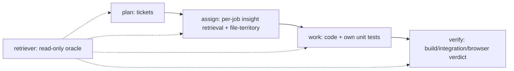

# feat: Agent Families R3 — Phase C: stages pivot + assign stage

## Summary

Complete the **agents → stages** pivot. The audit's headline finding: the deployed runtime is **already stage-shaped** — `orchestrator.py`/`ticket_loop.py`/`planning.py` route work purely by stage (planner/worker/verifier), never by family or agent, and the family-router / multi-persona machinery exists only as `library/`-layer code the pipeline never calls (`route()`, `retrieve()`, `run_boundary_ticket` appear in **zero** runtime files; `injected_skills=` is wired but passed empty everywhere). So this is the **smallest** of the three R3 plans: add one new `assign` stage that fills the existing inert context seam, finish demoting the runtime family/agent references that plan 009 didn't already remove, and re-scope downstream Plans 003–005 to the stage model. It also adds the `search_document:` retrieval vector (the third vector) that the assign stage's per-job retrieval wants.

## Problem Frame

DESIGN §3 makes the runtime a fixed `plan → assign → work → verify` pipeline differing by tools/permissions/contract/trust, not knowledge. The audit confirmed the work-execution core already satisfies this — `sessions.py`'s `planner_profile`/`worker_profile`/`verifier_profile` carry no knowledge, only tool surface, and that *is* the stage definition. What's missing is the explicit **assign** step: today a ticket's only context is the ticket document + the append-only ledger; the `injected_skills=` parameters (`ticket_loop.py:417/521`, `planning.py:1232`) are a documented inert seam. R3's assign stage is a *thin assembly* over two pieces that already exist (the rewritten retrieval from plan 009; the file-ownership lint reused by `rehearsal.compute_waves`). The risk to avoid is mistaking the *volume* of family/agent code (large, but isolated in `library/` + `reflector/` + Plan-005-only paths) for a deep rework of the stage runtime (which is already correct).

---

## Requirements

**The assign stage**

- R1. New `pipeline/assign.py` with contract `assign(ticket, ...) -> AssignedContext{injected_skills: str, file_territory}`: (a) per-job **insight-level retrieval** over the whole store (plan 009's rewritten `library/retrieval.py::retrieve` + the query builders `planner_query`/`worker_query`/`verifier_query` + `render_injection_section`), conditioned on the ticket; (b) **file-territory allocation** via the existing `planning.file_ownership_conflicts` (`planning.py:469-488`). No net-new logic — assign is the assembly.
- R2. Wire `assign`'s `injected_skills` output into the **existing** (currently-empty) `injected_skills=` parameters at `ticket_loop.py:417` (worker), `ticket_loop.py:521` (verifier), `planning.py:1232` (planner). The seam already exists and is byte-identical-to-today when empty; this plan makes it non-empty. No control-flow change to `orchestrator.py`/`ticket_loop.py`.
- R3. The assign stage is a distinct pipeline phase between plan and work — reflected in the orchestrator's stage sequencing and in the span/trace `family`/`agent` (now `stage`) labels, **without** reintroducing any per-ticket router or persona selection. Knowledge specialization lives in the index (retrieval), not in assign.

**The retrieval vector (third vector)**

- R4. Add the `search_document:` **retrieval vector** to the vec0 table (`insight_vectors.retrieval_embedding`) — the third vector deferred from plan 008. Because vec0 has no ALTER-ADD-COLUMN, this is a deliberate rebuild-migration of the vec table (declare 3 columns, re-embed the retrieval vector for all active insights, matched by `search_query:` job queries). Until this lands, plan 009's retrieval reads the full clustering vector as a stopgap; R4 switches it to the correct retrieval geometry.
- R5. `embedding.py::embed_retrieval` (built in plan 008) is now exercised at index time; `embed_query` (search_query:) is exercised in the assign stage's query embedding. Validate the geometry split on the ~50 hand-labeled pair set (the "is clustering-prefixed retrieval adequate, or is the dedicated retrieval vector worth it" check the design flagged).

**Finish the runtime demotion**

- R6. Stop seeding the routing substrate: `cli._seed_taxonomy` (`cli.py:283`) no longer seeds 4 families + generic agents as the routing taxonomy (the rows may survive physically per §4 reversibility, but they are not a runtime routing structure). Reframe seeding as stage setup, not family/agent taxonomy.
- R7. Stop reading `agents.base_prompt_specialty` (`store.py:224`, written at `:1159/1166`) at runtime — personas are removed (§3). The column survives (data/reversibility); nothing assembles a specialty section into a prompt. (`reflector/agent_split.py::check_base_prompt_residue` is already deleted in plan 009.)
- R8. Confirm-and-keep (already stage-shaped, no refactor): `sessions.py` `RoleProfile`/`planner_profile`/`worker_profile`/`verifier_profile` (cosmetic comment update "role/agent" → "stage" at most); the span schema `family`/`agent` data columns (traceability, §13 — keep); `enforcement.py::PersonaRotationRule`/`should_rotate_personas` (explorer *prompt-style* rotation, §9 — explicitly kept, a decoy for "persona" grep). Router demotion + boundary-ticket deletion already land in plan 009 (R14/R13).

**Re-scope downstream plans**

- R9. Plan 005 (Phase 3b): mark R12 (family router), R13 (routing replay), R14 (agent splitting + boundary tickets) **superseded by R3** — replaced by plan 009's §6 Leiden derive pass. R1–R11 (benchmark suite, rehearsal/one-shot, improvement tier, **R8 file-ownership enforcement** — now the assign stage's territory source, parallel episodes, enforcement modes) stand.
- R10. Plan 004 (Phase 3a): rewrite the requirements that assume **family-scoped retrieval** (R2 per-family retrieval; R3/R4 injection scope; R9 "explorer/grader have no library family") to the **stage / whole-store insight-level** model. The reflector Stage A/B, fitness, run-memory, validation lifecycle stand.
- R11. Plan 003 (Phase 2 explorer/grader): ~untouched — explorer/grader/registry/frontier are training-only roles R3 §3 keeps verbatim; only terminology ("explorer agent" → "explorer stage-role") changes, not routing. Confirm no family/agent routing assumption hides in the episode wiring.

**Testing**

- R12. The assign stage has unit tests (retrieval assembly + file-territory) and an integration test showing a ticket receiving non-empty `injected_skills` from the whole-store retrieval; the existing orchestrator/ticket-loop tests stay green (the seam was inert, now populated — assert byte-identical behavior when retrieval returns nothing, proving back-compat).

---

## Key Technical Decisions

- **Assign is a thin assembly, not a rewrite.** Both halves exist: plan 009's rewritten retrieval and the file-ownership lint already reused by `rehearsal.compute_waves` (`rehearsal.py:139/204`). The new module wires them into the existing inert `injected_skills=` seam. This is the lowest-risk part of all of R3.
- **The stage runtime is already correct — don't touch the control flow.** `orchestrator.py`/`ticket_loop.py` route by stage with fixed callables; there is no router call to delete there. Over-refactoring the work-execution core because the *library-layer* family code is voluminous would be a mistake.
- **Data columns vs runtime roles.** `family`/`agent` (span schema) and `base_prompt_specialty` (agents table) are demoted-but-preserved for reversibility (§4/§16). Stop *using* them as runtime roles; do not drop them.
- **`enforcement.py` persona rotation is explorer style, kept.** It is the §9 terse-PM/rambling-founder prompt rotation, not a worker persona — a false positive for "persona."
- **The third (retrieval) vector lands here, not in plan 008.** It's only needed once something retrieves per-job (the assign stage). Plan 009's retrieval uses the full vector as a stopgap; R4 switches to the dedicated retrieval geometry and validates the split was worth it.

---

## High-Level Technical Design

### The stage pipeline (R3)



Stages differ by tools/permissions/output-contract/trust (verifier independence is the load-bearing invariant), never by knowledge. `assign` is the only "routing" that remains: it gives each ticket its context (whole-store retrieval) and its file territory.

### Inert seam → populated (no control-flow change)

| Call site | Today | R3 |
|---|---|---|
| `ticket_loop.py:417` build_worker_prompt(injected_skills=...) | `""` | assign output |
| `ticket_loop.py:521` build_verifier_prompt(injected_skills=...) | `""` | assign output |
| `planning.py:1232` build_planner_prompt(injected_skills=...) | `""` | assign output |

---

## Output Structure

```text
agent-families/src/agent_families/
├── pipeline/assign.py   # NEW: assign(ticket) → {injected_skills, file_territory}; assembles retrieval + file-ownership
├── pipeline/ticket_loop.py  # wire assign output into existing injected_skills= (417, 521); no control-flow change
├── pipeline/planning.py     # wire assign output (1232); file_ownership_conflicts reused (469-488)
├── vecindex.py          # vec0 table → 3 columns (add retrieval_embedding); rebuild-migration + re-embed
├── embedding.py         # embed_retrieval exercised at index; embed_query in assign
├── cli.py               # _seed_taxonomy reframed as stage setup, not routing taxonomy
└── store.py             # stop reading base_prompt_specialty at runtime (column kept)
docs/plans/2026-06-10-{003,004,005}-...-plan.md  # re-scope annotations (R9-R11)
```

---

## Implementation Units

### U1. The assign stage
- **Goal:** assemble per-job context (retrieval + file-territory) and fill the inert seam.
- **Requirements:** R1, R2, R3
- **Dependencies:** plan 009 (rewritten retrieval)
- **Files:** `pipeline/assign.py`, `pipeline/ticket_loop.py`, `pipeline/planning.py`, `tests/test_assign.py`
- **Approach:** `assign(ticket, store, ...) -> AssignedContext`: call the rewritten `retrieve` with the stage-appropriate query builder + `render_injection_section`; call `file_ownership_conflicts` (or factor the wave-splitting helper out of `rehearsal.compute_waves`) for the territory. Wire `injected_skills` into the three existing parameters. No change to orchestrator control flow.
- **Test scenarios:** assign returns non-empty injected_skills from a seeded library; file-territory matches `file_ownership_conflicts`; when retrieval returns nothing the prompts are byte-identical to today (back-compat); no router/persona invoked.
- **Required acceptance tests** (named MUST-tests, do not weaken; add a `## Conformance` mapping):
  - `test_empty_retrieval_is_byte_identical_to_today` - when `retrieve` returns zero insights, the three built prompts (`build_worker_prompt`/`build_verifier_prompt`/`build_planner_prompt`) are BYTE-IDENTICAL to the pre-plan empty-`injected_skills=""` output (the seam was inert; populating it with nothing must not perturb a single byte - assert on the built prompt strings, not a green run).
  - `test_assign_retrieves_whole_store_not_family_scoped` - assign's retrieval query reaches the WHOLE store (ownership != reachability): an insight owned by a different family/agent than the ticket's is retrievable; assign passes NO family/agent filter to `retrieve`.
  - `test_no_router_or_persona_invoked` - with `route`/`run_boundary_ticket`/any persona-selection seam mocked to RAISE, `assign(ticket, ...)` completes; knowledge specialization comes only from the index, never a per-ticket router (R3).
  - `test_file_territory_matches_file_ownership_conflicts` - the `file_territory` assign emits is exactly what `planning.file_ownership_conflicts` (planning.py:469-488) computes for the same ticket set - no net-new allocation logic, identical partition.
  - `test_injected_skills_wired_to_three_seams` - assign's `injected_skills` output reaches `ticket_loop.py:417` (worker), `ticket_loop.py:521` (verifier), and `planning.py:1232` (planner); orchestrator/ticket_loop control flow is unchanged (no new branch).
- **Verification:** a ticket runs through plan→assign→work→verify with injected context; existing orchestrator tests green.

### U2. The retrieval vector (third vector)
- **Goal:** add the `search_document:` retrieval vector; switch retrieval off the full-vector stopgap.
- **Requirements:** R4, R5
- **Dependencies:** plan 008 (embed_retrieval), plan 009 (retrieval reads it)
- **Files:** `vecindex.py` (3-column rebuild-migration), `embedding.py`, `library/retrieval.py` (point at retrieval_embedding), tests
- **Approach:** rebuild the vec0 table to declare `retrieval_embedding`; re-embed all active insights' retrieval vectors (search_document:); switch `retrieve` from `on="full"` (stopgap) to `on="retrieval"`; embed job queries with `search_query:`. Validate on the hand-labeled pair set.
- **Test scenarios:** retrieval vector stored + queried; query/document prefix pairing correct; retrieval quality vs the full-vector stopgap measured on the pair set.
- **Required acceptance tests** (named MUST-tests, do not weaken; add a `## Conformance` mapping):
  - `test_index_uses_search_document_query_uses_search_query` - indexed insights embed via `embed_retrieval` (search_document: prefix) and job queries embed via `embed_query` (search_query: prefix); a test asserts the EXACT prefix on each side and that they are NOT swapped (a swapped/identical-prefix pairing is the silent fake-green this locks out).
  - `test_retrieve_switches_from_full_to_retrieval_column` - after migration, `retrieve` reads `on="retrieval"` (the `retrieval_embedding` column), NOT `on="full"` (the clustering-vector stopgap); a probe that distinguishes the two columns (different stored vectors) confirms results come from `retrieval_embedding`.
  - `test_vec_rebuild_migration_preserves_active_insights` - the vec0 3-column rebuild re-embeds the retrieval vector for ALL active insights (zero active insights left without a retrieval_embedding); re-running the migration is idempotent (no duplicate/orphan vec rows).
  - `test_retrieval_vector_beats_stopgap_on_pair_set` - on the ~50 hand-labeled pairs the dedicated retrieval geometry scores STRICTLY higher than the clustering-prefixed stopgap by the recorded margin, OR the unit explicitly records the stopgap-is-adequate decision (the documented escape hatch) - the worth-it check is a measured verdict, never assumed.
- **Verification:** the geometry split is justified (or the stopgap is kept if adequate — the documented escape hatch).

### U3. Finish runtime demotion + re-scope downstream plans
- **Goal:** remove the last runtime family/agent references; reconcile Plans 003–005.
- **Requirements:** R6, R7, R8, R9, R10, R11
- **Dependencies:** plan 009 (router/boundary already demoted)
- **Files:** `cli.py`, `store.py` (stop reading base_prompt_specialty), `sessions.py` (comments), `docs/plans/2026-06-10-{003,004,005}` annotations, tests
- **Approach:** reframe `_seed_taxonomy` as stage setup; stop assembling specialty sections; confirm-and-keep sessions RoleProfiles + span columns + enforcement persona-rotation. Annotate Plan 005 R12–R14 superseded; rewrite Plan 004's family-scoped-retrieval requirements to stage/whole-store; confirm Plan 003 terminology-only.
- **Test scenarios:** no runtime read of base_prompt_specialty; seeding produces stages not a routing taxonomy; grep confirms no family/agent runtime routing outside demoted files.
- **Required acceptance tests** (named MUST-tests, do not weaken; add a `## Conformance` mapping):
  - `test_base_prompt_specialty_not_read_at_runtime` - with `store.py:224`'s `base_prompt_specialty` read patched to RAISE, a full plan->assign->work->verify run completes; no code path assembles a specialty section into any prompt (the column survives in schema; nothing READS it at runtime).
  - `test_demoted_columns_and_rows_preserved` - the `agents.base_prompt_specialty` column and the span `family`/`agent` columns still EXIST post-plan (schema introspection); the seeded family/agent rows are not dropped - demotion stops USING them as runtime roles, it never drops them (§4 reversibility).
  - `test_seeding_produces_stages_not_routing_taxonomy` - `cli._seed_taxonomy` no longer seeds 4 families + generic agents AS a routing taxonomy; it is reframed as stage setup, and no runtime code consumes the seeded rows as a router input.
  - `test_enforcement_persona_rotation_kept` - `enforcement.PersonaRotationRule`/`should_rotate_personas` (explorer prompt-style rotation, the §9 decoy) is STILL present and wired - the demotion must not delete it.
  - `test_downstream_plans_carry_r3_reconciliation` - plan 005's R12/R13/R14 are marked superseded-by-R3, plan 004's family-scoped-retrieval requirements are rewritten to whole-store, and plan 003 carries the terminology-only note - each annotation is present in the respective plan file.
- **Verification:** the three downstream plans carry explicit R3 reconciliation notes; runtime grep is clean.

---

## Scope Boundaries

**Already done in plan 009:** router demotion, boundary-ticket deletion (`retrieval.py:420-658`), agent_split gutting, the retrieval rewrite internals. **Out of scope:** any change to the stage control flow (already correct); the derive pass / objective (plan 009); the ingest gauntlet (plan 008).

**Non-goals:** no new routing or persona machinery; no drop of demoted columns/tables; no rework of explorer/grader (training-only roles kept verbatim).

---

## Risks & Dependencies

- **False "deep refactor" impression** (the audit's headline risk): the family/agent *code volume* is large but isolated in `library/` + `reflector/` + Plan-005-only paths, never the work core. Keep the stage runtime as-is; only fill the seam and demote.
- **Data-column confusion:** dropping `family`/`agent` (span) or `base_prompt_specialty` breaks the reversible-migration guarantee — keep them, stop using them.
- **`enforcement.py` persona rotation decoy:** it's explorer style, kept by R3 §9 — don't remove it.
- **Depends on plan 009's retrieval interface** (`retrieve(query) -> insights`); U1 can stub against it but lands fully only after 009. U2 depends on plan 008's `embed_retrieval`.
- **Retrieval-vector worth-it check** (R5): if clustering-prefixed retrieval proves adequate on the pair set, U2's third vector is dropped and the stopgap kept — a real decision, not assumed.

---

## Sources & Research

- DESIGN.md R3 §3 (Stages: plan→assign→work→verify, assign = per-job retrieval + file-territory, verifier independence), §4 (insight-level retrieval), §13 (three-vector stack, span schema).
- Code audit (this session, stages subsystem): runtime is already stage-shaped (`route`/`retrieve`/`run_boundary_ticket` in zero runtime files; `injected_skills=""` at ticket_loop.py:417/521, planning.py:1232); file-ownership lint at planning.py:469-488 reused by rehearsal.compute_waves:139/204; sessions RoleProfiles are stages; enforcement persona-rotation is explorer style (decoy); Plans 003 untouched / 004 partial / 005 R12-R14 superseded.
